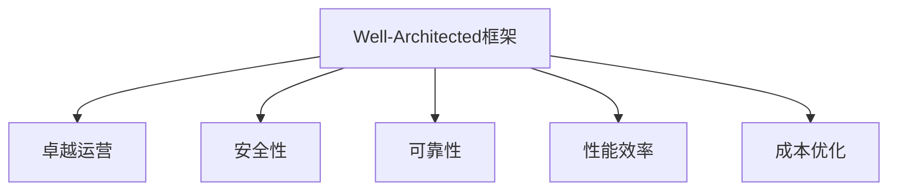

# AWS Well-Architected框架

本文详细介绍AWS Well-Architected框架的五大支柱，以及相应的最佳实践实现方案。

## 目录

1. [框架概述](#框架概述)
2. [卓越运营](#卓越运营)
3. [安全性](#安全性)
4. [可靠性](#可靠性)
5. [性能效率](#性能效率)
6. [成本优化](#成本优化)
7. [评估和改进](#评估和改进)

## 框架概述

### 五大支柱



### 设计原则

| 支柱 | 核心原则 | 关键指标 | 工具支持 |
|-----|---------|---------|---------|
| 卓越运营 | 代码化运维、频繁小规模变更 | MTTR、部署频率 | CloudFormation, Systems Manager |
| 安全性 | 纵深防御、最小权限 | 安全事件数、合规性 | IAM, Security Hub |
| 可靠性 | 自动恢复、水平扩展 | 可用性、MTBF | Auto Scaling, Route 53 |
| 性能效率 | 无服务器优先、按需使用 | 延迟、吞吐量 | CloudWatch, X-Ray |
| 成本优化 | 按需付费、资源优化 | 单位成本、利用率 | Cost Explorer, Budgets |

## 卓越运营

### 基础设施即代码

1. **CloudFormation模板**
   ```yaml
   Resources:
     VPC:
       Type: AWS::EC2::VPC
       Properties:
         CidrBlock: 10.0.0.0/16
         EnableDnsHostnames: true
         EnableDnsSupport: true
         Tags:
           - Key: Name
             Value: Production VPC
     
     AutoScalingGroup:
       Type: AWS::AutoScaling::AutoScalingGroup
       Properties:
         MinSize: 2
         MaxSize: 10
         DesiredCapacity: 2
         HealthCheckType: ELB
         HealthCheckGracePeriod: 300
   ```

2. **Systems Manager自动化**
   ```json
   {
       "AutomationDocument": {
           "Name": "PatchManagement",
           "Description": "自动化补丁管理流程",
           "Parameters": {
               "InstanceIds": {
                   "Type": "StringList",
                   "Description": "需要修补的实例ID列表"
               }
           },
           "MainSteps": [{
               "Name": "PrePatchSnapshot",
               "Action": "aws:createSnapshot"
           }, {
               "Name": "ApplyPatches",
               "Action": "aws:runCommand"
           }]
       }
   }
   ```

### 运维流程自动化

```json
{
    "OperationalProcedures": {
        "Monitoring": {
            "Tools": ["CloudWatch", "X-Ray", "ServiceLens"],
            "Metrics": ["Latency", "ErrorRate", "SLO"],
            "Alerts": {
                "HighLatency": {
                    "Threshold": "p99 > 1s",
                    "Action": "NotifyTeam"
                }
            }
        },
        "Deployment": {
            "Strategy": "BlueGreen",
            "AutomatedTests": true,
            "RollbackTriggers": ["ErrorRate > 1%"]
        }
    }
}
```

## 安全性

### 身份和访问管理

1. **IAM策略**
   ```json
   {
       "Version": "2012-10-17",
       "Statement": [{
           "Effect": "Allow",
           "Action": [
               "s3:GetObject",
               "s3:PutObject"
           ],
           "Resource": "arn:aws:s3:::bucket-name/*",
           "Condition": {
               "Bool": {
                   "aws:SecureTransport": "true"
               }
           }
       }]
   }
   ```

2. **安全组配置**
   ```json
   {
       "SecurityGroup": {
           "GroupName": "web-tier",
           "Description": "Web层安全组",
           "IngressRules": [{
               "IpProtocol": "tcp",
               "FromPort": 443,
               "ToPort": 443,
               "CidrIp": "0.0.0.0/0"
           }],
           "EgressRules": [{
               "IpProtocol": "-1",
               "FromPort": -1,
               "ToPort": -1,
               "CidrIp": "0.0.0.0/0"
           }]
       }
   }
   ```

### 数据保护

```json
{
    "DataProtection": {
        "Encryption": {
            "AtRest": {
                "Method": "KMS",
                "KeyRotation": true
            },
            "InTransit": {
                "Protocol": "TLS1.2",
                "CertificateManager": true
            }
        },
        "Backup": {
            "Schedule": "Daily",
            "RetentionPeriod": 30,
            "CrossRegion": true
        }
    }
}
```

## 可靠性

### 故障恢复

1. **自动恢复配置**
   ```json
   {
       "AutoRecovery": {
           "EC2": {
               "Enabled": true,
               "HealthCheck": {
                   "Type": "EC2",
                   "GracePeriod": 300
               }
           },
           "RDS": {
               "MultiAZ": true,
               "BackupRetentionPeriod": 35
           }
       }
   }
   ```

2. **负载均衡**
   ```json
   {
       "LoadBalancer": {
           "Type": "application",
           "Scheme": "internet-facing",
           "Listeners": [{
               "Protocol": "HTTPS",
               "Port": 443,
               "DefaultActions": [{
                   "Type": "forward",
                   "TargetGroupArn": "arn:aws:elasticloadbalancing:..."
               }]
           }],
           "HealthCheck": {
               "Protocol": "HTTPS",
               "Path": "/health",
               "Interval": 30,
               "Timeout": 5,
               "HealthyThreshold": 2,
               "UnhealthyThreshold": 2
           }
       }
   }
   ```

### 可用性设计

```json
{
    "AvailabilityDesign": {
        "MultiAZ": true,
        "Regions": ["ap-northeast-1", "ap-southeast-1"],
        "ServiceQuotas": {
            "Monitoring": true,
            "AutoIncrease": true
        },
        "BackupStrategy": {
            "RPO": "1hour",
            "RTO": "4hours"
        }
    }
}
```

## 性能效率

### 计算优化

1. **实例选择**
   ```json
   {
       "ComputeResources": {
           "EC2": {
               "InstanceTypes": {
                   "General": "t3.medium",
                   "Compute": "c5.xlarge",
                   "Memory": "r5.xlarge"
               },
               "AutoScaling": {
                   "Target": "CPU",
                   "TargetValue": 70
               }
           },
           "Containers": {
               "FargateProfile": {
                   "CPU": 1024,
                   "Memory": 2048
               }
           }
       }
   }
   ```

2. **无服务器配置**
   ```json
   {
       "Serverless": {
           "Lambda": {
               "Memory": 1024,
               "Timeout": 30,
               "ConcurrentExecutions": 100
           },
           "ApiGateway": {
               "CachingEnabled": true,
               "CacheTtl": 300
           }
       }
   }
   ```

### 存储优化

```json
{
    "StorageOptimization": {
        "EBS": {
            "VolumeType": "gp3",
            "Iops": 3000,
            "Throughput": 125
        },
        "S3": {
            "TransferAcceleration": true,
            "IntelligentTiering": true
        },
        "CloudFront": {
            "Enabled": true,
            "DefaultTTL": 86400
        }
    }
}
```

## 成本优化

### 资源优化

1. **实例成本优化**
   ```json
   {
       "CostOptimization": {
           "EC2": {
               "ReservedInstances": {
                   "CoverageTarget": 80,
                   "TermLength": "1year",
                   "PaymentOption": "partial_upfront"
               },
               "SpotInstances": {
                   "UseForBatch": true,
                   "MaxPrice": "on-demand-price"
               }
           }
       }
   }
   ```

2. **存储成本优化**
   ```json
   {
       "StorageCostOptimization": {
           "S3": {
               "LifecycleRules": [{
                   "Transition": {
                       "Days": 30,
                       "StorageClass": "STANDARD_IA"
                   },
                   "Expiration": {
                       "Days": 365
                   }
               }]
           },
           "EBS": {
               "SnapshotRetention": {
                   "Daily": 7,
                   "Weekly": 4,
                   "Monthly": 12
               }
           }
       }
   }
   ```

### 成本监控

```json
{
    "CostMonitoring": {
        "Budgets": [{
            "Name": "MonthlyBudget",
            "Amount": 10000,
            "TimeUnit": "MONTHLY",
            "Alerts": [{
                "Threshold": 80,
                "Type": "ACTUAL"
            }]
        }],
        "Reports": {
            "Frequency": "DAILY",
            "Format": "CSV",
            "Granularity": "HOURLY"
        }
    }
}
```

## 评估和改进

### 架构评估

```json
{
    "WellArchitectedReview": {
        "Frequency": "Quarterly",
        "Pillars": {
            "OperationalExcellence": {
                "Questions": [
                    "如何管理和自动化变更？",
                    "如何监控工作负载？"
                ],
                "Metrics": [
                    "部署成功率",
                    "MTTR"
                ]
            },
            "Security": {
                "Questions": [
                    "如何保护数据？",
                    "如何管理身份和权限？"
                ],
                "Metrics": [
                    "安全漏洞数量",
                    "合规性评分"
                ]
            }
        }
    }
}
```

### 持续改进

```json
{
    "ContinuousImprovement": {
        "ProcessReview": {
            "Frequency": "Monthly",
            "Focus": [
                "自动化程度",
                "成本效率",
                "性能优化"
            ]
        },
        "Metrics": {
            "Collection": "Automated",
            "Analysis": "Weekly",
            "Actions": "Prioritized"
        }
    }
}
```

## 最佳实践建议

### 实施策略

1. **渐进式改进**
   - 从单一支柱开始
   - 定期评估和调整
   - 持续收集反馈

2. **自动化优先**
   - 基础设施即代码
   - 自动化测试和部署
   - 自动化监控和告警

### 团队协作

1. **知识共享**
   - 文档维护
   - 培训计划
   - 最佳实践分享

2. **责任分工**
   - 明确角色职责
   - 跨团队协作
   - 定期回顾会议

## 总结

AWS Well-Architected框架提供了构建安全、高效、可靠的云架构的指导原则。通过遵循五大支柱的最佳实践，组织可以持续改进其云架构，提高系统质量，优化运营效率。关键是要根据具体需求和场景，灵活运用这些原则，并通过持续的评估和改进来确保架构的长期健康发展。 