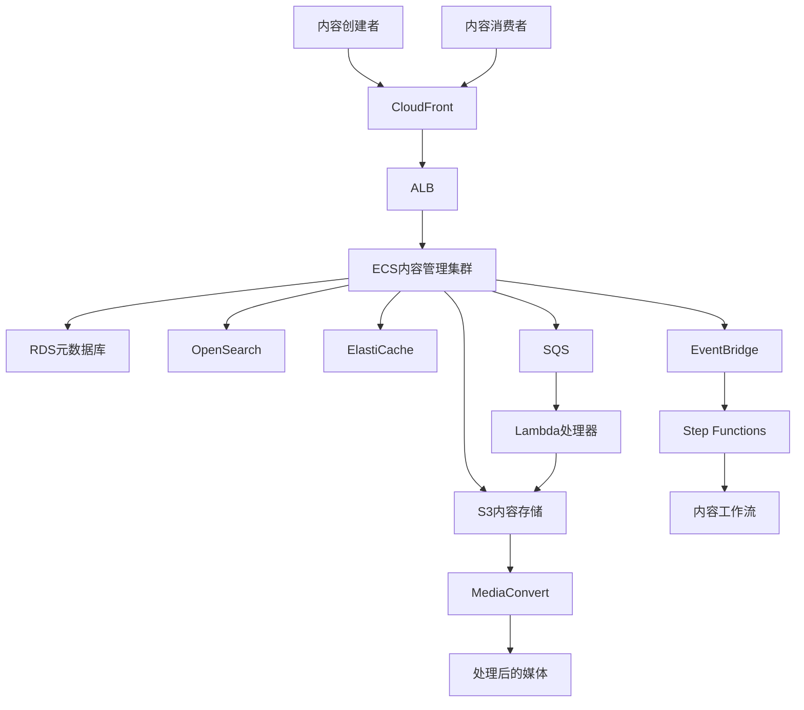
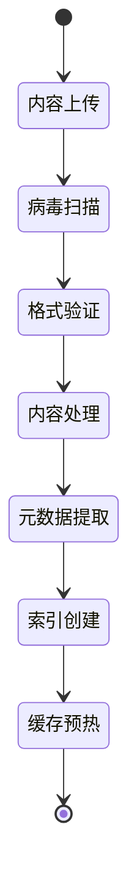

# AWS内容管理系统架构案例研究

本案例研究展示了一个基于AWS构建的高性能内容管理平台解决方案，适用于大规模的内容创建、管理、发布和分发场景。

## 目录
- [架构概述](#架构概述)
- [系统组件](#系统组件)
- [内容工作流](#内容工作流)
- [性能优化](#性能优化)
- [安全设计](#安全设计)
- [运维监控](#运维监控)
- [成本优化](#成本优化)

## 架构概述

### 架构特点

- 全球内容分发
- 高性能媒体处理
- 灵活的内容工作流
- 自动化内容处理
- 强大的搜索能力
- 多层次缓存策略

### 整体架构图



## 系统组件

### 内容存储层
```yaml
S3存储架构:
  原始内容桶:
    用途: 存储原始上传内容
    配置:
      - 版本控制
      - 生命周期管理
      - 跨区域复制
      - 访问日志
  
  处理后内容桶:
    用途: 存储转换后的内容
    配置:
      - CloudFront集成
      - 智能分层
      - 加密存储
      - 对象锁定

  临时内容桶:
    用途: 处理过程中的临时存储
    配置:
      - 自动过期
      - 低冗余存储
      - 临时访问
```

### 内容处理层
```yaml
MediaConvert:
  功能:
    - 视频转码
    - 格式转换
    - 缩略图生成
    - 水印添加
  配置:
    - 自定义转码模板
    - 作业优先级
    - 队列管理
    - 输出预设

Lambda处理器:
  功能:
    - 图片处理
    - 文档转换
    - 元数据提取
    - 内容验证
  触发器:
    - S3事件
    - SQS消息
    - API调用
    - 定时任务
```

### 数据库层
```yaml
RDS配置:
  主要用途:
    - 内容元数据
    - 用户数据
    - 权限管理
    - 工作流状态
  优化设置:
    - 读写分离
    - 多可用区
    - 自动备份
    - 性能优化

OpenSearch:
  用途:
    - 全文检索
    - 标签搜索
    - 相关内容推荐
    - 内容分析
  特性:
    - 自动扩展
    - 多可用区
    - 快照备份
    - 安全访问
```

### 缓存层
```yaml
CloudFront配置:
  - 边缘缓存策略
  - 自定义错误页面
  - 地理限制
  - 安全头部

ElastiCache:
  用途:
    - 热点内容缓存
    - 会话管理
    - API结果缓存
  配置:
    - 集群模式
    - 自动故障转移
    - 备份策略
```

## 内容工作流

### 内容上传流程
```yaml
上传处理:
  1. 预签名URL生成:
    - Lambda生成上传URL
    - 临时凭证分配
    - 上传策略设置
  
  2. 分片上传:
    - 大文件分片
    - 断点续传
    - 上传进度跟踪
  
  3. 上传后处理:
    - 病毒扫描
    - 格式验证
    - 元数据提取
```

### 内容处理流程


### 发布工作流
```yaml
Step Functions工作流:
  状态:
    - 内容审核
    - 版本控制
    - 依赖检查
    - 缓存刷新
  
  集成:
    - SNS通知
    - SQS队列
    - Lambda函数
    - API调用
```

## 性能优化

### 内容分发优化
```yaml
CDN策略:
  - 多层缓存
  - 智能路由
  - 动态内容加速
  - 实时压缩

缓存优化:
  - 缓存规则优化
  - TTL策略
  - 缓存键设计
  - 缓存预热
```

### 存储优化
```yaml
S3优化:
  - 请求路由优化
  - 分区设计
  - 前缀策略
  - 传输加速

数据库优化:
  - 查询优化
  - 索引设计
  - 连接池管理
  - 读写分离
```

## 安全设计

### 访问控制
```yaml
IAM策略:
  - 角色基础访问控制
  - 细粒度权限
  - 临时凭证
  - 服务角色

内容保护:
  - 原始文件加密
  - 传输加密
  - 访问签名
  - DRM集成
```

### 安全监控
```yaml
监控项:
  - 异常访问检测
  - 内容完整性
  - 权限变更
  - 安全事件

响应措施:
  - 自动封禁
  - 事件通知
  - 日志分析
  - 安全修复
```

## 运维监控

### 监控指标
```yaml
性能指标:
  - 上传速度
  - 处理时间
  - 分发延迟
  - 缓存命中率

业务指标:
  - 内容使用量
  - 存储增长
  - 带宽使用
  - 用户活跃度
```

### 告警配置
```yaml
CloudWatch告警:
  - 性能阈值
  - 错误率监控
  - 资源使用率
  - 成本预警

响应自动化:
  - 自动扩容
  - 故障转移
  - 缓存刷新
  - 资源回收
```

## 成本优化

### 存储成本优化
```yaml
S3优化策略:
  - 生命周期管理
  - 存储类型选择
  - 智能分层
  - 数据压缩

数据库优化:
  - 实例规格选择
  - 存储优化
  - 备份策略
  - 副本配置
```

### 处理成本优化
```yaml
Lambda优化:
  - 内存配置
  - 超时设置
  - 并发控制
  - 代码优化

MediaConvert优化:
  - 作业打包
  - 输出设置
  - 队列管理
  - 预设使用
```

## 最佳实践

### 开发最佳实践
1. 使用基础设施即代码
2. 实现自动化部署
3. 采用持续集成/部署
4. 实施监控和日志
5. 定期安全审查

### 运维最佳实践
1. 自动化运维流程
2. 实施灾难恢复
3. 定期性能优化
4. 成本持续优化
5. 安全定期评估

### 示例配置

```yaml
# CloudFormation示例
Resources:
  ContentBucket:
    Type: AWS::S3::Bucket
    Properties:
      VersioningConfiguration:
        Status: Enabled
      LifecycleConfiguration:
        Rules:
          - Id: TransitionToIA
            Status: Enabled
            Transitions:
              - StorageClass: STANDARD_IA
                TransitionInDays: 30
          - Id: TransitionToGlacier
            Status: Enabled
            Transitions:
              - StorageClass: GLACIER
                TransitionInDays: 90

  ContentDistribution:
    Type: AWS::CloudFront::Distribution
    Properties:
      DistributionConfig:
        Origins:
          - DomainName: !GetAtt ContentBucket.DomainName
            Id: S3Origin
            S3OriginConfig:
              OriginAccessIdentity: !Sub "origin-access-identity/cloudfront/${CloudFrontOAI}"
        Enabled: true
        DefaultCacheBehavior:
          TargetOriginId: S3Origin
          ViewerProtocolPolicy: redirect-to-https
          AllowedMethods:
            - GET
            - HEAD
          CachedMethods:
            - GET
            - HEAD
          ForwardedValues:
            QueryString: false
            Cookies:
              Forward: none
```

### 性能优化建议
1. 实施多层缓存策略
2. 优化内容处理流程
3. 实现智能分发策略
4. 优化存储访问模式
5. 实施预处理和预热

### 安全建议
1. 实施最小权限原则
2. 加密所有敏感数据
3. 实施访问控制策略
4. 定期安全评估
5. 建立安全响应机制 