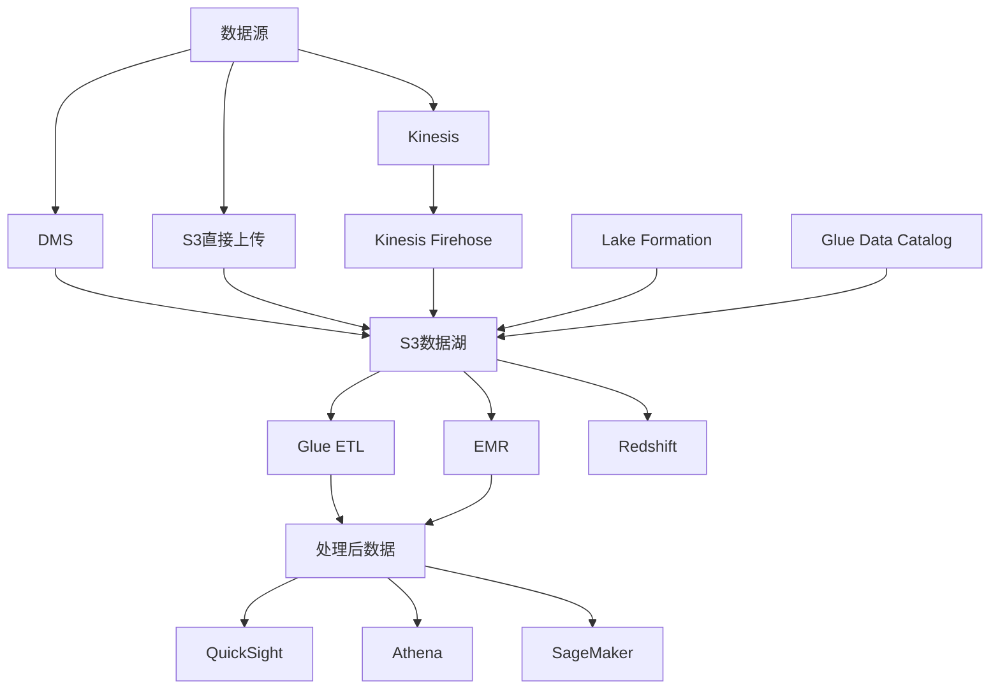

# AWS企业级数据湖与分析平台架构案例研究

本案例研究展示了一个基于AWS构建的企业级数据湖与分析平台解决方案，适用于大规模数据收集、存储、处理和分析场景。

## 目录
- [架构概述](#架构概述)
- [数据接入层](#数据接入层)
- [数据存储层](#数据存储层)
- [数据处理层](#数据处理层)
- [数据分析层](#数据分析层)
- [数据治理](#数据治理)
- [安全与合规](#安全与合规)
- [运维监控](#运维监控)
- [成本优化](#成本优化)

## 架构概述

### 架构特点

- 全方位数据接入能力
- 灵活的存储策略
- 强大的处理能力
- 丰富的分析工具
- 完善的安全机制
- 成本优化设计

### 整体架构图



## 数据接入层

### 实时数据接入
```yaml
Kinesis配置:
  Streams:
    用途: 实时数据流处理
    配置:
      - 分片自动扩展
      - 数据保留策略
      - 加密设置
      - 监控告警
  
  Firehose:
    目标:
      - S3
      - Redshift
      - OpenSearch
    设置:
      - 数据转换
      - 压缩配置
      - 缓冲设置
      - 错误处理
```

### 批量数据接入
```yaml
数据迁移服务(DMS):
  源支持:
    - 关系型数据库
    - NoSQL数据库
    - 文件系统
  
  特性:
    - 持续复制
    - 变更数据捕获
    - 数据验证
    - 模式转换

S3数据上传:
  方式:
    - AWS CLI
    - SDK集成
    - 直接上传
    - 批量传输
  
  优化:
    - 分片上传
    - 传输加速
    - 生命周期管理
    - 版本控制
```

## 数据存储层

### 数据湖设计
```yaml
S3存储架构:
  原始区(Raw):
    用途: 存储原始数据
    配置:
      - 智能分层
      - 生命周期规则
      - 访问日志
      - 版本控制
  
  处理区(Processing):
    用途: 数据处理和转换
    配置:
      - 标准存储
      - 临时数据清理
      - 处理状态跟踪
  
  精炼区(Refined):
    用途: 处理后数据存储
    配置:
      - 压缩存储
      - 分区优化
      - 查询优化
      - 安全访问

Lake Formation:
  功能:
    - 数据湖管理
    - 权限控制
    - 数据发现
    - 安全审计
```

### 元数据管理
```yaml
Glue Data Catalog:
  功能:
    - 元数据存储
    - 模式管理
    - 数据发现
    - 版本控制
  
  集成:
    - Athena
    - EMR
    - Redshift
    - SageMaker
```

## 数据处理层

### ETL处理
```yaml
Glue ETL:
  作业类型:
    - Python Shell
    - Spark
    - Streaming ETL
  
  特性:
    - 自动扩展
    - 作业编排
    - 依赖管理
    - 监控集成

EMR集群:
  应用:
    - Spark
    - Hive
    - Presto
    - HBase
  
  配置:
    - 动态扩展
    - Spot实例
    - 资源调度
    - 性能优化
```

### 数据仓库
```yaml
Redshift配置:
  集群管理:
    - 节点类型选择
    - 自动扩展
    - 并发扩展
    - 快照管理
  
  性能优化:
    - 分布键设计
    - 排序键优化
    - 压缩编码
    - 查询优化
```

## 数据分析层

### 查询与分析
```yaml
Athena配置:
  优化:
    - 分区优化
    - 压缩格式
    - 列式存储
    - 查询优化
  
  集成:
    - QuickSight
    - Glue
    - Lake Formation
    - CloudWatch

QuickSight:
  功能:
    - 交互式仪表板
    - ML洞察
    - 嵌入式分析
    - 数据准备
```

### 机器学习
```yaml
SageMaker:
  功能:
    - 模型训练
    - 模型部署
    - 自动化ML
    - 模型监控
  
  优化:
    - 资源管理
    - 成本优化
    - 性能调优
    - 安全配置
```

## 数据治理

### 数据质量管理
```yaml
质量控制:
  检查项:
    - 完整性
    - 准确性
    - 一致性
    - 时效性
  
  自动化:
    - 质量规则
    - 异常检测
    - 告警通知
    - 修复流程
```

### 数据生命周期
```yaml
生命周期管理:
  策略:
    - 数据分级
    - 存储转换
    - 数据归档
    - 数据删除
  
  自动化:
    - 规则执行
    - 成本优化
    - 合规保证
    - 审计跟踪
```

## 安全与合规

### 访问控制
```yaml
安全架构:
  身份认证:
    - IAM角色
    - 联合身份
    - 细粒度权限
    - 临时凭证
  
  数据保护:
    - 传输加密
    - 存储加密
    - 密钥管理
    - 访问日志
```

### 合规管理
```yaml
合规框架:
  标准:
    - GDPR
    - HIPAA
    - SOC
    - PCI DSS
  
  实施:
    - 数据分类
    - 访问控制
    - 审计日志
    - 合规报告
```

## 运维监控

### 性能监控
```yaml
监控指标:
  系统性能:
    - 处理延迟
    - 资源使用率
    - 查询性能
    - 吞吐量
  
  业务指标:
    - 数据量增长
    - 处理成功率
    - 数据质量
    - 用户活跃度
```

### 成本监控
```yaml
成本管理:
  监控:
    - 资源使用
    - 存储成本
    - 处理成本
    - 查询成本
  
  优化:
    - 资源调度
    - 存储分层
    - 压缩策略
    - 缓存利用
```

## 最佳实践

### 架构最佳实践
1. 采用分层存储策略
2. 实现自动化数据处理
3. 建立完善的监控体系
4. 实施数据生命周期管理
5. 优化查询性能

### 示例配置

```yaml
# CloudFormation示例
Resources:
  DataLakeBucket:
    Type: AWS::S3::Bucket
    Properties:
      VersioningConfiguration:
        Status: Enabled
      LifecycleConfiguration:
        Rules:
          - Id: DataArchive
            Status: Enabled
            Transitions:
              - StorageClass: INTELLIGENT_TIERING
                TransitionInDays: 90
          - Id: DataDelete
            Status: Enabled
            ExpirationInDays: 365

  GlueDatabase:
    Type: AWS::Glue::Database
    Properties:
      CatalogId: !Ref AWS::AccountId
      DatabaseInput:
        Name: enterprise-data-lake
        Description: Enterprise Data Lake Catalog

  RedshiftCluster:
    Type: AWS::Redshift::Cluster
    Properties:
      ClusterType: multi-node
      NodeType: ra3.4xlarge
      NumberOfNodes: 2
      DBName: analytics
      MasterUsername: admin
      MasterUserPassword: !Ref MasterUserPassword
      Encrypted: true
      AutomatedSnapshotRetentionPeriod: 7
```

### 性能优化建议
1. 优化数据分区策略
2. 实施查询优化
3. 利用缓存机制
4. 实现并行处理
5. 优化资源配置

### 安全建议
1. 实施最小权限原则
2. 加密所有敏感数据
3. 实施访问控制策略
4. 定期安全评估
5. 建立审计机制
