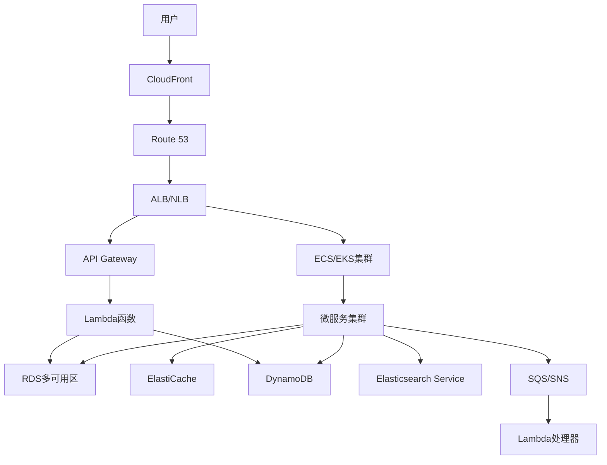

# AWS电商平台架构案例研究

本案例研究展示了一个基于AWS构建的可扩展电商平台解决方案。该架构设计满足高可用性、高性能、安全性和成本效益的要求。

## 目录
- [架构概述](#架构概述)
- [核心组件](#核心组件)
- [详细设计](#详细设计)
- [扩展性考虑](#扩展性考虑)
- [安全性设计](#安全性设计)
- [成本优化](#成本优化)
- [监控和运维](#监控和运维)
- [最佳实践](#最佳实践)

## 架构概述

### 架构特点

- 多可用区部署确保高可用性
- 无服务器架构减少运维负担
- 微服务架构提供业务灵活性
- CDN加速全球内容分发
- 自动扩展应对流量波动
- 安全性深度防御

### 整体架构图



## 核心组件

### 前端层
```yaml
CloudFront:
  用途: 全球CDN分发
  特点:
    - 边缘缓存
    - HTTPS加密
    - WAF防护
    - DDoS防护

S3:
  用途: 静态资源存储
  配置:
    - 版本控制
    - 生命周期管理
    - CloudFront集成
    - 加密存储

Route 53:
  用途: DNS解析和流量路由
  策略:
    - 延迟路由
    - 地理位置路由
    - 故障转移路由
    - 加权路由
```

### 应用层
```yaml
API Gateway:
  功能:
    - API版本管理
    - 请求限流
    - 认证授权
    - API缓存
  集成:
    - Lambda集成
    - VPC集成
    - HTTP集成

Lambda:
  应用:
    - API处理
    - 数据处理
    - 定时任务
    - 事件处理
  特点:
    - 自动扩展
    - 按需付费
    - 无服务器运维

ECS/EKS:
  用途: 容器化服务
  配置:
    - 自动扩展组
    - 负载均衡
    - 服务发现
    - 日志收集
```

### 数据层
```yaml
RDS:
  配置:
    - 多可用区部署
    - 读写分离
    - 自动备份
    - 加密存储
  优化:
    - 参数优化
    - 索引优化
    - 查询优化
    - 连接池

DynamoDB:
  特点:
    - 自动扩展
    - 全球表
    - 时间点恢复
    - DAX加速
  应用:
    - 会话管理
    - 购物车
    - 用户配置
    - 实时数据

ElasticSearch:
  用途:
    - 商品搜索
    - 日志分析
    - 实时监控
  配置:
    - 多可用区
    - 自动快照
    - Kibana集成
```

### 中间件层
```yaml
SQS:
  用途: 消息队列
  特点:
    - 标准队列
    - FIFO队列
    - 死信队列
    - 延迟队列

SNS:
  用途: 消息通知
  功能:
    - 主题订阅
    - 消息过滤
    - 消息归档
    - 重试策略

EventBridge:
  用途: 事件总线
  特点:
    - 事件路由
    - 事件转换
    - 事件归档
    - 事件重放
```

## 详细设计

### 用户访问流程

1. **静态资源访问**
```yaml
流程:
  - 用户请求通过CloudFront
  - Route 53智能DNS解析
  - S3提供静态资源
  - CloudFront缓存响应
```

2. **API请求处理**
```yaml
流程:
  - API Gateway接收请求
  - Lambda/ECS处理业务逻辑
  - 数据存储在RDS/DynamoDB
  - ElastiCache提供缓存
```

### 关键功能实现

#### 商品服务
```yaml
商品管理:
  存储:
    - 基本信息: RDS
    - 详细描述: S3
    - 搜索索引: Elasticsearch
  缓存:
    - 热门商品: ElastiCache
    - 类目数据: DynamoDB
  
搜索服务:
  实现:
    - Elasticsearch Service
    - 自定义词典
    - 同义词处理
    - 搜索建议
```

#### 订单服务
```yaml
订单处理:
  流程:
    - 库存检查: DynamoDB
    - 订单创建: RDS
    - 支付处理: Lambda
    - 库存扣减: DynamoDB
    - 订单确认: SNS通知

异步任务:
  - 订单状态更新
  - 库存同步
  - 物流更新
  - 通知发送
```

#### 用户服务
```yaml
用户管理:
  存储:
    - 用户信息: RDS
    - 会话管理: DynamoDB
    - 用户配置: DynamoDB
  
认证授权:
  - Cognito用户池
  - IAM角色管理
  - JWT令牌
  - OAuth2.0
```

## 扩展性考虑

### 自动扩展策略
```yaml
应用层扩展:
  Lambda:
    - 并发配置
    - 内存配置
    - 超时设置
  
  ECS/EKS:
    - 目标跟踪扩展
    - 步进扩展
    - 预测扩展

数据层扩展:
  RDS:
    - 读写分离
    - 实例扩展
    - 存储自动扩展
  
  DynamoDB:
    - 自动扩展
    - 预置吞吐
    - 按需模式
```

### 性能优化
```yaml
多层缓存:
  - CloudFront边缘缓存
  - API Gateway缓存
  - ElastiCache缓存
  - DAX缓存

数据库优化:
  - 读写分离
  - 分片策略
  - 索引优化
  - 查询优化
```

## 安全性设计

### 网络安全
```yaml
VPC配置:
  - 公有子网
  - 私有子网
  - NAT网关
  - VPC终端节点

安全组:
  - 最小权限
  - 端口限制
  - 来源限制
  - 出站规则
```

### 应用安全
```yaml
身份认证:
  - Cognito
  - IAM角色
  - SSL/TLS
  - WAF规则

数据安全:
  - KMS加密
  - Secrets Manager
  - 传输加密
  - 存储加密
```

## 成本优化

### 优化策略
```yaml
计算资源:
  - Lambda按需计费
  - EC2预留实例
  - Spot实例
  - 自动关停

存储优化:
  - S3生命周期
  - EBS优化
  - RDS存储优化
  - 数据归档
```

### 监控和分析
```yaml
成本监控:
  - AWS Cost Explorer
  - 预算告警
  - 使用量跟踪
  - 成本分配

资源优化:
  - 闲置资源
  - 资源规格
  - 自动扩缩
  - 预留容量
```

## 监控和运维

### 监控方案
```yaml
CloudWatch:
  - 指标监控
  - 日志管理
  - 告警配置
  - 仪表板

X-Ray:
  - 分布式追踪
  - 性能分析
  - 服务地图
  - 错误追踪
```

### 运维自动化
```yaml
部署自动化:
  - CloudFormation
  - AWS CDK
  - Terraform
  - Ansible

CI/CD:
  - CodePipeline
  - CodeBuild
  - CodeDeploy
  - CodeArtifact
```

## 最佳实践

### 架构最佳实践
1. 使用无服务器架构减少运维成本
2. 实现自动扩展应对流量波动
3. 采用多可用区部署保证高可用
4. 实施深度防御确保安全性
5. 优化成本控制资源使用

### 开发最佳实践
1. 采用微服务架构
2. 实现API版本控制
3. 使用基础设施即代码
4. 建立完整监控体系
5. 制定灾难恢复计划

### 示例部署模板
```yaml
# CloudFormation模板示例
Resources:
  ProductService:
    Type: AWS::ECS::Service
    Properties:
      Cluster: !Ref ECSCluster
      TaskDefinition: !Ref ProductTaskDefinition
      DesiredCount: 2
      LaunchType: FARGATE
      NetworkConfiguration:
        AwsvpcConfiguration:
          Subnets:
            - !Ref PrivateSubnet1
            - !Ref PrivateSubnet2
          SecurityGroups:
            - !Ref ServiceSecurityGroup

  ProductDatabase:
    Type: AWS::RDS::DBInstance
    Properties:
      Engine: aurora-postgresql
      DBInstanceClass: db.r5.large
      MultiAZ: true
      StorageType: gp2
      StorageEncrypted: true
```

### 性能优化建议
1. 实施多层缓存策略
2. 优化数据库查询
3. 使用CDN加速内容分发
4. 实现异步处理机制
5. 优化API响应时间

### 安全加固建议
1. 实施最小权限原则
2. 加密敏感数据
3. 定期安全审计
4. 建立入侵检测机制
5. 制定安全响应计划
