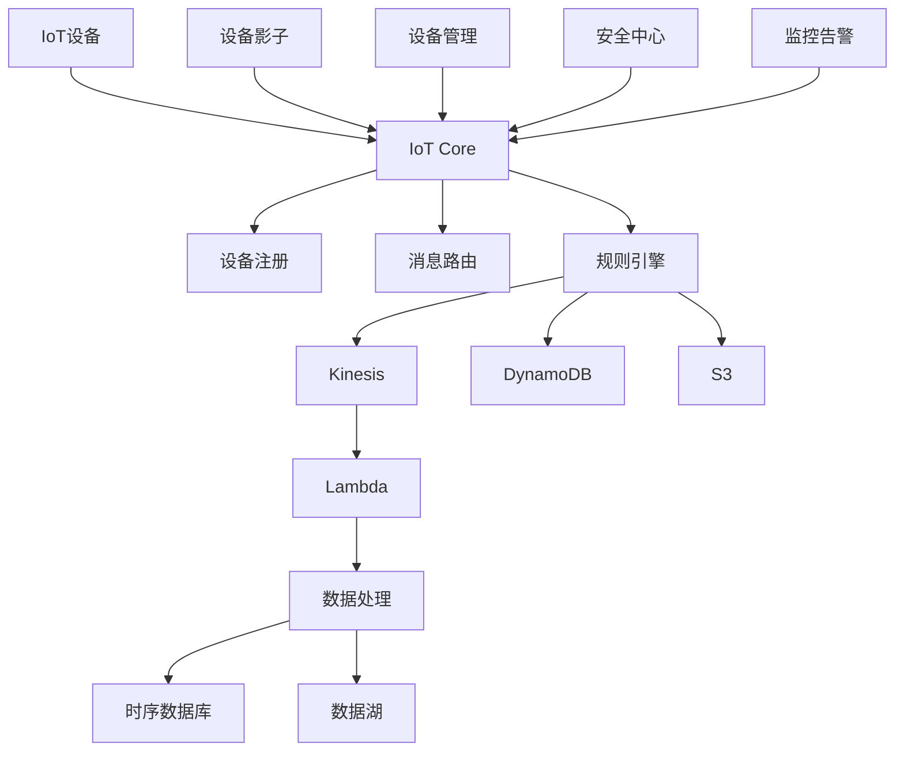

# AWS IoT应用后端架构案例研究

本案例研究展示了一个基于AWS构建的IoT应用后端解决方案，专注于大规模物联网设备管理、实时数据处理和设备控制。

## 目录
- [架构概述](#架构概述)
- [设备连接层](#设备连接层)
- [设备管理层](#设备管理层)
- [数据处理层](#数据处理层)
- [应用服务层](#应用服务层)
- [存储层](#存储层)
- [监控告警](#监控告警)
- [安全架构](#安全架构)
- [运维管理](#运维管理)

## 架构概述

### 架构特点

- 高可靠的设备连接
- 灵活的设备管理
- 实时数据处理
- 可扩展的存储方案
- 完善的安全机制
- 全面的监控能力

### 整体架构图



## 设备连接层

### IoT Core配置
```yaml
连接配置:
  协议支持:
    - MQTT
    - MQTT over WebSocket
    - HTTP
    - LoRaWAN
  
  连接管理:
    - 自动重连
    - 会话持久化
    - 离线消息队列
    - QoS级别控制

消息路由:
  规则:
    - 主题过滤
    - 消息转换
    - 条件触发
    - 错误处理
```

### 设备影子服务
```yaml
影子配置:
  功能:
    - 状态同步
    - 离线命令队列
    - 状态冲突解决
    - 版本控制
  
  更新处理:
    - 增量更新
    - 完整更新
    - 状态回滚
    - 更新确认
```

## 设备管理层

### 设备注册
```yaml
设备管理:
  注册流程:
    - 设备认证
    - 证书管理
    - 组策略
    - 标签管理
  
  批量操作:
    - 批量注册
    - 批量更新
    - 批量删除
    - 任务追踪
```

### 设备组织
```yaml
组织结构:
  分组管理:
    - 层级结构
    - 动态分组
    - 继承关系
    - 权限控制
  
  设备类型:
    - 传感器
    - 执行器
    - 网关设备
    - 边缘设备
```

## 数据处理层

### 实时处理
```yaml
Kinesis配置:
  数据流:
    - 分片管理
    - 吞吐量控制
    - 数据保留
    - 加密设置
  
  处理逻辑:
    - 数据过滤
    - 数据转换
    - 异常检测
    - 实时分析
```

### Lambda处理
```yaml
函数配置:
  处理类型:
    - 数据清洗
    - 格式转换
    - 业务处理
    - 告警触发
  
  性能优化:
    - 内存配置
    - 超时设置
    - 并发控制
    - 错误重试
```

## 应用服务层

### API服务
```yaml
API Gateway:
  接口类型:
    - REST API
    - WebSocket
    - HTTP API
  
  功能配置:
    - 认证授权
    - 流量控制
    - 缓存策略
    - 日志监控
```

### 设备控制
```yaml
控制服务:
  命令类型:
    - 直接命令
    - 延迟命令
    - 批量命令
    - 定时命令
  
  执行管理:
    - 命令确认
    - 超时处理
    - 重试策略
    - 结果回调
```

## 存储层

### 时序数据
```yaml
TimeStream配置:
  数据模型:
    - 度量定义
    - 维度设计
    - 保留策略
    - 查询优化
  
  存储策略:
    - 内存存储
    - 磁盘存储
    - 冷热分离
    - 数据压缩
```

### 设备状态
```yaml
DynamoDB配置:
  表设计:
    - 分区键选择
    - 排序键设计
    - 二级索引
    - TTL设置
  
  性能优化:
    - 容量单位
    - 自动扩展
    - DAX缓存
    - 读写分离
```

## 监控告警

### 设备监控
```yaml
监控指标:
  连接状态:
    - 在线率
    - 连接质量
    - 响应时间
    - 丢包率
  
  业务指标:
    - 消息吞吐量
    - 数据延迟
    - 处理成功率
    - 异常事件
```

### 告警配置
```yaml
CloudWatch配置:
  告警规则:
    - 阈值告警
    - 复合告警
    - 异常检测
    - 日志告警
  
  通知渠道:
    - SNS
    - Email
    - SMS
    - Webhook
```

## 安全架构

### 认证授权
```yaml
安全机制:
  设备认证:
    - X.509证书
    - 预共享密钥
    - 自定义认证
    - 临时凭证
  
  访问控制:
    - IAM策略
    - IoT策略
    - 资源标签
    - 细粒度权限
```

### 数据安全
```yaml
安全策略:
  传输安全:
    - TLS加密
    - 协议安全
    - 端口控制
    - 防火墙规则
  
  存储安全:
    - 加密存储
    - 密钥轮换
    - 访问审计
    - 数据备份
```

## 运维管理

### 部署配置
```yaml
CloudFormation:
  资源模板:
    IoTCore:
      Type: AWS::IoT::Thing
      Properties:
        ThingName: !Ref DeviceName
        AttributePayload:
          Attributes:
            type: sensor
            location: warehouse
    
    DeviceCertificate:
      Type: AWS::IoT::Certificate
      Properties:
        Status: ACTIVE
        CertificateSigningRequest: !Ref CSR
    
    DevicePolicy:
      Type: AWS::IoT::Policy
      Properties:
        PolicyName: !Sub ${AWS::StackName}-device-policy
        PolicyDocument:
          Version: "2012-10-17"
          Statement:
            - Effect: Allow
              Action: 
                - iot:Connect
                - iot:Publish
              Resource: !Sub arn:aws:iot:${AWS::Region}:${AWS::AccountId}:*
```

### 运维自动化
```yaml
自动化配置:
  设备运维:
    - 远程诊断
    - 固件更新
    - 配置管理
    - 健康检查
  
  运维工具:
    - AWS CLI
    - SDK工具
    - 自动化脚本
    - 运维面板
```

## 最佳实践

### 设计建议
1. 采用分层架构设计
2. 实现设备状态同步
3. 建立完善的监控体系
4. 实施安全最佳实践
5. 优化数据处理流程

### 性能优化
1. 合理设置消息大小
2. 优化连接保持策略
3. 实施数据批处理
4. 使用设备影子服务
5. 配置适当的缓存

### 安全建议
1. 实施设备认证
2. 加密所有数据传输
3. 实施最小权限原则
4. 定期轮换密钥
5. 监控异常行为

### 扩展性建议
1. 使用无服务器架构
2. 实施自动扩展
3. 采用微服务设计
4. 使用消息队列解耦
5. 实现异步处理 