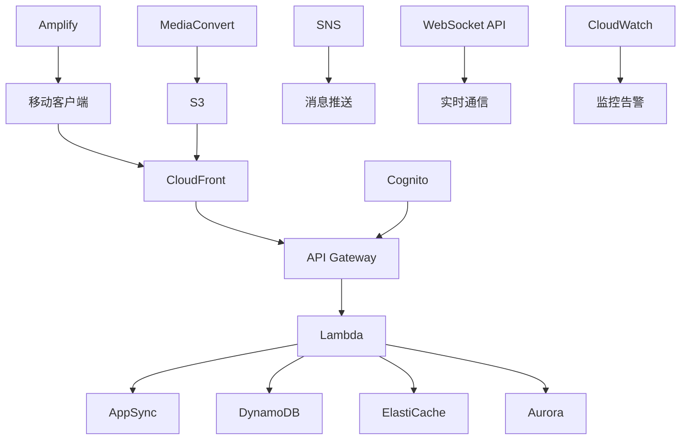

# AWS移动应用后端架构案例研究

本案例研究展示了一个基于AWS构建的移动应用后端解决方案，专注于高可扩展性、实时通信、离线同步等移动应用特定需求。

## 目录
- [架构概述](#架构概述)
- [API层](#api层)
- [认证授权](#认证授权)
- [数据存储](#数据存储)
- [媒体处理](#媒体处理)
- [消息推送](#消息推送)
- [实时通信](#实时通信)
- [离线同步](#离线同步)
- [监控分析](#监控分析)
- [安全架构](#安全架构)

## 架构概述

### 架构特点

- 高可扩展API架构
- 灵活的数据存储
- 实时通信能力
- 高效的媒体处理
- 可靠的消息推送
- 完善的监控体系

### 整体架构图



## API层

### API Gateway配置
```yaml
REST API配置:
  端点类型:
    - 区域性
    - 边缘优化
    - 私有
  
  功能特性:
    - 请求验证
    - 响应转换
    - 缓存策略
    - 用量计划

GraphQL API配置:
  AppSync设置:
    - 模式定义
    - 解析器配置
    - 实时订阅
    - 冲突解决
```

### Lambda函数
```yaml
函数配置:
  运行时环境:
    - Node.js
    - Python
    - Java
    - Go
  
  部署策略:
    - 蓝绿部署
    - 流量转移
    - 别名路由
    - 版本控制

性能优化:
  配置项:
    - 内存分配
    - 超时设置
    - 并发限制
    - 预留并发
```

## 认证授权

### Cognito配置
```yaml
用户池配置:
  认证方式:
    - 用户名密码
    - 社交登录
    - SAML集成
    - OpenID Connect
  
  安全设置:
    - MFA配置
    - 密码策略
    - 账户恢复
    - 风险检测

身份池配置:
  功能设置:
    - 临时凭证
    - 角色映射
    - 身份切换
    - 访问控制
```

### 权限管理
```yaml
IAM策略:
  访问控制:
    - 用户权限
    - 服务权限
    - 资源策略
    - 会话策略
  
  最佳实践:
    - 最小权限
    - 角色分离
    - 权限边界
    - 策略条件
```

## 数据存储

### DynamoDB配置
```yaml
表设计:
  模型设计:
    - 分区键选择
    - 排序键设计
    - 二级索引
    - GSI优化
  
  性能配置:
    - 容量模式
    - 自动扩展
    - DAX缓存
    - 备份策略

数据访问:
  操作模式:
    - 批量操作
    - 事务支持
    - 流处理
    - 全局表
```

### Aurora配置
```yaml
集群配置:
  架构设置:
    - 多可用区
    - 读写分离
    - 自动扩展
    - 故障转移
  
  性能优化:
    - 连接池
    - 查询缓存
    - 参数优化
    - 监控告警
```

### ElastiCache配置
```yaml
Redis设置:
  集群模式:
    - 主从复制
    - 分片集群
    - 故障转移
    - 持久化
  
  缓存策略:
    - 过期策略
    - 驱逐策略
    - 备份恢复
    - 安全设置
```

## 媒体处理

### S3存储
```yaml
存储配置:
  存储类型:
    - 标准存储
    - 智能分层
    - 低频访问
    - 归档存储
  
  访问优化:
    - CloudFront分发
    - 传输加速
    - 版本控制
    - 生命周期
```

### MediaConvert
```yaml
转码配置:
  作业设置:
    - 输出格式
    - 分辨率
    - 码率控制
    - 水印处理
  
  处理流程:
    - 队列管理
    - 模板使用
    - 事件通知
    - 错误处理
```

## 消息推送

### SNS配置
```yaml
推送服务:
  平台集成:
    - APNS
    - FCM
    - HMS
    - 邮件SMS
  
  消息管理:
    - 主题订阅
    - 消息过滤
    - 投递重试
    - 死信队列
```

### 推送优化
```yaml
优化策略:
  发送策略:
    - 批量推送
    - 定时发送
    - 目标分组
    - 智能路由
  
  监控分析:
    - 送达率
    - 打开率
    - 转化率
    - 用户分析
```

## 实时通信

### WebSocket配置
```yaml
连接管理:
  配置项:
    - 连接认证
    - 心跳检测
    - 重连策略
    - 消息压缩
  
  消息处理:
    - 消息路由
    - 广播推送
    - 房间管理
    - 状态同步
```

### 实时数据
```yaml
AppSync实时:
  订阅配置:
    - 实时查询
    - 数据同步
    - 冲突解决
    - 离线支持
  
  优化设置:
    - 连接池化
    - 批量操作
    - 错误重试
    - 限流控制
```

## 离线同步

### 数据同步
```yaml
同步策略:
  机制设计:
    - 增量同步
    - 冲突解决
    - 版本控制
    - 优先级
  
  实现方案:
    - DataStore
    - AppSync
    - Custom Logic
    - 状态管理
```

### 离线存储
```yaml
本地存储:
  存储方案:
    - SQLite
    - Realm
    - AsyncStorage
    - 文件系统
  
  数据管理:
    - 缓存策略
    - 清理策略
    - 加密存储
    - 容量控制
```

## 监控分析

### CloudWatch配置
```yaml
监控设置:
  指标监控:
    - API延迟
    - 错误率
    - 资源使用
    - 业务指标
  
  日志分析:
    - 日志收集
    - 实时处理
    - 告警设置
    - 仪表板
```

### 移动分析
```yaml
Analytics配置:
  数据收集:
    - 用户行为
    - 崩溃分析
    - 性能监控
    - 转化跟踪
  
  分析报告:
    - 实时统计
    - 趋势分析
    - 用户画像
    - 漏斗分析
```

## 安全架构

### 安全防护
```yaml
安全机制:
  应用安全:
    - SSL/TLS
    - API认证
    - 数据加密
    - 防刷限流
  
  基础设施:
    - WAF配置
    - DDoS防护
    - VPC设置
    - 安全组
```

### 合规管理
```yaml
合规要求:
  数据保护:
    - 数据分类
    - 访问控制
    - 审计日志
    - 数据销毁
  
  隐私合规:
    - GDPR
    - CCPA
    - 隐私协议
    - 用户授权
```

## 最佳实践

### 开发建议
1. 使用Amplify加速开发
2. 实施API版本控制
3. 采用无服务器架构
4. 优化移动体验
5. 实现优雅降级

### 性能优化
1. 实施API缓存
2. 优化数据模型
3. 使用CDN加速
4. 实现请求合并
5. 优化资源加载

### 成本优化
1. 选择合适的实例
2. 实施自动扩缩容
3. 优化存储策略
4. 控制带宽成本
5. 监控资源使用

### 运维建议
1. 自动化部署
2. 实施监控告警
3. 制定备份策略
4. 建立应急预案
5. 进行容量规划 