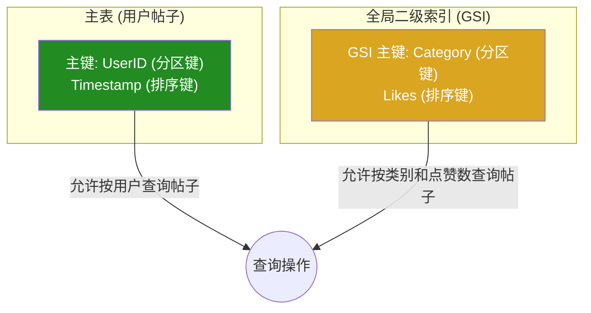

# Amazon DynamoDB - 可扩展性 NoSQL 数据库指南

Amazon DynamoDB 是一种完全托管的、无服务器的 NoSQL 数据库服务，提供快速且可预测的性能，并具有无缝的可扩展性。它设计用于运行任何规模的高性能应用程序，能够处理每秒数百万次的请求。

本指南将深入探讨 DynamoDB 的核心概念、关键特性、数据建模策略和最佳实践。

## 目录

- [概述：为什么选择 DynamoDB？](#概述为什么选择-dynamodb)
- [核心概念](#核心概念)
  - [表、项目和属性](#表项目和属性)
  - [主键 (Primary Key)](#主键-primary-key)
  - [二级索引 (Secondary Indexes)](#二级索引-secondary-indexes)
- [数据类型](#数据类型)
- [读取/写入容量模式](#读取写入容量模式)
  - [按需模式 (On-Demand)](#按需模式-on-demand)
  - [预置模式 (Provisioned)](#预置模式-provisioned)
- [读取一致性模型](#读取一致性模型)
- [关键特性详解](#关键特性详解)
  - [DynamoDB Streams](#dynamodb-streams)
  - [生存时间 (Time to Live - TTL)](#生存时间-time-to-live---ttl)
  - [DynamoDB Accelerator (DAX)](#dynamodb-accelerator-dax)
  - [全局表 (Global Tables)](#全局表-global-tables)
  - [事务 (Transactions)](#事务-transactions)
  - [备份与恢复](#备份与恢复)
- [数据建模与设计模式](#数据建模与设计模式)
  - [单表设计 vs. 多表设计](#单表设计-vs-多表设计)
  - [邻接列表模式 (Adjacency List)](#邻接列表模式-adjacency-list)
  - [稀疏索引模式](#稀疏索引模式)
- [查询数据：Query vs. Scan](#查询数据query-vs-scan)
  - [Query 操作](#query-操作)
  - [Scan 操作](#scan-操作)
- [安全与访问控制](#安全与访问控制)
- [监控与指标](#监控与指标)
- [成本模型](#成本模型)
- [DynamoDB vs. RDS (SQL)](#dynamodb-vs-rds-sql)
- [常见使用场景](#常见使用场景)
- [代码示例 (Python with Boto3)](#代码示例-python-with-boto3)

## 概述：为什么选择 DynamoDB？

传统的 SQL 数据库在面临大规模和高并发时，扩展性成为一个巨大的挑战。DynamoDB 通过其分布式架构和无模式设计，从根本上解决了这个问题。

主要优势：
- **极致的可扩展性**: 水平扩展，性能不会随着数据集的增长而降低。
- **毫秒级延迟**: 提供稳定的个位数毫秒级读写延迟。
- **完全托管**: 无需管理服务器、操作系统或数据库软件。AWS 负责所有底层基础设施。
- **灵活的数据模型**: 无模式设计，每个项目可以有不同的属性。
- **高可用性和持久性**: 数据自动在多个可用区 (AZ) 中复制。

## 核心概念

### 表、项目和属性

- **表 (Table)**: 数据的集合，类似于 SQL 中的表。
- **项目 (Item)**: 表中的一个数据记录，类似于 SQL 中的行。每个项目由一个或多个属性组成。
- **属性 (Attribute)**: 项目中的一个数据元素，类似于 SQL 中的列。属性是键值对。

```json
// 一个 DynamoDB 表中的项目示例
{
  "UserID": "user123",
  "Timestamp": "2023-10-27T10:00:00Z",
  "PostText": "Hello DynamoDB!",
  "Likes": 15,
  "Tags": ["aws", "nosql", "database"]
}
```

### 主键 (Primary Key)

主键唯一标识表中的每个项目。DynamoDB 支持两种类型的主键：

1.  **分区键 (Partition Key)**:
    - 也称为哈希键 (Hash Key)。
    - DynamoDB 使用分区键的哈希值来确定项目存储的物理分区。
    - 如果表只有分区键，则每个项目的分区键值必须是唯一的。

2.  **复合主键 (Composite Primary Key)**:
    - 由 **分区键** 和 **排序键 (Sort Key)** 组成。
    - 也称为哈希和范围键 (Hash and Range Key)。
    - 具有相同分区键的所有项目会存储在一起，并按排序键的值进行排序。
    - 在这种情况下，分区键值不必唯一，但分区键和排序键的组合必须是唯一的。

### 二级索引 (Secondary Indexes)

二级索引允许您使用除主键之外的其他属性来查询数据。

1.  **本地二级索引 (Local Secondary Index - LSI)**:
    - 与表共享相同的分区键，但有不同的排序键。
    - 提供了对数据的不同排序视图。
    - 必须在创建表时定义，且之后不能删除。
    - 查询 LSI 时消耗表的读写容量。

2.  **全局二级索引 (Global Secondary Index - GSI)**:
    - 可以有与表不同的分区键和排序键。
    - 提供了一种全新的数据查询模式。
    - 可以在表创建后随时添加或删除。
    - GSI 有其自己独立的预置吞吐量。



## 数据类型

DynamoDB 支持多种数据类型，包括：
- **标量类型 (Scalar Types)**: Number, String, Binary, Boolean, Null.
- **文档类型 (Document Types)**: List, Map (用于存储嵌套的 JSON 数据)。
- **集合类型 (Set Types)**: String Set, Number Set, Binary Set (集合中的值必须是唯一的)。

## 读取/写入容量模式

### 按需模式 (On-Demand)

- **工作原理**: 根据应用程序的实际读写流量自动调整容量。
- **适用场景**:
  - 新应用程序或流量未知的工作负载。
  - 流量不可预测、有突发尖峰。
  - 愿意为简单性和易用性支付更高单位成本。
- **成本**: 按实际发生的读写请求数付费。

### 预置模式 (Provisioned)

- **工作原理**: 您手动指定应用程序需要的读取容量单位 (RCU) 和写入容量单位 (WCU)。
- **适用场景**:
  - 流量可预测且相对稳定的工作负载。
  - 对成本敏感，希望通过预留容量获得折扣。
- **成本**: 按预置的容量计费，即使未使用完。可以使用 **Auto Scaling** 自动调整预置容量。

## 读取一致性模型

- **最终一致性读取 (Eventually Consistent Reads)** - **默认**: 读取操作可能会返回稍旧的数据副本，但延迟最低。
- **强一致性读取 (Strongly Consistent Reads)**: 读取操作保证返回所有先前成功的写入操作完成后的最新数据。延迟相对较高，成本是最终一致性读取的两倍。

## 关键特性详解

### DynamoDB Streams

捕获对 DynamoDB 表中项目进行的任何修改（创建、更新、删除）的时间排序序列。
- **用途**:
  - **触发器**: 与 AWS Lambda 结合使用，实现事件驱动架构（例如，在用户注册后发送欢迎邮件）。
  - **跨区域复制**: 实现自定义的跨区域数据复制逻辑。
  - **数据分析**: 将变更流式传输到分析服务。

### 生存时间 (Time to Live - TTL)

允许您定义一个时间戳属性，DynamoDB 会自动删除过期的项目，而无需消耗写入容量。
- **用途**:
  - 删除旧的会话数据、日志条目或临时数据。
  - 遵守数据保留策略。

### DynamoDB Accelerator (DAX)

一个完全托管、高可用的内存中缓存，专为 DynamoDB 设计。
- **工作原理**: DAX 位于您的应用程序和 DynamoDB 之间，将读写延迟从毫秒级降低到微秒级。
- **用途**: 读取密集型应用，如实时竞价、社交游戏。

### 全局表 (Global Tables)

提供一个完全托管的多区域、多主数据库解决方案。
- **工作原理**: 您可以指定希望将表复制到的 AWS 区域。DynamoDB 会自动处理所有区域之间的数据复制。
- **用途**:
  - 为全球分布的用户提供低延迟的数据访问。
  - 构建具有高可用性和灾难恢复能力的应用程序。

### 事务 (Transactions)

提供原子性、一致性、隔离性和持久性 (ACID) 事务，支持在一个或多个表之间协调多个“全有或全无”的操作。

### 备份与恢复

- **时间点恢复 (Point-in-Time Recovery - PITR)**: 持续备份您的表数据，并允许您恢复到过去 35 天内的任何一个时间点。
- **按需备份与恢复**: 创建表的完整备份，用于长期归档和数据保留。

## 数据建模与设计模式

在 DynamoDB 中，数据建模至关重要，因为它直接影响性能和成本。关键在于**了解您的访问模式**。

### 单表设计 vs. 多表设计

- **多表设计**: 类似于关系型数据库，将不同类型的实体放入不同的表中（例如 `Users` 表, `Posts` 表）。
- **单表设计**: 将应用程序中的多个不同实体类型放入一个表中。这是一种常见的 NoSQL 设计模式，通过利用 GSI 和灵活的属性，可以用一次查询获取多种类型的数据，从而减少请求次数并提高性能。

### 邻接列表模式 (Adjacency List)

这是一种使用单表设计来表示多对多关系（如图、层次结构）的通用方法。

### 稀疏索引模式

通过仅在某些项目上包含二级索引的属性，来创建一个“稀疏”的索引。这允许您高效地查询表中符合特定条件的项目的子集。

## 查询数据：Query vs. Scan

### Query 操作

- **工作原理**: 根据主键或二级索引的键来查找项目。
- **性能**: **高效**。DynamoDB 可以直接定位到存储数据的分区。
- **用法**: 始终优先使用 `Query`。您必须提供分区键，并可以提供对排序键的条件（如 `>`、`<`、`BETWEEN`）。

### Scan 操作

- **工作原理**: 读取表中的**每一个**项目，然后对结果进行筛选。
- **性能**: **低效且昂贵**，尤其对于大表。会消耗大量的读取容量。
- **用法**: 仅在绝对必要时使用，例如需要对全表进行分析或数据导出时。

## 安全与访问控制

- **IAM**: 使用 IAM 用户、角色和策略来控制对 DynamoDB 表和 API 操作的访问。
- **静态加密**: DynamoDB 中所有用户数据都默认使用 AWS KMS 进行静态加密。
- **VPC 端点**: 允许您的 VPC 中的 EC2 实例通过私有连接访问 DynamoDB，而无需通过公共互联网。

## 监控与指标

通过 **Amazon CloudWatch** 监控 DynamoDB 表的性能：
- `ConsumedReadCapacityUnits` / `ConsumedWriteCapacityUnits`: 消耗的读/写容量。
- `ThrottledRequests`: 因超出预置容量而被限制的请求数（**关键告警指标**）。
- `SuccessfulRequestLatency`: 请求的平均延迟。

## 成本模型

- **读取/写入容量**: 按需模式下按请求数计费，预置模式下按容量单位计费。
- **数据存储**: 按每月存储的数据量 (GB) 计费。
- **可选特性**:
  - DynamoDB Streams
  - 备份存储
  - 全局表（按复制的写入和区域数计费）
  - DAX（按节点小时数计费）

## DynamoDB vs. RDS (SQL)

| 特性 | DynamoDB (NoSQL) | RDS (SQL) |
| :--- | :--- | :--- |
| **数据模型** | **灵活** (无模式) | **严格** (预定义模式) |
| **可扩展性** | **水平扩展** (几乎无限) | **垂直扩展** (受限于实例大小) |
| **性能** | **稳定的毫秒级延迟** | 延迟可能随负载增加而变化 |
| **查询语言** | **API 操作** (`GetItem`, `Query`) | **SQL** (支持复杂查询和 JOIN) |
| **使用场景** | 大规模、高并发、需要低延迟的应用 | 关系复杂、需要事务一致性的应用 |

## 常见使用场景

- **用户个人资料存储**: 快速存取用户偏好和设置。
- **购物车**: 处理高并发的读写操作。
- **游戏排行榜**: 实时更新和查询排名。
- **物联网 (IoT)**: 接收和处理来自大量设备的传感器数据。
- **会话存储**: 缓存 Web 应用的用户会话。

## 代码示例 (Python with Boto3)

```python
import boto3

# 初始化 DynamoDB 资源
dynamodb = boto3.resource('dynamodb', region_name='us-east-1')
table = dynamodb.Table('YourTableName')

# 1. 创建一个新项目
def create_item(user_id, username):
    response = table.put_item(
       Item={
            'UserID': user_id,
            'Username': username,
            'JoinedDate': str(datetime.now())
        }
    )
    return response

# 2. 获取一个项目
def get_item(user_id):
    try:
        response = table.get_item(Key={'UserID': user_id})
    except ClientError as e:
        print(e.response['Error']['Message'])
    else:
        return response.get('Item')

# 3. 使用 Query 操作
def query_posts_by_user(user_id):
    # 假设表有复合主键 (UserID, PostID)
    response = table.query(
        KeyConditionExpression=Key('UserID').eq(user_id)
    )
    return response['Items']

# 4. 更新项目
def update_item_add_attribute(user_id, new_attribute):
    response = table.update_item(
        Key={'UserID': user_id},
        UpdateExpression="set info.new_attr = :a",
        ExpressionAttributeValues={':a': new_attribute},
        ReturnValues="UPDATED_NEW"
    )
    return response
``` 