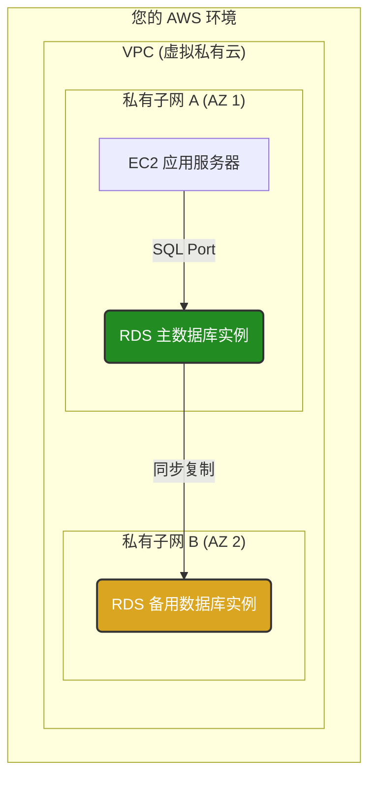
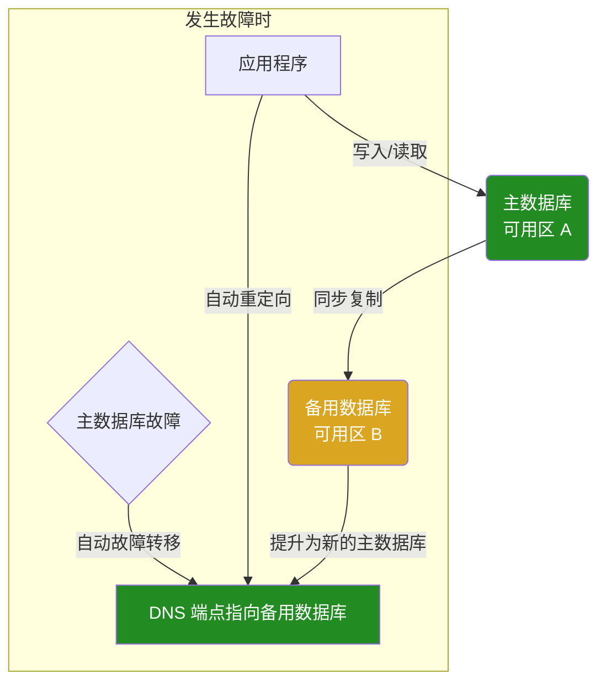
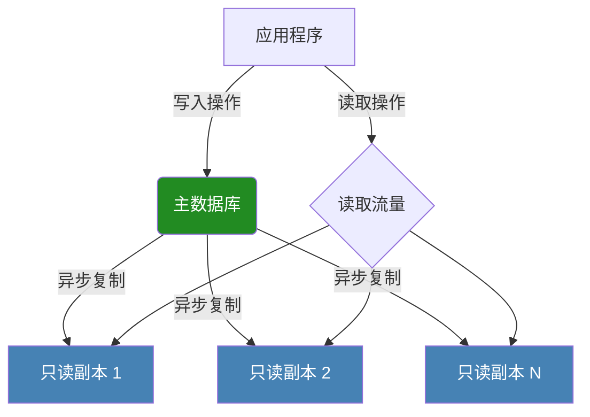

# AWS Relational Database Service (RDS) - 完美教习文档

Amazon RDS (Relational Database Service) 是一种托管的关系数据库服务，旨在简化在云中设置、操作和扩展关系数据库的过程。它通过自动化耗时的管理任务（如硬件预置、数据库设置、修补和备份），使开发人员能够专注于应用程序开发。

本指南将全面、深入地介绍 RDS，助您从新手成长为专家。

## 目录

- [概述：为什么选择 RDS？](#概述为什么选择-rds)
- [核心优势](#核心优势)
- [工作原理与架构](#工作原理与架构)
- [支持的数据库引擎](#支持的数据库引擎)
- [核心功能详解](#核心功能详解)
  - [全托管服务](#全托管服务)
  - [高可用性 (Multi-AZ)](#高可用性-multi-az)
  - [读取可扩展性 (Read Replicas)](#读取可扩展性-read-replicas)
  - [存储选项](#存储选项)
  - [网络与安全](#网络与安全)
- [快速入门：创建您的第一个 RDS 数据库](#快速入门创建您的第一个-rds-数据库)
- [连接到 RDS 数据库](#连接到-rds-数据库)
- [备份、恢复与快照](#备份恢复与快照)
  - [自动备份与时间点恢复 (PITR)](#自动备份与时间点恢复-pitr)
  - [手动数据库快照](#手动数据库快照)
- [监控与性能优化](#监控与性能优化)
  - [Amazon CloudWatch 指标](#amazon-cloudwatch-指标)
  - [增强监控 (Enhanced Monitoring)](#增强监控-enhanced-monitoring)
  - [性能详情 (Performance Insights)](#性能详情-performance-insights)
- [深度解析：Amazon Aurora](#深度解析amazon-aurora)
  - [Aurora 的云原生架构](#aurora-的云原生架构)
  - [Aurora Serverless](#aurora-serverless)
  - [Aurora Global Database](#aurora-global-database)
- [安全最佳实践](#安全最佳实践)
- [成本模型](#成本模型)
- [RDS vs. 在 EC2 上自建数据库](#rds-vs-在-ec2-上自建数据库)
- [常见使用场景](#常见使用场景)
- [实际应用案例：构建高可用的 Web 应用后端](#实际应用案例构建高可用的-web-应用后端)

## 概述：为什么选择 RDS？

在传统的数据库管理中，团队需要投入大量时间和精力来处理服务器采购、操作系统安装、数据库软件配置、补丁更新、备份策略实施和扩展规划等任务。RDS 的出现旨在将这些繁重的、无差别的任务自动化，从而释放资源，让团队能够更专注于创造业务价值。

## 核心优势

- **易于管理**: 无需服务器管理，自动化软件修补、备份和故障检测。
- **高性能与可扩展性**: 多种实例类型和存储选项可选，支持通过只读副本轻松扩展读取流量，只需点击几下即可纵向扩展实例。
- **高可用性与持久性**: Multi-AZ 部署可实现自动故障转移，自动备份和快照确保持久性。
- **安全性**: 提供网络隔离（VPC）、静态加密（KMS）和传输中加密（SSL），并与 IAM 集成进行精细的访问控制。
- **成本效益**: 按需付费，无预付费用。可选择预留实例以获得更低成本。

## 工作原理与架构

RDS 在一个虚拟化的环境中运行您选择的数据库引擎。您不需要管理底层的 EC2 实例，只需与数据库端点交互即可。



## 支持的数据库引擎

RDS 支持业界最流行的关系数据库引擎，您可以根据应用程序的需求和现有技术栈进行选择。

| 引擎 | 主要特点 | 常见用例 |
| :--- | :--- | :--- |
| **Amazon Aurora** | 云原生，与 MySQL 和 PostgreSQL 兼容，性能高，可用性强。 | 高吞吐量、任务关键型企业应用、SaaS 应用。 |
| **PostgreSQL** | 功能强大的开源对象关系数据库，注重扩展性和标准符合性。 | 复杂的查询、地理空间应用、数据仓库。 |
| **MySQL** | 全球最受欢迎的开源关系数据库。 | Web 应用、电子商务平台、内容管理系统 (CMS)。 |
| **MariaDB** | MySQL 的一个流行分支，由原 MySQL 开发者创建，注重社区驱动。 | 需要 MySQL 兼容性并希望使用开源社区新功能的应用。 |
| **Oracle Database** | 功能全面的商业关系数据库，适用于大型企业。 | 大型企业资源规划 (ERP)、客户关系管理 (CRM)、数据仓库。 |
| **SQL Server** | 微软开发的关系数据库，与 .NET 生态系统紧密集成。 | Windows 环境下的企业应用、SharePoint、商业智能。 |

## 核心功能详解

### 全托管服务

RDS 负责处理数据库管理的各个方面，包括：
- **自动软件修补**: 在您设置的维护时段内自动应用最新的安全和功能补丁。
- **自动备份**: 默认启用自动备份，并保留一段时间的事务日志，支持时间点恢复。
- **故障检测与恢复**: 自动监控数据库实例健康状况，并在发生故障时自动替换实例或执行故障转移。

### 高可用性 (Multi-AZ)

为了实现高可用性，您可以启用 Multi-AZ 部署。RDS 会在另一个可用区 (AZ) 中预置和维护一个同步的备用副本。


- **工作原理**: 数据从主数据库同步复制到备用数据库。
- **故障转移**: 如果主数据库发生故障，RDS 会自动将数据库端点的 DNS 记录指向备用副本，备用副本会被提升为新的主数据库。此过程通常在 1-2 分钟内完成。

### 读取可扩展性 (Read Replicas)

对于读取密集型应用，您可以通过创建只读副本来扩展读取吞吐量。


- **工作原理**: 主数据库的更改会异步复制到一个或多个只读副本。
- **用途**: 应用程序可以将读取请求定向到只读副本，从而减轻主数据库的负载。只读副本也可以用于商业智能 (BI) 或报告工作负载。

### 存储选项

RDS 提供多种存储类型，以平衡性能和成本：
- **通用型 SSD (gp2/gp3)**: 适用于各种工作负载，提供成本和性能之间的平衡。`gp3` 允许独立扩展 IOPS 和吞吐量。
- **预置 IOPS SSD (io1/io2)**: 为需要低延迟和一致性能的任务关键型 OLTP 工作负载设计。`io2 Block Express` 提供更高的性能和持久性。
- **磁力存储**: 为不常访问的数据提供低成本选项（不推荐用于大多数生产场景）。

### 网络与安全

- **VPC**: 所有 RDS 实例都部署在您的虚拟私有云 (VPC) 中，提供了网络隔离。
- **安全组**: 作为实例级别的防火墙，控制进出数据库实例的流量。
- **IAM 数据库身份验证**: 使用 IAM 用户和角色对数据库进行身份验证，无需管理数据库密码。
- **静态加密**: 使用 AWS KMS 管理的密钥对底层存储和快照进行加密。
- **传输中加密**: 使用 SSL/TLS 加密应用程序和数据库之间的连接。

## 快速入门：创建您的第一个 RDS 数据库

以下是使用 AWS CLI 创建一个小型 PostgreSQL 数据库的示例。

```bash
# 创建一个 PostgreSQL 数据库实例 (t3.micro, 20GB 存储)
aws rds create-db-instance \
  --db-instance-identifier "my-postgres-db" \
  --db-instance-class "db.t3.micro" \
  --engine "postgres" \
  --master-username "myadmin" \
  --master-user-password "yourSuperSecretPassword" \
  --allocated-storage 20 \
  --db-name "mydatabase" \
  --vpc-security-group-ids "sg-xxxxxxxx" \
  --tags Key=Name,Value=MyFirstDB

# 检查数据库实例状态
aws rds describe-db-instances --db-instance-identifier "my-postgres-db" --query "DBInstances[0].DBInstanceStatus"
```

## 连接到 RDS 数据库

创建数据库后，您可以在 AWS 控制台或通过 CLI 找到其连接端点。

```bash
# 获取数据库端点
DB_ENDPOINT=$(aws rds describe-db-instances \
  --db-instance-identifier "my-postgres-db" \
  --query "DBInstances[0].Endpoint.Address" \
  --output text)

# 使用 psql 客户端连接 (假设您在有权访问该数据库的 EC2 实例上)
psql --host=$DB_ENDPOINT --port=5432 --username=myadmin --password --dbname=mydatabase
```

## 备份、恢复与快照

### 自动备份与时间点恢复 (PITR)

- RDS 会自动执行每日快照，并存储事务日志。
- 这允许您将数据库恢复到备份保留期内的任何一个时间点（精确到秒）。
- 备份保留期可配置为 1 到 35 天。

### 手动数据库快照

- 您可以随时创建手动快照。
- 手动快照会一直保留，直到您手动删除它们。
- 这是在进行重大更改（如版本升级）之前保护数据的绝佳方式。

```bash
# 创建手动快照
aws rds create-db-snapshot \
  --db-instance-identifier "my-postgres-db" \
  --db-snapshot-identifier "my-postgres-snapshot-before-upgrade"

# 从快照恢复到一个新的数据库实例
aws rds restore-db-instance-from-db-snapshot \
  --db-instance-identifier "my-restored-db" \
  --db-snapshot-identifier "my-postgres-snapshot-before-upgrade"
```

## 监控与性能优化

### Amazon CloudWatch 指标

RDS 自动向 CloudWatch 发送关键性能指标，例如：
- `CPUUtilization`: CPU 使用率。
- `DatabaseConnections`: 活跃的数据库连接数。
- `ReadIOPS` / `WriteIOPS`: 读/写操作速率。
- `FreeableMemory`: 可用内存。
- `FreeStorageSpace`: 可用存储空间。

### 增强监控 (Enhanced Monitoring)

启用增强监控可以从操作系统层面获取更详细的指标（每秒采集），例如：
- 进程列表和资源消耗。
- 更精细的 CPU 分解（如 `system`, `user`, `wait`）。
- 内存和文件系统使用详情。

### 性能详情 (Performance Insights)

这是一个强大的数据库性能调优工具，帮助您快速诊断性能瓶颈。
- **数据库负载图**: 可视化显示数据库负载，并按等待事件、SQL 查询、主机或用户进行分解。
- **Top SQL**: 识别消耗最多资源的 SQL 查询。

## 深度解析：Amazon Aurora

Amazon Aurora 是 RDS 产品组合中的一个特殊成员，是 AWS 自主研发的云原生关系数据库。

### Aurora 的云原生架构

Aurora 将计算层和存储层分离。存储层是一个分布式的、自愈的存储系统，它跨三个可用区复制六份数据副本。

- **性能**: 吞吐量可达标准 MySQL 的 5 倍，标准 PostgreSQL 的 3 倍。
- **高可用性**: 极快的故障转移（通常在 30 秒内），实例重启时无缓存预热延迟。
- **持久性**: 跨 3 个 AZ 的 6 份数据副本可容忍多达 2 份副本丢失而不影响写入可用性，以及多达 3 份副本丢失而不影响读取可用性。

### Aurora Serverless

- **v1**: 按需自动启动、关闭和扩展容量。适用于不频繁、间歇性或不可预测的工作负载。
- **v2**: 能够以秒为单位即时扩展，容量调整粒度更细，响应更迅速。

### Aurora Global Database

适用于需要全球分布的应用程序，可在多个 AWS 区域之间提供低延迟的读取和快速的灾难恢复。

## 安全最佳实践

1.  **最小权限原则**: 在安全组中只开放必要的端口和源 IP。使用 IAM 策略严格限制谁可以管理 RDS 实例。
2.  **使用 IAM 数据库身份验证**: 避免在代码中硬编码密码。
3.  **加密所有数据**: 始终启用静态加密和传输中加密。
4.  **在私有子网中部署**: 不要将数据库实例暴露在公共互联网上。
5.  **定期审计**: 使用 CloudTrail 监控 API 调用，并定期审查数据库日志。

## 成本模型

RDS 的费用由以下几个部分组成：
- **数据库实例小时数**: 根据实例类型和运行时间计费。
- **存储**: 根据您预置的存储量（GB/月）计费。
- **预置 IOPS**: 如果使用 `io1` 或 `io2` 存储，则需为预置的 IOPS 付费。
- **备份存储**: 超出免费额度的备份存储空间（通常是您总存储大小的 100%）。
- **数据传输**: 从 RDS 传出到互联网的数据。

## RDS vs. 在 EC2 上自建数据库

| 特性 | Amazon RDS | 在 EC2 上自建数据库 |
| :--- | :--- | :--- |
| **管理开销** | **低** (由 AWS 管理) | **高** (您负责一切) |
| **设置速度** | **快** (几分钟) | **慢** (几小时到几天) |
| **高可用性** | **简单** (一键式 Multi-AZ) | **复杂** (需手动配置和管理) |
| **可扩展性** | **简单** (通过 API 或控制台扩展) | **复杂** (需手动操作) |
| **自动化** | 自动备份、修补、故障转移 | 需手动设置所有自动化脚本 |
| **控制力** | 有限的操作系统访问权限 | 完全的 `root` 访问权限 |
| **成本** | 包含管理服务费，可能稍高 | 仅为 EC2 和 EBS 付费，但需考虑人力成本 |

**结论**: 对于大多数标准应用，RDS 是首选，因为它能大幅降低运营复杂性。只有在您需要对数据库引擎或操作系统进行深度定制时，才应考虑在 EC2 上自建。

## 常见使用场景

- **Web 和移动应用**: 为需要高可用性、可靠性和可扩展性的应用程序提供后端数据库支持。
- **电子商务应用**: 处理交易、管理产品目录和客户数据。
- **SaaS 应用**: 为多租户架构提供隔离、可扩展的数据库后端。
- **游戏应用**: 存储玩家数据、排行榜和会话信息。

## 实际应用案例：构建高可用的 Web 应用后端

一家初创公司正在构建一个新的社交媒体平台，预计流量将快速增长。

1.  **架构选择**:
    - **应用层**: 在两个可用区的 Auto Scaling 组中部署 EC2 实例。
    - **数据库层**:
        - 使用 **RDS for MySQL**（或 PostgreSQL）并启用 **Multi-AZ** 部署以实现高可用性。
        - 创建多个**只读副本**并分布在不同可用区，以处理大量读取请求（如用户个人资料、帖子流）。
        - 应用程序的写入操作（如发帖、评论）指向主数据库，读取操作分发到只读副本。
2.  **安全配置**:
    - 将所有 EC2 实例和 RDS 实例部署在私有子网中。
    - 创建一个安全组，只允许来自应用层 EC2 实例安全组的流量访问 RDS 数据库。
    - 启用静态加密和传输中加密。
3.  **结果**:
    - **高可用**: 即使一个可用区发生故障，应用仍然可用。
    - **可扩展**: 可以根据流量增长轻松增加更多只读副本或纵向扩展主实例。
    - **易于管理**: 开发团队可以专注于功能开发，而无需担心数据库管理。 