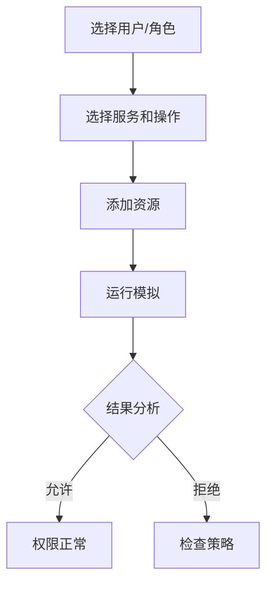
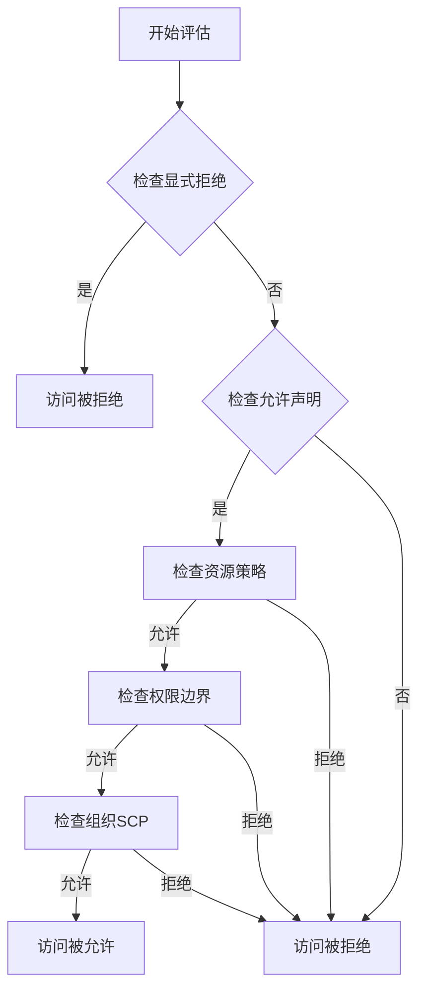

# AWS IAM权限调试指南

本指南提供了系统的方法来诊断和解决AWS IAM权限相关的问题，帮助您快速定位和修复权限错误。

## 目录

- [常见权限错误](#常见权限错误)
- [调试工具和方法](#调试工具和方法)
- [权限评估流程](#权限评估流程)
- [最佳实践](#最佳实践)
- [常见场景解决方案](#常见场景解决方案)
- [安全建议](#安全建议)

## 常见权限错误

### 1. AccessDenied错误

```json
{
    "Error": {
        "Code": "AccessDenied",
        "Message": "User: arn:aws:iam::123456789012:user/developer is not authorized to perform: s3:PutObject on resource: arn:aws:s3:::example-bucket/*"
    }
}
```

### 2. UnauthorizedOperation错误

```json
{
    "Error": {
        "Code": "UnauthorizedOperation",
        "Message": "You are not authorized to perform this operation."
    }
}
```

### 3. 显式拒绝

```json
{
    "Error": {
        "Code": "AccessDenied",
        "Message": "Access to the resource is denied by an explicit deny statement"
    }
}
```

## 调试工具和方法

### 1. IAM Policy Simulator

使用IAM Policy Simulator测试权限：



### 2. AWS CloudTrail

查看API调用历史：

```bash
# 使用AWS CLI查看CloudTrail日志
aws cloudtrail lookup-events \
    --lookup-attributes AttributeKey=Username,AttributeValue=developer \
    --start-time 2024-01-01T00:00:00Z
```

### 3. IAM Access Analyzer

```bash
# 使用AWS CLI分析访问权限
aws accessanalyzer start-policy-generation \
    --policy-type SERVICE_CONTROL_POLICY \
    --cloud-trail-details '{
        "StartTime": "2024-01-01T00:00:00Z",
        "EndTime": "2024-01-31T23:59:59Z"
    }'
```

## 权限评估流程

### 1. 权限评估步骤

1. 检查显式拒绝
2. 检查允许声明
3. 评估资源策略
4. 评估权限边界
5. 评估组织SCP
6. 生成最终决定



### 2. 权限分析工具

```bash
# 使用AWS CLI分析IAM策略
aws iam simulate-custom-policy \
    --policy-input-list file://policy.json \
    --action-names s3:PutObject
```

## 常见场景解决方案

### 1. S3访问问题

检查以下组件：

1. IAM策略
```json
{
    "Version": "2012-10-17",
    "Statement": [
        {
            "Effect": "Allow",
            "Action": [
                "s3:GetObject",
                "s3:PutObject"
            ],
            "Resource": "arn:aws:s3:::example-bucket/*"
        }
    ]
}
```

2. 存储桶策略
```json
{
    "Version": "2012-10-17",
    "Statement": [
        {
            "Effect": "Allow",
            "Principal": {
                "AWS": "arn:aws:iam::123456789012:user/developer"
            },
            "Action": "s3:*",
            "Resource": [
                "arn:aws:s3:::example-bucket",
                "arn:aws:s3:::example-bucket/*"
            ]
        }
    ]
}
```

### 2. EC2相关权限

检查实例配置文件：

```json
{
    "Version": "2012-10-17",
    "Statement": [
        {
            "Effect": "Allow",
            "Action": [
                "s3:GetObject",
                "dynamodb:Query"
            ],
            "Resource": "*"
        }
    ]
}
```

### 3. 跨账户访问

设置跨账户访问：

```json
{
    "Version": "2012-10-17",
    "Statement": [
        {
            "Effect": "Allow",
            "Principal": {
                "AWS": "arn:aws:iam::ACCOUNT-B-ID:root"
            },
            "Action": "sts:AssumeRole",
            "Condition": {}
        }
    ]
}
```

## 最佳实践

### 1. 权限最小化原则

- 仅授予必要权限
- 定期审查权限
- 使用条件限制访问

### 2. 使用AWS托管策略

```bash
# 列出AWS托管策略
aws iam list-policies --scope AWS --only-attached

# 获取策略详情
aws iam get-policy --policy-arn arn:aws:iam::aws:policy/AmazonS3ReadOnlyAccess
```

### 3. 权限边界使用

```json
{
    "Version": "2012-10-17",
    "Statement": [
        {
            "Effect": "Allow",
            "Action": [
                "s3:*",
                "dynamodb:*"
            ],
            "Resource": "*"
        }
    ]
}
```

## 调试步骤

### 1. 收集错误信息

```bash
# 启用AWS CLI调试
export AWS_DEBUG=true
aws s3 ls s3://my-bucket 2>&1 | tee debug.log
```

### 2. 检查策略评估

使用以下步骤：

1. 确认请求者身份
2. 列出适用策略
3. 评估有效权限
4. 检查资源策略
5. 验证条件语句

### 3. 常见解决方案

```bash
# 检查用户权限
aws iam list-attached-user-policies --user-name developer

# 检查角色权限
aws iam list-attached-role-policies --role-name app-role

# 检查组权限
aws iam list-attached-group-policies --group-name developers
```

## 安全建议

### 1. 定期审计

```bash
# 生成凭证报告
aws iam generate-credential-report
aws iam get-credential-report

# 列出未使用的凭证
aws iam list-access-keys --query 'AccessKeyMetadata[?Status==`Active`]'
```

### 2. 实施MFA

```bash
# 列出MFA设备
aws iam list-virtual-mfa-devices

# 启用MFA
aws iam enable-mfa-device \
    --user-name developer \
    --serial-number arn:aws:iam::123456789012:mfa/developer \
    --authentication-code1 123456 \
    --authentication-code2 789012
```

### 3. 使用临时凭证

```bash
# 获取临时凭证
aws sts get-session-token \
    --duration-seconds 3600 \
    --serial-number arn:aws:iam::123456789012:mfa/user \
    --token-code 123456
```

## 参考资源

- [AWS IAM 用户指南](https://docs.aws.amazon.com/IAM/latest/UserGuide/)
- [AWS IAM 策略参考](https://docs.aws.amazon.com/IAM/latest/UserGuide/reference_policies.html)
- [AWS CloudTrail 用户指南](https://docs.aws.amazon.com/awscloudtrail/latest/userguide/)
- [IAM Access Analyzer](https://docs.aws.amazon.com/IAM/latest/UserGuide/what-is-access-analyzer.html) 