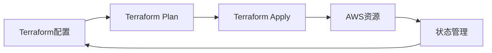

# 使用Terraform管理AWS资源

本指南详细介绍如何使用Terraform管理AWS云资源，包括基础设施即代码(IaC)的最佳实践和常见场景。

## 目录

- [基础知识](#基础知识)
- [安装和配置](#安装和配置)
- [核心概念](#核心概念)
- [常见资源管理](#常见资源管理)
- [最佳实践](#最佳实践)
- [高级主题](#高级主题)
- [故障排除](#故障排除)

## 基础知识

### 什么是Terraform?

Terraform是HashiCorp开发的开源基础设施即代码(IaC)工具，允许您以声明式代码定义和管理云资源。主要优势包括：

- 声明式配置
- 基础设施版本控制
- 自动化部署
- 多云支持
- 资源依赖管理

### 工作原理



## 安装和配置

### 安装Terraform

```bash
# Windows (使用Chocolatey)
choco install terraform

# MacOS (使用Homebrew)
brew install terraform

# Linux
curl -fsSL https://apt.releases.hashicorp.com/gpg | sudo apt-key add -
sudo apt-add-repository "deb [arch=amd64] https://apt.releases.hashicorp.com $(lsb_release -cs) main"
sudo apt-get update && sudo apt-get install terraform
```

### AWS凭证配置

```hcl
# AWS Provider配置
provider "aws" {
  region     = "ap-northeast-1"
  access_key = "YOUR_ACCESS_KEY"
  secret_key = "YOUR_SECRET_KEY"
}
```

推荐使用AWS凭证文件或环境变量进行配置：

```bash
# 使用AWS CLI配置
aws configure

# 或设置环境变量
export AWS_ACCESS_KEY_ID="YOUR_ACCESS_KEY"
export AWS_SECRET_ACCESS_KEY="YOUR_SECRET_KEY"
export AWS_REGION="ap-northeast-1"
```

## 核心概念

### 1. Provider

Provider是Terraform与AWS API交互的插件：

```hcl
terraform {
  required_providers {
    aws = {
      source  = "hashicorp/aws"
      version = "~> 4.0"
    }
  }
}
```

### 2. Resource

Resource定义要创建的AWS资源：

```hcl
resource "aws_instance" "example" {
  ami           = "ami-0c55b159cbfafe1f0"
  instance_type = "t2.micro"
  
  tags = {
    Name = "terraform-example"
  }
}
```

### 3. Data Source

Data Source用于查询现有资源信息：

```hcl
data "aws_vpc" "default" {
  default = true
}
```

### 4. Variables

变量定义和使用：

```hcl
# variables.tf
variable "environment" {
  type        = string
  description = "部署环境"
  default     = "dev"
}

# main.tf
resource "aws_instance" "example" {
  tags = {
    Environment = var.environment
  }
}
```

## 常见资源管理

### VPC配置

```hcl
resource "aws_vpc" "main" {
  cidr_block           = "10.0.0.0/16"
  enable_dns_hostnames = true
  enable_dns_support   = true

  tags = {
    Name = "main"
  }
}

resource "aws_subnet" "public" {
  vpc_id     = aws_vpc.main.id
  cidr_block = "10.0.1.0/24"

  tags = {
    Name = "Public Subnet"
  }
}
```

### EC2实例

```hcl
resource "aws_instance" "web" {
  ami           = "ami-0c55b159cbfafe1f0"
  instance_type = "t2.micro"
  subnet_id     = aws_subnet.public.id

  root_block_device {
    volume_size = 20
    volume_type = "gp2"
  }

  tags = {
    Name = "Web Server"
  }
}
```

### S3存储桶

```hcl
resource "aws_s3_bucket" "data" {
  bucket = "my-terraform-bucket"

  tags = {
    Environment = "Dev"
  }
}

resource "aws_s3_bucket_versioning" "versioning" {
  bucket = aws_s3_bucket.data.id
  versioning_configuration {
    status = "Enabled"
  }
}
```

## 最佳实践

### 1. 状态管理

使用远程状态存储：

```hcl
terraform {
  backend "s3" {
    bucket         = "terraform-state-bucket"
    key            = "terraform.tfstate"
    region         = "ap-northeast-1"
    encrypt        = true
    dynamodb_table = "terraform-locks"
  }
}
```

### 2. 模块化

创建可重用的模块：

```
modules/
  ├── vpc/
  │   ├── main.tf
  │   ├── variables.tf
  │   └── outputs.tf
  └── ec2/
      ├── main.tf
      ├── variables.tf
      └── outputs.tf
```

使用模块：

```hcl
module "vpc" {
  source = "./modules/vpc"
  
  vpc_cidr = "10.0.0.0/16"
}

module "web_server" {
  source = "./modules/ec2"
  
  subnet_id = module.vpc.public_subnet_id
}
```

### 3. 工作空间管理

```bash
# 创建新工作空间
terraform workspace new dev
terraform workspace new prod

# 切换工作空间
terraform workspace select dev
```

### 4. 变量管理

使用tfvars文件管理不同环境的变量：

```hcl
# dev.tfvars
environment = "dev"
instance_type = "t2.micro"

# prod.tfvars
environment = "prod"
instance_type = "t2.small"
```

## 高级主题

### 1. 条件创建

```hcl
resource "aws_instance" "dev" {
  count = var.environment == "dev" ? 1 : 0
  
  ami           = "ami-0c55b159cbfafe1f0"
  instance_type = "t2.micro"
}
```

### 2. 数据转换

```hcl
locals {
  common_tags = {
    Environment = var.environment
    Project     = var.project_name
    Terraform   = "true"
  }
}
```

### 3. 动态块

```hcl
resource "aws_security_group" "example" {
  name = "example"

  dynamic "ingress" {
    for_each = var.service_ports
    content {
      from_port   = ingress.value
      to_port     = ingress.value
      protocol    = "tcp"
      cidr_blocks = ["0.0.0.0/0"]
    }
  }
}
```

## 故障排除

### 常见问题

1. 状态文件锁定问题
```bash
# 强制解锁
terraform force-unlock LOCK_ID
```

2. 计划和应用失败
```bash
# 启用详细日志
export TF_LOG=DEBUG
terraform plan
```

3. 凭证问题
- 检查AWS凭证配置
- 验证IAM权限
- 确认区域设置

### 调试技巧

```bash
# 启用Terraform日志
export TF_LOG=TRACE
export TF_LOG_PATH=terraform.log

# 验证配置语法
terraform validate

# 格式化配置文件
terraform fmt
```

## 参考资源

- [Terraform官方文档](https://www.terraform.io/docs)
- [AWS Provider文档](https://registry.terraform.io/providers/hashicorp/aws/latest/docs)
- [Terraform最佳实践](https://www.terraform.io/docs/cloud/guides/recommended-practices/index.html) 