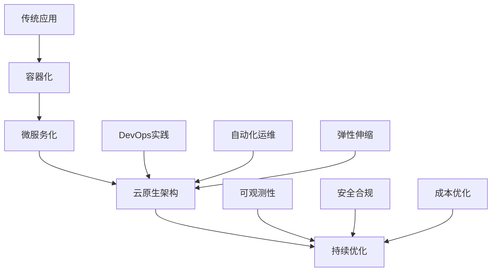

# AWS云原生转型指南

本指南详细介绍如何在AWS上实现云原生转型，包括架构设计、技术选型、实施策略和最佳实践。

## 目录
- [云原生概述](#云原生概述)
- [架构设计](#架构设计)
- [技术栈选型](#技术栈选型)
- [实施策略](#实施策略)
- [运维管理](#运维管理)
- [最佳实践](#最佳实践)

## 云原生概述

### 转型目标



### 云原生特性
```yaml
核心特性:
  架构特性:
    - 微服务架构
    - 容器化部署
    - 声明式API
    - 服务网格
  
  技术特性:
    - 不可变基础设施
    - 自动化运维
    - 持续交付
    - 弹性伸缩
  
  运维特性:
    - 可观测性
    - 自愈能力
    - 安全防护
    - 成本可控
```

## 架构设计

### 微服务架构
```yaml
架构模式:
  服务拆分:
    原则:
      - 单一职责
      - 领域驱动
      - 松耦合
      - 高内聚
    
    策略:
      - 业务功能
      - 数据模型
      - 团队边界
      - 扩展需求

  服务治理:
    核心要素:
      - 服务注册
      - 服务发现
      - 负载均衡
      - 熔断降级
    
    最佳实践:
      - API网关
      - 服务网格
      - 配置中心
      - 链路追踪
```

### 容器平台
```yaml
容器架构:
  基础设施:
    计算层:
      - EKS集群
      - EC2节点组
      - Fargate配置
      - 自动扩缩容
    
    网络层:
      - VPC设计
      - 子网规划
      - 安全组
      - 负载均衡

  容器编排:
    Kubernetes:
      - 命名空间
      - Pod设计
      - 服务定义
      - 存储配置
    
    运维管理:
      - 集群监控
      - 日志收集
      - 备份恢复
      - 升级策略
```

## 技术栈选型

### AWS服务
```yaml
核心服务:
  容器服务:
    - Amazon EKS
    - Amazon ECS
    - AWS App Runner
    - AWS Fargate
  
  应用服务:
    - AWS Lambda
    - Amazon API Gateway
    - AWS App Mesh
    - AWS CloudMap
  
  数据服务:
    - Amazon RDS
    - Amazon DynamoDB
    - Amazon ElastiCache
    - Amazon MSK
```

### 开源组件
```yaml
技术选型:
  基础设施:
    容器运行时:
      - Docker
      - Containerd
      - CRI-O
    
    服务网格:
      - Istio
      - Linkerd
      - AWS App Mesh

  可观测性:
    监控工具:
      - Prometheus
      - Grafana
      - CloudWatch
      - X-Ray
    
    日志工具:
      - Fluentd
      - Elasticsearch
      - Kibana
      - CloudWatch Logs
```

## 实施策略

### 转型路径
```yaml
实施路线:
  准备阶段:
    评估工作:
      - 应用评估
      - 架构评估
      - 团队评估
      - 风险评估
    
    规划工作:
      - 技术选型
      - 架构设计
      - 路径规划
      - 资源准备

  实施阶段:
    基础设施:
      - 网络规划
      - 集群部署
      - 安全配置
      - 监控部署
    
    应用改造:
      - 容器化
      - 服务拆分
      - 接口重构
      - 数据迁移
```

### DevOps实践
```yaml
DevOps流程:
  持续集成:
    代码管理:
      - 版本控制
      - 分支策略
      - 代码审查
      - 自动化测试
    
    构建发布:
      - 自动构建
      - 制品管理
      - 漏洞扫描
      - 质量检查

  持续部署:
    部署策略:
      - 蓝绿部署
      - 金丝雀发布
      - 滚动更新
      - 回滚机制
    
    自动化运维:
      - 配置管理
      - 环境管理
      - 变更管理
      - 监控告警
```

## 运维管理

### 可观测性
```yaml
监控体系:
  基础监控:
    资源监控:
      - CPU使用率
      - 内存使用
      - 网络流量
      - 磁盘使用
    
    容器监控:
      - 容器状态
      - Pod健康度
      - 服务可用性
      - 资源分配

  应用监控:
    性能指标:
      - 响应时间
      - 吞吐量
      - 错误率
      - 饱和度
    
    业务指标:
      - 业务KPI
      - 用户体验
      - 转化率
      - 成功率
```

### 安全防护
```yaml
安全架构:
  基础安全:
    网络安全:
      - VPC隔离
      - 安全组策略
      - WAF防护
      - DDoS防护
    
    访问控制:
      - IAM权限
      - RBAC配置
      - 密钥管理
      - 证书管理

  应用安全:
    安全实践:
      - 容器安全
      - 镜像扫描
      - 漏洞管理
      - 合规检查
    
    数据安全:
      - 加密传输
      - 加密存储
      - 数据备份
      - 访问审计
```

## 最佳实践

### 架构实践
1. **微服务设计**
   - 合理的服务粒度
   - 清晰的服务边界
   - 标准的API设计
   - 异步消息通信

2. **容器化实践**
   - 轻量级镜像
   - 健康检查配置
   - 资源限制设置
   - 存储卷管理

3. **高可用设计**
   - 多可用区部署
   - 自动故障转移
   - 弹性扩缩容
   - 熔断降级机制

### 运维实践
1. **自动化运维**
   - 自动化部署
   - 配置管理
   - 日志管理
   - 监控告警

2. **故障处理**
   - 故障检测
   - 自动恢复
   - 根因分析
   - 应急响应

3. **成本优化**
   - 资源规划
   - 成本监控
   - 弹性伸缩
   - 资源回收

### 安全实践
1. **身份认证**
   - 统一认证
   - 细粒度授权
   - 安全令牌
   - 证书管理

2. **数据安全**
   - 传输加密
   - 存储加密
   - 密钥轮换
   - 数据备份

3. **安全监控**
   - 安全审计
   - 威胁检测
   - 漏洞扫描
   - 合规检查

### 团队实践
1. **DevOps文化**
   - 持续学习
   - 快速反馈
   - 共同责任
   - 自动化思维

2. **敏捷开发**
   - 迭代开发
   - 持续交付
   - 团队协作
   - 技术卓越

3. **知识管理**
   - 文档维护
   - 经验分享
   - 技能培训
   - 最佳实践 