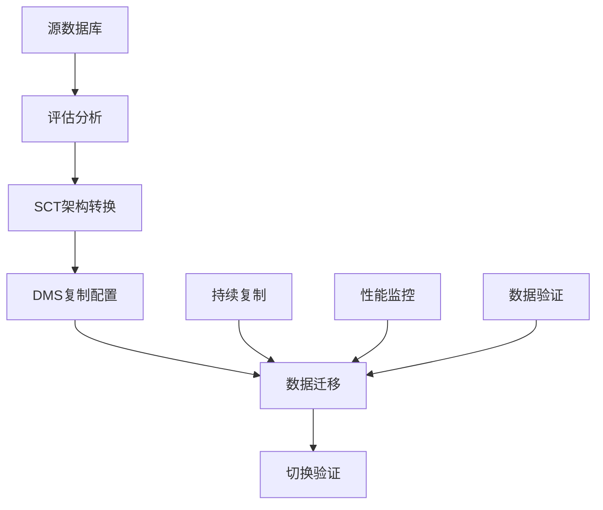

# AWS数据库迁移指南

本指南详细介绍如何使用AWS Database Migration Service (DMS)和Schema Conversion Tool (SCT)进行数据库迁移。

## 目录
- [迁移概述](#迁移概述)
- [迁移工具](#迁移工具)
- [迁移规划](#迁移规划)
- [实施步骤](#实施步骤)
- [最佳实践](#最佳实践)
- [故障排除](#故障排除)

## 迁移概述

### 迁移流程



### 支持的数据库
```yaml
源数据库:
  关系型:
    - Oracle
    - SQL Server
    - MySQL
    - PostgreSQL
    - SAP ASE
    - DB2
  
  非关系型:
    - MongoDB
    - DocumentDB
    - DynamoDB

目标数据库:
  AWS服务:
    - Aurora
    - RDS
    - Redshift
    - DynamoDB
    - DocumentDB
    - S3
```

## 迁移工具

### AWS DMS
```yaml
功能特点:
  数据迁移:
    - 一次性迁移
    - 持续复制
    - 变更数据捕获
    - 双向复制
  
  支持特性:
    - 数据过滤
    - 数据转换
    - 并行加载
    - 故障恢复
  
  监控功能:
    - 任务状态
    - 复制延迟
    - 资源使用
    - 错误日志
```

### AWS SCT
```yaml
主要功能:
  架构转换:
    - 数据库架构
    - 应用代码
    - ETL作业
    - 存储过程
  
  评估报告:
    - 兼容性分析
    - 复杂度评估
    - 工作量估算
    - 建议方案
  
  代码转换:
    - SQL语句
    - 函数
    - 视图
    - 触发器
```

## 迁移规划

### 评估阶段
```yaml
迁移评估:
  数据评估:
    规模分析:
      - 数据库大小
      - 表数量
      - 对象数量
      - 增长趋势
    
    复杂度分析:
      - 架构复杂度
      - 依赖关系
      - 特殊功能
      - 自定义代码

  性能需求:
    基准指标:
      - 吞吐量
      - 响应时间
      - 并发用户
      - 查询性能
    
    容量规划:
      - 存储需求
      - 计算资源
      - 网络带宽
      - 扩展预估
```

### 迁移策略
```yaml
策略选择:
  迁移方式:
    大批量:
      - 完整备份
      - 并行加载
      - 分批迁移
      - 增量同步
    
    实时复制:
      - CDC捕获
      - 双写模式
      - 零停机切换
      - 回滚方案

  风险控制:
    预防措施:
      - 数据备份
      - 演练测试
      - 监控告警
      - 应急预案
```

## 实施步骤

### 环境准备
```yaml
准备工作:
  网络配置:
    连接设置:
      - VPC配置
      - 安全组
      - 子网设置
      - 路由表
    
    访问控制:
      - IAM角色
      - 数据库权限
      - 加密设置
      - SSL证书

  资源配置:
    DMS实例:
      - 实例类型
      - 存储配置
      - 多可用区
      - 维护时间
```

### SCT转换步骤
```yaml
架构转换:
  准备阶段:
    - 安装SCT
    - 配置驱动
    - 连接测试
    - 权限验证
  
  转换过程:
    - 加载架构
    - 生成报告
    - 转换代码
    - 优化调整
  
  验证测试:
    - 语法检查
    - 功能测试
    - 性能测试
    - 回归测试
```

### DMS配置步骤
```yaml
任务配置:
  端点配置:
    源端点:
      - 连接信息
      - 访问权限
      - SSL设置
      - 额外连接属性
    
    目标端点:
      - 数据库选择
      - 连接参数
      - 安全设置
      - 性能选项

  任务设置:
    基本配置:
      - 迁移类型
      - 表映射
      - LOB设置
      - 错误处理
    
    高级选项:
      - 并行加载
      - 验证设置
      - 日志记录
      - 控制表
```

## 最佳实践

### 性能优化
```yaml
优化方案:
  资源优化:
    DMS实例:
      - 选择合适实例类型
      - 配置充足存储
      - 启用多可用区
      - 优化网络设置
    
    数据库优化:
      - 索引策略
      - 分区设计
      - 并行度设置
      - 资源限制

  任务优化:
    并行设置:
      - 表并行度
      - LOB分段
      - 批量应用
      - 内存管理
```

### 监控和验证
```yaml
监控方案:
  性能监控:
    指标收集:
      - 复制延迟
      - CPU使用率
      - 内存使用
      - I/O性能
    
    告警设置:
      - 延迟阈值
      - 错误计数
      - 资源使用
      - 任务状态

  数据验证:
    验证方法:
      - 行计数
      - 校验和
      - 采样比对
      - 完整性检查
```

## 故障排除

### 常见问题
1. **连接问题**
   - 网络连接失败
   - 权限不足
   - SSL配置错误
   - 防火墙限制

2. **性能问题**
   - 复制延迟高
   - 资源不足
   - 网络带宽限制
   - 数据库瓶颈

3. **数据问题**
   - 数据类型不兼容
   - 字符集问题
   - LOB处理错误
   - 主键冲突

### 解决方案
```yaml
问题解决:
  连接问题:
    排查步骤:
      - 检查网络连通性
      - 验证安全组规则
      - 确认数据库权限
      - 测试端点配置
    
    解决方法:
      - 调整网络设置
      - 更新安全规则
      - 修改权限配置
      - 重新配置端点

  性能问题:
    优化措施:
      - 升级实例规格
      - 优化任务设置
      - 调整并行度
      - 增加资源配额
    
    监控改进:
      - 设置告警阈值
      - 实时监控指标
      - 定期性能评估
      - 优化配置参数
```

### 最佳实践建议

1. **规划阶段**
   - 详细评估源数据库
   - 选择合适的目标数据库
   - 制定详细的迁移计划
   - 准备回滚方案

2. **实施阶段**
   - 进行充分的测试
   - 采用增量迁移策略
   - 实施监控和告警
   - 准备应急预案

3. **验证阶段**
   - 执行全面的数据验证
   - 进行性能测试
   - 验证应用兼容性
   - 执行回滚演练

4. **运维阶段**
   - 持续监控性能
   - 定期验证数据
   - 优化迁移配置
   - 记录经验教训
