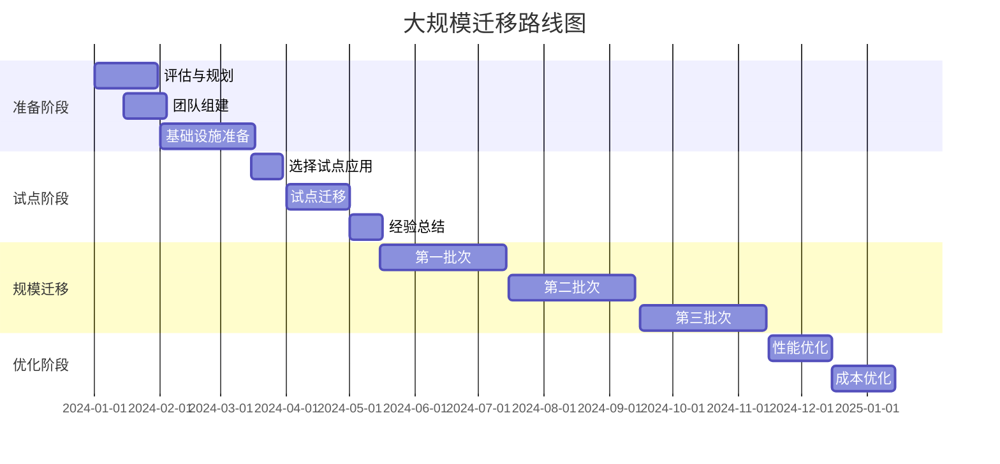

# AWS大规模迁移实施指南

本指南详细介绍了企业级工作负载向AWS大规模迁移的完整实施方案，包括组织准备、技术实施、风险控制等各个方面。

## 目录
- [迁移准备](#迁移准备)
- [组织架构](#组织架构)
- [技术架构](#技术架构)
- [迁移流程](#迁移流程)
- [风险管理](#风险管理)
- [变更管理](#变更管理)
- [成本管理](#成本管理)
- [质量保证](#质量保证)
- [运维交接](#运维交接)

## 迁移准备

### 评估框架
```yaml
业务评估:
  应用清单:
    - 业务重要性
    - 依赖关系
    - SLA要求
    - 合规要求
  
  技术评估:
    - 应用架构
    - 技术栈
    - 性能需求
    - 安全要求

准备工作:
  基础设施:
    - 网络规划
    - 安全架构
    - 身份认证
    - 监控体系
  
  团队准备:
    - 技能评估
    - 培训计划
    - 职责分工
    - 协作机制
```

### 迁移路线图



## 组织架构

### 团队设置
```yaml
核心团队:
  指导委员会:
    - 业务负责人
    - 技术负责人
    - 财务负责人
    - 安全合规官
  
  项目管理办公室:
    - 项目经理
    - 进度管理
    - 风险管理
    - 质量管理

技术团队:
  迁移团队:
    - 架构师
    - 开发工程师
    - 运维工程师
    - DBA
  
  支持团队:
    - 网络团队
    - 安全团队
    - 监控团队
    - 测试团队
```

### 职责矩阵
```yaml
RACI矩阵:
  决策层:
    - 战略决策
    - 资源分配
    - 风险审批
    - 预算控制
  
  执行层:
    - 技术实施
    - 进度管理
    - 问题解决
    - 质量控制
```

## 技术架构

### 目标架构
```yaml
网络架构:
  骨干网络:
    - Direct Connect
    - Transit Gateway
    - VPC设计
    - 子网规划
  
  安全架构:
    - 防火墙策略
    - 访问控制
    - 加密方案
    - 审计日志

应用架构:
  计算资源:
    - EC2实例
    - 容器服务
    - 无服务器
    - 自动扩展
  
  存储方案:
    - 块存储
    - 对象存储
    - 文件系统
    - 数据备份
```

### 迁移工具链
```yaml
工具集成:
  评估工具:
    - Migration Evaluator
    - Application Discovery
    - TCO Calculator
    - 依赖分析工具
  
  迁移工具:
    - Application Migration
    - Database Migration
    - Server Migration
    - 数据同步工具

自动化平台:
  持续集成:
    - Jenkins
    - GitLab
    - Ansible
    - Terraform
  
  监控平台:
    - CloudWatch
    - Prometheus
    - Grafana
    - ELK Stack
```

## 迁移流程

### 标准流程
```yaml
迁移阶段:
  发现与评估:
    - 应用盘点
    - 依赖分析
    - 性能基线
    - 迁移优先级
  
  规划与设计:
    - 架构设计
    - 网络规划
    - 安全方案
    - 迁移时间表

  实施与验证:
    - 环境准备
    - 数据迁移
    - 应用迁移
    - 功能测试
  
  切换与优化:
    - 预演验证
    - 生产切换
    - 性能优化
    - 问题修复
```

### 批次规划
```yaml
分批策略:
  第一批次:
    类型: 非关键应用
    规模: 20%工作负载
    目标: 积累经验
    时长: 2个月
  
  第二批次:
    类型: 中等重要性
    规模: 40%工作负载
    目标: 规模化验证
    时长: 2个月
  
  第三批次:
    类型: 核心应用
    规模: 40%工作负载
    目标: 完成迁移
    时长: 2个月
```

## 风险管理

### 风险评估
```yaml
风险类别:
  技术风险:
    - 性能问题
    - 兼容性问题
    - 数据丢失
    - 安全漏洞
  
  业务风险:
    - 服务中断
    - 用户体验
    - 数据一致性
    - SLA违约

  运营风险:
    - 人员技能
    - 流程适应
    - 成本超支
    - 进度延迟
```

### 应对策略
```yaml
风险控制:
  预防措施:
    - 架构评审
    - 压力测试
    - 应急预案
    - 回滚机制
  
  监控措施:
    - 性能监控
    - 安全监控
    - 成本监控
    - 进度监控
```

## 变更管理

### 变更流程
```yaml
变更控制:
  评估流程:
    - 影响分析
    - 风险评估
    - 资源评估
    - 审批流程
  
  实施流程:
    - 变更通知
    - 实施计划
    - 验证确认
    - 结果回顾
```

### 沟通计划
```yaml
沟通矩阵:
  内部沟通:
    - 每日站会
    - 周度汇报
    - 月度评审
    - 高层简报
  
  外部沟通:
    - 用户通知
    - 进度报告
    - 问题反馈
    - 满意度调查
```

## 成本管理

### 预算控制
```yaml
成本框架:
  基础成本:
    - 基础设施
    - 许可证
    - 带宽费用
    - 存储费用
  
  人力成本:
    - 内部团队
    - 外部顾问
    - 培训费用
    - 加班费用
```

### 优化策略
```yaml
成本优化:
  短期优化:
    - 资源规划
    - 实例选型
    - 预留实例
    - 自动关停
  
  长期优化:
    - 架构优化
    - 服务选型
    - 存储分层
    - 自动扩缩
```

## 质量保证

### 测试策略
```yaml
测试框架:
  功能测试:
    - 单元测试
    - 集成测试
    - 端到端测试
    - 回归测试
  
  非功能测试:
    - 性能测试
    - 安全测试
    - 灾备测试
    - 可用性测试
```

### 验收标准
```yaml
验收指标:
  性能指标:
    - 响应时间
    - 吞吐量
    - CPU使用率
    - 内存使用率
  
  可用性指标:
    - 服务可用性
    - 故障恢复时间
    - 数据一致性
    - 用户体验
```

## 运维交接

### 运维准备
```yaml
交接计划:
  文档准备:
    - 架构文档
    - 运维手册
    - 故障处理
    - 监控配置
  
  培训计划:
    - 技术培训
    - 流程培训
    - 工具使用
    - 应急响应
```

### 持续优化
```yaml
优化计划:
  性能优化:
    - 资源调整
    - 架构优化
    - 代码优化
    - 配置优化
  
  运维优化:
    - 自动化程度
    - 监控完善
    - 流程优化
    - 成本控制
```

## 最佳实践

### 技术建议
1. 采用自动化迁移工具
2. 实施持续集成/部署
3. 建立完善监控体系
4. 实施数据备份策略
5. 优化性能和成本

### 管理建议
1. 建立清晰的治理结构
2. 制定详细的计划和时间表
3. 保持有效的沟通机制
4. 重视风险管理和控制
5. 注重知识管理和经验总结

### 经验教训
1. 充分的准备和评估
2. 合理的批次规划
3. 有效的团队协作
4. 完善的监控和反馈
5. 持续的优化和改进
