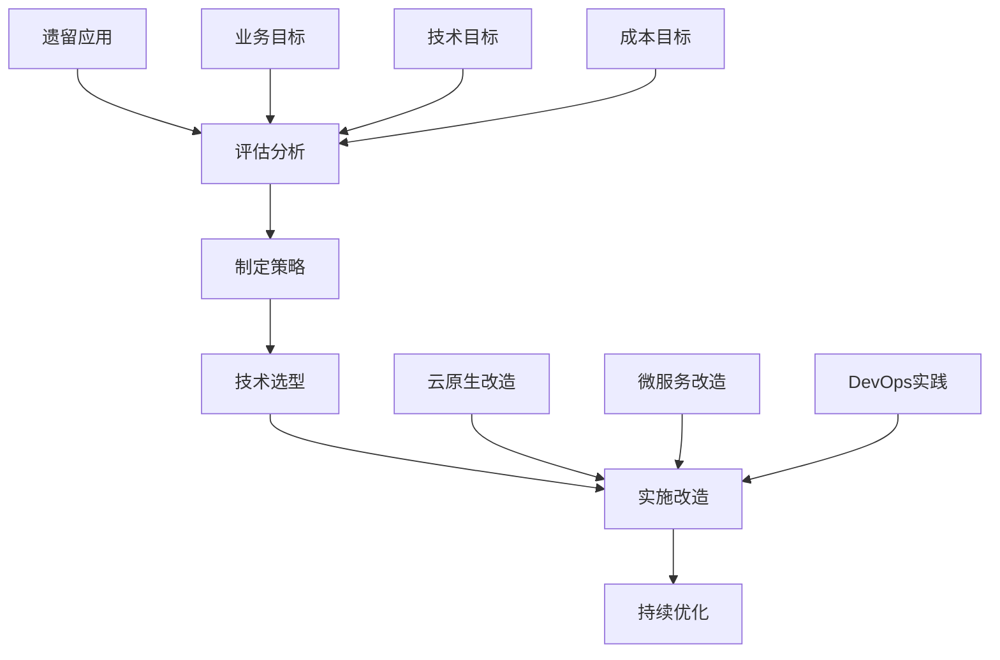

# AWS应用现代化指南

本指南详细介绍了在AWS上进行应用现代化改造的完整方案，包括评估框架、现代化策略、技术选型和最佳实践。

## 目录
- [现代化概述](#现代化概述)
- [评估框架](#评估框架)
- [现代化策略](#现代化策略)
- [技术架构](#技术架构)
- [实施方法](#实施方法)
- [DevOps转型](#devops转型)
- [监控运维](#监控运维)
- [最佳实践](#最佳实践)

## 现代化概述

### 现代化目标



### 现代化路径
```yaml
改造路径:
  单体到微服务:
    - 功能解耦
    - 服务拆分
    - 接口重构
    - 数据分离
  
  传统到云原生:
    - 容器化改造
    - 服务编排
    - 自动扩展
    - 弹性部署

  技术栈更新:
    - 框架升级
    - 中间件现代化
    - 数据库优化
    - 安全加固
```

## 评估框架

### 应用评估
```yaml
评估维度:
  技术维度:
    架构评估:
      - 代码质量
      - 技术债务
      - 扩展性
      - 维护性
    
    性能评估:
      - 响应时间
      - 并发能力
      - 资源利用
      - 瓶颈分析
  
  业务维度:
    价值评估:
      - 业务重要性
      - 用户规模
      - 更新频率
      - 维护成本
    
    风险评估:
      - 技术风险
      - 业务风险
      - 安全风险
      - 合规风险
```

### 现代化决策
```yaml
决策矩阵:
  改造方案:
    重构级别:
      - 表层改造
      - 部分重构
      - 完全重构
      - 重新开发
    
    优先顺序:
      - 试点项目
      - 快速价值
      - 复杂依赖
      - 核心系统

  投资回报:
    成本因素:
      - 开发成本
      - 运维成本
      - 培训成本
      - 迁移成本
    
    收益分析:
      - 性能提升
      - 维护简化
      - 创新能力
      - 市场响应
```

## 现代化策略

### 架构现代化
```yaml
架构改造:
  微服务架构:
    服务设计:
      - 领域驱动设计
      - 服务边界
      - API设计
      - 数据模型
    
    治理框架:
      - 服务注册
      - 配置管理
      - 服务监控
      - 链路追踪

  云原生架构:
    基础设施:
      - 容器平台
      - 服务网格
      - 持续部署
      - 自动扩缩
    
    运行时:
      - 健康检查
      - 故障恢复
      - 流量控制
      - 安全防护
```

### 技术现代化
```yaml
技术栈:
  前端技术:
    框架选择:
      - React
      - Vue.js
      - Angular
      - Next.js
    
    现代化特性:
      - 组件化
      - 状态管理
      - 服务端渲染
      - 性能优化

  后端技术:
    框架升级:
      - Spring Boot
      - Node.js
      - Django
      - FastAPI
    
    中间件:
      - 消息队列
      - 缓存系统
      - 搜索引擎
      - 任务调度
```

## 技术架构

### AWS服务选型
```yaml
核心服务:
  计算服务:
    容器服务:
      - ECS
      - EKS
      - App Runner
      - Fargate
    
    无服务器:
      - Lambda
      - API Gateway
      - Step Functions
      - EventBridge

  数据服务:
    数据存储:
      - Aurora
      - DynamoDB
      - ElastiCache
      - S3
    
    数据处理:
      - Kinesis
      - MSK
      - EMR
      - Glue
```

### 参考架构
```yaml
架构模式:
  微服务架构:
    基础组件:
      - API Gateway
      - 服务注册
      - 配置中心
      - 服务发现
    
    高级特性:
      - 熔断降级
      - 限流控制
      - 分布式追踪
      - 监控告警

  事件驱动:
    核心组件:
      - 事件总线
      - 消息队列
      - 状态机
      - 事件存储
    
    集成方案:
      - 异步处理
      - 事件溯源
      - CQRS模式
      - 流处理
```

## 实施方法

### 重构方法
```yaml
重构策略:
  代码重构:
    重构模式:
      - 提取方法
      - 移动方法
      - 重命名
      - 简化条件
    
    最佳实践:
      - 单一职责
      - 开闭原则
      - 依赖注入
      - 测试驱动

  数据重构:
    数据迁移:
      - 模式转换
      - 数据清洗
      - 增量同步
      - 一致性检查
    
    存储优化:
      - 分库分表
      - 读写分离
      - 缓存策略
      - 数据分层
```

### 实施步骤
```yaml
实施流程:
  准备阶段:
    - 架构评估
    - 依赖分析
    - 技术选型
    - 团队培训
  
  实施阶段:
    - 环境搭建
    - 功能重构
    - 测试验证
    - 灰度发布
  
  优化阶段:
    - 性能优化
    - 监控完善
    - 文档更新
    - 经验总结
```

## DevOps转型

### 流程自动化
```yaml
自动化实践:
  CI/CD流水线:
    构建流程:
      - 代码检查
      - 单元测试
      - 构建打包
      - 制品管理
    
    部署流程:
      - 环境准备
      - 配置注入
      - 服务部署
      - 健康检查

  自动化测试:
    测试类型:
      - 单元测试
      - 集成测试
      - 性能测试
      - 安全测试
    
    测试工具:
      - JUnit
      - Selenium
      - JMeter
      - SonarQube
```

### 工具链集成
```yaml
DevOps工具:
  代码管理:
    - CodeCommit
    - GitHub
    - GitLab
    - Bitbucket
  
  构建部署:
    - CodeBuild
    - CodeDeploy
    - Jenkins
    - CircleCI
  
  监控运维:
    - CloudWatch
    - Prometheus
    - Grafana
    - ELK Stack
```

## 监控运维

### 监控体系
```yaml
监控框架:
  基础监控:
    - 资源使用率
    - 服务状态
    - 性能指标
    - 安全事件
  
  业务监控:
    - 业务指标
    - 用户体验
    - 转化率
    - 错误率
  
  告警策略:
    - 阈值设置
    - 告警级别
    - 通知渠道
    - 处理流程
```

### 运维管理
```yaml
运维实践:
  日常运维:
    - 变更管理
    - 问题处理
    - 容量规划
    - 成本优化
  
  应急响应:
    - 故障诊断
    - 应急处理
    - 事后复盘
    - 持续改进
```

## 最佳实践

### 技术实践
1. 采用领域驱动设计
2. 实施测试驱动开发
3. 建立持续集成流程
4. 实现自动化部署
5. 构建完整监控体系

### 团队实践
1. 培养全栈能力
2. 建立DevOps文化
3. 促进知识共享
4. 实施敏捷开发
5. 持续学习和改进

### 架构实践
1. 遵循云原生原则
2. 采用微服务架构
3. 实现服务解耦
4. 保证数据一致性
5. 确保系统可扩展

### 安全实践
1. 实施身份认证
2. 加密敏感数据
3. 控制访问权限
4. 监控安全事件
5. 定期安全评估
