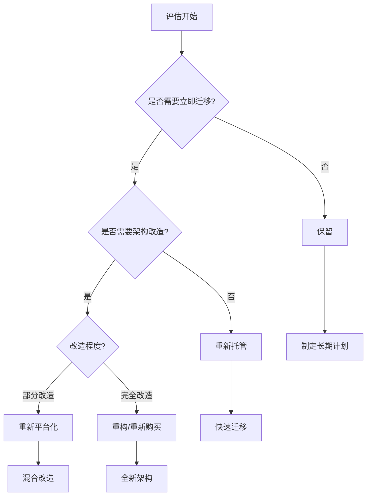

# AWS迁移策略指南

本指南详细介绍了将应用和系统迁移到AWS的各种策略、方法和最佳实践。

## 目录
- [迁移策略概述](#迁移策略概述)
- [重新托管(Rehost)](#重新托管)
- [重新平台化(Replatform)](#重新平台化)
- [重构(Refactor)](#重构)
- [重新购买(Repurchase)](#重新购买)
- [保留(Retain)](#保留)
- [停用(Retire)](#停用)
- [迁移工具](#迁移工具)
- [迁移流程](#迁移流程)
- [最佳实践](#最佳实践)

## 迁移策略概述

### 策略选择框架



### 策略对比
```yaml
迁移策略比较:
  重新托管:
    优势:
      - 迁移速度快
      - 风险较低
      - 成本可控
      - 操作简单
    劣势:
      - 云原生特性利用有限
      - 优化空间较小
      - 长期TCO较高
    适用场景:
      - 快速迁移需求
      - 传统应用迁移
      - 低风险要求
      - 预算有限

  重新平台化:
    优势:
      - 部分云原生优化
      - 性能提升
      - 管理简化
      - 成本优化
    劣势:
      - 需要部分改造
      - 迁移周期增加
      - 需要新技能
    适用场景:
      - 性能优化需求
      - 部分现代化
      - 可控改造
      - 平衡投资收益

  重构:
    优势:
      - 充分利用云特性
      - 架构现代化
      - 长期TCO优化
      - 创新能力提升
    劣势:
      - 投入大
      - 周期长
      - 风险高
      - 技能要求高
    适用场景:
      - 业务创新需求
      - 架构老旧
      - 长期发展
      - 数字化转型

  重新购买:
    优势:
      - 快速获得新功能
      - 降低维护成本
      - 标准化程度高
      - 持续更新
    劣势:
      - 供应商锁定
      - 定制性降低
      - 迁移成本
    适用场景:
      - 标准化需求
      - 非核心系统
      - 维护成本高
      - 快速部署
```

## 重新托管

### 实施方法
```yaml
托管迁移:
  准备阶段:
    - 应用清单梳理
    - 依赖关系分析
    - 性能基线采集
    - 迁移工具选择
  
  迁移步骤:
    - 服务器复制
    - 网络配置
    - 数据迁移
    - 切换测试

工具使用:
  AWS工具:
    - Application Migration Service
    - Server Migration Service
    - Database Migration Service
    - CloudEndure Migration
  
  最佳实践:
    - 批次规划
    - 自动化脚本
    - 回滚方案
    - 监控验证
```

### 案例分析
```yaml
典型案例:
  Web应用迁移:
    步骤:
      - 服务器映射
      - 存储迁移
      - 网络配置
      - 负载均衡
    结果:
      - 迁移时间: 2周
      - 停机时间: 4小时
      - 成本节省: 30%
  
  数据库迁移:
    步骤:
      - 架构评估
      - 数据复制
      - 增量同步
      - 切换验证
    结果:
      - 数据量: 5TB
      - 同步延迟: <1分钟
      - 成功率: 99.9%
```

## 重新平台化

### 改造方案
```yaml
平台改造:
  数据库改造:
    - 迁移到RDS
    - 优化数据模型
    - 实施读写分离
    - 配置高可用
  
  应用改造:
    - 容器化改造
    - 自动扩展
    - 监控集成
    - 日志中心化

架构优化:
  基础设施:
    - 多可用区部署
    - VPC网络规划
    - 安全组策略
    - 备份策略
  
  运维优化:
    - 自动化部署
    - 监控告警
    - 日志分析
    - 成本管理
```

### 实施步骤
```yaml
实施流程:
  评估阶段:
    - 应用分析
    - 改造范围
    - 技术选型
    - 风险评估
  
  执行阶段:
    - 环境准备
    - 分批改造
    - 测试验证
    - 灰度发布
```

## 重构

### 架构设计
```yaml
现代化架构:
  应用架构:
    - 微服务化
    - 无服务器化
    - 事件驱动
    - 云原生设计
  
  技术选型:
    - 容器编排
    - 服务网格
    - API网关
    - 消息队列

数据架构:
  存储选择:
    - 关系型数据库
    - NoSQL数据库
    - 数据仓库
    - 数据湖
  
  数据处理:
    - 流处理
    - 批处理
    - 实时分析
    - 机器学习
```

### 实施策略
```yaml
重构策略:
  渐进式改造:
    - 功能拆分
    - 服务解耦
    - 数据迁移
    - 平滑过渡
  
  团队建设:
    - 技能培训
    - DevOps实践
    - 敏捷转型
    - 文化建设
```

## 重新购买

### 评估框架
```yaml
SaaS选型:
  评估维度:
    - 功能覆盖度
    - 集成能力
    - 定价模型
    - 服务等级
  
  迁移考虑:
    - 数据迁移
    - 用户培训
    - 流程适配
    - 变更管理
```

### 实施指南
```yaml
实施步骤:
  准备阶段:
    - 需求梳理
    - 产品选型
    - POC测试
    - 采购审批
  
  上线阶段:
    - 环境配置
    - 数据迁移
    - 用户培训
    - 切换上线
```

## 迁移工具

### AWS迁移工具
```yaml
工具清单:
  评估工具:
    - Migration Evaluator
    - Migration Hub
    - TCO Calculator
    - Application Discovery
  
  迁移工具:
    - Application Migration Service
    - Database Migration Service
    - Server Migration Service
    - DataSync
```

### 第三方工具
```yaml
辅助工具:
  监控工具:
    - Prometheus
    - Grafana
    - ELK Stack
    - NewRelic
  
  自动化工具:
    - Terraform
    - Ansible
    - Jenkins
    - GitLab
```

## 迁移流程

### 标准流程
```yaml
流程步骤:
  发现阶段:
    - 应用清单
    - 依赖分析
    - 性能基线
    - 迁移目标
  
  规划阶段:
    - 策略选择
    - 架构设计
    - 时间规划
    - 资源预算
  
  执行阶段:
    - 环境准备
    - 迁移实施
    - 测试验证
    - 切换上线
  
  优化阶段:
    - 性能优化
    - 成本优化
    - 安全加固
    - 运维优化
```

### 风险管理
```yaml
风险控制:
  风险类型:
    - 技术风险
    - 业务风险
    - 人员风险
    - 成本风险
  
  应对策略:
    - 风险评估
    - 预案准备
    - 持续监控
    - 快速响应
```

## 最佳实践

### 技术建议
1. 采用自动化工具
2. 实施持续集成
3. 建立监控体系
4. 保证数据安全
5. 优化性能配置

### 管理建议
1. 制定详细计划
2. 建立沟通机制
3. 控制项目范围
4. 注重知识传递
5. 做好变更管理

### 成本控制
1. 选择合适实例
2. 优化存储使用
3. 实施预留实例
4. 监控资源使用
5. 优化架构设计

### 安全合规
1. 实施访问控制
2. 加密敏感数据
3. 建立审计机制
4. 确保合规要求
5. 定期安全评估
