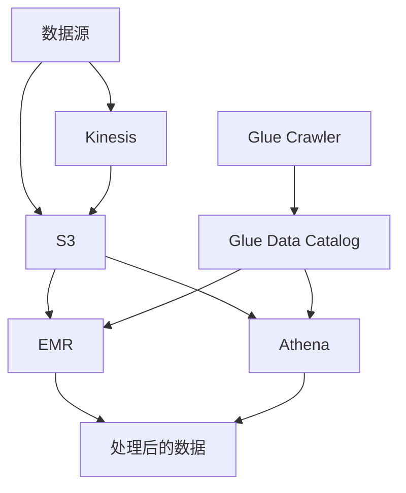

# AWS 大数据处理解决方案

本文详细介绍如何使用AWS EMR、Athena和Glue构建完整的大数据处理解决方案。

## 目录

1. [方案概述](#方案概述)
2. [数据采集和存储](#数据采集和存储)
3. [EMR集群管理](#emr集群管理)
4. [数据目录和ETL](#数据目录和etl)
5. [数据查询和分析](#数据查询和分析)
6. [性能优化](#性能优化)
7. [安全性配置](#安全性配置)
8. [监控和运维](#监控和运维)
9. [成本优化](#成本优化)
10. [最佳实践](#最佳实践)

## 方案概述

### 架构组件



### 服务功能对比

| 服务 | 主要功能 | 适用场景 | 优势 |
|-----|---------|---------|------|
| EMR | 大规模数据处理 | 批处理、机器学习 | 灵活、强大 |
| Athena | 交互式查询 | 即席查询、数据探索 | 无服务器、简单 |
| Glue | 数据目录和ETL | 数据转换、元数据管理 | 全托管、自动化 |

## 数据采集和存储

### S3数据湖配置

```json
{
    "BucketConfiguration": {
        "DataLake": {
            "Name": "my-data-lake",
            "Lifecycle": {
                "Transitions": [{
                    "Days": 90,
                    "StorageClass": "INTELLIGENT_TIERING"
                }]
            },
            "Versioning": "Enabled"
        }
    }
}
```

### 数据分区策略

```sql
-- Hive分区表示例
CREATE EXTERNAL TABLE events (
    event_id STRING,
    event_type STRING,
    data STRING
)
PARTITIONED BY (
    year INT,
    month INT,
    day INT
)
STORED AS PARQUET
LOCATION 's3://my-data-lake/events/';
```

## EMR集群管理

### 集群配置

1. **硬件配置**
   ```json
   {
       "Instances": {
           "MasterInstanceType": "m5.xlarge",
           "CoreInstanceType": "r5.2xlarge",
           "CoreInstanceCount": 3,
           "TaskInstanceType": "r5.2xlarge",
           "TaskInstanceCount": 2
       }
   }
   ```

2. **软件配置**
   ```json
   {
       "Applications": [
           {"Name": "Hadoop"},
           {"Name": "Spark"},
           {"Name": "Hive"},
           {"Name": "Presto"}
       ],
       "Configurations": [{
           "Classification": "spark-defaults",
           "Properties": {
               "spark.driver.memory": "5g",
               "spark.executor.memory": "5g",
               "spark.dynamicAllocation.enabled": "true"
           }
       }]
   }
   ```

### EMR步骤示例

1. **Spark作业**
   ```python
   # 数据处理作业示例
   from pyspark.sql import SparkSession

   spark = SparkSession.builder \
       .appName("DataProcessing") \
       .getOrCreate()

   # 读取数据
   df = spark.read.parquet("s3://my-data-lake/raw/")

   # 处理数据
   processed = df.filter("event_type = 'purchase'") \
       .groupBy("product_id") \
       .agg({"amount": "sum"})

   # 保存结果
   processed.write.parquet("s3://my-data-lake/processed/")
   ```

2. **Hive查询**
   ```sql
   -- 数据聚合示例
   INSERT OVERWRITE TABLE summary
   PARTITION (year=${year}, month=${month})
   SELECT 
       product_id,
       SUM(amount) as total_amount,
       COUNT(DISTINCT user_id) as unique_users
   FROM events
   WHERE year=${year} AND month=${month}
   GROUP BY product_id;
   ```

## 数据目录和ETL

### Glue爬虫配置

```json
{
    "Crawler": {
        "Name": "data-lake-crawler",
        "Role": "arn:aws:iam::account:role/GlueServiceRole",
        "DatabaseName": "data_catalog",
        "Targets": {
            "S3Targets": [{
                "Path": "s3://my-data-lake/processed/",
                "Exclusions": ["*.tmp", "*.temp"]
            }]
        },
        "Schedule": {
            "FrequencySchedule": "cron(0 0 * * ? *)"
        }
    }
}
```

### ETL作业配置

```json
{
    "Job": {
        "Name": "data-transformation",
        "Role": "arn:aws:iam::account:role/GlueETLRole",
        "Command": {
            "Name": "glueetl",
            "ScriptLocation": "s3://my-scripts/transform.py"
        },
        "DefaultArguments": {
            "--job-language": "python",
            "--job-bookmark-option": "job-bookmark-enable"
        }
    }
}
```

### ETL脚本示例

```python
import sys
from awsglue.transforms import *
from awsglue.utils import getResolvedOptions
from pyspark.context import SparkContext
from awsglue.context import GlueContext
from awsglue.job import Job

# 初始化Glue上下文
glueContext = GlueContext(SparkContext.getOrCreate())
spark = glueContext.spark_session
job = Job(glueContext)

# 读取源数据
source = glueContext.create_dynamic_frame.from_catalog(
    database="data_catalog",
    table_name="raw_data"
)

# 应用转换
mapped = ApplyMapping.apply(
    frame=source,
    mappings=[
        ("id", "string", "user_id", "string"),
        ("ts", "long", "timestamp", "timestamp"),
        ("data", "string", "event_data", "string")
    ]
)

# 写入目标位置
glueContext.write_dynamic_frame.from_options(
    frame=mapped,
    connection_type="s3",
    connection_options={
        "path": "s3://my-data-lake/transformed/"
    },
    format="parquet"
)
```

## 数据查询和分析

### Athena查询优化

1. **分区剪枝**
   ```sql
   -- 高效的分区查询
   SELECT *
   FROM events
   WHERE year = 2024
     AND month = 3
     AND day BETWEEN 1 AND 7;
   ```

2. **列式存储优化**
   ```sql
   -- 创建优化表
   CREATE TABLE optimized_events
   WITH (
       format = 'PARQUET',
       parquet_compression = 'SNAPPY',
       partitioned_by = ARRAY['year', 'month']
   ) AS
   SELECT * FROM raw_events;
   ```

### 查询性能监控

```json
{
    "QueryExecutionConfig": {
        "EngineVersion": "Athena engine version 3",
        "ResultConfiguration": {
            "OutputLocation": "s3://query-results/",
            "EncryptionConfiguration": {
                "EncryptionOption": "SSE_S3"
            }
        },
        "WorkGroup": "primary",
        "BytesScannedCutoffPerQuery": 1073741824
    }
}
```

## 性能优化

### EMR性能优化

1. **实例配置**
   ```json
   {
       "Configurations": [{
           "Classification": "spark",
           "Properties": {
               "spark.memory.fraction": "0.8",
               "spark.memory.storageFraction": "0.3",
               "spark.speculation": "true"
           }
       }]
   }
   ```

2. **存储优化**
   ```json
   {
       "EbsConfiguration": {
           "EbsBlockDeviceConfigs": [{
               "VolumeSpecification": {
                   "VolumeType": "gp3",
                   "SizeInGB": 500,
                   "Iops": 3000
               },
               "VolumesPerInstance": 4
           }]
       }
   }
   ```

### Glue性能优化

```json
{
    "JobParameters": {
        "--enable-metrics": "true",
        "--enable-continuous-cloudwatch-log": "true",
        "--enable-spark-ui": "true",
        "--spark-event-logs-path": "s3://spark-logs/",
        "--enable-job-insights": "true",
        "--enable-glue-datacatalog": "true"
    }
}
```

## 安全性配置

### 数据加密

```json
{
    "EncryptionConfiguration": {
        "AtRestEncryption": {
            "S3": {
                "EncryptionMode": "SSE-KMS",
                "KmsKeyId": "arn:aws:kms:region:account:key/key-id"
            }
        },
        "InTransitEncryption": {
            "Type": "TLS"
        }
    }
}
```

### 访问控制

```json
{
    "IAMPolicy": {
        "Version": "2012-10-17",
        "Statement": [{
            "Effect": "Allow",
            "Action": [
                "glue:GetTable",
                "glue:GetTables",
                "glue:GetDatabase",
                "glue:GetDatabases"
            ],
            "Resource": "*"
        }]
    }
}
```

## 监控和运维

### CloudWatch监控

```json
{
    "Monitoring": {
        "Metrics": [
            "EMRClusterUtilization",
            "GlueJobRunTime",
            "AthenaQueryExecutionTime"
        ],
        "Alarms": {
            "JobFailure": {
                "MetricName": "glue.driver.aggregate.numFailedTasks",
                "Threshold": 1,
                "Period": 300,
                "EvaluationPeriods": 1
            }
        }
    }
}
```

### 日志管理

```json
{
    "LogConfiguration": {
        "EMRLogs": {
            "S3Bucket": "emr-logs",
            "Types": ["ApplicationLogs", "ContainerLogs"]
        },
        "GlueLogs": {
            "CloudWatchLogGroup": "/aws-glue/jobs",
            "RetentionDays": 30
        }
    }
}
```

## 成本优化

### EMR成本优化

1. **实例策略**
   ```json
   {
       "InstanceFleet": {
           "TargetSpotCapacity": 10,
           "InstanceTypeConfigs": [{
               "InstanceType": "r5.2xlarge",
               "WeightedCapacity": 2,
               "BidPrice": "0.5"
           }]
       }
   }
   ```

2. **自动扩缩容**
   ```json
   {
       "AutoScalingPolicy": {
           "Constraints": {
               "MinCapacity": 2,
               "MaxCapacity": 10
           },
           "Rules": [{
               "Name": "ScaleOutMemoryPercentage",
               "Description": "Scale out if YARNMemoryAvailablePercentage is less than 15",
               "Action": {
                   "SimpleScalingPolicyConfiguration": {
                       "AdjustmentType": "CHANGE_IN_CAPACITY",
                       "ScalingAdjustment": 1,
                       "CoolDown": 300
                   }
               },
               "Trigger": {
                   "CloudWatchAlarmDefinition": {
                       "MetricName": "YARNMemoryAvailablePercentage",
                       "ComparisonOperator": "LESS_THAN",
                       "Threshold": 15
                   }
               }
           }]
       }
   }
   ```

### Athena成本优化

```json
{
    "WorkGroupConfiguration": {
        "BytesScannedCutoffPerQuery": 1073741824,
        "EnforceWorkGroupConfiguration": true,
        "RequesterPaysEnabled": true,
        "PublishCloudWatchMetricsEnabled": true
    }
}
```

## 最佳实践

### 数据组织

1. **分区策略**
   - 基于时间的分区
   - 基于业务维度的分区
   - 适当的分区粒度

2. **文件格式**
   - 使用列式存储（Parquet）
   - 合适的文件大小
   - 压缩算法选择

### 性能优化

1. **EMR优化**
   - 合适的实例类型
   - 资源配置优化
   - 作业调优

2. **查询优化**
   - 分区剪枝
   - 列投影
   - 缓存利用

### 成本控制

1. **资源规划**
   - 按需使用
   - Spot实例
   - 自动扩缩容

2. **数据生命周期**
   - 数据分层存储
   - 冷数据归档
   - 过期数据清理

## 总结

AWS提供了强大的大数据处理解决方案，通过EMR、Athena和Glue的集成，可以构建完整的数据处理流水线。选择合适的服务组合，遵循最佳实践，可以构建高效、可靠且经济的大数据处理系统。关键是要根据具体需求进行合理规划，并注意性能、安全性和成本的平衡。 