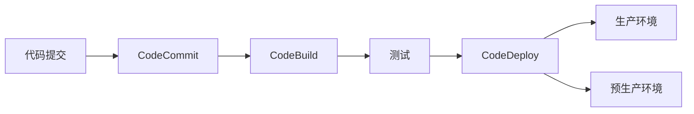

# AWS DevOps CI/CD解决方案

本文详细介绍如何使用AWS CodePipeline、CodeBuild和CodeDeploy构建完整的CI/CD解决方案。

## 目录

1. [方案概述](#方案概述)
2. [源代码管理](#源代码管理)
3. [构建配置](#构建配置)
4. [部署流程](#部署流程)
5. [流水线管理](#流水线管理)
6. [测试和质量控制](#测试和质量控制)
7. [安全性配置](#安全性配置)
8. [监控和运维](#监控和运维)
9. [最佳实践](#最佳实践)

## 方案概述

### CI/CD流程



### 服务集成

| 服务 | 功能 | 优势 | 使用场景 |
|-----|------|-----|---------|
| CodePipeline | 流水线编排 | 可视化、自动化 | 端到端部署流程 |
| CodeBuild | 代码构建 | 完全托管、可扩展 | 编译、测试、打包 |
| CodeDeploy | 应用部署 | 自动化部署、回滚 | 多环境部署 |

## 源代码管理

### CodeCommit配置

1. **仓库设置**
   ```json
   {
       "RepositoryConfiguration": {
           "RepositoryName": "my-application",
           "RepositoryDescription": "Main application repository",
           "Triggers": [{
               "Name": "BuildTrigger",
               "DestinationArn": "arn:aws:sns:region:account:topic",
               "Events": ["all"]
           }]
       }
   }
   ```

2. **分支策略**
   ```json
   {
       "BranchingStrategy": {
           "MainBranch": "main",
           "DevelopmentBranch": "develop",
           "FeatureBranchPrefix": "feature/",
           "ReleaseBranchPrefix": "release/"
       }
   }
   ```

### 代码审查

```json
{
    "PullRequestWorkflow": {
        "ApprovalRules": [{
            "NumberOfApprovals": 2,
            "ApprovalPoolMembers": ["TeamLeads", "SeniorDevs"]
        }],
        "BuildValidation": {
            "BuildSpecPath": "buildspec.yml",
            "ComputeType": "BUILD_GENERAL1_SMALL"
        }
    }
}
```

## 构建配置

### CodeBuild项目

1. **基础配置**
   ```yaml
   # buildspec.yml
   version: 0.2
   
   phases:
     install:
       runtime-versions:
         nodejs: 14
       commands:
         - npm install -g typescript
     
     pre_build:
       commands:
         - npm install
         - npm run lint
     
     build:
       commands:
         - npm run build
         - npm run test
     
     post_build:
       commands:
         - aws s3 cp dist/ s3://my-bucket/ --recursive
   
   artifacts:
     files:
       - '**/*'
     base-directory: 'dist'
   ```

2. **环境配置**
   ```json
   {
       "Environment": {
           "ComputeType": "BUILD_GENERAL1_SMALL",
           "Image": "aws/codebuild/standard:5.0",
           "Type": "LINUX_CONTAINER",
           "EnvironmentVariables": [{
               "Name": "NODE_ENV",
               "Value": "production"
           }]
       }
   }
   ```

### 缓存策略

```json
{
    "Cache": {
        "Type": "S3",
        "Location": "my-bucket/cache",
        "Modes": [
            "LOCAL_CUSTOM_CACHE",
            "LOCAL_DOCKER_LAYER_CACHE"
        ]
    }
}
```

## 部署流程

### CodeDeploy配置

1. **应用程序配置**
   ```json
   {
       "Application": {
           "Name": "my-application",
           "ComputePlatform": "Server"
       },
       "DeploymentGroup": {
           "Name": "production",
           "DeploymentStyle": {
               "DeploymentType": "BLUE_GREEN",
               "DeploymentOption": "WITH_TRAFFIC_CONTROL"
           }
       }
   }
   ```

2. **部署配置**
   ```yaml
   # appspec.yml
   version: 0.0
   os: linux
   
   files:
     - source: /
       destination: /var/www/html/
   
   hooks:
     BeforeInstall:
       - location: scripts/before_install.sh
         timeout: 300
         runas: root
     
     AfterInstall:
       - location: scripts/after_install.sh
         timeout: 300
         runas: root
     
     ApplicationStart:
       - location: scripts/start_application.sh
         timeout: 300
         runas: root
     
     ValidateService:
       - location: scripts/validate_service.sh
         timeout: 300
         runas: root
   ```

### 部署策略

1. **蓝绿部署**
   ```json
   {
       "BlueGreenDeployment": {
           "DeploymentStyle": "WITH_TRAFFIC_CONTROL",
           "GreenFleetProvisioningOption": "COPY_AUTO_SCALING_GROUP",
           "TerminateBlueInstancesOnDeploymentSuccess": {
               "Action": "TERMINATE",
               "TerminationWaitTimeInMinutes": 5
           }
       }
   }
   ```

2. **滚动部署**
   ```json
   {
       "RollingDeployment": {
           "MaximumPercent": 150,
           "MinimumHealthyPercent": 75
       }
   }
   ```

## 流水线管理

### CodePipeline配置

```json
{
    "Pipeline": {
        "Name": "production-pipeline",
        "RoleArn": "arn:aws:iam::account:role/service-role/codepipeline-role",
        "Stages": [{
            "Name": "Source",
            "Actions": [{
                "Name": "Source",
                "ActionTypeId": {
                    "Category": "Source",
                    "Owner": "AWS",
                    "Provider": "CodeCommit",
                    "Version": "1"
                },
                "Configuration": {
                    "RepositoryName": "my-application",
                    "BranchName": "main"
                }
            }]
        }, {
            "Name": "Build",
            "Actions": [{
                "Name": "Build",
                "ActionTypeId": {
                    "Category": "Build",
                    "Owner": "AWS",
                    "Provider": "CodeBuild",
                    "Version": "1"
                },
                "Configuration": {
                    "ProjectName": "my-build-project"
                }
            }]
        }, {
            "Name": "Deploy",
            "Actions": [{
                "Name": "Deploy",
                "ActionTypeId": {
                    "Category": "Deploy",
                    "Owner": "AWS",
                    "Provider": "CodeDeploy",
                    "Version": "1"
                },
                "Configuration": {
                    "ApplicationName": "my-application",
                    "DeploymentGroupName": "production"
                }
            }]
        }]
    }
}
```

### 手动审批

```json
{
    "ApprovalAction": {
        "Name": "ProductionApproval",
        "ActionTypeId": {
            "Category": "Approval",
            "Owner": "AWS",
            "Provider": "Manual",
            "Version": "1"
        },
        "Configuration": {
            "NotificationArn": "arn:aws:sns:region:account:topic",
            "CustomData": "请审核生产环境部署"
        }
    }
}
```

## 测试和质量控制

### 自动化测试

```yaml
# buildspec-test.yml
version: 0.2

phases:
  install:
    commands:
      - npm install
  
  pre_build:
    commands:
      - npm run lint
  
  build:
    commands:
      - npm run test:unit
      - npm run test:integration
      - npm run test:e2e
  
  post_build:
    commands:
      - npm run coverage

reports:
  coverage:
    files:
      - 'coverage/*'
    base-directory: '.'
    file-format: 'CLOVERXML'
```

### 代码质量检查

```json
{
    "CodeQuality": {
        "SonarQube": {
            "Host": "https://sonarqube.example.com",
            "Token": "{{resolve:secretsmanager:sonarqube-token}}",
            "ProjectKey": "my-application"
        }
    }
}
```

## 安全性配置

### IAM策略

```json
{
    "Version": "2012-10-17",
    "Statement": [{
        "Effect": "Allow",
        "Action": [
            "codepipeline:StartPipelineExecution",
            "codepipeline:GetPipelineState",
            "codebuild:StartBuild",
            "codebuild:BatchGetBuilds",
            "codedeploy:CreateDeployment",
            "codedeploy:GetDeployment"
        ],
        "Resource": "*"
    }]
}
```

### 密钥管理

```json
{
    "Secrets": {
        "DatabaseCredentials": {
            "SecretName": "prod/db/credentials",
            "KmsKeyId": "arn:aws:kms:region:account:key/key-id"
        },
        "ApiKeys": {
            "SecretName": "prod/api/keys",
            "KmsKeyId": "arn:aws:kms:region:account:key/key-id"
        }
    }
}
```

## 监控和运维

### CloudWatch配置

```json
{
    "Monitoring": {
        "Metrics": {
            "BuildDuration": {
                "Namespace": "AWS/CodeBuild",
                "MetricName": "BuildDuration",
                "Period": 300,
                "Threshold": 600
            },
            "DeploymentSuccess": {
                "Namespace": "AWS/CodeDeploy",
                "MetricName": "DeploymentSuccess",
                "Period": 300,
                "Threshold": 1
            }
        },
        "Alarms": {
            "BuildFailure": {
                "MetricName": "FailedBuilds",
                "Threshold": 1,
                "Period": 300,
                "EvaluationPeriods": 1
            }
        }
    }
}
```

### 日志管理

```json
{
    "Logging": {
        "CloudWatchLogs": {
            "GroupName": "/aws/codebuild/my-project",
            "StreamName": "{build-id}",
            "RetentionInDays": 30
        },
        "S3": {
            "Bucket": "my-logs-bucket",
            "Prefix": "codepipeline/",
            "Encryption": "AWS_KMS"
        }
    }
}
```

## 最佳实践

### 开发流程

1. **分支管理**
   - 使用Git Flow或类似工作流
   - 保护主分支
   - 强制代码审查

2. **版本控制**
   - 语义化版本
   - 自动化版本号更新
   - 变更日志管理

### 部署策略

1. **环境管理**
   - 环境隔离
   - 配置外部化
   - 基础设施即代码

2. **发布策略**
   - 蓝绿部署
   - 金丝雀发布
   - 回滚机制

### 安全实践

1. **访问控制**
   - 最小权限原则
   - 角色分离
   - 审计日志

2. **密钥管理**
   - 使用密钥管理服务
   - 定期轮换密钥
   - 加密敏感数据

## 总结

AWS DevOps服务提供了完整的CI/CD解决方案，通过CodePipeline、CodeBuild和CodeDeploy的集成，可以构建自动化、可靠的部署流水线。选择合适的服务组合，遵循最佳实践，可以显著提高开发团队的效率和产品质量。关键是要根据具体需求进行合理规划，并注意安全性、可靠性和可维护性的平衡。 