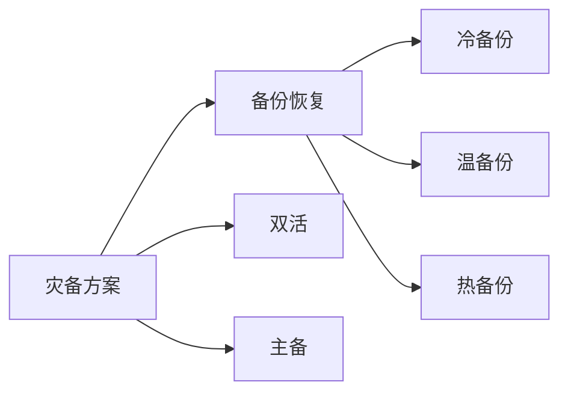

# AWS 灾备与高可用解决方案

本文详细介绍如何使用AWS服务构建灾备和高可用解决方案，重点关注多区域部署与故障转移实现。

## 目录

1. [方案概述](#方案概述)
2. [灾备策略](#灾备策略)
3. [多区域架构](#多区域架构)
4. [数据复制](#数据复制)
5. [故障转移机制](#故障转移机制)
6. [监控和告警](#监控和告警)
7. [恢复流程](#恢复流程)
8. [成本优化](#成本优化)
9. [最佳实践](#最佳实践)

## 方案概述

### 灾备类型



### RTO和RPO对比

| 方案类型 | RTO | RPO | 成本 | 适用场景 |
|---------|-----|-----|------|----------|
| 备份恢复 | 数小时 | 24小时 | 低 | 非关键业务 |
| 主备 | 分钟级 | 分钟级 | 中 | 重要业务 |
| 双活 | 秒级 | 接近0 | 高 | 核心业务 |

## 灾备策略

### 备份策略

1. **S3跨区域复制**
   ```json
   {
       "ReplicationConfiguration": {
           "Role": "arn:aws:iam::account:role/replication-role",
           "Rules": [{
               "Status": "Enabled",
               "Priority": 1,
               "DeleteMarkerReplication": { "Status": "Enabled" },
               "Destination": {
                   "Bucket": "arn:aws:s3:::destination-bucket",
                   "ReplicaKmsKeyID": "arn:aws:kms:region:account:key/key-id"
               }
           }]
       }
   }
   ```

2. **数据库备份**
   ```json
   {
       "DBSnapshot": {
           "AutomatedBackup": {
               "RetentionPeriod": 35,
               "BackupWindow": "03:00-04:00",
               "CopyTags": true
           },
           "CrossRegionCopy": {
               "DestinationRegion": "us-west-2",
               "RetentionPeriod": 7
           }
       }
   }
   ```

### 恢复点目标（RPO）

```json
{
    "RPOConfiguration": {
        "DatabaseRPO": "5minutes",
        "FileSystemRPO": "15minutes",
        "ApplicationStateRPO": "1hour",
        "MonitoringThreshold": {
            "Warning": "80%",
            "Critical": "120%"
        }
    }
}
```

## 多区域架构

### 区域配置

1. **主区域设置**
   ```json
   {
       "PrimaryRegion": {
           "Region": "ap-northeast-1",
           "VPC": {
               "CIDR": "10.0.0.0/16",
               "Subnets": {
                   "Public": ["10.0.1.0/24", "10.0.2.0/24"],
                   "Private": ["10.0.3.0/24", "10.0.4.0/24"]
               }
           }
       }
   }
   ```

2. **备用区域设置**
   ```json
   {
       "SecondaryRegion": {
           "Region": "ap-southeast-1",
           "VPC": {
               "CIDR": "172.16.0.0/16",
               "Subnets": {
                   "Public": ["172.16.1.0/24", "172.16.2.0/24"],
                   "Private": ["172.16.3.0/24", "172.16.4.0/24"]
               }
           }
       }
   }
   ```

### 网络连接

```json
{
    "NetworkConfiguration": {
        "TransitGateway": {
            "ASN": 64512,
            "AutoAcceptSharedAttachments": "enable",
            "DefaultRouteTableAssociation": "enable",
            "DefaultRouteTablePropagation": "enable"
        },
        "VPCPeering": {
            "RequesterVPC": "vpc-xxxxx",
            "AccepterVPC": "vpc-yyyyy",
            "AllowDNSResolution": true
        }
    }
}
```

## 数据复制

### 数据库复制

1. **RDS多可用区**
   ```json
   {
       "DBInstance": {
           "MultiAZ": true,
           "AutoMinorVersionUpgrade": true,
           "BackupRetentionPeriod": 35,
           "EnablePerformanceInsights": true,
           "MonitoringInterval": 60
       }
   }
   ```

2. **跨区域只读副本**
   ```json
   {
       "ReadReplica": {
           "SourceDBInstanceIdentifier": "primary-db",
           "DestinationRegion": "us-west-2",
           "EnableEnhancedMonitoring": true,
           "MonitoringRoleArn": "arn:aws:iam::account:role/rds-monitoring-role"
       }
   }
   ```

### DynamoDB全局表

```json
{
    "GlobalTable": {
        "TableName": "global-data",
        "Regions": [
            "ap-northeast-1",
            "ap-southeast-1"
        ],
        "StreamSpecification": {
            "StreamEnabled": true,
            "StreamViewType": "NEW_AND_OLD_IMAGES"
        }
    }
}
```

## 故障转移机制

### Route 53配置

```json
{
    "HealthCheck": {
        "Id": "primary-health-check",
        "Type": "HTTPS",
        "ResourcePath": "/health",
        "FullyQualifiedDomainName": "primary.example.com",
        "RequestInterval": 30,
        "FailureThreshold": 3
    },
    "DNSRecords": {
        "Type": "A",
        "SetIdentifier": "primary",
        "Region": "ap-northeast-1",
        "Weight": 100,
        "HealthCheckId": "primary-health-check"
    }
}
```

### 自动故障转移

```json
{
    "FailoverConfiguration": {
        "AutomaticFailover": {
            "Enabled": true,
            "FailoverThreshold": {
                "HealthCheckFailures": 3,
                "TimeWindow": 300
            }
        },
        "FailbackConfiguration": {
            "AutomaticFailback": true,
            "StabilizationTime": 600
        }
    }
}
```

## 监控和告警

### CloudWatch配置

```json
{
    "Monitoring": {
        "Metrics": {
            "ReplicationLag": {
                "Namespace": "AWS/RDS",
                "MetricName": "ReplicaLag",
                "Period": 60,
                "Threshold": 300
            },
            "HealthCheckStatus": {
                "Namespace": "AWS/Route53",
                "MetricName": "HealthCheckStatus",
                "Period": 60,
                "Threshold": 1
            }
        },
        "Alarms": {
            "HighReplicationLag": {
                "ComparisonOperator": "GreaterThanThreshold",
                "EvaluationPeriods": 3,
                "AlarmActions": ["arn:aws:sns:region:account:topic"]
            }
        }
    }
}
```

### 健康检查

```json
{
    "HealthChecks": {
        "Application": {
            "Endpoint": "/health",
            "Protocol": "HTTPS",
            "Port": 443,
            "Interval": 30,
            "Timeout": 5,
            "HealthyThreshold": 2,
            "UnhealthyThreshold": 3
        },
        "Database": {
            "Type": "TCP",
            "Port": 3306,
            "Interval": 10,
            "Timeout": 5
        }
    }
}
```

## 恢复流程

### 灾难恢复计划

```yaml
RecoveryPlan:
  PreFailover:
    - ValidateBackups:
        Type: "Task"
        Resource: "Lambda"
        Timeout: 300
    - CheckReplicationStatus:
        Type: "Task"
        Resource: "Lambda"
        Timeout: 300
  
  Failover:
    - UpdateDNS:
        Type: "Task"
        Resource: "Route53"
        Timeout: 300
    - PromoteReadReplica:
        Type: "Task"
        Resource: "RDS"
        Timeout: 600
    
  PostFailover:
    - ValidateApplication:
        Type: "Task"
        Resource: "Lambda"
        Timeout: 300
    - NotifyStakeholders:
        Type: "Task"
        Resource: "SNS"
        Timeout: 60
```

### 恢复测试

```json
{
    "RecoveryTest": {
        "Schedule": "rate(3 months)",
        "Scenarios": [{
            "Name": "FullRegionFailover",
            "Description": "测试完整的区域故障转移流程",
            "Steps": [
                "ValidateBackups",
                "SimulateFailure",
                "TriggerFailover",
                "ValidateRecovery"
            ]
        }]
    }
}
```

## 成本优化

### 资源配置

```json
{
    "CostOptimization": {
        "SecondaryRegion": {
            "ComputeResources": {
                "MinCapacity": "30%",
                "AutoScaling": true
            },
            "StorageResources": {
                "StorageClass": "STANDARD_IA",
                "LifecycleRules": [{
                    "Transition": {
                        "Days": 90,
                        "StorageClass": "GLACIER"
                    }
                }]
            }
        }
    }
}
```

### 成本监控

```json
{
    "CostMonitoring": {
        "Budgets": [{
            "Name": "DR-Budget",
            "BudgetLimit": {
                "Amount": 1000,
                "Unit": "USD"
            },
            "TimeUnit": "MONTHLY",
            "Alerts": [{
                "Threshold": 80,
                "Type": "ACTUAL"
            }]
        }]
    }
}
```

## 最佳实践

### 架构设计

1. **区域选择**
   - 考虑地理位置分散
   - 评估法规要求
   - 考虑延迟影响

2. **数据策略**
   - 分层数据备份
   - 定期备份验证
   - 加密传输和存储

### 运维管理

1. **文档管理**
   - 详细的恢复流程
   - 角色和责任定义
   - 定期更新和审查

2. **演练计划**
   - 定期灾备演练
   - 场景模拟测试
   - 持续改进流程

### 安全考虑

1. **访问控制**
   - 跨区域IAM策略
   - 密钥管理
   - 审计日志

2. **合规要求**
   - 数据主权
   - 隐私保护
   - 行业规范

## 总结

AWS提供了丰富的服务和工具来构建灾备和高可用解决方案。通过合理规划和配置多区域部署与故障转移机制，可以显著提高系统的可用性和可靠性。关键是要根据业务需求选择合适的灾备策略，并通过持续的测试和改进来确保解决方案的有效性。同时，需要平衡成本、性能和复杂性，构建最适合的灾备架构。 