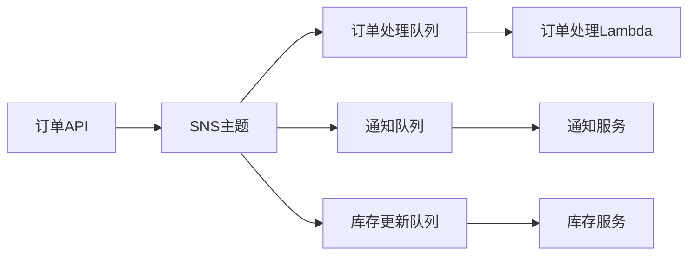
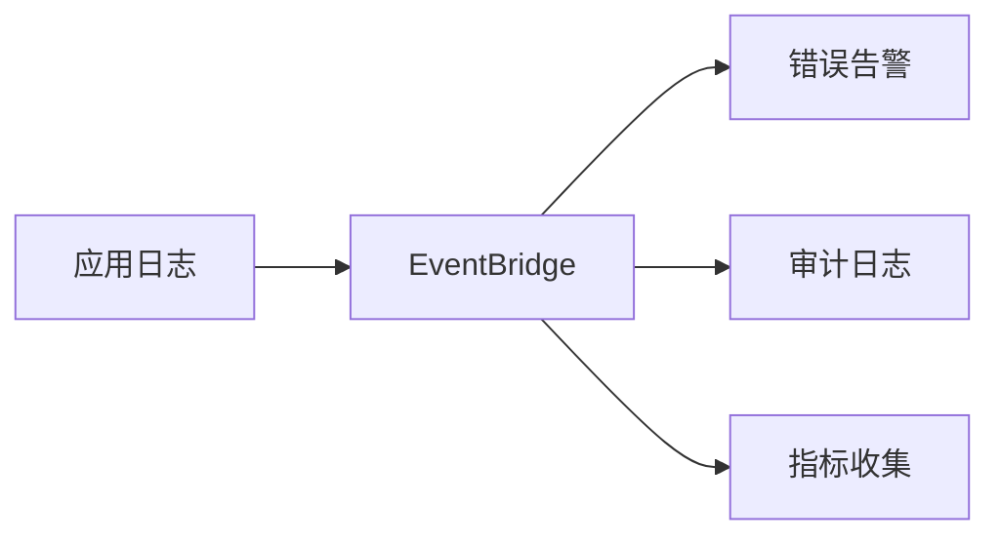

# AWS 事件驱动架构

本文将详细介绍如何使用 AWS 的事件驱动服务（SQS、SNS 和 EventBridge）构建可扩展的事件驱动架构。

## 目录

1. [事件驱动架构基础](#事件驱动架构基础)
2. [AWS 消息服务概述](#aws-消息服务概述)
3. [Amazon SQS 详解](#amazon-sqs-详解)
4. [Amazon SNS 详解](#amazon-sns-详解)
5. [Amazon EventBridge 详解](#amazon-eventbridge-详解)
6. [集成模式和最佳实践](#集成模式和最佳实践)
7. [案例研究](#案例研究)
8. [监控和运维](#监控和运维)
9. [安全性考虑](#安全性考虑)
10. [成本优化](#成本优化)

## 事件驱动架构基础

事件驱动架构（EDA）是一种现代应用架构模式，其中系统组件通过事件的产生和消费来进行通信。

### 核心概念

- **事件生产者**：生成事件的服务或系统
- **事件消费者**：接收和处理事件的服务或系统
- **事件总线**：事件传输的通道
- **事件格式**：事件数据的结构化表示

### 优势

- 松耦合：组件之间通过事件解耦
- 可扩展性：易于添加新的生产者和消费者
- 弹性：组件故障不会导致系统瘫痪
- 异步处理：提高系统响应性

## AWS 消息服务概述

AWS 提供了三个主要的事件服务，每个都有其特定用途：

### SQS（Simple Queue Service）
- 用于应用程序组件之间的消息传递
- 支持点对点队列模型
- 保证消息至少传递一次

### SNS（Simple Notification Service）
- 用于发布/订阅模式的消息传递
- 支持多个订阅者
- 支持多种订阅协议（HTTP/S、邮件、SQS等）

### EventBridge
- 无服务器事件总线
- 支持复杂的路由规则
- 原生集成众多AWS服务

## Amazon SQS 详解

### 队列类型

1. **标准队列**
   - 无限吞吐量
   - 至少一次传递
   - 尽最大努力排序

2. **FIFO队列**
   - 严格的消息顺序
   - 精确一次处理
   - 有限吞吐量（每秒3000条消息）

### 关键特性

```json
{
    "QueueAttributes": {
        "VisibilityTimeout": 30,
        "MessageRetentionPeriod": 345600,
        "DelaySeconds": 0,
        "MaximumMessageSize": 262144
    }
}
```

### 最佳实践

- 使用适当的可见性超时
- 实现死信队列处理
- 批量操作以提高效率
- 使用长轮询减少空响应

## Amazon SNS 详解

### 主题和订阅

```json
{
    "TopicArn": "arn:aws:sns:region:account-id:topic-name",
    "Protocol": "https",
    "Endpoint": "https://example.com/webhook"
}
```

### 消息过滤

```json
{
    "MessageAttributes": {
        "event_type": {
            "DataType": "String",
            "StringValue": "order_created"
        }
    }
}
```

### 消息格式

```json
{
    "Type": "Notification",
    "MessageId": "uuid",
    "TopicArn": "arn:aws:sns:region:account-id:topic-name",
    "Message": "Hello World!",
    "Timestamp": "2023-01-01T12:00:00.000Z"
}
```

## Amazon EventBridge 详解

### 事件模式

```json
{
    "source": ["aws.ec2"],
    "detail-type": ["EC2 Instance State-change Notification"],
    "detail": {
        "state": ["running", "stopped"]
    }
}
```

### 规则配置

```json
{
    "Name": "capture-ec2-changes",
    "EventPattern": {
        "source": ["aws.ec2"],
        "detail-type": ["EC2 Instance State-change Notification"]
    },
    "Targets": [{
        "Arn": "arn:aws:lambda:region:account-id:function:process-ec2-changes",
        "Id": "ProcessEC2Changes"
    }]
}
```

### 自定义事件总线

- 创建专用事件总线
- 定义权限策略
- 配置事件路由

## 集成模式和最佳实践

### 常见集成模式

1. **扇出模式**
   ```
   Producer -> SNS -> Multiple SQS Queues
   ```

2. **事件过滤模式**
   ```
   Source -> EventBridge -> Rule -> Target
   ```

3. **死信队列模式**
   ```
   SQS Queue -> Lambda -> DLQ
   ```

### 最佳实践

1. **错误处理**
   - 实现重试机制
   - 使用死信队列
   - 监控失败事件

2. **性能优化**
   - 使用批处理
   - 并行处理
   - 适当的扩缩容策略

3. **成本控制**
   - 消息生命周期管理
   - 适当的预留容量
   - 监控使用情况

## 案例研究

### 电子商务订单处理系统



### 实时日志处理系统



## 监控和运维

### 关键指标

1. **SQS指标**
   - ApproximateNumberOfMessages
   - ApproximateAgeOfOldestMessage
   - NumberOfMessagesDelivered

2. **SNS指标**
   - NumberOfMessagesPublished
   - NumberOfNotificationsDelivered
   - NumberOfNotificationsFailed

3. **EventBridge指标**
   - TriggeredRules
   - FailedInvocations
   - ThrottledRules

### 告警配置

```json
{
    "AlarmName": "QueueDepthAlarm",
    "MetricName": "ApproximateNumberOfMessages",
    "Threshold": 1000,
    "Period": 300,
    "EvaluationPeriods": 2,
    "ComparisonOperator": "GreaterThanThreshold"
}
```

## 安全性考虑

### 访问控制

1. **IAM策略**
   ```json
   {
       "Version": "2012-10-17",
       "Statement": [{
           "Effect": "Allow",
           "Action": [
               "sqs:SendMessage",
               "sqs:ReceiveMessage"
           ],
           "Resource": "arn:aws:sqs:region:account-id:queue-name"
       }]
   }
   ```

2. **加密**
   - 使用KMS进行加密
   - 传输加密（TLS）
   - 客户端加密

### 安全最佳实践

- 实施最小权限原则
- 启用审计日志
- 定期安全评估
- 加密敏感数据

## 成本优化

### 优化策略

1. **消息生命周期管理**
   - 设置合适的消息保留期
   - 及时处理消息
   - 清理未使用的资源

2. **批处理优化**
   - 使用批量API操作
   - 合理设置批处理大小
   - 优化处理间隔

3. **资源规划**
   - 估算容量需求
   - 选择合适的定价模型
   - 监控使用情况

### 成本监控

- 设置成本预算
- 监控使用趋势
- 定期成本审查

## 总结

事件驱动架构在AWS中可以通过SQS、SNS和EventBridge灵活实现。选择合适的服务组合，遵循最佳实践，可以构建高效、可靠且经济的事件驱动系统。要根据具体需求选择合适的服务，并注意监控、安全性和成本优化。
