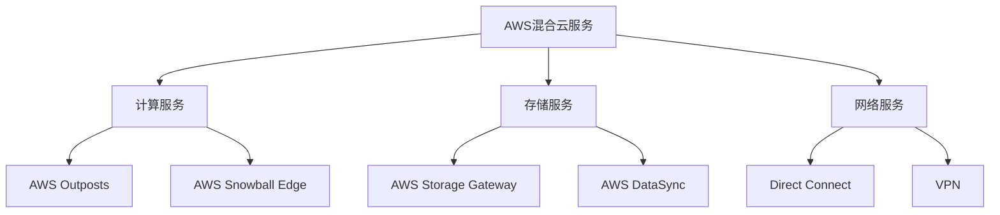
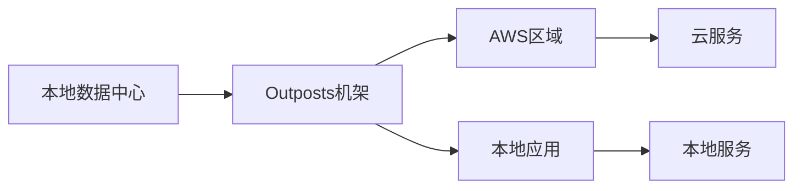
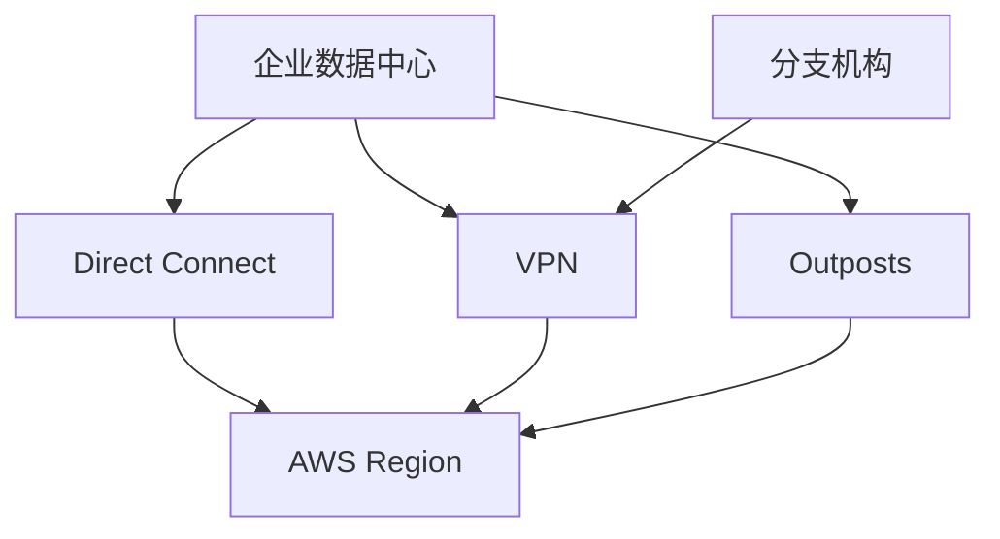
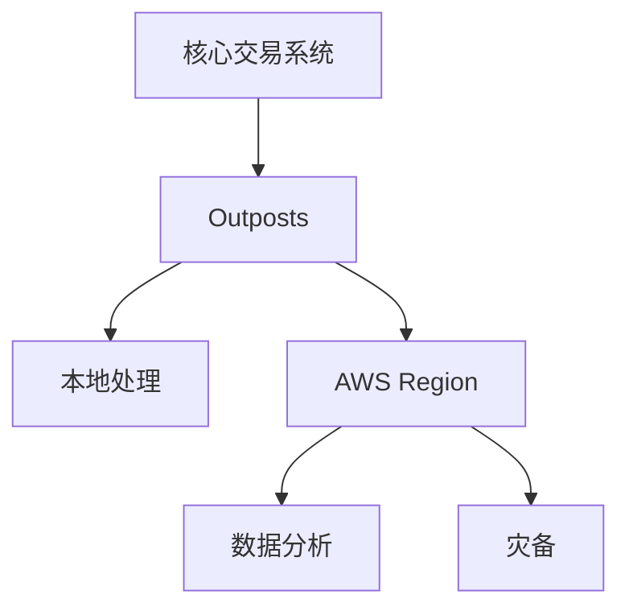
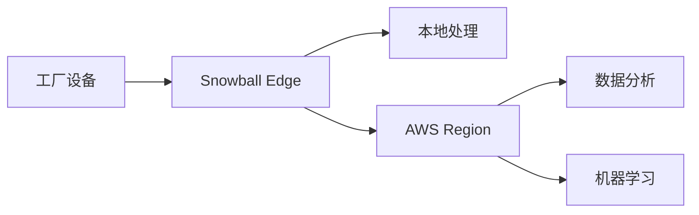

# AWS 混合云架构

本文详细介绍如何使用 AWS Outposts 和 AWS Snowball 构建混合云架构解决方案。

## 目录

1. [混合云架构概述](#混合云架构概述)
2. [AWS Outposts 详解](#aws-outposts-详解)
3. [AWS Snowball 详解](#aws-snowball-详解)
4. [混合云网络架构](#混合云网络架构)
5. [数据同步和迁移](#数据同步和迁移)
6. [安全性和合规性](#安全性和合规性)
7. [运维和监控](#运维和监控)
8. [成本优化](#成本优化)
9. [案例研究](#案例研究)

## 混合云架构概述

### 什么是混合云

混合云是将本地数据中心（私有云）与公有云服务相结合的计算环境，允许数据和应用程序在两者之间共享。

### 混合云优势

- **数据主权**：满足数据本地化要求
- **低延迟**：本地处理关键工作负载
- **现有投资保护**：充分利用现有基础设施
- **灾难恢复**：提供多站点备份选项
- **合规性**：满足特定行业的监管要求

### AWS 混合云服务组合



## AWS Outposts 详解

### Outposts 基础架构

1. **硬件配置**
   - 标准机架配置
   - 服务器和网络设备
   - 电源和冷却系统

2. **支持的服务**
   - Amazon EC2
   - Amazon EBS
   - Amazon S3
   - Amazon RDS
   - Amazon ECS/EKS

### 部署模式



### 配置步骤

1. **前期准备**
   ```json
   {
       "NetworkRequirements": {
           "MinimumBandwidth": "1Gbps",
           "MaximumLatency": "100ms",
           "RequiredPorts": [443, 22]
       },
       "PowerRequirements": {
           "PowerConnectors": "C13/C14",
           "PowerRedundancy": "N+1",
           "Voltage": "200-240V"
       }
   }
   ```

2. **网络配置**
   ```json
   {
       "VpcConfig": {
           "VpcId": "vpc-xxxxx",
           "Subnets": ["subnet-xxxxx"],
           "SecurityGroups": ["sg-xxxxx"]
       },
       "DirectConnectConfig": {
           "ConnectionId": "dxcon-xxxxx",
           "VirtualInterfaceId": "dxvif-xxxxx"
       }
   }
   ```

### 管理和监控

1. **资源管理**
   - AWS Systems Manager
   - AWS CloudWatch
   - AWS CloudTrail

2. **监控指标**
   ```json
   {
       "Metrics": {
           "CPUUtilization": "Percent",
           "NetworkIn": "Bytes",
           "NetworkOut": "Bytes",
           "DiskReadOps": "Count",
           "DiskWriteOps": "Count"
       }
   }
   ```

## AWS Snowball 详解

### Snowball 设备类型

1. **Snowball Edge Storage Optimized**
   - 80TB 存储容量
   - 适合大规模数据传输

2. **Snowball Edge Compute Optimized**
   - 42TB 存储容量
   - 强大的计算能力
   - 支持 EC2 实例

### 使用场景

1. **大规模数据迁移**
2. **边缘计算**
3. **离线数据处理**
4. **灾难恢复**

### 配置和使用

1. **作业创建**
   ```json
   {
       "JobType": "IMPORT",
       "DeviceType": "STORAGE_OPTIMIZED",
       "Resources": {
           "S3Bucket": "my-bucket",
           "KeyPrefix": "data/",
           "KmsKeyArn": "arn:aws:kms:region:account:key/key-id"
       }
   }
   ```

2. **数据传输命令**
   ```bash
   # 复制数据到设备
   aws snowball cp /local/path s3://bucket/prefix
   
   # 检查传输状态
   aws snowball status
   ```

## 混合云网络架构

### 网络连接选项

1. **AWS Direct Connect**
   - 专用网络连接
   - 可预测的性能
   - 降低带宽成本

2. **VPN 连接**
   - Site-to-Site VPN
   - Client VPN
   - 加密通信

### 网络架构示例



### 网络安全配置

```json
{
    "SecurityGroups": [{
        "GroupId": "sg-xxxxx",
        "Rules": [{
            "Protocol": "tcp",
            "FromPort": 443,
            "ToPort": 443,
            "CidrIp": "10.0.0.0/16"
        }]
    }],
    "NetworkAcls": [{
        "RuleNumber": 100,
        "Protocol": -1,
        "RuleAction": "allow",
        "CidrBlock": "0.0.0.0/0"
    }]
}
```

## 数据同步和迁移

### 数据同步策略

1. **实时同步**
   - AWS DataSync
   - AWS Database Migration Service
   - AWS Storage Gateway

2. **批量迁移**
   - AWS Snowball
   - AWS Transfer Family
   - AWS DataSync

### 同步配置示例

```json
{
    "DataSyncTask": {
        "SourceLocation": "local-path",
        "DestinationLocation": "s3://bucket/prefix",
        "Options": {
            "VerifyMode": "POINT_IN_TIME_CONSISTENT",
            "Atime": "BEST_EFFORT",
            "Mtime": "PRESERVE",
            "TaskQueueing": "ENABLED"
        }
    }
}
```

## 安全性和合规性

### 安全控制

1. **身份认证**
   - AWS IAM
   - AWS Directory Service
   - 多因素认证

2. **数据安全**
   - 静态加密
   - 传输加密
   - 密钥管理

### 合规性框架

```json
{
    "ComplianceFrameworks": {
        "HIPAA": {
            "Required": true,
            "Controls": ["访问控制", "审计日志", "加密"]
        },
        "GDPR": {
            "Required": true,
            "Controls": ["数据保护", "数据主权", "数据处理协议"]
        }
    }
}
```

## 运维和监控

### 监控指标

1. **性能指标**
   - 延迟
   - 吞吐量
   - CPU 使用率
   - 内存使用率

2. **可用性指标**
   - 服务正常运行时间
   - 故障恢复时间
   - 同步状态

### 告警配置

```json
{
    "CloudWatchAlarms": {
        "HighLatency": {
            "Metric": "Latency",
            "Threshold": 100,
            "Period": 300,
            "EvaluationPeriods": 2,
            "AlarmActions": ["arn:aws:sns:region:account:topic"]
        }
    }
}
```

## 成本优化

### 成本构成

1. **硬件成本**
   - Outposts 机架租用
   - Snowball 设备使用费

2. **运营成本**
   - 数据传输费用
   - 存储费用
   - 计算资源费用

### 优化建议

1. **资源规划**
   - 合理估算容量
   - 优化资源使用
   - 自动化管理

2. **数据传输优化**
   - 压缩传输
   - 增量同步
   - 批量处理

## 案例研究

### 金融行业案例



1. **需求**
   - 低延迟交易处理
   - 数据本地化
   - 合规要求

2. **解决方案**
   - Outposts 部署核心交易系统
   - Direct Connect 连接云端
   - Snowball 进行数据备份

### 制造业案例



1. **需求**
   - 边缘计算
   - 实时数据处理
   - 离线操作能力

2. **解决方案**
   - Snowball Edge 进行边缘计算
   - 定期数据同步到云端
   - 机器学习模型本地部署

## 总结

AWS混合云架构通过Outposts和Snowball提供了灵活的混合云解决方案，能够满足各种业务场景的需求。选择合适的服务组合，遵循最佳实践，可以构建安全、可靠、高效的混合云环境。关键是要根据具体需求进行合理规划，并注意安全性、性能和成本的平衡。
