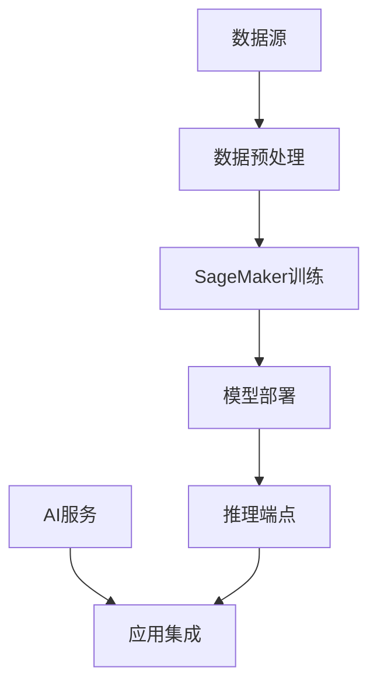

# AWS 机器学习与AI解决方案

本文详细介绍如何使用AWS SageMaker和AI服务构建机器学习解决方案。

## 目录

1. [方案概述](#方案概述)
2. [SageMaker基础设施](#sagemaker基础设施)
3. [模型开发与训练](#模型开发与训练)
4. [模型部署与服务](#模型部署与服务)
5. [AI服务集成](#ai服务集成)
6. [MLOps实践](#mlops实践)
7. [性能优化](#性能优化)
8. [安全性配置](#安全性配置)
9. [监控和运维](#监控和运维)
10. [成本优化](#成本优化)

## 方案概述

### 服务架构



### 服务选择指南

| 场景 | 推荐服务 | 优势 | 考虑因素 |
|-----|---------|------|---------|
| 定制模型 | SageMaker | 完全控制、灵活性高 | 需要专业知识 |
| 计算机视觉 | Rekognition | 快速集成、无需训练 | 功能相对固定 |
| 自然语言处理 | Comprehend | 开箱即用、多语言支持 | 定制化有限 |
| 语音服务 | Transcribe/Polly | 高质量语音转换 | API调用成本 |

## SageMaker基础设施

### 开发环境配置

1. **笔记本实例**
   ```json
   {
       "NotebookInstance": {
           "InstanceType": "ml.t3.medium",
           "VolumeSizeInGB": 50,
           "DefaultCodeRepository": "https://github.com/user/repo",
           "DirectInternetAccess": "Disabled",
           "RootAccess": "Enabled"
       }
   }
   ```

2. **Studio配置**
   ```json
   {
       "Domain": {
           "AuthMode": "IAM",
           "DefaultUserSettings": {
               "ExecutionRole": "arn:aws:iam::account:role/service-role/AmazonSageMaker-ExecutionRole",
               "SecurityGroups": ["sg-xxx"],
               "SharingSettings": {
                   "NotebookOutputOption": "Allowed"
               }
           }
       }
   }
   ```

### 数据准备

1. **特征工程管理**
   ```python
   import sagemaker
   from sagemaker.feature_store.feature_group import FeatureGroup

   # 创建特征组
   feature_group = FeatureGroup(
       name="customer_features",
       sagemaker_session=sagemaker.Session()
   )

   # 配置特征定义
   feature_group.load_feature_definitions(
       data_frame=features_df,
       target_feature_name="label"
   )
   ```

2. **数据处理流水线**
   ```python
   from sagemaker.processing import ProcessingInput, ProcessingOutput
   from sagemaker.processing import ScriptProcessor

   # 配置数据处理作业
   processor = ScriptProcessor(
       command=['python3'],
       image_uri='your-processing-image',
       role=role,
       instance_count=1,
       instance_type='ml.m5.xlarge'
   )

   # 运行处理作业
   processor.run(
       code='preprocessing.py',
       inputs=[
           ProcessingInput(
               source='s3://bucket/raw-data',
               destination='/opt/ml/processing/input'
           )
       ],
       outputs=[
           ProcessingOutput(
               output_name='train',
               source='/opt/ml/processing/output/train'
           )
       ]
   )
   ```

## 模型开发与训练

### 训练作业配置

1. **内置算法**
   ```python
   from sagemaker.algorithm import AlgorithmEstimator

   # XGBoost训练配置
   xgb = AlgorithmEstimator(
       algorithm_arn='arn:aws:sagemaker:region:account:algorithm/xgboost',
       role=role,
       instance_count=1,
       instance_type='ml.m5.xlarge',
       hyperparameters={
           'max_depth': 5,
           'eta': 0.2,
           'objective': 'binary:logistic',
           'num_round': 100
       }
   )
   ```

2. **自定义训练**
   ```python
   from sagemaker.pytorch import PyTorch

   # PyTorch训练配置
   pytorch_estimator = PyTorch(
       entry_point='train.py',
       role=role,
       framework_version='1.8.1',
       py_version='py36',
       instance_count=1,
       instance_type='ml.p3.2xlarge',
       hyperparameters={
           'epochs': 10,
           'batch-size': 32,
           'learning-rate': 0.001
       }
   )
   ```

### 超参数优化

```python
from sagemaker.tuner import HyperparameterTuner

# 配置超参数优化
tuner = HyperparameterTuner(
    estimator=estimator,
    objective_metric_name='validation:auc',
    hyperparameter_ranges={
        'learning_rate': ContinuousParameter(0.01, 0.1),
        'num_layers': IntegerParameter(2, 5),
        'hidden_units': CategoricalParameter([32, 64, 128])
    },
    max_jobs=10,
    max_parallel_jobs=2
)
```

## 模型部署与服务

### 端点配置

1. **实时推理**
   ```json
   {
       "EndpointConfig": {
           "ProductionVariants": [{
               "VariantName": "AllTraffic",
               "ModelName": "model-name",
               "InstanceType": "ml.c5.xlarge",
               "InitialInstanceCount": 2,
               "InitialVariantWeight": 1.0
           }]
       }
   }
   ```

2. **批量推理**
   ```python
   from sagemaker.transformer import Transformer

   transformer = Transformer(
       model_name='model-name',
       instance_type='ml.c5.xlarge',
       instance_count=1,
       output_path='s3://bucket/output'
   )
   ```

### 自动扩展配置

```json
{
    "AutoScalingPolicy": {
        "MinCapacity": 1,
        "MaxCapacity": 4,
        "TargetTrackingScalingPolicyConfiguration": {
            "TargetValue": 70,
            "ScaleInCooldown": 300,
            "ScaleOutCooldown": 300,
            "PredefinedMetricSpecification": {
                "PredefinedMetricType": "SageMakerVariantInvocationsPerInstance"
            }
        }
    }
}
```

## AI服务集成

### Rekognition集成

```python
import boto3

rekognition = boto3.client('rekognition')

# 图像分析
response = rekognition.detect_labels(
    Image={
        'S3Object': {
            'Bucket': 'bucket-name',
            'Name': 'image.jpg'
        }
    },
    MaxLabels=10,
    MinConfidence=70
)
```

### Comprehend集成

```python
import boto3

comprehend = boto3.client('comprehend')

# 文本分析
response = comprehend.detect_sentiment(
    Text='Your text here',
    LanguageCode='zh'
)
```

### Transcribe集成

```python
import boto3

transcribe = boto3.client('transcribe')

# 语音转文字
response = transcribe.start_transcription_job(
    TranscriptionJobName='job-name',
    Media={'MediaFileUri': 's3://bucket/audio.mp3'},
    MediaFormat='mp3',
    LanguageCode='zh-CN'
)
```

## MLOps实践

### CI/CD流水线

```yaml
version: 0.2
phases:
  install:
    runtime-versions:
      python: 3.8
  build:
    commands:
      - pip install -r requirements.txt
      - python test_model.py
      - aws sagemaker create-model --model-name $MODEL_NAME
      - aws sagemaker create-endpoint-config --endpoint-config-name $CONFIG_NAME
      - aws sagemaker create-endpoint --endpoint-name $ENDPOINT_NAME
```

### 模型监控

```python
from sagemaker.model_monitor import DataCaptureConfig

# 配置数据捕获
data_capture_config = DataCaptureConfig(
    enable_capture=True,
    sampling_percentage=100,
    destination_s3_uri='s3://bucket/captured-data'
)

# 创建模型监控器
from sagemaker.model_monitor import DefaultModelMonitor

model_monitor = DefaultModelMonitor(
    role=role,
    instance_count=1,
    instance_type='ml.m5.xlarge',
    volume_size_in_gb=20,
    max_runtime_in_seconds=3600
)
```

## 性能优化

### 模型优化

1. **量化优化**
   ```python
   from sagemaker.neo import compile_model

   # 编译模型
   compiled_model = compile_model(
       model=model,
       target_instance_family='ml_c5',
       input_shape={'data': [1, 3, 224, 224]},
       output_path='s3://bucket/compiled-model'
   )
   ```

2. **推理优化**
   ```json
   {
       "ServerlessConfig": {
           "MemorySizeInMB": 2048,
           "MaxConcurrency": 50,
           "ProvisionedConcurrency": 2
       }
   }
   ```

## 安全性配置

### 数据加密

```json
{
    "KMSKeyId": "arn:aws:kms:region:account:key/key-id",
    "VolumeKmsKeyId": "arn:aws:kms:region:account:key/key-id",
    "EnableInterContainerTrafficEncryption": true,
    "EnableNetworkIsolation": true
}
```

### IAM策略

```json
{
    "Version": "2012-10-17",
    "Statement": [{
        "Effect": "Allow",
        "Action": [
            "sagemaker:CreateTrainingJob",
            "sagemaker:CreateModel",
            "sagemaker:CreateEndpoint"
        ],
        "Resource": "*"
    }]
}
```

## 监控和运维

### CloudWatch监控

```json
{
    "Metrics": {
        "EndpointInvocations": {
            "Threshold": 1000,
            "Period": 300,
            "EvaluationPeriods": 2,
            "ComparisonOperator": "GreaterThanThreshold"
        },
        "ModelLatency": {
            "Threshold": 100,
            "Period": 300,
            "EvaluationPeriods": 2,
            "ComparisonOperator": "GreaterThanThreshold"
        }
    }
}
```

### 日志配置

```json
{
    "LogConfiguration": {
        "EnableCloudWatchMetrics": true,
        "MetricsLevel": "Full",
        "EnableAutoMLJobTags": true
    }
}
```

## 成本优化

### 实例策略

```json
{
    "TrainingInstanceStrategy": {
        "UseSpotInstances": true,
        "MaxWaitTimeInSeconds": 3600,
        "MaxRuntimeInSeconds": 86400
    }
}
```

### 资源管理

```json
{
    "ResourceLimits": {
        "MaxNumberOfTrainingJobs": 10,
        "MaxParallelTrainingJobs": 2,
        "MaxNumberOfTransformJobs": 5
    }
}
```

## 最佳实践

### 开发流程

1. **实验管理**
   - 使用SageMaker Experiments跟踪实验
   - 版本控制训练代码和模型
   - 记录超参数和评估指标

2. **模型评估**
   - 使用交叉验证
   - 实施A/B测试
   - 监控模型漂移

### 生产部署

1. **部署策略**
   - 蓝绿部署
   - 金丝雀发布
   - 流量分流

2. **监控策略**
   - 设置关键指标告警
   - 实时性能监控
   - 定期模型评估

### 成本控制

1. **资源优化**
   - 使用Spot实例
   - 自动关闭空闲资源
   - 选择合适的实例类型

2. **数据管理**
   - 实施数据生命周期管理
   - 优化存储使用
   - 控制数据传输成本

## 总结

AWS提供了强大的机器学习和AI服务生态系统，通过SageMaker和各种AI服务的集成，可以构建完整的机器学习解决方案。选择合适的服务组合，遵循最佳实践，可以构建高效、可靠且经济的AI应用。关键是要根据具体需求进行合理规划，并注意性能、安全性和成本的平衡。 