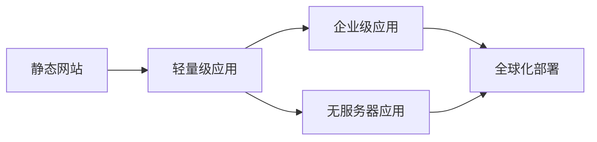
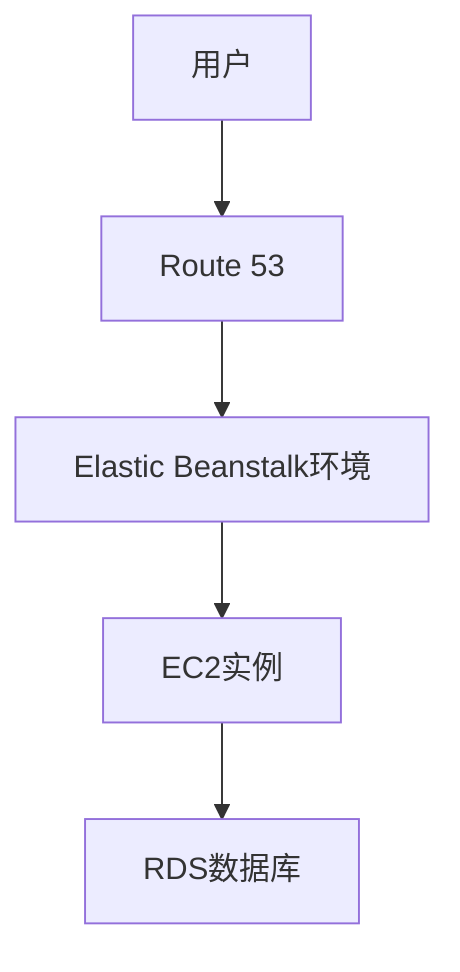
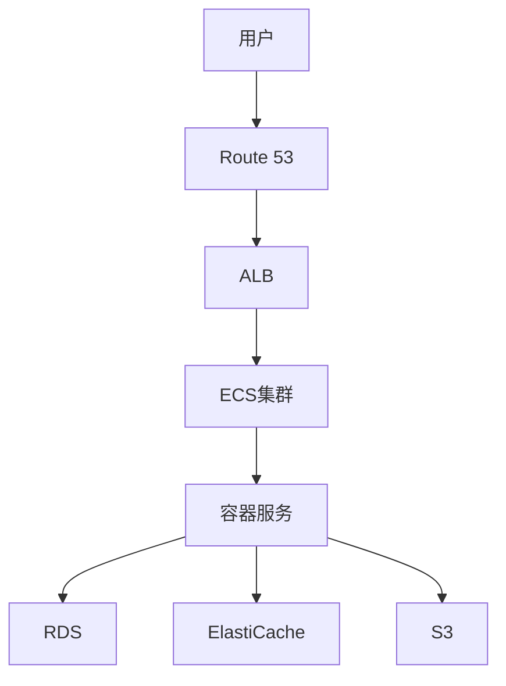
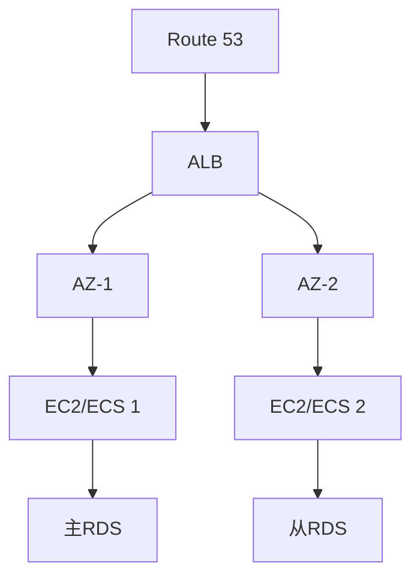
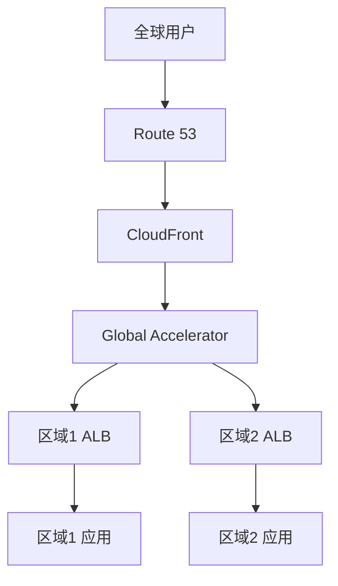

# AWS Web应用托管方案

本文详细介绍AWS上从简单到复杂的Web应用托管解决方案，帮助您选择最适合的架构方案。

## 目录

1. [方案概述](#方案概述)
2. [静态网站托管](#静态网站托管)
3. [轻量级Web应用](#轻量级web应用)
4. [企业级Web应用](#企业级web应用)
5. [高可用架构](#高可用架构)
6. [全球化部署](#全球化部署)
7. [性能优化](#性能优化)
8. [安全性配置](#安全性配置)
9. [监控和运维](#监控和运维)
10. [成本优化](#成本优化)

## 方案概述

### 托管方案对比

| 方案类型 | 适用场景 | 核心服务 | 优势 | 挑战 |
|---------|---------|---------|------|------|
| 静态网站 | 展示页面、文档 | S3, CloudFront | 简单、低成本 | 功能限制 |
| 轻量级应用 | 个人博客、小型应用 | Elastic Beanstalk, EC2 | 易于管理 | 扩展性有限 |
| 企业级应用 | 大型网站、电商 | ECS, EKS, RDS | 高可用、可扩展 | 复杂度高 |
| 无服务器应用 | API驱动的应用 | Lambda, API Gateway | 自动扩展、低维护 | 冷启动延迟 |

### 架构演进



## 静态网站托管

### S3静态网站

1. **基础配置**
   ```json
   {
       "WebsiteConfiguration": {
           "IndexDocument": {
               "Suffix": "index.html"
           },
           "ErrorDocument": {
               "Key": "error.html"
           }
       }
   }
   ```

2. **CloudFront配置**
   ```json
   {
       "DistributionConfig": {
           "Origins": {
               "S3Origin": {
                   "DomainName": "bucket-name.s3.amazonaws.com",
                   "OriginAccessIdentity": "origin-access-identity/cloudfront/ID"
               }
           },
           "DefaultCacheBehavior": {
               "ViewerProtocolPolicy": "redirect-to-https",
               "MinTTL": 0,
               "DefaultTTL": 86400
           }
       }
   }
   ```

### 架构图

```mermaid
graph LR
    A[用户] --> B[CloudFront]
    B --> C[S3存储桶]
    B --> D[Lambda@Edge]
```

## 轻量级Web应用

### Elastic Beanstalk部署

1. **应用配置**
   ```yaml
   Resources:
     AWSEBAutoScalingGroup:
       Type: AWS::AutoScaling::AutoScalingGroup
       Properties:
         MinSize: 1
         MaxSize: 4
     
     AWSEBLoadBalancer:
       Type: AWS::ElasticLoadBalancing::LoadBalancer
       Properties:
         HealthCheck:
           HealthyThreshold: 3
           Interval: 30
   ```

2. **环境变量**
   ```json
   {
       "EnvironmentVariables": {
           "NODE_ENV": "production",
           "DB_HOST": "xxx.rds.amazonaws.com",
           "REDIS_URL": "xxx.cache.amazonaws.com"
       }
   }
   ```

### 架构图



## 企业级Web应用

### 容器化部署

1. **ECS任务定义**
   ```json
   {
       "taskDefinition": {
           "family": "web-app",
           "containerDefinitions": [{
               "name": "web",
               "image": "nginx:latest",
               "memory": 512,
               "cpu": 256,
               "portMappings": [{
                   "containerPort": 80,
                   "hostPort": 80
               }]
           }]
       }
   }
   ```

2. **服务配置**
   ```json
   {
       "service": {
           "serviceName": "web-service",
           "taskDefinition": "web-app",
           "desiredCount": 2,
           "loadBalancers": [{
               "targetGroupArn": "arn:aws:elasticloadbalancing:...",
               "containerName": "web",
               "containerPort": 80
           }]
       }
   }
   ```

### 架构图



## 高可用架构

### 多可用区部署

1. **负载均衡配置**
   ```json
   {
       "LoadBalancerAttributes": {
           "CrossZoneLoadBalancing": true,
           "ConnectionDraining": true,
           "ConnectionDrainingTimeout": 300
       },
       "AvailabilityZones": [
           "us-east-1a",
           "us-east-1b",
           "us-east-1c"
       ]
   }
   ```

2. **自动扩展配置**
   ```json
   {
       "AutoScalingGroup": {
           "MinSize": 2,
           "MaxSize": 10,
           "DesiredCapacity": 4,
           "HealthCheckType": "ELB",
           "HealthCheckGracePeriod": 300
       }
   }
   ```

### 架构图



## 全球化部署

### Route 53配置

```json
{
    "HealthCheck": {
        "Id": "latency-check",
        "Type": "HTTP",
        "Port": 80,
        "ResourcePath": "/health"
    },
    "RoutingPolicy": {
        "Type": "LATENCY",
        "Region": "us-east-1",
        "SetIdentifier": "us-east-1"
    }
}
```

### 全球加速器配置

```json
{
    "GlobalAccelerator": {
        "Name": "webapp-accelerator",
        "IpAddressType": "IPV4",
        "Listeners": [{
            "PortRanges": [{
                "FromPort": 80,
                "ToPort": 80
            }]
        }]
    }
}
```

### 架构图



## 性能优化

### 缓存策略

1. **CloudFront缓存**
   ```json
   {
       "CacheBehavior": {
           "PathPattern": "*.jpg",
           "MinTTL": 86400,
           "DefaultTTL": 604800,
           "MaxTTL": 31536000,
           "Compress": true
       }
   }
   ```

2. **应用层缓存**
   ```json
   {
       "ElastiCache": {
           "Engine": "redis",
           "CacheNodeType": "cache.t3.micro",
           "NumCacheNodes": 2,
           "AutoMinorVersionUpgrade": true
       }
   }
   ```

### 性能监控

```json
{
    "CloudWatch": {
        "Metrics": [
            "RequestCount",
            "TargetResponseTime",
            "HTTPCode_Target_4XX_Count",
            "HTTPCode_Target_5XX_Count"
        ],
        "Alarms": {
            "HighLatency": {
                "Threshold": 1,
                "Period": 300,
                "EvaluationPeriods": 2
            }
        }
    }
}
```

## 安全性配置

### WAF规则

```json
{
    "WebACL": {
        "Rules": [{
            "Name": "BlockSQLInjection",
            "Priority": 1,
            "Action": {
                "Block": {}
            },
            "Statement": {
                "SqlInjectionMatchStatement": {
                    "FieldToMatch": {
                        "QueryString": {}
                    }
                }
            }
        }]
    }
}
```

### SSL/TLS配置

```json
{
    "Certificate": {
        "DomainName": "example.com",
        "ValidationMethod": "DNS",
        "SubjectAlternativeNames": [
            "*.example.com"
        ]
    }
}
```

## 监控和运维

### CloudWatch配置

```json
{
    "Dashboard": {
        "Widgets": [{
            "Type": "metric",
            "Properties": {
                "Metrics": [
                    ["AWS/ApplicationELB", "RequestCount"],
                    ["AWS/ApplicationELB", "TargetResponseTime"]
                ],
                "Period": 300,
                "Stat": "Average"
            }
        }]
    }
}
```

### 告警设置

```json
{
    "Alarms": {
        "HighCPUUtilization": {
            "MetricName": "CPUUtilization",
            "Threshold": 80,
            "Period": 300,
            "EvaluationPeriods": 2,
            "AlarmActions": [
                "arn:aws:sns:region:account:topic"
            ]
        }
    }
}
```

## 成本优化

### 预留实例策略

```json
{
    "ReservedInstances": {
        "InstanceType": "t3.micro",
        "OfferingType": "Partial Upfront",
        "Term": "1yr",
        "InstanceCount": 2
    }
}
```

### 自动扩缩容策略

```json
{
    "ScalingPolicy": {
        "Type": "TargetTrackingScaling",
        "TargetValue": 70,
        "PredefinedMetricSpecification": {
            "PredefinedMetricType": "ASGAverageCPUUtilization"
        }
    }
}
```

## 最佳实践建议

1. **架构选择**
   - 根据业务需求选择合适的托管方案
   - 考虑未来扩展需求
   - 评估成本和维护复杂度

2. **性能优化**
   - 使用CDN加速静态内容
   - 实施多层缓存策略
   - 优化数据库访问

3. **安全性**
   - 启用WAF防护
   - 实施SSL/TLS加密
   - 定期安全评估

4. **运维管理**
   - 建立完善的监控体系
   - 实施自动化运维
   - 制定灾难恢复计划

## 总结

AWS提供了丰富的Web应用托管方案，从简单的静态网站到复杂的企业级应用都能找到合适的解决方案。选择合适的架构方案时，需要综合考虑业务需求、性能要求、安全性、可维护性和成本等因素。通过合理的规划和配置，可以构建稳定、高效、安全的Web应用托管环境。
