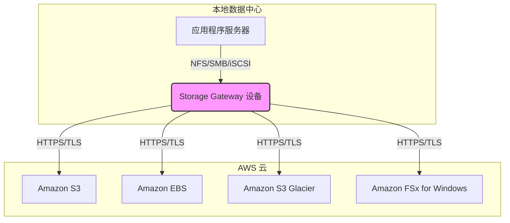

# AWS Storage Gateway

AWS Storage Gateway 是一种混合云存储服务，使您的本地应用程序能够无缝使用 AWS 云存储。该服务通过提供标准的存储协议（如 NFS、SMB、iSCSI 和 iSCSI-VTL），将您的本地环境与 AWS 存储服务（如 S3、EBS、Glacier）连接起来。

## 目录

- [概述](#概述)
- [核心概念与工作原理](#核心概念与工作原理)
- [网关类型详解](#网关类型详解)
  - [Amazon S3 文件网关](#amazon-s3-文件网关)
  - [Amazon FSx 文件网关](#amazon-fsx-文件网关)
  - [卷网关](#卷网关)
  - [磁带网关](#磁带网关)
- [部署与激活](#部署与激活)
- [网络与性能](#网络与性能)
- [安全与访问控制](#安全与访问控制)
- [监控与管理](#监控与管理)
- [成本模型](#成本模型)
- [Storage Gateway vs. DataSync vs. Direct Connect](#storage-gateway-vs-datasync-vs-direct-connect)
- [最佳实践](#最佳实践)
- [常见使用场景](#常见使用场景)
- [实际应用案例](#实际应用案例)

## 概述

Storage Gateway 旨在解决混合云存储的挑战，如数据迁移、云端备份、分层存储和灾难恢复。它通过在您的本地数据中心部署一个虚拟设备（或硬件设备）来实现。

主要优势：

- **标准协议支持**: 无需修改本地应用程序即可与云存储集成。
- **本地缓存**: 在网关设备上保留频繁访问的数据，提供低延迟访问。
- **优化数据传输**: 使用压缩、加密和带宽管理来优化本地与云之间的数据传输。
- **与 AWS 服务无缝集成**: 与 S3、EBS、IAM、KMS 和 CloudWatch 等服务深度集成。
- **简化管理**: 通过 AWS 管理控制台统一管理所有网关。

## 核心概念与工作原理

Storage Gateway 在您的本地环境中运行一个虚拟或物理设备。该设备作为本地应用程序和 AWS 云存储之间的桥梁。



## 网关类型详解

Storage Gateway 提供多种类型的网关以满足不同的需求。

### Amazon S3 文件网关

- **协议**: NFS (v3, v4.1), SMB (v2, v3)
- **工作原理**: 将 S3 存储桶作为本地文件共享公开。文件以对象形式存储在 S3 中，元数据（如权限、时间戳）作为 S3 对象元数据存储。
- **缓存**: 在本地缓存最近访问的数据，以实现低延迟访问。
- **适用场景**:
  - 本地应用程序的云端备份。
  - 混合云文件共享。
  - 将数据迁移到 S3，用于云端分析和机器学习。
  - 替代本地 NAS 存储。

```bash
# 挂载 S3 文件网关共享 (NFS 示例)
sudo mount -t nfs -o nfsvers=4.1,rsize=1048576,wsize=1048576,hard,timeo=600,retrans=2,noresvport [Gateway-IP]:/[S3-Bucket-Name] /mnt/s3-share
```

### Amazon FSx 文件网关

- **协议**: SMB
- **工作原理**: 为本地环境提供对云中 Amazon FSx for Windows File Server 的低延迟、缓存访问。
- **适用场景**:
  - 需要原生 Windows 文件系统功能（如 AD 集成、NTFS 权限、DFS）的混合工作负载。
  - 扩展现有 FSx for Windows 环境到本地。

### 卷网关

卷网关提供基于 iSCSI 协议的块存储卷。

#### 1. 缓存卷 (Cached Volumes)

- **工作原理**: 将主数据存储在 S3 中，并在本地网关上保留频繁访问数据的缓存。
- **卷大小**: 1 GiB - 32 TiB
- **适用场景**:
  - 需要低延迟访问活动数据集，同时将主数据存储在云端的应用。
  - 经济高效的主数据存储和备份。

#### 2. 存储卷 (Stored Volumes)

- **工作原理**: 将整个数据集存储在本地，并定期将数据异步备份到 S3（以 EBS 快照形式）。
- **卷大小**: 1 GiB - 16 TiB
- **适用场景**:
  - 需要对整个数据集进行低延迟访问的应用。
  - 需要在本地保留主数据，并在云中进行灾难恢复备份。

### 磁带网关

- **协议**: iSCSI 虚拟磁带库 (VTL)
- **工作原理**: 提供一个云端的虚拟磁带库，与主流备份应用程序（如 Veeam, NetBackup, Commvault）兼容。
- **虚拟磁带**: 存储在 S3 Standard 或 S3 Glacier Flexible Retrieval 中。
- **虚拟磁带归档**: 可以将虚拟磁带归档到 S3 Glacier Deep Archive 以实现极低的长期存储成本。
- **适用场景**:
  - 替换物理磁带库，消除磁带管理的运营开销。
  - 实现经济高效、持久的云端磁带备份和归档。

## 部署与激活

1.  **选择网关类型**: 根据您的需求选择文件、卷或磁带网关。
2.  **选择主机平台**:
    - **VMware ESXi**: 下载并部署 OVA 模板。
    - **Microsoft Hyper-V**: 下载并部署 VHDX 映像。
    - **Linux KVM**: 下载并部署 QCOW2 映像。
    - **Amazon EC2**: 在 EC2 上启动 Storage Gateway AMI。
    - **硬件设备**: 购买和部署 Dell EMC 提供的专用硬件设备。
3.  **分配本地资源**: 为网关虚拟机分配所需的 CPU、内存和磁盘空间（用于缓存和上传缓冲区）。
4.  **激活网关**: 将网关连接到您的 AWS 账户并激活。

```bash
# 示例：通过 CLI 激活网关 (需要先通过控制台或本地网关 VM 获取激活密钥)
aws storagegateway activate-gateway \
  --activation-key "YOUR-ACTIVATION-KEY" \
  --gateway-name "MyFileGateway" \
  --gateway-region "ap-northeast-1" \
  --gateway-timezone "GMT-7:00"
```

## 网络与性能

- **网络需求**: 确保网关与 AWS 端点之间有稳定、高带宽的连接。
- **端口要求**: 需要开放特定端口（如 443 用于控制，2049 用于 NFS，3260 用于 iSCSI）。
- **本地磁盘性能**: 网关的本地磁盘性能直接影响缓存性能。建议使用 SSD 以获得最佳性能。
- **带宽限制**: 您可以配置带宽限制，以管理网关用于数据同步的带宽。

## 安全与访问控制

- **传输中加密**: 所有在网关和 AWS 之间传输的数据都通过 HTTPS/TLS 加密。
- **静态加密**:
  - 文件网关和磁带网关中的数据默认使用 SSE-S3 在 S3 中加密。
  - 卷网关的数据可以通过 AWS KMS 进行加密。
- **CHAP 身份验证**: 卷网关支持使用质询握手身份验证协议 (CHAP) 来验证 iSCSI 连接。
- **IAM 权限**: 使用 IAM 策略来控制谁可以管理 Storage Gateway 资源。

## 监控与管理

- **Amazon CloudWatch**:
  - **指标 (Metrics)**: 监控网关的性能，如缓存命中率、吞吐量、IOPS 等。
  - **告警 (Alarms)**: 根据性能指标设置告警，以便在出现问题时收到通知。
  - **日志 (Logs)**: 审计日志提供有关文件共享操作的详细信息。
- **AWS CloudTrail**: 记录对 Storage Gateway API 的所有调用。
- **AWS Systems Manager**: 可以用于管理部署在 EC2 上的网关实例。

## 成本模型

Storage Gateway 的成本主要包括：

- **网关使用费**: 按每个激活的网关每月收费（硬件设备除外）。
- **存储费用**: 您在 AWS 中存储的数据（如 S3 对象、EBS 快照）的费用。
- **数据传输费用**: 从 AWS 传出到网关的数据（少量免费额度后收费）。
- **请求费用**: S3 API 请求费用（文件网关）。
- **快照存储费用**: 卷网关的 EBS 快照存储费用。

## Storage Gateway vs. DataSync vs. Direct Connect

| 服务 | 类型 | 主要用途 |
| :--- | :--- | :--- |
| **Storage Gateway** | 混合存储服务 | 提供对云存储的本地协议访问（NFS, SMB, iSCSI）。 |
| **AWS DataSync** | 数据传输服务 | 在本地存储和 AWS 存储服务之间进行大规模、高速的在线数据迁移和复制。 |
| **AWS Direct Connect** | 网络连接服务 | 在您的本地数据中心和 AWS 之间建立私有、专用的网络连接。 |

- **结合使用**: 通常将 Storage Gateway 与 Direct Connect 结合使用，以获得更稳定、更安全的私有连接。DataSync 可用于将大量现有数据一次性迁移到云端，之后由 Storage Gateway 提供持续访问。

## 最佳实践

1.  **为网关分配足够资源**: 确保您的网关虚拟机或硬件设备有足够的 CPU、内存和本地磁盘，以满足性能需求。
2.  **使用 SSD 缓存**: 为了获得最佳性能，请为缓存磁盘使用高性能 SSD。
3.  **监控关键指标**: 定期监控缓存命中率、吞吐量和延迟等 CloudWatch 指标。
4.  **配置带宽限制**: 在共享网络环境中，配置带宽限制以避免影响其他关键业务应用。
5.  **保护您的网络连接**: 对于生产工作负载，考虑使用 AWS Direct Connect 或 VPN 来保护和稳定您的网络连接。
6.  **定期测试备份和恢复**: 如果使用卷网关或磁带网关进行备份，请定期测试恢复流程以确保其有效性。

## 常见使用场景

- **将备份迁移到云端**: 使用磁带网关替换物理磁带库，或使用文件网关将数据库备份、日志等直接写入 S3。
- **混合云文件共享**: 使用文件网关在本地和云端之间提供统一的文件共享访问。
- **分层存储**: 使用缓存卷将不常访问的数据存储在 S3 中，同时在本地保留活动数据的缓存，以平衡成本和性能。
- **灾难恢复**: 使用存储卷的快照功能，在 AWS 中快速恢复您的本地应用程序。
- **数据处理工作流**: 本地设备（如显微镜、基因测序仪）生成的数据通过文件网关直接写入 S3，以便在云中进行分析。

## 实际应用案例

### 案例：医疗影像归档

一家医院需要将其 PACS (图片归档和通信系统) 中的大量医疗影像（如 X 光、CT 扫描）从本地存储迁移到云端，以降低成本并提高可访问性。

1.  **解决方案**:
    - **部署 S3 文件网关**: 在医院数据中心部署一个文件网关。
    - **配置 NFS 共享**: 将文件网关配置为一个 NFS 文件共享，并将其挂载到 PACS 系统上。
    - **数据分层**: PACS 系统将新的影像写入文件网关，文件网关自动将其上传到 Amazon S3。
    - **生命周期策略**: 使用 S3 生命周期策略，将旧的、不常访问的影像自动转移到 S3 Glacier Deep Archive，以实现最低成本的长期归档。

2.  **优势**:
    - **无缝集成**: PACS 系统无需任何修改即可将数据写入云端。
    - **低延迟访问**: 文件网关的本地缓存确保放射科医生可以快速访问最近的影像。
    - **成本效益**: 大幅降低了长期归半的存储成本。
    - **高持久性**: 数据存储在 S3 中，具有 11 个 9 的持久性。 