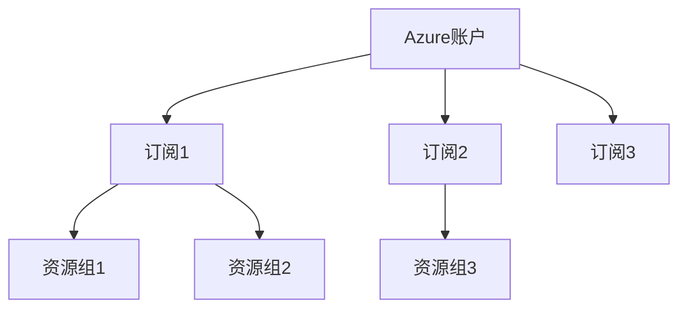
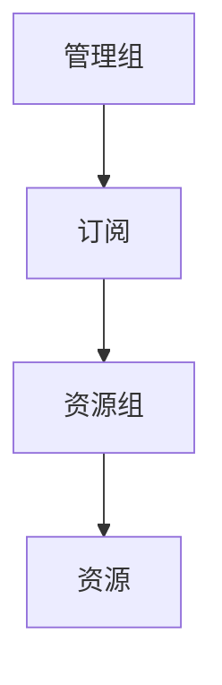

# Azure账户与订阅

本文档详细介绍Azure账户和订阅的概念、结构、管理方法以及最佳实践，帮助您有效地组织和控制Azure资源。

## 目录

- [账户与订阅基础](#账户与订阅基础)
- [账户类型](#账户类型)
- [订阅类型](#订阅类型)
- [账户与订阅层次结构](#账户与订阅层次结构)
- [管理订阅](#管理订阅)
- [访问控制](#访问控制)
- [成本管理](#成本管理)
- [最佳实践](#最佳实践)
- [常见问题](#常见问题)

## 账户与订阅基础

在Azure中，账户和订阅是两个不同但相关的概念：

- **Azure账户** - 用于登录和访问Azure服务的身份，与Microsoft账户或工作/学校账户关联。
- **Azure订阅** - 资源的逻辑容器，也是计费的基本单位。一个Azure账户可以关联多个订阅。



## 账户类型

Azure支持两种主要类型的账户：

### Microsoft账户 (个人)

- 适用于个人使用或小型项目
- 使用个人电子邮件地址注册
- 可以创建和管理订阅
- 默认成为订阅的账户管理员

### 工作或学校账户 (Azure AD)

- 由组织提供和管理
- 通过Azure Active Directory进行身份验证
- 可以被分配不同级别的权限
- 支持单点登录和多因素身份验证
- 可以与组织的身份管理系统集成

## 订阅类型

Azure提供多种类型的订阅，满足不同用户和组织的需求：

### 免费订阅

- 提供有限数量的免费服务12个月
- 包括$200的信用额度（30天内使用）
- 适合初学者和测试用途
- 不需要付款承诺

### 即用即付

- 按实际使用量计费
- 无长期承诺
- 可以随时取消
- 适合中小型企业和变动性较大的工作负载

### 企业协议 (EA)

- 为大型企业提供的批量许可计划
- 提供折扣价格和灵活的计费选项
- 通常需要年度或多年承诺
- 包括企业门户进行集中管理

### 云解决方案提供商 (CSP)

- 通过Microsoft合作伙伴购买
- 合作伙伴提供支持和计费
- 适合希望通过服务提供商管理云资源的客户

### 学生订阅

- 为学生提供免费信用额度
- 需要验证学生身份
- 包括免费的开发者工具和服务

### Visual Studio订阅

- 为Visual Studio订阅者提供的月度信用额度
- 包括开发和测试环境的优惠价格
- 不适合生产工作负载

## 账户与订阅层次结构

Azure使用四级层次结构来组织资源：



### 管理组

- 提供订阅上的范围级别治理
- 可以包含多个订阅
- 支持策略和访问控制的继承
- 最多可以支持六级嵌套

### 订阅

- 资源的逻辑边界
- 与特定账户和付款方式关联
- 有自己的配额和限制
- 用于隔离环境（如开发、测试、生产）

### 资源组

- 包含共享生命周期的资源
- 通常按应用程序或项目组织
- 简化部署、管理和监控

### 资源

- 实际的Azure服务实例
- 每个资源必须属于一个资源组
- 可以有自己的访问控制设置

## 管理订阅

### 创建新订阅

1. 登录[Azure门户](https://portal.azure.com)
2. 搜索并选择"订阅"
3. 点击"添加"
4. 选择订阅类型并完成购买流程

### 转移订阅所有权

1. 登录Azure门户
2. 导航到"订阅"
3. 选择要转移的订阅
4. 点击"访问控制(IAM)"
5. 添加新所有者并移除旧所有者

### 取消订阅

1. 登录Azure门户
2. 导航到"订阅"
3. 选择要取消的订阅
4. 点击"取消订阅"
5. 提供取消原因并确认

> **注意**：取消订阅后，所有资源将被禁用，数据可能会被删除。请确保在取消前备份重要数据。

## 访问控制

Azure使用基于角色的访问控制(RBAC)来管理对资源的访问：

### 内置角色

- **所有者** - 完全访问权限，包括分配访问权限
- **贡献者** - 可以创建和管理所有资源，但不能分配访问权限
- **读取者** - 可以查看现有资源
- **用户访问管理员** - 可以管理用户对Azure资源的访问权限

### 自定义角色

可以创建自定义角色，精确定义允许和拒绝的操作：

```json
{
  "Name": "Virtual Machine Operator",
  "Description": "Can monitor and restart virtual machines.",
  "Actions": [
    "Microsoft.Compute/virtualMachines/read",
    "Microsoft.Compute/virtualMachines/start/action",
    "Microsoft.Compute/virtualMachines/restart/action"
  ],
  "NotActions": [],
  "DataActions": [],
  "NotDataActions": [],
  "AssignableScopes": ["/subscriptions/{subscriptionId}"]
}
```

### 分配角色

1. 导航到资源、资源组或订阅
2. 点击"访问控制(IAM)"
3. 点击"添加角色分配"
4. 选择角色、用户或组

## 成本管理

### 订阅级别的成本控制

- **预算** - 设置支出限制并在接近或超过时收到通知
- **成本分析** - 分析和可视化支出模式
- **成本警报** - 基于预设条件自动通知

### 资源标记

使用标记来组织资源并分析成本：

```azurecli
# 为资源组添加标记
az group update --name myResourceGroup --tags Department=Finance Project=Migration

# 为资源添加标记
az resource tag --tags Environment=Production --ids /subscriptions/{subscriptionId}/resourceGroups/{resourceGroup}/providers/Microsoft.Compute/virtualMachines/{vmName}
```

### 配额和限制

每个订阅都有资源限制和配额：

- 区域内的虚拟机数量
- 每个区域的存储账户数量
- 每个订阅的资源组数量
- API请求频率

可以通过提交支持请求来增加某些配额。

## 最佳实践

### 订阅组织策略

#### 按环境分离

```
├── 开发订阅
├── 测试订阅
├── 预生产订阅
└── 生产订阅
```

#### 按部门或业务单位分离

```
├── IT部门订阅
├── 财务部门订阅
├── 营销部门订阅
└── 研发部门订阅
```

#### 按应用程序分离

```
├── 核心业务应用订阅
├── 客户门户订阅
├── 数据分析平台订阅
└── 内部工具订阅
```

### 命名约定

采用一致的命名约定：

```
<环境>-<业务单位>-<应用>-<资源类型>-<实例>
```

例如：`prod-finance-payroll-vm-01`

### 资源组策略

- 将共享相同生命周期的资源放在同一资源组中
- 避免在不同资源组之间创建依赖关系
- 为每个应用程序环境使用单独的资源组

### 访问控制建议

- 遵循最小权限原则
- 使用Azure AD组分配权限
- 定期审核访问权限
- 为关键操作启用多因素身份验证

## 常见问题

### 一个账户可以有多少个订阅？

一个Azure账户可以关联多个订阅，但具体数量可能因账户类型和信用记录而异。

### 如何在订阅之间移动资源？

可以使用Azure门户、PowerShell或Azure CLI将资源移动到不同的订阅：

```powershell
# 使用PowerShell移动资源
Move-AzResource -DestinationResourceGroupName "TargetResourceGroup" -DestinationSubscriptionId "TargetSubscriptionId" -ResourceId "ResourceId"
```

### 如何监控多个订阅的成本？

使用Azure成本管理工具可以查看和分析跨多个订阅的成本。管理组也可以帮助集中管理多个订阅的策略和成本。

### 删除订阅后数据会怎样？

删除订阅后，所有资源将被删除，数据可能无法恢复。建议在删除订阅前备份重要数据。

### 如何重新激活已取消的订阅？

如果订阅是在过去90天内取消的，可以通过Azure门户或联系支持团队重新激活。 