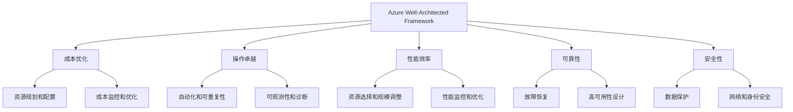
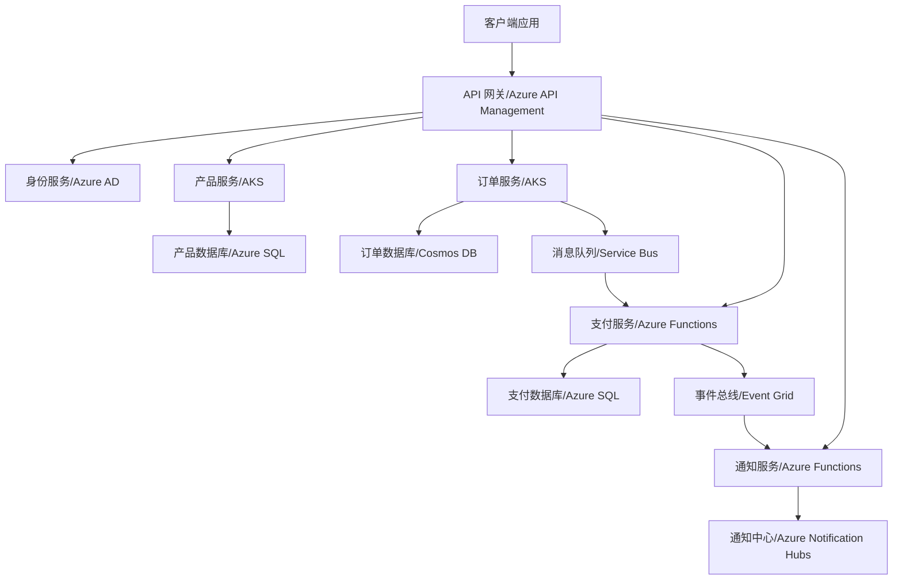
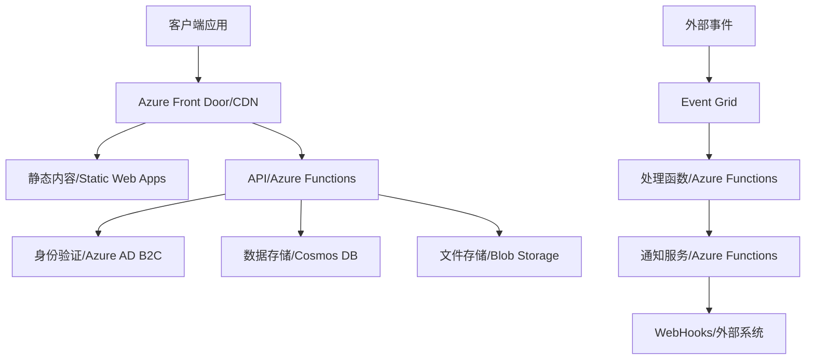
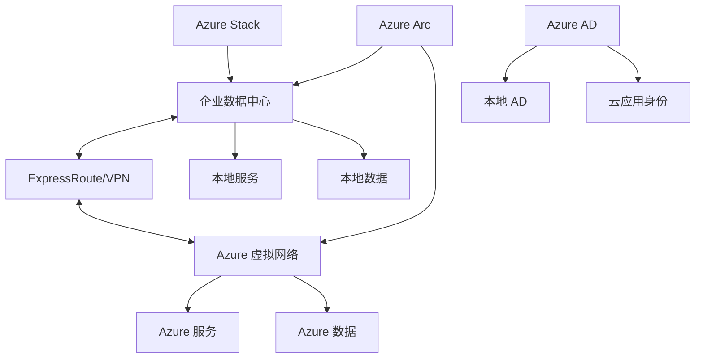
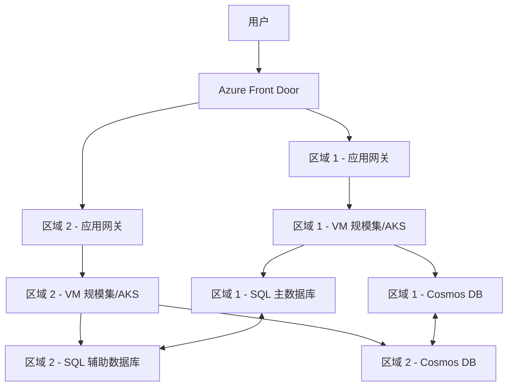
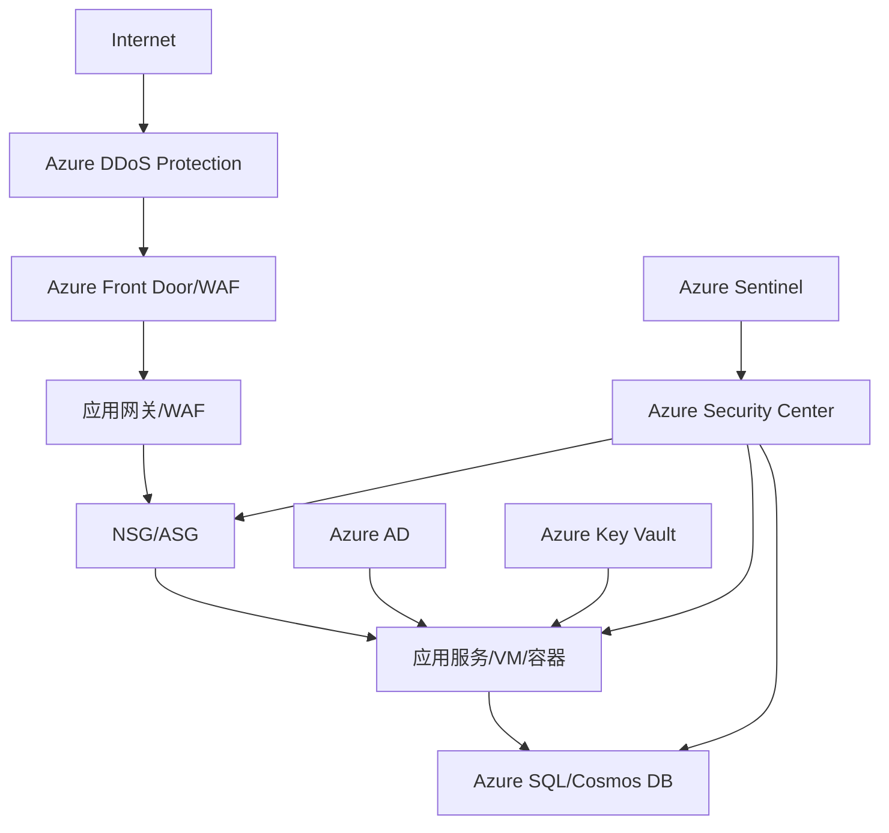
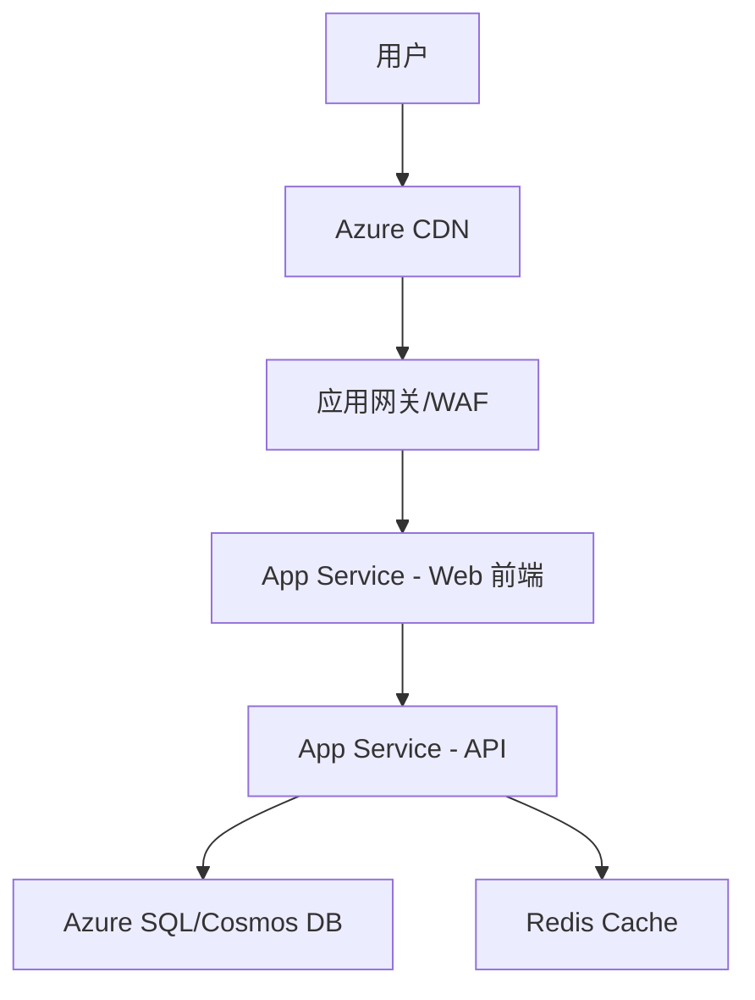
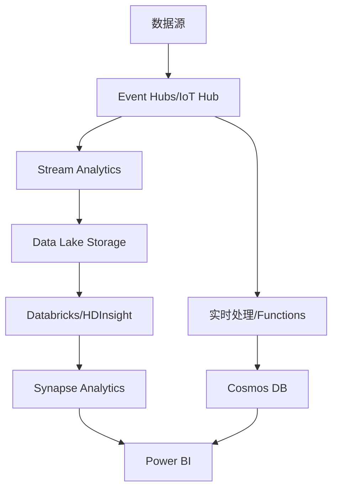
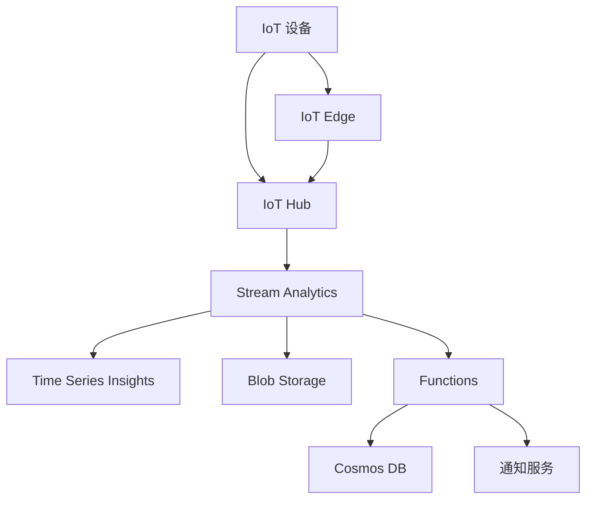
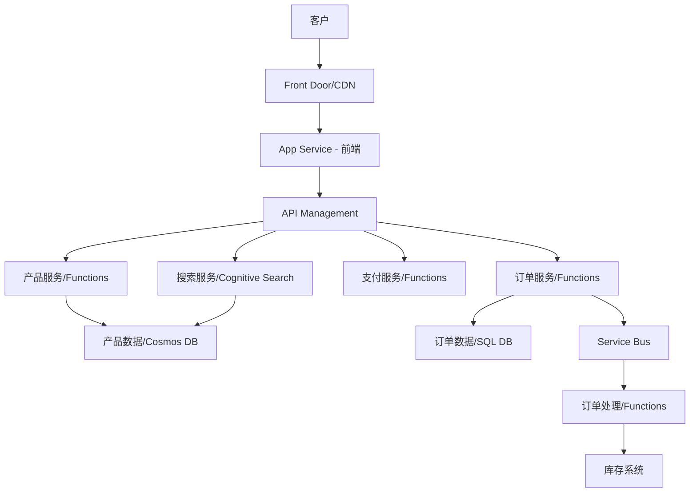

# Azure 架构设计最佳实践

> [!NOTE]
> 本文档提供了 Azure 架构设计的最佳实践指南，帮助您设计可靠、安全、高效且具有成本效益的云解决方案。

## 目录

- [架构设计原则](#架构设计原则)
- [Azure Well-Architected Framework](#azure-well-architected-framework)
- [应用架构模式](#应用架构模式)
- [微服务架构](#微服务架构)
- [无服务器架构](#无服务器架构)
- [混合云架构](#混合云架构)
- [多租户架构](#多租户架构)
- [高可用性设计](#高可用性设计)
- [灾难恢复设计](#灾难恢复设计)
- [安全架构](#安全架构)
- [成本优化架构](#成本优化架构)
- [常见架构场景](#常见架构场景)

## 架构设计原则

设计 Azure 解决方案时，应遵循以下核心原则：

### 1. 设计简单性

- **减少复杂性**
  - 避免不必要的组件和依赖
  - 使用标准化模式和实践

- **增量式设计**
  - 从简单开始，根据需求逐步扩展
  - 采用迭代方法验证设计假设

### 2. 设计弹性

- **消除单点故障**
  - 在多个可用区部署资源
  - 实现冗余和故障转移机制

- **优雅降级**
  - 设计系统在部分故障时仍能提供核心功能
  - 实现断路器和隔离模式

### 3. 设计可扩展性

- **水平扩展**
  - 优先考虑水平扩展而非垂直扩展
  - 设计无状态组件以便轻松扩展

- **自动缩放**
  - 根据负载自动调整资源
  - 设置适当的缩放规则和阈值

### 4. 设计可管理性

- **自动化**
  - 自动化部署、监控和维护任务
  - 使用基础设施即代码 (IaC)

- **可观测性**
  - 实现全面的日志记录和监控
  - 设计健康检查和诊断功能

### 5. 设计安全性

- **深度防御**
  - 实施多层安全控制
  - 采用最小权限原则

- **安全默认设置**
  - 默认配置应是安全的
  - 显式允许而非隐式允许

## Azure Well-Architected Framework

Azure Well-Architected Framework 提供了构建高质量解决方案的五大支柱：

### 成本优化

- **适当规模调整**
  - 选择适合工作负载的资源大小
  - 避免过度配置

- **使用成本管理工具**
  - 定期审查 Azure Advisor 建议
  - 设置预算和成本警报

### 操作卓越

- **DevOps 实践**
  - 实现 CI/CD 管道
  - 自动化测试和部署

- **监控和诊断**
  - 使用 Azure Monitor 全面监控
  - 设置适当的警报和通知

### 性能效率

- **性能测试**
  - 在生产规模下测试应用
  - 识别和解决瓶颈

- **缓存和内容分发**
  - 使用 Azure Cache for Redis 减少延迟
  - 利用 Azure CDN 加速内容交付

### 可靠性

- **自动恢复**
  - 设计自我修复机制
  - 实现健康检查和自动重启

- **负载平衡和流量管理**
  - 使用 Azure Load Balancer 或 Application Gateway
  - 实现流量管理策略

### 安全性

- **身份和访问管理**
  - 使用 Azure AD 进行身份验证
  - 实施最小权限原则

- **数据加密**
  - 加密传输中和静态数据
  - 使用 Azure Key Vault 管理密钥

## 应用架构模式

在 Azure 上设计应用时，可以利用以下常见架构模式：

### 分层架构

- **表示层**：处理用户界面和客户端通信
- **业务层**：实现业务逻辑和规则
- **数据层**：管理数据存储和检索

**Azure 实现**：
- 表示层：Azure App Service、Azure Static Web Apps
- 业务层：Azure Functions、Azure App Service
- 数据层：Azure SQL、Cosmos DB

### 事件驱动架构

- 基于事件生产者和消费者
- 松散耦合的组件通过事件通信

**Azure 实现**：
- Azure Event Grid：事件路由服务
- Azure Event Hubs：大规模事件处理
- Azure Service Bus：企业消息队列

### CQRS 模式

- 命令查询责任分离
- 分离读操作和写操作

**Azure 实现**：
- 写操作：Azure SQL、Cosmos DB
- 读操作：Azure Cache for Redis、Azure Cosmos DB
- 事件源：Azure Event Hubs、Azure Service Bus

### API 网关模式

- 集中式入口点处理客户端请求
- 提供路由、认证、限流等功能

**Azure 实现**：
- Azure API Management
- Azure Application Gateway
- Azure Front Door

## 微服务架构

微服务架构将应用程序分解为小型、独立的服务，每个服务专注于特定业务功能。

### 微服务设计原则

1. **单一职责**
   - 每个服务专注于一个业务功能
   - 独立开发、部署和扩展

2. **领域驱动设计**
   - 基于业务领域边界划分服务
   - 明确定义服务间的接口和契约

3. **数据隔离**
   - 每个微服务拥有自己的数据存储
   - 通过 API 而非共享数据库进行通信

### Azure 微服务实现选项

1. **容器化微服务**
   - **Azure Kubernetes Service (AKS)**
     - 管理 Kubernetes 集群
     - 适合复杂的微服务架构

   - **Azure Container Instances**
     - 快速部署容器
     - 适合简单场景和开发/测试

2. **无服务器微服务**
   - **Azure Functions**
     - 事件驱动的微服务
     - 自动扩展和按使用付费

   - **Azure Logic Apps**
     - 工作流驱动的集成服务
     - 适合业务流程和集成场景

3. **微服务通信**
   - **同步通信**：Azure API Management
   - **异步通信**：Azure Service Bus、Event Grid

## 无服务器架构

无服务器架构允许开发人员构建应用程序而无需管理基础设施，专注于业务逻辑。

### 无服务器设计原则

1. **事件驱动**
   - 基于事件触发函数执行
   - 使用发布/订阅模型

2. **有状态与无状态分离**
   - 函数保持无状态
   - 状态存储在专用服务中

3. **细粒度功能**
   - 将功能分解为小型、专注的函数
   - 优化执行时间和资源使用

### Azure 无服务器实现选项

1. **计算服务**
   - **Azure Functions**
     - 支持多种触发器和绑定
     - 自动扩展和按使用付费

   - **Azure Logic Apps**
     - 低代码/无代码工作流
     - 丰富的连接器生态系统

2. **状态管理**
   - **Azure Cosmos DB**：全球分布式数据库
   - **Azure Table Storage**：简单键值存储
   - **Azure Redis Cache**：高性能缓存

3. **无服务器应用场景**
   - 后端 API
   - 实时文件处理
   - 计划任务和自动化
   - IoT 数据处理
   - 实时数据流处理

## 混合云架构

混合云架构结合了公有云和私有环境的优势，适用于有特定本地要求的组织。

### 混合云设计原则

1. **一致性管理**
   - 跨环境统一管理和监控
   - 使用一致的工具和流程

2. **智能工作负载放置**
   - 根据需求选择最佳部署位置
   - 考虑性能、合规性和成本因素

3. **安全连接**
   - 安全的网络连接
   - 一致的身份和访问管理

### Azure 混合云实现选项

1. **混合连接**
   - **Azure ExpressRoute**：专用网络连接
   - **Azure VPN Gateway**：安全 VPN 连接
   - **Azure Virtual WAN**：全球广域网络

2. **混合管理**
   - **Azure Arc**：将 Azure 管理扩展到任何基础设施
   - **Azure Stack**：在本地运行 Azure 服务

3. **混合身份**
   - **Azure AD Connect**：同步本地 AD 和 Azure AD
   - **Azure AD 混合身份验证**：单点登录体验

4. **混合数据**
   - **Azure SQL Managed Instance**：与本地 SQL Server 兼容
   - **Azure Data Factory**：混合数据集成

## 多租户架构

多租户架构允许单个应用程序实例服务多个客户（租户），同时确保数据隔离和安全性。

### 多租户设计模型

1. **数据库模型**
   - **单一数据库**：所有租户共享一个数据库
   - **数据库分片**：租户分布在多个数据库
   - **每租户数据库**：每个租户专用数据库

2. **应用程序模型**
   - **共享应用实例**：所有租户共享应用实例
   - **每租户应用实例**：每个租户专用应用实例
   - **混合模型**：关键租户专用实例，其他共享

### Azure 多租户实现最佳实践

1. **租户隔离**
   - 使用 Azure SQL 弹性池进行数据库隔离
   - 利用 Cosmos DB 分区键实现数据隔离
   - 应用适当的访问控制和权限

2. **租户标识**
   - 使用 Azure AD B2C 或 Azure AD 外部标识
   - 实现租户上下文和标识传播

3. **资源分配**
   - 根据租户服务级别分配资源
   - 实现资源限制和配额

4. **监控和计量**
   - 按租户跟踪资源使用情况
   - 实现租户级别的计费和成本分配

## 高可用性设计

高可用性 (HA) 设计确保应用程序即使在组件故障的情况下也能保持运行。

### 可用性级别

1. **单区域高可用性**
   - 在单个 Azure 区域内实现冗余
   - 使用可用性集或可用性区域

2. **多区域高可用性**
   - 跨多个 Azure 区域部署
   - 实现区域故障转移机制

### Azure 高可用性实现选项

1. **计算高可用性**
   - **虚拟机可用性集**：防止单点故障和维护事件
   - **虚拟机可用性区域**：跨数据中心的物理隔离
   - **虚拟机规模集**：自动扩展和负载均衡

2. **数据高可用性**
   - **Azure SQL 高可用性**：自动故障转移组
   - **Cosmos DB 多区域分布**：多主复制
   - **存储冗余选项**：LRS、ZRS、GRS、RA-GRS

3. **网络高可用性**
   - **Azure Load Balancer**：区域内负载均衡
   - **Azure Traffic Manager**：全球流量路由
   - **Azure Front Door**：全球 HTTP/S 负载均衡

### 高可用性设计模式

1. **健康检查和自动恢复**
   - 实现健康探测
   - 配置自动重启和替换

2. **负载均衡和流量管理**
   - 分散流量以避免单点故障
   - 实现智能路由策略

3. **数据复制和同步**
   - 同步或异步数据复制
   - 定期备份和恢复测试

## 灾难恢复设计

灾难恢复 (DR) 设计确保在发生重大中断时能够恢复业务运营。

### 灾难恢复指标

1. **恢复点目标 (RPO)**
   - 可接受的数据丢失量
   - 由备份或复制频率决定

2. **恢复时间目标 (RTO)**
   - 可接受的服务中断时间
   - 由恢复过程的速度决定

### Azure 灾难恢复实现选项

1. **备份和恢复**
   - **Azure Backup**：VM、数据库和文件的备份
   - **Azure Blob 存储**：不可变存储和软删除

2. **复制和故障转移**
   - **Azure Site Recovery**：VM 和物理服务器复制
   - **Azure SQL 主动地理复制**：数据库复制
   - **Cosmos DB 多区域写入**：多区域数据库复制

3. **灾难恢复架构模式**
   - **热备用 (Hot Standby)**：始终运行的辅助环境
   - **温备用 (Warm Standby)**：部分运行的辅助环境
   - **冷备用 (Cold Standby)**：需要启动的辅助环境

### 灾难恢复测试和演练

- 定期测试恢复过程
- 记录和优化恢复步骤
- 更新灾难恢复文档和程序

## 安全架构

安全架构确保应用程序和数据受到保护，防止未授权访问和威胁。

### 安全设计原则

1. **深度防御**
   - 实施多层安全控制
   - 不依赖单一安全措施

2. **最小权限**
   - 只提供完成任务所需的最小权限
   - 定期审查和撤销不必要的权限

3. **假设违规**
   - 设计时假设安全控制可能被绕过
   - 实施检测和响应机制

### Azure 安全实现选项

1. **身份和访问管理**
   - **Azure AD**：身份验证和授权
   - **Azure RBAC**：细粒度访问控制
   - **Azure AD PIM**：特权身份管理

2. **网络安全**
   - **NSG 和 ASG**：网络流量控制
   - **Azure Firewall**：云原生防火墙
   - **Azure DDoS Protection**：DDoS 攻击防护

3. **数据安全**
   - **Azure Key Vault**：密钥和机密管理
   - **Azure Information Protection**：数据分类和保护
   - **Azure SQL TDE**：透明数据加密

4. **安全监控**
   - **Azure Security Center**：统一安全管理
   - **Azure Sentinel**：SIEM 和 SOAR 解决方案
   - **Azure Monitor**：日志和警报

## 成本优化架构

成本优化架构旨在最大化云投资的价值，同时维持所需的性能和可靠性。

### 成本优化设计原则

1. **按需使用**
   - 只在需要时使用资源
   - 实现自动缩放和关闭

2. **适当规模调整**
   - 选择适合工作负载的资源大小
   - 定期审查和调整资源配置

3. **利用定价优势**
   - 使用预留实例和节省计划
   - 利用 Spot 实例处理可中断工作负载

### Azure 成本优化实现选项

1. **计算优化**
   - 使用 VM 规模集自动缩放
   - 利用 B 系列 VM 处理不稳定工作负载
   - 使用 Azure Functions 消费计划

2. **存储优化**
   - 实施存储生命周期管理
   - 选择适当的冗余级别
   - 使用适合数据访问模式的存储类型

3. **网络优化**
   - 优化出站数据传输
   - 使用 CDN 减少数据传输
   - 合理规划区域间通信

4. **许可优化**
   - 利用 Azure 混合优势
   - 使用开发/测试定价
   - 优化软件许可模型

### 成本监控和治理

- 使用 Azure Cost Management 跟踪支出
- 实施标记策略进行成本分配
- 设置预算和成本警报

## 常见架构场景

### Web 应用架构

**场景**：构建可扩展、安全的 Web 应用程序

**Azure 实现**：
- 前端：Azure App Service 或 Static Web Apps
- API：Azure Functions 或 App Service
- 数据库：Azure SQL 或 Cosmos DB
- 缓存：Azure Redis Cache
- CDN：Azure CDN

### 大数据和分析架构

**场景**：处理和分析大量数据

**Azure 实现**：
- 数据摄取：Event Hubs 或 IoT Hub
- 数据存储：Data Lake Storage
- 数据处理：Databricks 或 HDInsight
- 数据仓库：Synapse Analytics
- 可视化：Power BI

### IoT 解决方案架构

**场景**：连接、监控和管理 IoT 设备

**Azure 实现**：
- 设备连接：IoT Hub
- 设备管理：IoT Central
- 边缘计算：IoT Edge
- 数据处理：Stream Analytics
- 存储和分析：Time Series Insights

### 电子商务架构

**场景**：构建可扩展、安全的电子商务平台

**Azure 实现**：
- 前端：App Service 或 Static Web Apps
- API：API Management 和 Functions
- 产品目录：Cosmos DB
- 订单处理：Service Bus 和 Functions
- 搜索：Azure Cognitive Search

## 参考资源

- [Azure 架构中心](https://docs.microsoft.com/azure/architecture/)
- [Azure Well-Architected Framework](https://docs.microsoft.com/azure/architecture/framework/)
- [Azure 应用架构指南](https://docs.microsoft.com/azure/architecture/guide/)
- [Azure 解决方案架构](https://azure.microsoft.com/solutions/architecture/)
- [Azure 架构图标和图表](https://docs.microsoft.com/azure/architecture/icons/) 