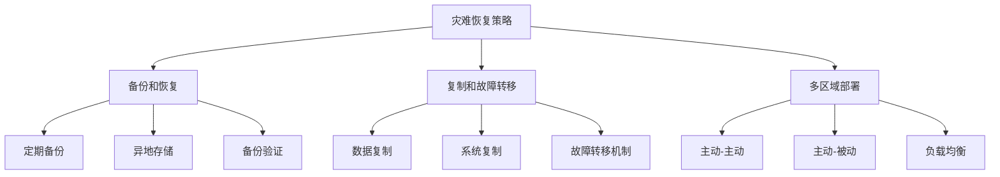
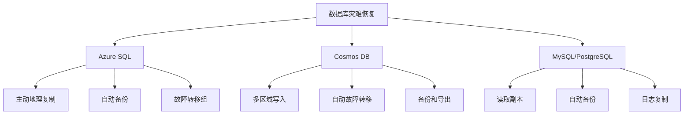
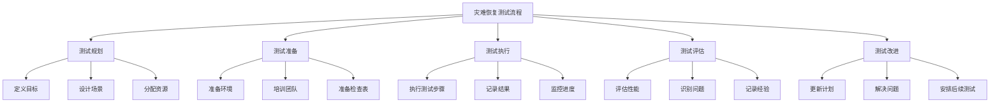
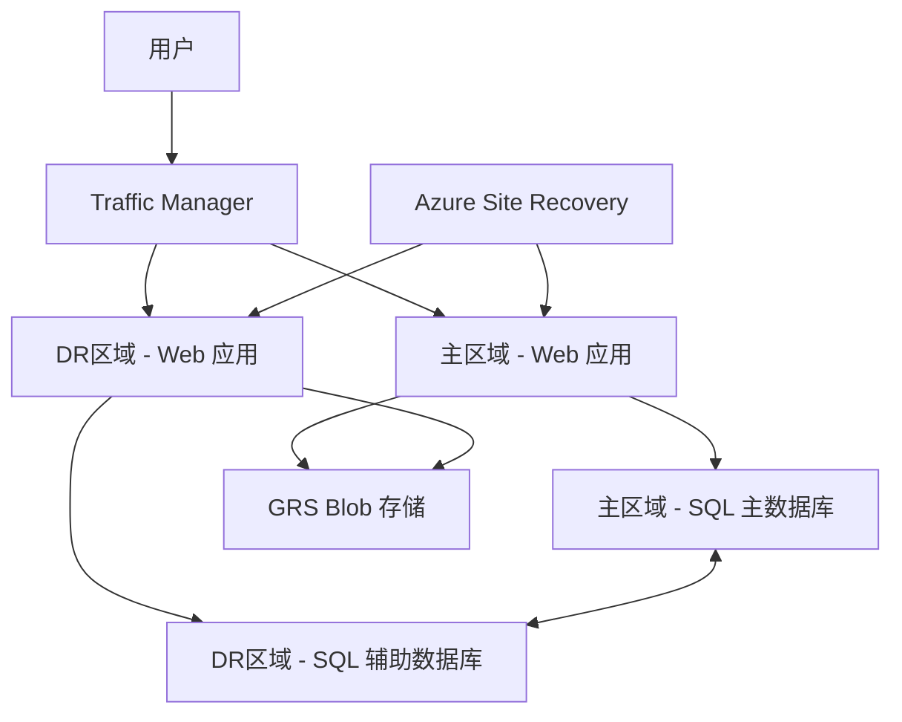

# Azure 灾难恢复最佳实践

> [!NOTE]
> 本文档提供了 Azure 灾难恢复的最佳实践指南，帮助您设计和实施有效的灾难恢复策略，确保业务连续性。

## 目录

- [灾难恢复概述](#灾难恢复概述)
- [灾难恢复规划](#灾难恢复规划)
- [Azure 灾难恢复服务](#azure-灾难恢复服务)
- [虚拟机灾难恢复](#虚拟机灾难恢复)
- [数据库灾难恢复](#数据库灾难恢复)
- [存储灾难恢复](#存储灾难恢复)
- [应用程序灾难恢复](#应用程序灾难恢复)
- [网络灾难恢复](#网络灾难恢复)
- [灾难恢复测试](#灾难恢复测试)
- [灾难恢复自动化](#灾难恢复自动化)
- [灾难恢复文档](#灾难恢复文档)
- [常见灾难恢复场景](#常见灾难恢复场景)

## 灾难恢复概述

灾难恢复 (DR) 是确保在发生重大中断事件后能够恢复业务运营的关键流程，包括技术基础设施、应用程序和数据的恢复。

### 灾难恢复的重要性

1. **业务连续性**
   - 减少停机时间和业务中断
   - 保护收入和客户关系

2. **合规性要求**
   - 满足行业法规和标准
   - 遵守数据保护法律

3. **声誉保护**
   - 维护客户和合作伙伴信任
   - 展示组织弹性

4. **风险管理**
   - 减轻灾难影响
   - 降低财务和运营风险

### 灾难类型

1. **自然灾害**
   - 地震、洪水、飓风
   - 火灾和极端天气

2. **技术故障**
   - 硬件故障
   - 软件错误和系统崩溃
   - 数据中心基础设施问题

3. **人为因素**
   - 人为错误和误配置
   - 恶意攻击和安全漏洞
   - 内部威胁

4. **服务提供商中断**
   - 云服务中断
   - 电信服务故障
   - 供应商服务中断

## 灾难恢复规划

### 业务影响分析

1. **关键业务流程识别**
   - 确定核心业务功能
   - 评估中断影响
   - 确定恢复优先级

2. **恢复目标定义**
   - 恢复点目标 (RPO)：可接受的数据丢失量
   - 恢复时间目标 (RTO)：可接受的服务中断时间
   - 恢复级别目标 (RLO)：恢复后的性能水平

3. **依赖关系映射**
   - 识别系统和服务依赖关系
   - 确定外部依赖项
   - 评估依赖关系风险

### 灾难恢复策略

1. **备份和恢复**
   - 定期数据备份
   - 异地备份存储
   - 验证备份完整性

2. **复制和故障转移**
   - 数据和系统复制
   - 自动或手动故障转移
   - 故障恢复规划

3. **多区域部署**
   - 跨 Azure 区域部署
   - 主动-主动或主动-被动配置
   - 区域间负载均衡

### 灾难恢复模型

1. **冷备用 (Cold Standby)**
   - 特点：最低成本，最长恢复时间
   - 实现：备份恢复，需要创建新资源
   - 适用：非关键系统，可接受较长 RTO

2. **温备用 (Warm Standby)**
   - 特点：中等成本，中等恢复时间
   - 实现：预配资源但不完全活跃
   - 适用：重要系统，中等 RTO 要求

3. **热备用 (Hot Standby)**
   - 特点：最高成本，最短恢复时间
   - 实现：完全复制的活跃环境
   - 适用：关键系统，极低 RTO 要求

4. **主动-主动 (Active-Active)**
   - 特点：最高成本，近乎零恢复时间
   - 实现：多区域同时活跃部署
   - 适用：任务关键型系统，接近零 RTO

## Azure 灾难恢复服务

### Azure Site Recovery

1. **功能概述**
   - 复制、故障转移和恢复服务
   - 支持 Azure VM、本地 VM 和物理服务器
   - 自动化复制和恢复流程

2. **关键功能**
   - 连续复制
   - 一键式故障转移
   - 恢复计划
   - 无中断测试

3. **实施最佳实践**
   - 配置适当的复制频率
   - 创建恢复网络映射
   - 设置恢复点保留策略
   - 定期测试故障转移

### Azure Backup

1. **功能概述**
   - 集中管理的备份服务
   - 支持 Azure VM、本地服务器、文件共享和应用程序
   - 长期保留和合规性

2. **关键功能**
   - 增量备份
   - 应用程序一致性备份
   - 加密备份
   - 备份策略管理

3. **实施最佳实践**
   - 设置适当的备份频率
   - 配置多层备份存储
   - 实施备份监控和警报
   - 定期测试恢复

### Azure Storage 复制

1. **功能概述**
   - 内置存储复制功能
   - 本地、区域和地理复制选项
   - 自动数据复制

2. **复制选项**
   - LRS：本地冗余存储
   - ZRS：区域冗余存储
   - GRS：地理冗余存储
   - RA-GRS：读取访问地理冗余存储

3. **实施最佳实践**
   - 根据数据重要性选择复制级别
   - 配置存储账户故障转移
   - 测试读取访问端点
   - 监控复制状态和滞后

### Traffic Manager 和 Front Door

1. **功能概述**
   - 全球流量路由和负载均衡
   - 自动故障检测和重定向
   - 多区域应用程序支持

2. **关键功能**
   - 多种路由方法
   - 端点健康监控
   - 自动故障转移
   - 全球分布式平台

3. **实施最佳实践**
   - 配置适当的健康探测
   - 设置合理的故障转移阈值
   - 实施多区域部署
   - 测试故障转移场景

## 虚拟机灾难恢复

### Azure VM 灾难恢复

1. **使用 Azure Site Recovery**
   - 配置 VM 复制
   - 设置复制策略和频率
   - 创建恢复计划
   - 实施自动化故障转移

2. **使用 Azure Backup**
   - 配置 VM 备份策略
   - 设置备份频率和保留期
   - 实施应用程序一致性备份
   - 配置备份监控

3. **多区域部署**
   - 在多个区域部署相同配置
   - 使用 ARM 模板确保一致性
   - 实施数据同步机制
   - 配置流量路由和负载均衡

### 虚拟机规模集灾难恢复

1. **跨区域规模集**
   - 在多个区域部署规模集
   - 使用相同配置和自动缩放设置
   - 配置全球负载均衡

2. **规模集备份**
   - 备份规模集配置
   - 实施自定义镜像备份
   - 保存扩展和配置设置

3. **规模集恢复**
   - 使用 ARM 模板重新部署
   - 恢复自定义镜像和配置
   - 实施自动化恢复脚本

### 虚拟机数据灾难恢复

1. **数据磁盘复制**
   - 使用 Azure Site Recovery 复制数据磁盘
   - 配置存储级别复制
   - 实施应用程序级数据复制

2. **数据备份**
   - 使用 Azure Backup 备份 VM 数据
   - 配置文件级恢复
   - 实施应用程序一致性快照

3. **数据同步**
   - 实施跨区域数据同步
   - 使用 Azure Data Factory 或自定义同步
   - 监控数据一致性

## 数据库灾难恢复

### Azure SQL 灾难恢复

1. **主动地理复制**
   - 配置一个或多个辅助副本
   - 设置自动故障转移组
   - 监控复制滞后
   - 测试手动故障转移

2. **自动备份**
   - 配置长期备份保留
   - 设置时间点恢复
   - 实施跨区域备份复制

3. **SQL 托管实例灾难恢复**
   - 使用自动故障转移组
   - 配置跨区域复制
   - 实施业务连续性组

### Cosmos DB 灾难恢复

1. **多区域写入**
   - 配置多区域写入功能
   - 设置区域优先级
   - 实施冲突解决策略

2. **自动故障转移**
   - 启用自动区域故障转移
   - 配置区域优先级
   - 测试手动区域故障转移

3. **备份和恢复**
   - 配置定期备份
   - 实施数据导出
   - 准备恢复脚本

### MySQL/PostgreSQL 灾难恢复

1. **读取副本**
   - 创建跨区域读取副本
   - 监控复制滞后
   - 准备手动故障转移流程

2. **备份和恢复**
   - 配置自动备份
   - 设置备份保留期
   - 测试跨区域恢复

3. **基于日志的复制**
   - 实施基于日志的复制
   - 监控复制状态
   - 准备故障转移脚本

## 存储灾难恢复

### Blob 存储灾难恢复

1. **地理冗余存储**
   - 使用 GRS 或 RA-GRS 复制
   - 配置存储账户故障转移
   - 测试辅助区域访问

2. **数据保护功能**
   - 启用软删除
   - 配置不可变存储策略
   - 实施版本控制

3. **数据备份**
   - 使用 AzCopy 或 Storage Explorer 备份
   - 实施跨账户复制
   - 创建数据快照

### 文件存储灾难恢复

1. **Azure File Sync**
   - 使用 File Sync 复制到多个位置
   - 配置云终结点
   - 实施备份和恢复

2. **文件共享快照**
   - 配置定期快照
   - 设置快照保留策略
   - 测试文件恢复

3. **跨区域复制**
   - 实施自定义复制解决方案
   - 使用 AzCopy 或 PowerShell 脚本
   - 监控复制状态

### 磁盘存储灾难恢复

1. **磁盘快照**
   - 创建定期磁盘快照
   - 复制快照到辅助区域
   - 测试从快照恢复

2. **Azure Site Recovery**
   - 使用 ASR 复制附加的磁盘
   - 配置复制策略
   - 测试磁盘故障转移

3. **数据复制**
   - 实施应用程序级数据复制
   - 使用第三方复制工具
   - 监控数据一致性

## 应用程序灾难恢复

### Web 应用灾难恢复

1. **多区域部署**
   - 在多个区域部署 Web 应用
   - 使用 Traffic Manager 或 Front Door 路由流量
   - 实施全球 CDN

2. **App Service 备份**
   - 配置 App Service 备份功能
   - 设置备份频率和保留期
   - 测试应用恢复

3. **部署自动化**
   - 使用 CI/CD 管道实现快速重新部署
   - 保存配置和设置
   - 实施基础设施即代码

### 容器应用灾难恢复

1. **AKS 多集群策略**
   - 在多个区域部署 AKS 集群
   - 使用 Helm 确保配置一致性
   - 配置多集群流量路由

2. **容器镜像备份**
   - 在多个区域复制容器注册表
   - 实施镜像版本控制
   - 保存镜像部署配置

3. **有状态工作负载**
   - 实施数据复制策略
   - 使用持久卷声明备份
   - 配置跨集群数据同步

### 无服务器应用灾难恢复

1. **Functions 多区域部署**
   - 在多个区域部署 Functions 应用
   - 使用 Traffic Manager 路由请求
   - 实施共享状态管理

2. **Logic Apps 备份**
   - 导出 Logic Apps 工作流定义
   - 在多个区域部署相同工作流
   - 实施工作流版本控制

3. **事件处理灾难恢复**
   - 配置 Event Grid 或 Event Hubs 地理灾难恢复
   - 实施事件重放机制
   - 监控事件处理状态

## 网络灾难恢复

### 虚拟网络灾难恢复

1. **网络设计**
   - 在多个区域创建相同网络拓扑
   - 使用一致的 IP 地址空间规划
   - 实施网络文档和自动化

2. **VNet 对等互连**
   - 配置跨区域 VNet 对等互连
   - 设置适当的路由规则
   - 测试跨区域连接

3. **网络安全组**
   - 使用一致的 NSG 规则
   - 自动化 NSG 部署
   - 备份和恢复 NSG 配置

### 连接灾难恢复

1. **ExpressRoute 冗余**
   - 配置多条 ExpressRoute 线路
   - 使用不同的对等位置
   - 实施 ExpressRoute Global Reach

2. **VPN 备份连接**
   - 配置 VPN 作为 ExpressRoute 备份
   - 实施主动-主动 VPN 网关
   - 测试故障转移场景

3. **负载均衡器灾难恢复**
   - 在多个区域部署负载均衡器
   - 使用 Traffic Manager 进行全球负载均衡
   - 配置健康探测和自动故障转移

### DNS 灾难恢复

1. **Azure DNS 冗余**
   - 使用 Azure DNS 的全球冗余
   - 配置适当的 TTL 设置
   - 实施 DNS 故障转移策略

2. **多区域 DNS 配置**
   - 配置地理路由策略
   - 实施 DNS 负载均衡
   - 测试 DNS 故障转移

3. **私有 DNS 灾难恢复**
   - 备份私有 DNS 区域配置
   - 在多个区域创建相同配置
   - 实施 DNS 配置自动化

## 灾难恢复测试

### 测试类型

1. **桌面演练**
   - 文档审查和讨论
   - 角色和责任验证
   - 流程评估

2. **模拟测试**
   - 模拟灾难场景
   - 执行恢复步骤（无实际切换）
   - 评估团队响应

3. **功能测试**
   - 测试特定组件的恢复
   - 验证备份和恢复功能
   - 评估恢复时间

4. **完全灾难恢复测试**
   - 执行完整的灾难恢复演练
   - 实际故障转移到灾难恢复站点
   - 测量 RTO 和 RPO 达成情况

### 测试规划

1. **测试目标定义**
   - 确定测试范围和目标
   - 定义成功标准
   - 设置测试时间表

2. **测试场景设计**
   - 创建现实的灾难场景
   - 定义触发条件和影响范围
   - 准备测试数据和环境

3. **测试团队组织**
   - 分配角色和责任
   - 确保关键人员参与
   - 准备升级路径

### 测试执行和评估

1. **测试执行**
   - 按照测试计划执行
   - 记录所有操作和时间
   - 监控恢复进度和问题

2. **测试评估**
   - 评估 RTO 和 RPO 达成情况
   - 识别流程和技术问题
   - 记录经验教训

3. **测试改进**
   - 更新灾难恢复计划
   - 解决识别的问题
   - 计划后续测试

## 灾难恢复自动化

### 自动化工具

1. **Azure 自动化**
   - 创建恢复 Runbook
   - 自动化故障检测
   - 实施恢复工作流

2. **Azure Logic Apps**
   - 构建灾难恢复工作流
   - 集成多个系统和服务
   - 自动化通知和升级

3. **Azure Functions**
   - 创建事件驱动恢复函数
   - 实施检查点和状态管理
   - 处理复杂恢复逻辑

### 自动化流程

1. **自动故障检测**
   - 实施健康监控
   - 配置警报和通知
   - 定义故障阈值

2. **自动故障转移**
   - 配置自动故障转移触发器
   - 实施预检查和验证
   - 自动化流量切换

3. **自动恢复验证**
   - 验证恢复完整性
   - 测试应用程序功能
   - 确认数据一致性

### 自动化最佳实践

1. **可靠性设计**
   - 确保自动化组件的高可用性
   - 实施错误处理和重试
   - 提供手动覆盖选项

2. **测试和验证**
   - 定期测试自动化脚本
   - 在非生产环境验证
   - 模拟各种故障场景

3. **文档和监控**
   - 记录自动化流程和依赖关系
   - 监控自动化执行
   - 审计自动化操作

## 灾难恢复文档

### 灾难恢复计划

1. **计划组件**
   - 范围和目标
   - 角色和责任
   - 恢复策略和程序
   - 联系信息和升级路径

2. **恢复程序**
   - 详细的恢复步骤
   - 决策树和触发条件
   - 验证检查表
   - 回滚程序

3. **计划维护**
   - 定期审查和更新
   - 变更管理流程
   - 版本控制和分发

### 运行手册

1. **技术运行手册**
   - 详细的技术步骤
   - 配置和凭据管理
   - 故障排除指南

2. **角色运行手册**
   - 特定角色的职责和任务
   - 决策权限和边界
   - 升级标准

3. **通信运行手册**
   - 内部通信流程
   - 外部沟通策略
   - 媒体和公关指南

### 文档最佳实践

1. **可访问性**
   - 确保文档在灾难期间可访问
   - 存储多个位置的副本
   - 提供离线版本

2. **简洁明了**
   - 使用清晰、简洁的语言
   - 包含图表和流程图
   - 避免技术术语和行话

3. **实用性**
   - 包含实际示例和场景
   - 提供检查表和模板
   - 包括联系信息和资源

## 常见灾难恢复场景

### 企业应用程序灾难恢复

**场景**：企业关键业务应用程序的灾难恢复

**Azure 实现**：
- 计算：使用 ASR 复制虚拟机
- 数据库：SQL 数据库主动地理复制
- 存储：使用 GRS 或 RA-GRS 存储
- 网络：使用 Traffic Manager 进行流量路由
- 监控：使用 Azure Monitor 监控恢复状态

### 电子商务平台灾难恢复

**场景**：高可用性电子商务平台的灾难恢复

**Azure 实现**：
- 前端：使用 Front Door 的多区域部署
- 应用层：使用容器和 AKS 多集群
- 数据库：Cosmos DB 多区域写入
- 缓存：Redis Cache 地理复制
- 支付处理：冗余支付处理服务

### 医疗保健系统灾难恢复

**场景**：医疗保健系统的灾难恢复，需要严格的合规性和数据保护

**Azure 实现**：
- 计算：使用 ASR 的热备用环境
- 数据库：SQL 托管实例自动故障转移组
- 存储：使用 RA-GRS 和不可变存储
- 安全：保持加密和访问控制
- 合规性：满足 HIPAA 和其他医疗法规要求

## 参考资源

- [Azure 灾难恢复架构](https://docs.microsoft.com/azure/architecture/solution-ideas/articles/disaster-recovery-enterprise-scale-dr)
- [Azure Site Recovery 文档](https://docs.microsoft.com/azure/site-recovery/)
- [Azure Backup 文档](https://docs.microsoft.com/azure/backup/)
- [Azure 业务连续性和灾难恢复](https://docs.microsoft.com/azure/best-practices-availability-paired-regions)
- [Azure Well-Architected Framework - 可靠性](https://docs.microsoft.com/azure/architecture/framework/resiliency/) 