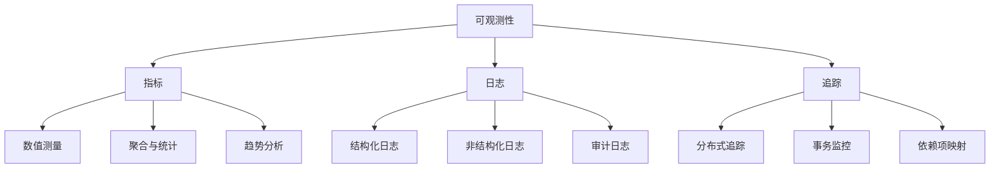
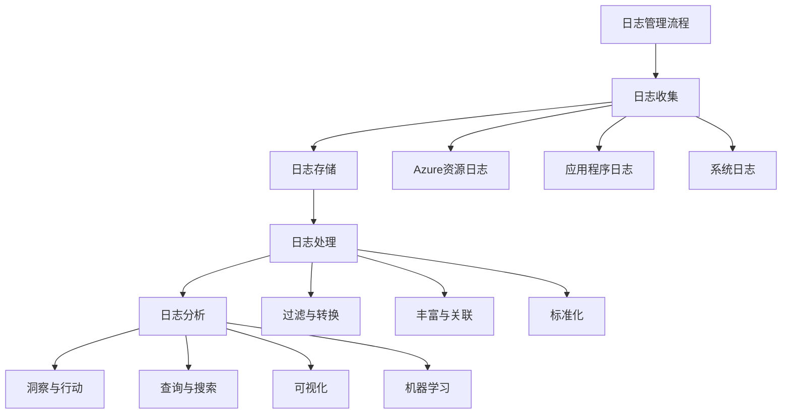
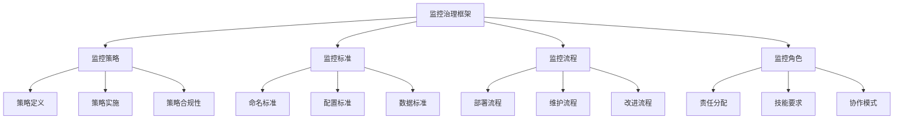

# Azure 监控与诊断最佳实践

> [!NOTE]
> 本文档提供了 Azure 监控与诊断的最佳实践指南，帮助您实施全面的可观测性策略，及时发现并解决问题。

## 目录

- [监控与诊断概述](#监控与诊断概述)
- [Azure Monitor 基础](#azure-monitor-基础)
- [基础设施监控](#基础设施监控)
- [应用程序监控](#应用程序监控)
- [日志管理与分析](#日志管理与分析)
- [警报与通知](#警报与通知)
- [仪表板与可视化](#仪表板与可视化)
- [自动化响应](#自动化响应)
- [监控安全性](#监控安全性)
- [成本监控](#成本监控)
- [监控策略与治理](#监控策略与治理)
- [常见监控场景](#常见监控场景)

## 监控与诊断概述

监控与诊断是确保 Azure 解决方案可靠性、性能和安全性的关键组成部分，提供对系统健康状况和行为的可见性。

### 可观测性的重要性

1. **问题早期发现**
   - 在用户受影响前检测问题
   - 减少平均检测时间 (MTTD)

2. **快速诊断与解决**
   - 识别根本原因
   - 减少平均修复时间 (MTTR)

3. **性能优化**
   - 识别瓶颈和优化机会
   - 提高系统效率

4. **容量规划**
   - 预测资源需求
   - 主动扩展资源

### 可观测性的三大支柱

1. **指标**
   - 数值测量和时间序列数据
   - 系统和应用程序性能指标
   - 用户体验和业务指标

2. **日志**
   - 详细的事件记录
   - 错误和异常信息
   - 审计和安全事件

3. **追踪**
   - 请求流程跟踪
   - 分布式系统中的事务监控
   - 服务依赖关系映射

## Azure Monitor 基础

Azure Monitor 是 Azure 的统一监控平台，提供全面的监控和诊断功能。

### Azure Monitor 架构

1. **数据收集**
   - Azure 资源指标和日志
   - 虚拟机和容器监控代理
   - 应用程序检测

2. **数据存储**
   - 指标存储：时间序列数据库
   - 日志存储：Log Analytics
   - 应用程序数据：Application Insights

3. **数据分析**
   - 指标资源管理器
   - Log Analytics 查询语言 (KQL)
   - 工作簿和仪表板

4. **响应**
   - 警报规则和操作组
   - 自动化工作流
   - 集成第三方工具

### 监控范围

1. **平台级监控**
   - Azure 服务健康状况
   - 资源健康状况
   - 活动日志

2. **资源级监控**
   - 资源特定指标
   - 资源日志
   - 诊断设置

3. **租户级监控**
   - 跨订阅监控
   - 管理组级别监控
   - 多租户视图

### 监控数据模型

1. **指标数据模型**
   - 时间戳值对
   - 维度和标签
   - 聚合和统计

2. **日志数据模型**
   - 结构化记录
   - 表和架构
   - 查询和分析

3. **应用程序数据模型**
   - 请求和依赖项
   - 异常和事件
   - 用户会话和页面视图

## 基础设施监控

### 虚拟机监控

1. **Azure VM 监控**
   - 安装 Azure Monitor 代理
   - 收集性能计数器和事件日志
   - 监控操作系统和应用程序指标

2. **VM 洞察**
   - 启用 VM 洞察
   - 监控 CPU、内存、磁盘和网络性能
   - 识别性能瓶颈和异常

3. **VM 可用性监控**
   - 配置可用性测试
   - 监控启动和关闭事件
   - 跟踪可用性集和可用性区域状态

### 容器监控

1. **AKS 监控**
   - 启用 Container Insights
   - 监控集群、节点和 Pod 健康状况
   - 跟踪容器资源使用情况

2. **容器日志收集**
   - 收集容器 stdout/stderr 日志
   - 监控容器事件和状态变化
   - 分析容器崩溃和重启

3. **Prometheus 集成**
   - 配置 Prometheus 指标收集
   - 使用 Grafana 仪表板
   - 设置基于 Prometheus 的警报

### 网络监控

1. **网络性能监控**
   - 监控网络延迟和丢包
   - 跟踪连接和吞吐量
   - 分析网络拓扑

2. **NSG 流日志**
   - 启用 NSG 流日志
   - 分析网络流量模式
   - 检测异常网络活动

3. **ExpressRoute 和 VPN 监控**
   - 监控连接健康状况和带宽使用
   - 跟踪路由更新和对等互连状态
   - 设置连接警报

### 存储监控

1. **存储账户监控**
   - 跟踪容量和事务指标
   - 监控延迟和可用性
   - 分析存储访问模式

2. **存储分析**
   - 启用存储分析日志
   - 监控请求和错误统计
   - 分析存储性能

3. **备份和恢复监控**
   - 监控备份作业状态
   - 跟踪恢复点创建
   - 验证备份合规性

## 应用程序监控

### Application Insights

1. **应用程序检测**
   - 安装 Application Insights SDK
   - 配置自动和手动检测
   - 调整采样和遥测处理

2. **请求监控**
   - 跟踪 HTTP 请求性能
   - 分析响应时间分布
   - 识别慢速请求和失败

3. **依赖项监控**
   - 跟踪外部服务调用
   - 监控数据库查询性能
   - 识别依赖项故障和瓶颈

### 异常监控

1. **异常跟踪**
   - 捕获和记录应用程序异常
   - 分析异常趋势和模式
   - 关联异常与请求和依赖项

2. **崩溃分析**
   - 监控应用程序崩溃和终止
   - 收集崩溃转储和堆栈跟踪
   - 分析崩溃根本原因

3. **异常警报**
   - 设置异常率警报
   - 配置新异常类型通知
   - 实施异常分类和优先级

### 用户体验监控

1. **页面性能监控**
   - 跟踪页面加载时间
   - 监控前端性能指标
   - 分析客户端脚本执行

2. **用户行为分析**
   - 跟踪用户会话和流程
   - 分析功能使用情况
   - 识别用户痛点和放弃点

3. **可用性测试**
   - 配置 URL ping 测试
   - 设置多步骤 Web 测试
   - 从多个位置监控可用性

### 分布式追踪

1. **端到端追踪**
   - 实施分布式追踪上下文传播
   - 关联跨服务请求
   - 可视化完整事务流程

2. **服务映射**
   - 自动发现应用程序组件
   - 可视化组件依赖关系
   - 识别关键路径和瓶颈

3. **性能分析**
   - 使用应用程序剖析工具
   - 识别热代码路径
   - 分析资源使用情况

## 日志管理与分析

### Log Analytics

1. **工作区设计**
   - 规划工作区结构和范围
   - 配置数据保留策略
   - 实施访问控制和权限

2. **数据收集配置**
   - 配置诊断设置
   - 自定义数据收集规则
   - 优化数据卷和成本

3. **查询和分析**
   - 使用 Kusto 查询语言 (KQL)
   - 创建常用查询库
   - 设计高效查询模式

### 日志集中化

1. **多源日志收集**
   - 收集 Azure 服务日志
   - 集成本地系统日志
   - 合并第三方云日志

2. **日志标准化**
   - 实施一致的日志格式
   - 标准化时间戳和标识符
   - 丰富日志上下文

3. **日志路由**
   - 配置日志流向不同目标
   - 实施日志筛选和转换
   - 优化日志存储成本

### 日志分析技术

1. **模式识别**
   - 识别日志中的模式和趋势
   - 检测异常和离群值
   - 关联不同来源的事件

2. **根本原因分析**
   - 使用日志时间线重建事件序列
   - 关联错误和系统状态变化
   - 识别触发事件和根本原因

3. **预测分析**
   - 使用历史日志预测问题
   - 识别潜在故障前兆
   - 实施主动维护和修复

## 警报与通知

### 警报设计

1. **警报类型**
   - 指标警报：基于数值阈值
   - 日志查询警报：基于日志模式
   - 活动日志警报：基于平台事件
   - 智能警报：基于异常检测

2. **警报阈值**
   - 设置适当的静态阈值
   - 使用动态阈值适应模式变化
   - 配置多级阈值和严重性

3. **警报范围**
   - 资源级警报
   - 资源组级警报
   - 订阅级警报
   - 跨资源关联警报

### 警报管理

1. **警报分类**
   - 按严重性分类
   - 按服务或组件分类
   - 按影响范围分类

2. **警报分组**
   - 配置智能警报分组
   - 减少警报风暴
   - 关联相关警报

3. **警报生命周期**
   - 警报确认和分配
   - 警报状态跟踪
   - 警报解决和关闭

### 通知渠道

1. **操作组配置**
   - 设置电子邮件和短信通知
   - 配置 Teams 或 Slack 集成
   - 使用 Webhook 集成第三方系统

2. **升级路径**
   - 配置基于时间的升级
   - 设置不同级别的通知接收者
   - 实施值班轮换集成

3. **通知优化**
   - 减少通知疲劳
   - 优化通知内容和格式
   - 实施通知批处理和摘要

## 仪表板与可视化

### Azure 仪表板

1. **仪表板设计**
   - 创建针对特定角色的仪表板
   - 组织相关指标和视图
   - 实施一致的布局和格式

2. **仪表板共享**
   - 共享团队仪表板
   - 配置仪表板权限
   - 发布组织级仪表板

3. **仪表板最佳实践**
   - 优先显示关键指标
   - 包含趋势和比较视图
   - 提供钻取和详细信息链接

### Azure 工作簿

1. **工作簿设计**
   - 创建交互式报告
   - 组合指标和日志数据
   - 使用参数和筛选器

2. **工作簿模板**
   - 创建可重用工作簿模板
   - 共享常用分析模式
   - 实施一致的报告格式

3. **工作簿场景**
   - 故障排除工作簿
   - 性能分析工作簿
   - 安全调查工作簿

### Power BI 集成

1. **Azure Monitor 连接器**
   - 连接 Log Analytics 数据
   - 导入 Application Insights 数据
   - 刷新设置和认证

2. **高级可视化**
   - 创建自定义仪表板
   - 使用高级图表和视觉对象
   - 实施交互式筛选和钻取

3. **报告分发**
   - 计划报告刷新
   - 配置报告订阅
   - 共享仪表板和报告

## 自动化响应

### 自动修复

1. **自动缩放**
   - 基于指标配置自动缩放规则
   - 设置适当的缩放阈值和冷却期
   - 监控自动缩放操作和效果

2. **自动重启**
   - 配置健康检查和自动重启
   - 设置 VM 修复操作
   - 实施服务自愈策略

3. **自动故障转移**
   - 配置负载均衡器健康探测
   - 设置 Traffic Manager 故障转移
   - 实施数据库自动故障转移

### 自动化工作流

1. **Azure Logic Apps**
   - 创建基于警报的工作流
   - 自动化常见响应操作
   - 集成多个系统和服务

2. **Azure Automation**
   - 开发响应 Runbook
   - 调度维护任务
   - 实施配置管理

3. **Azure Functions**
   - 创建事件驱动函数
   - 处理监控事件和警报
   - 实施自定义修复逻辑

### 事件响应集成

1. **ITSM 集成**
   - 与 ServiceNow 或 JIRA 集成
   - 自动创建事件和工单
   - 同步警报和事件状态

2. **ChatOps 集成**
   - 与 Teams 或 Slack 集成
   - 创建事件响应频道
   - 实施交互式命令和响应

3. **战情室支持**
   - 提供事件概览仪表板
   - 集中事件相关数据
   - 支持协作调查和响应

## 监控安全性

### 安全监控

1. **Azure Security Center**
   - 启用 Microsoft Defender for Cloud
   - 监控安全状况和合规性
   - 跟踪安全建议和修复

2. **安全日志监控**
   - 收集和分析安全日志
   - 监控身份验证和授权事件
   - 检测异常访问模式

3. **威胁检测**
   - 使用 Azure Sentinel 进行 SIEM
   - 实施安全分析规则
   - 检测已知威胁和异常行为

### 合规性监控

1. **法规合规性**
   - 监控 GDPR、HIPAA、PCI DSS 等合规性
   - 跟踪合规性控制状态
   - 生成合规性报告

2. **策略合规性**
   - 使用 Azure Policy 监控合规性
   - 跟踪资源配置偏差
   - 实施自动修复策略

3. **审计日志**
   - 收集和保留审计日志
   - 监控管理操作和更改
   - 支持法务调查和审计

### 监控数据保护

1. **监控数据访问控制**
   - 实施最小权限原则
   - 定期审查访问权限
   - 监控权限变更

2. **敏感数据处理**
   - 保护监控数据中的敏感信息
   - 实施数据屏蔽和匿名化
   - 控制监控数据访问

3. **监控数据生命周期**
   - 定义数据保留策略
   - 实施数据归档和删除
   - 确保合规数据处理

## 成本监控

### 监控成本

1. **Azure 成本分析**
   - 跟踪和分析 Azure 支出
   - 按资源、服务和标记分析成本
   - 识别成本趋势和异常

2. **预算监控**
   - 设置成本预算和阈值
   - 配置预算警报
   - 跟踪预算执行情况

3. **资源利用率监控**
   - 识别未充分利用的资源
   - 监控资源闲置时间
   - 跟踪自动缩放效率

### 监控成本优化

1. **Azure Advisor 建议**
   - 监控成本优化建议
   - 跟踪建议实施状态
   - 量化潜在节省

2. **预留实例监控**
   - 跟踪预留实例使用情况
   - 监控预留覆盖率
   - 识别预留优化机会

3. **成本异常检测**
   - 检测异常支出模式
   - 识别成本增长驱动因素
   - 提供成本异常警报

### 监控服务成本

1. **监控解决方案成本**
   - 优化数据收集和保留
   - 监控查询和 API 使用量
   - 控制警报和通知成本

2. **Log Analytics 成本**
   - 监控日志摄取量
   - 优化日志查询效率
   - 实施数据分层和归档

3. **Application Insights 成本**
   - 配置智能采样
   - 监控遥测量和配额
   - 优化检测配置

## 监控策略与治理

### 监控标准

1. **监控策略**
   - 定义组织监控标准
   - 指定必需的监控组件
   - 建立监控成熟度模型

2. **命名和标记标准**
   - 实施一致的资源命名
   - 定义标准标记策略
   - 确保监控资源可发现性

3. **监控模板**
   - 创建标准监控配置
   - 开发可重用的 ARM 模板
   - 实施监控即代码

### 监控治理

1. **监控角色和责任**
   - 定义监控团队职责
   - 建立监控所有权模型
   - 实施 RACI 矩阵

2. **监控变更管理**
   - 控制监控配置更改
   - 测试监控更新
   - 记录和审查监控变更

3. **监控合规性**
   - 审计监控覆盖率
   - 验证必需监控组件
   - 实施监控策略强制执行

### 监控知识管理

1. **监控文档**
   - 记录监控架构和配置
   - 维护警报和响应程序
   - 创建故障排除指南

2. **监控培训**
   - 提供监控工具培训
   - 开发分析技能
   - 共享最佳实践和经验教训

3. **持续改进**
   - 定期审查监控效果
   - 收集反馈和改进建议
   - 更新和优化监控策略

## 常见监控场景

### Web 应用监控

**场景**：监控企业 Web 应用程序

**Azure 实现**：
- 前端监控：Application Insights JavaScript SDK
- 后端监控：Application Insights SDK
- 基础设施监控：VM 洞察和 Container Insights
- 数据库监控：Azure SQL 洞察
- 可用性监控：多区域可用性测试

### 微服务监控

**场景**：监控微服务架构

**Azure 实现**：
- 服务监控：Application Insights
- 容器监控：Container Insights
- 服务网格监控：Istio 或 Linkerd 集成
- 分布式追踪：Application Insights 分布式追踪
- 依赖项映射：Application Map

### 混合云监控

**场景**：监控跨 Azure 和本地的混合环境

**Azure 实现**：
- Azure 资源：Azure Monitor
- 本地服务器：Azure Monitor 代理
- 网络连接：Network Performance Monitor
- 身份服务：Azure AD 监控
- 集中日志：Log Analytics 工作区

### IoT 解决方案监控

**场景**：监控 IoT 设备和后端服务

**Azure 实现**：
- IoT Hub 监控：IoT Hub 指标和日志
- 设备监控：IoT Central 或自定义遥测
- 流处理监控：Stream Analytics 指标
- 数据存储监控：Time Series Insights
- 端到端监控：自定义 Azure Monitor 工作簿

## 参考资源

- [Azure Monitor 文档](https://docs.microsoft.com/azure/azure-monitor/)
- [Application Insights 文档](https://docs.microsoft.com/azure/azure-monitor/app/app-insights-overview)
- [Log Analytics 查询语言参考](https://docs.microsoft.com/azure/data-explorer/kusto/query/)
- [Azure 监控最佳实践](https://docs.microsoft.com/azure/architecture/best-practices/monitoring)
- [Azure Well-Architected Framework - 操作卓越](https://docs.microsoft.com/azure/architecture/framework/devops/) 