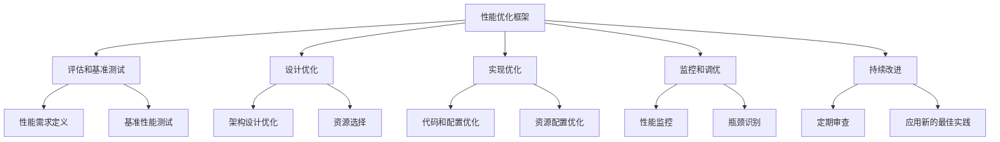
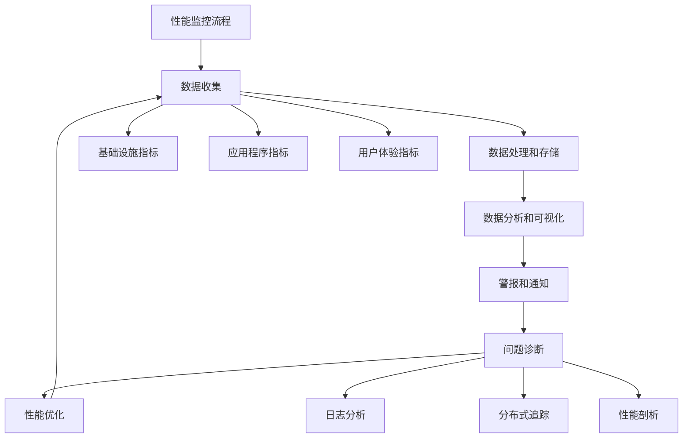

# Azure 性能优化最佳实践

> [!NOTE]
> 本文档提供了 Azure 性能优化的最佳实践指南，帮助您设计和实现高性能的云解决方案。

## 目录

- [性能优化概述](#性能优化概述)
- [性能评估方法](#性能评估方法)
- [计算性能优化](#计算性能优化)
- [存储性能优化](#存储性能优化)
- [数据库性能优化](#数据库性能优化)
- [网络性能优化](#网络性能优化)
- [应用程序性能优化](#应用程序性能优化)
- [缓存策略](#缓存策略)
- [内容分发优化](#内容分发优化)
- [性能监控与分析](#性能监控与分析)
- [常见性能问题与解决方案](#常见性能问题与解决方案)
- [性能测试最佳实践](#性能测试最佳实践)

## 性能优化概述

性能优化是云解决方案设计和实现的关键方面，直接影响用户体验、系统可扩展性和运营成本。

### 性能优化的重要性

1. **提升用户体验**
   - 减少延迟和响应时间
   - 提高系统响应能力

2. **提高资源利用率**
   - 最大化现有资源的价值
   - 降低运营成本

3. **增强系统可扩展性**
   - 支持更多并发用户
   - 处理更大的工作负载

4. **优化成本效益**
   - 减少资源浪费
   - 提高投资回报率

### 性能优化框架

## 性能评估方法

### 性能指标

1. **响应时间**
   - 请求响应的平均时间
   - 百分位数分布（P50、P90、P99）

2. **吞吐量**
   - 每秒请求数 (RPS)
   - 每秒事务数 (TPS)
   - 数据处理速率

3. **资源利用率**
   - CPU 使用率
   - 内存使用率
   - 磁盘 I/O
   - 网络带宽

4. **延迟**
   - 网络延迟
   - 数据库查询延迟
   - API 调用延迟

### 性能测试类型

1. **负载测试**
   - 测试系统在预期负载下的性能
   - 验证系统是否满足性能要求

2. **压力测试**
   - 测试系统在极限负载下的性能
   - 确定系统的最大容量

3. **耐久性测试**
   - 长时间运行测试
   - 检测内存泄漏和性能下降

4. **峰值测试**
   - 测试系统处理突发负载的能力
   - 验证自动扩展机制

### 性能基准测试工具

1. **Azure 工具**
   - Azure Load Testing
   - Azure Monitor 性能视图
   - Application Insights

2. **开源工具**
   - JMeter
   - Gatling
   - Locust

3. **专业工具**
   - Apache Benchmark (ab)
   - wrk
   - k6

## 计算性能优化

### 虚拟机性能优化

1. **选择合适的 VM 大小**
   - 根据工作负载特性选择 VM 系列
   - 计算密集型：F 系列、Fsv2 系列
   - 内存密集型：E 系列、M 系列
   - 存储密集型：Ls 系列
   - 通用型：D 系列、Dv3 系列

2. **磁盘性能优化**
   - 使用高级 SSD 或 Ultra 磁盘
   - 启用主机缓存
   - 使用临时磁盘存储临时数据

3. **网络性能优化**
   - 启用加速网络
   - 使用 VMSS 实现负载均衡
   - 合理设置 NSG 规则

4. **操作系统优化**
   - 优化内核参数
   - 调整文件系统设置
   - 更新驱动程序

### 容器性能优化

1. **AKS 集群优化**
   - 选择合适的节点大小
   - 使用节点池隔离工作负载
   - 启用集群自动缩放

2. **容器配置优化**
   - 设置资源请求和限制
   - 优化容器镜像大小
   - 使用 liveness 和 readiness 探针

3. **Pod 调度优化**
   - 使用节点亲和性和反亲和性
   - 设置 Pod 拓扑分布约束
   - 利用污点和容忍

### 无服务器性能优化

1. **Azure Functions 优化**
   - 选择合适的托管计划
   - 优化函数启动时间
   - 实施连接池和实例重用

2. **App Service 优化**
   - 选择合适的服务计划
   - 启用自动缩放
   - 使用部署槽进行零停机部署

## 存储性能优化

### Blob 存储性能优化

1. **存储账户配置**
   - 使用通用 v2 存储账户
   - 选择合适的性能层（标准或高级）
   - 启用分层命名空间（适用于数据湖）

2. **分区策略**
   - 设计高效的分区键
   - 避免热分区问题
   - 分散访问模式

3. **并行操作**
   - 使用并行上传/下载
   - 实施分块传输
   - 优化块大小

4. **访问层优化**
   - 使用热访问层存储频繁访问的数据
   - 使用冷访问层存储不常访问的数据
   - 实施生命周期管理策略

### 磁盘存储性能优化

1. **磁盘类型选择**
   - 标准 HDD：低成本、低性能工作负载
   - 标准 SSD：中等性能工作负载
   - 高级 SSD：高性能工作负载
   - Ultra 磁盘：极高性能工作负载

2. **磁盘缓存设置**
   - 操作系统磁盘：读/写缓存
   - 数据磁盘：根据工作负载特性选择
   - 数据库磁盘：仅读缓存

3. **磁盘条带化**
   - 使用存储空间或 LVM 创建条带卷
   - 跨多个磁盘分散 I/O
   - 提高总体吞吐量

4. **临时存储使用**
   - 使用 VM 临时磁盘存储临时数据
   - 利用 SSD 临时存储提高性能
   - 注意数据持久性限制

### 文件存储性能优化

1. **Azure Files 优化**
   - 选择合适的性能层（标准或高级）
   - 使用 SMB 3.0 协议
   - 优化并发连接数

2. **NetApp Files 优化**
   - 选择合适的服务级别
   - 使用自动分层功能
   - 优化卷大小和吞吐量

## 数据库性能优化

### Azure SQL 性能优化

1. **数据库配置**
   - 选择合适的服务层级和计算大小
   - 使用弹性池共享资源
   - 启用自动调优

2. **索引优化**
   - 创建适当的索引
   - 使用列存储索引处理分析查询
   - 定期维护索引

3. **查询优化**
   - 使用参数化查询
   - 优化查询执行计划
   - 使用查询存储监控性能

4. **数据分区**
   - 实施表分区
   - 使用分区视图
   - 归档历史数据

### Cosmos DB 性能优化

1. **吞吐量配置**
   - 选择合适的吞吐量模式（预配或自动缩放）
   - 在容器或数据库级别分配吞吐量
   - 监控和调整 RU 使用情况

2. **分区策略**
   - 选择高基数、均匀分布的分区键
   - 避免热分区
   - 使用合成分区键处理复杂场景

3. **查询优化**
   - 使用索引策略优化查询
   - 减少跨分区查询
   - 优化 RU 消耗

4. **多区域配置**
   - 在靠近用户的区域部署
   - 使用多区域写入减少延迟
   - 配置适当的一致性级别

### Redis Cache 性能优化

1. **缓存配置**
   - 选择合适的定价层
   - 配置适当的内存大小
   - 启用集群功能处理大数据集

2. **缓存策略**
   - 实施适当的缓存过期策略
   - 使用批处理操作减少网络往返
   - 实施缓存预热

3. **数据结构优化**
   - 选择高效的数据结构
   - 优化键名和值大小
   - 使用序列化优化内存使用

## 网络性能优化

### 虚拟网络优化

1. **网络拓扑设计**
   - 优化子网划分
   - 实施中心辐射型架构
   - 使用虚拟网络对等互连

2. **路由优化**
   - 优化 UDR（用户定义路由）
   - 减少路由跳数
   - 避免不必要的网关传输

3. **网络安全组优化**
   - 简化 NSG 规则
   - 使用应用程序安全组 (ASG)
   - 优化规则处理顺序

### 负载均衡优化

1. **Azure Load Balancer 优化**
   - 选择标准负载均衡器
   - 配置合适的健康探测
   - 优化会话持久性设置

2. **应用程序网关优化**
   - 选择合适的实例大小和数量
   - 启用自动缩放
   - 优化 SSL 终止和处理

3. **Front Door 优化**
   - 优化路由规则
   - 配置缓存策略
   - 使用 WAF 策略保护应用程序

### ExpressRoute 和 VPN 优化

1. **ExpressRoute 优化**
   - 选择合适的带宽
   - 实施 ExpressRoute FastPath
   - 配置 BGP 路由优化

2. **VPN 优化**
   - 使用高性能 VPN SKU
   - 启用主动-主动配置
   - 优化 IKE 参数

## 应用程序性能优化

### Web 应用性能优化

1. **前端优化**
   - 压缩静态资源
   - 实施资源打包和最小化
   - 优化图像和媒体文件

2. **API 优化**
   - 实施 API 分页
   - 使用 GraphQL 减少过度获取
   - 优化响应格式和大小

3. **异步处理**
   - 使用后台作业处理长时间运行的任务
   - 实施消息队列解耦组件
   - 使用 WebJobs 或 Functions 处理异步工作

### 微服务性能优化

1. **服务通信优化**
   - 使用 gRPC 提高性能
   - 实施断路器模式
   - 优化服务发现

2. **数据一致性优化**
   - 使用最终一致性模型
   - 实施 CQRS 模式分离读写操作
   - 使用事件溯源处理复杂数据更新

3. **服务部署优化**
   - 使用蓝绿部署减少停机时间
   - 实施金丝雀发布测试性能
   - 使用服务网格优化流量

### 无服务器应用性能优化

1. **函数优化**
   - 减少冷启动时间
   - 优化依赖项和包大小
   - 实施连接池和客户端重用

2. **触发器优化**
   - 选择合适的触发器类型
   - 使用批处理触发器
   - 优化触发器配置

3. **绑定优化**
   - 使用输入和输出绑定减少代码
   - 优化绑定配置
   - 使用 Durable Functions 处理复杂工作流

## 缓存策略

### 多级缓存策略

1. **浏览器缓存**
   - 设置适当的缓存标头
   - 使用 ETag 和条件请求
   - 实施服务工作线程缓存

2. **CDN 缓存**
   - 配置 CDN 缓存规则
   - 使用缓存清除 API
   - 实施缓存标记和版本控制

3. **应用程序缓存**
   - 使用 Redis 或内存缓存
   - 实施分布式缓存
   - 优化缓存键设计

4. **数据库缓存**
   - 使用查询缓存
   - 实施结果集缓存
   - 优化数据库内存配置

### 缓存模式

1. **缓存穿透**
   - 使用布隆过滤器
   - 缓存空结果（带短过期时间）
   - 实施请求合并

2. **缓存击穿**
   - 使用互斥锁或信号量
   - 实施热点数据预加载
   - 使用滑动过期时间

3. **缓存雪崩**
   - 设置随机过期时间
   - 实施缓存预热
   - 使用多级缓存降低影响

### 缓存一致性策略

1. **TTL 策略**
   - 基于数据变化频率设置 TTL
   - 使用不同级别的 TTL
   - 实施主动刷新

2. **写策略**
   - 写入时更新缓存
   - 写入时使缓存失效
   - 写入后异步更新缓存

3. **一致性级别**
   - 强一致性：同步更新或使缓存失效
   - 最终一致性：异步更新缓存
   - 弱一致性：定期刷新缓存

## 内容分发优化

### Azure CDN 优化

1. **CDN 配置**
   - 选择合适的 CDN 产品（Microsoft、Akamai、Verizon）
   - 配置缓存规则和过期时间
   - 启用压缩和优化功能

2. **源站优化**
   - 使用源站负载均衡
   - 优化源站响应时间
   - 实施源站故障转移

3. **缓存控制**
   - 使用查询字符串缓存
   - 配置缓存控制标头
   - 使用 URL 重写规则

### 静态内容优化

1. **静态网站托管**
   - 使用 Azure Storage 静态网站
   - 使用 Azure Static Web Apps
   - 配合 CDN 使用

2. **资源优化**
   - 压缩图像和视频
   - 使用现代图像格式（WebP、AVIF）
   - 实施响应式图像

3. **资源交付优化**
   - 使用域分片
   - 实施预加载和预连接
   - 优化关键渲染路径

### 动态内容优化

1. **边缘计算**
   - 使用 Azure Functions 边缘计算
   - 实施边缘缓存
   - 使用边缘重定向

2. **动态内容缓存**
   - 使用 Edge Side Includes (ESI)
   - 实施片段缓存
   - 使用动态缓存控制

3. **地理路由**
   - 使用 Traffic Manager 地理路由
   - 配置 Front Door 路由规则
   - 实施全球负载均衡

## 性能监控与分析

### 监控工具

1. **Azure Monitor**
   - 收集和分析遥测数据
   - 创建自定义仪表板
   - 设置性能警报

2. **Application Insights**
   - 监控应用程序性能
   - 跟踪依赖项调用
   - 分析用户行为

3. **Log Analytics**
   - 查询和分析日志数据
   - 创建自定义查询
   - 设置自动化响应

### 性能指标监控

1. **基础设施指标**
   - CPU 和内存使用率
   - 磁盘 I/O 和网络吞吐量
   - 资源利用率和饱和度

2. **应用程序指标**
   - 请求率和响应时间
   - 依赖项性能
   - 异常和错误率

3. **用户体验指标**
   - 页面加载时间
   - 首次内容绘制 (FCP)
   - 累积布局偏移 (CLS)

### 性能分析技术

1. **分布式追踪**
   - 跟踪请求流经系统的路径
   - 识别跨服务调用的延迟
   - 分析关键路径性能

2. **性能剖析**
   - 代码级性能分析
   - 识别热点方法和函数
   - 分析内存使用和分配

3. **瓶颈分析**
   - 识别系统瓶颈
   - 分析资源争用
   - 评估扩展限制

## 常见性能问题与解决方案

### 计算性能问题

1. **CPU 瓶颈**
   - **症状**：高 CPU 使用率，请求排队
   - **解决方案**：
     - 扩展计算资源
     - 优化计算密集型代码
     - 使用缓存减少计算

2. **内存压力**
   - **症状**：高内存使用率，频繁垃圾回收
   - **解决方案**：
     - 增加内存配置
     - 优化内存使用和对象生命周期
     - 检查内存泄漏

3. **冷启动延迟**
   - **症状**：首次请求响应时间长
   - **解决方案**：
     - 使用预热实例
     - 优化启动代码路径
     - 减少依赖项和初始化时间

### 存储性能问题

1. **I/O 瓶颈**
   - **症状**：高磁盘延迟，I/O 等待时间长
   - **解决方案**：
     - 升级到高性能存储
     - 使用缓存减少 I/O 操作
     - 优化数据访问模式

2. **存储限流**
   - **症状**：存储操作被限制，错误增加
   - **解决方案**：
     - 实施指数退避重试
     - 分散存储访问
     - 升级存储性能层级

3. **数据分区热点**
   - **症状**：特定分区的高负载
   - **解决方案**：
     - 重新设计分区键
     - 实施分区散列
     - 使用更均匀的访问模式

### 网络性能问题

1. **网络延迟**
   - **症状**：高网络往返时间
   - **解决方案**：
     - 使用加速网络
     - 优化区域放置
     - 减少网络往返次数

2. **带宽限制**
   - **症状**：网络吞吐量受限
   - **解决方案**：
     - 增加带宽配额
     - 优化数据传输
     - 使用压缩减少数据量

3. **DNS 解析延迟**
   - **症状**：连接建立时间长
   - **解决方案**：
     - 使用 DNS 缓存
     - 优化 TTL 设置
     - 使用 IP 地址而非主机名（适当情况下）

### 数据库性能问题

1. **慢查询**
   - **症状**：特定查询执行时间长
   - **解决方案**：
     - 优化查询和索引
     - 使用查询缓存
     - 重新设计数据模型

2. **连接池耗尽**
   - **症状**：连接错误，请求排队
   - **解决方案**：
     - 增加连接池大小
     - 优化连接使用和释放
     - 实施连接重用

3. **锁争用**
   - **症状**：高等待时间，阻塞
   - **解决方案**：
     - 优化事务范围和持续时间
     - 使用乐观并发控制
     - 重新设计高争用表

## 性能测试最佳实践

### 测试环境设置

1. **环境相似性**
   - 测试环境应尽可能接近生产环境
   - 使用相同的配置和设置
   - 包括网络拓扑和安全控制

2. **数据代表性**
   - 使用代表性数据集
   - 包括各种数据分布情况
   - 考虑数据增长和规模

3. **隔离测试环境**
   - 避免干扰生产系统
   - 隔离测试资源和网络
   - 控制外部依赖项

### 测试场景设计

1. **用户旅程测试**
   - 模拟真实用户行为
   - 包括完整的业务流程
   - 考虑不同用户角色

2. **峰值负载测试**
   - 模拟预期峰值负载
   - 测试自动扩展响应
   - 验证系统稳定性

3. **长时间运行测试**
   - 执行持续负载测试
   - 监控性能随时间变化
   - 检测内存泄漏和资源耗尽

### 测试结果分析

1. **基线比较**
   - 与既定基线比较结果
   - 跟踪性能趋势
   - 识别性能退化

2. **瓶颈识别**
   - 分析资源使用情况
   - 识别限制因素
   - 确定优化重点

3. **改进验证**
   - 测试优化措施的效果
   - 量化性能提升
   - 验证优化投资回报

## 参考资源

- [Azure 性能优化文档](https://docs.microsoft.com/azure/architecture/performance/)
- [Azure Well-Architected Framework - 性能效率](https://docs.microsoft.com/azure/architecture/framework/scalability/)
- [Azure 应用程序性能管理](https://docs.microsoft.com/azure/azure-monitor/app/app-insights-overview)
- [Azure 数据库性能优化](https://docs.microsoft.com/azure/sql-database/sql-database-performance-guidance)
- [Azure 存储性能优化](https://docs.microsoft.com/azure/storage/blobs/storage-performance-checklist) 