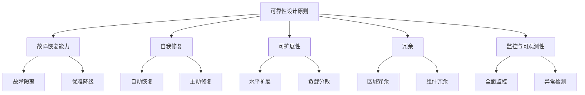
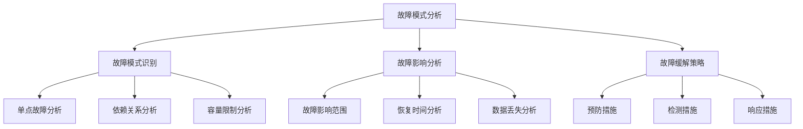
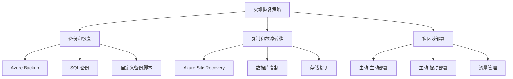
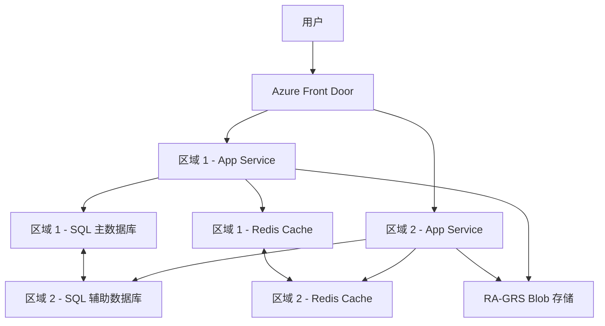

# Azure 可靠性最佳实践

> [!NOTE]
> 本文档提供了 Azure 可靠性设计的最佳实践指南，帮助您构建稳定、弹性和高可用的云解决方案。

## 目录

- [可靠性设计概述](#可靠性设计概述)
- [可靠性设计原则](#可靠性设计原则)
- [应用程序可靠性](#应用程序可靠性)
- [数据可靠性](#数据可靠性)
- [基础设施可靠性](#基础设施可靠性)
- [网络可靠性](#网络可靠性)
- [故障模式分析](#故障模式分析)
- [弹性测试](#弹性测试)
- [灾难恢复](#灾难恢复)
- [监控与警报](#监控与警报)
- [自动化与 DevOps](#自动化与-devops)
- [SLA 设计与管理](#sla-设计与管理)
- [常见可靠性场景](#常见可靠性场景)

## 可靠性设计概述

可靠性是指系统在正常和不利条件下正确执行其功能的能力。在 Azure 中，构建可靠系统需要综合考虑应用程序、数据和基础设施的弹性设计。

### 可靠性的重要性

1. **业务连续性**
   - 减少停机时间和业务中断
   - 保持服务可用性和一致性

2. **用户信任**
   - 提供稳定、可预测的用户体验
   - 建立服务可靠性的声誉

3. **合规性要求**
   - 满足行业标准和法规要求
   - 达到服务级别协议 (SLA) 承诺

4. **成本效益**
   - 减少意外停机带来的损失
   - 避免紧急修复的高成本

### 可靠性挑战

1. **复杂的分布式系统**
   - 多组件依赖关系
   - 分布式故障模式

2. **不可预测的负载**
   - 流量峰值和突发
   - 用户行为变化

3. **外部依赖**
   - 第三方服务和 API
   - 网络和基础设施限制

4. **安全威胁**
   - DDoS 攻击
   - 系统漏洞

## 可靠性设计原则

构建可靠的 Azure 解决方案需要遵循以下核心原则：

### 1. 设计故障恢复能力

- **故障隔离**
  - 使用隔离边界限制故障影响范围
  - 实施舱壁模式分隔系统组件

- **优雅降级**
  - 在部分组件失败时保持核心功能
  - 实施回退机制和服务降级策略

### 2. 自我修复

- **自动恢复**
  - 实施健康检查和自动重启
  - 使用自动扩展替换故障实例

- **主动修复**
  - 定期重新部署以消除潜在问题
  - 实施预测性维护

### 3. 可扩展性

- **水平扩展**
  - 设计无状态组件以便轻松扩展
  - 实施自动扩展响应负载变化

- **负载分散**
  - 均衡分布请求和处理
  - 避免单点高负载

### 4. 冗余

- **区域冗余**
  - 跨多个 Azure 区域部署
  - 实施区域故障转移机制

- **组件冗余**
  - 消除单点故障
  - 实施多实例部署

## 应用程序可靠性

### 弹性设计模式

1. **断路器模式**
   - 防止级联故障
   - 在依赖服务失败时快速失败
   - 实施半开状态和恢复机制

2. **重试模式**
   - 处理暂时性故障
   - 使用指数退避策略
   - 添加抖动避免同步重试

3. **舱壁模式**
   - 隔离资源和故障
   - 限制并发请求
   - 防止资源耗尽

4. **补偿事务模式**
   - 实施可靠的分布式事务
   - 提供回滚和补偿操作
   - 维护数据一致性

### 代码级可靠性

1. **异常处理**
   - 实施全面的异常处理策略
   - 区分可恢复和不可恢复错误
   - 避免异常吞没

2. **超时管理**
   - 设置合理的超时值
   - 避免无限等待
   - 实施请求取消机制

3. **异步编程**
   - 使用异步模式提高响应能力
   - 实施正确的任务取消
   - 避免线程阻塞

4. **资源管理**
   - 正确释放资源
   - 使用连接池和对象池
   - 避免资源泄漏

### 依赖服务处理

1. **外部服务集成**
   - 实施服务抽象层
   - 使用适配器模式简化切换
   - 准备替代服务或模拟

2. **API 管理**
   - 版本控制和兼容性管理
   - 流量控制和限流
   - 监控 API 健康状况

3. **服务发现**
   - 动态服务注册和发现
   - 健康检查和路由
   - 负载均衡和故障转移

## 数据可靠性

### 数据持久性

1. **存储冗余**
   - 选择适当的冗余级别：
     - LRS（本地冗余存储）
     - ZRS（区域冗余存储）
     - GRS（地理冗余存储）
     - RA-GRS（读取访问地理冗余存储）

2. **数据备份**
   - 实施定期备份策略
   - 验证备份完整性
   - 测试恢复流程

3. **数据保护**
   - 启用软删除和版本控制
   - 实施不可变存储策略
   - 使用访问控制保护数据

### 数据一致性

1. **事务管理**
   - 使用适当的事务隔离级别
   - 实施分布式事务协调
   - 处理长时间运行的事务

2. **最终一致性**
   - 设计适合最终一致性的工作流
   - 实施冲突检测和解决
   - 使用版本控制和时间戳

3. **数据同步**
   - 实施可靠的复制机制
   - 处理复制延迟和冲突
   - 监控数据同步状态

### 数据库可靠性

1. **Azure SQL 可靠性**
   - 使用主动-被动高可用性配置
   - 实施自动故障转移组
   - 使用读取缩放提高可用性

2. **Cosmos DB 可靠性**
   - 配置多区域写入
   - 选择适当的一致性级别
   - 使用自动故障转移

3. **缓存可靠性**
   - 实施 Redis 集群或地理复制
   - 使用缓存旁路模式
   - 处理缓存失效和重建

## 基础设施可靠性

### 虚拟机可靠性

1. **可用性设置**
   - 使用可用性集分散故障域和更新域
   - 使用可用性区域跨数据中心部署
   - 实施虚拟机规模集自动修复

2. **磁盘配置**
   - 使用托管磁盘提高可靠性
   - 实施磁盘冗余（RAID）
   - 使用高级存储提高性能和可靠性

3. **VM 备份和恢复**
   - 配置 Azure Backup
   - 实施应用程序一致性备份
   - 测试 VM 恢复流程

### 容器可靠性

1. **AKS 集群可靠性**
   - 使用多节点池分散工作负载
   - 跨可用性区域部署节点
   - 实施集群自动扩展

2. **Pod 可靠性**
   - 设置适当的资源请求和限制
   - 使用 Pod 中断预算
   - 实施健康检查和就绪探针

3. **容器镜像管理**
   - 使用可靠的容器注册表
   - 版本控制和镜像标记
   - 实施镜像扫描和验证

### 无服务器可靠性

1. **Azure Functions 可靠性**
   - 选择合适的托管计划
   - 实施函数幂等性
   - 使用持久化触发器和绑定

2. **Logic Apps 可靠性**
   - 设计可靠的工作流
   - 处理异常和重试
   - 实施长时间运行操作检查点

3. **Event Grid 可靠性**
   - 实施死信队列
   - 处理事件重复和顺序
   - 监控事件传递状态

## 网络可靠性

### 连接可靠性

1. **多路径连接**
   - 实施冗余网络路径
   - 使用多个 ExpressRoute 线路
   - 配置 VPN 备份连接

2. **负载均衡**
   - 使用 Azure Load Balancer 分散流量
   - 配置健康探测和自动故障转移
   - 实施会话持久性

3. **流量管理**
   - 使用 Traffic Manager 进行全球负载均衡
   - 实施优先级路由和故障转移
   - 配置健康检查和自动故障转移

### 网络安全可靠性

1. **DDoS 防护**
   - 启用 Azure DDoS Protection
   - 实施流量限制和过滤
   - 准备 DDoS 响应计划

2. **网络隔离**
   - 使用网络安全组控制流量
   - 实施子网隔离
   - 使用服务端点和专用链接

3. **网络监控**
   - 使用网络观察程序监控连接
   - 实施流日志分析
   - 监控网络性能指标

### 混合网络可靠性

1. **ExpressRoute 可靠性**
   - 使用 ExpressRoute 直接对等互连
   - 配置多条 ExpressRoute 线路
   - 实施 BGP 路由优化

2. **VPN 可靠性**
   - 使用主动-主动 VPN 网关
   - 实施 VPN 故障转移
   - 监控 VPN 连接健康状况

3. **DNS 可靠性**
   - 使用 Azure DNS 冗余
   - 实施 DNS 缓存和存活时间 (TTL) 优化
   - 监控 DNS 解析性能

## 故障模式分析

### 故障模式识别

1. **单点故障分析**
   - 识别系统中的单点故障
   - 评估故障影响和可能性
   - 实施冗余和故障转移

2. **依赖关系分析**
   - 映射组件依赖关系
   - 识别关键依赖项
   - 实施依赖项隔离

3. **容量限制分析**
   - 识别系统瓶颈
   - 评估资源限制
   - 实施自动扩展和负载分散

### 故障影响分析

1. **故障影响范围**
   - 评估故障传播路径
   - 确定受影响的用户和功能
   - 实施故障隔离边界

2. **恢复时间分析**
   - 估计故障检测时间
   - 评估恢复流程持续时间
   - 优化恢复步骤

3. **数据丢失分析**
   - 评估潜在数据丢失场景
   - 确定可接受的数据丢失量
   - 实施数据保护措施

### 故障缓解策略

1. **预防措施**
   - 实施主动监控和警报
   - 执行定期维护
   - 使用自动化减少人为错误

2. **检测措施**
   - 实施健康检查和探测
   - 使用异常检测
   - 监控关键指标和日志

3. **响应措施**
   - 准备事件响应计划
   - 实施自动修复
   - 建立升级流程

## 弹性测试

### 混沌工程

1. **受控实验**
   - 设计针对性故障注入
   - 在非高峰时段执行
   - 准备回滚计划

2. **故障注入**
   - 模拟组件故障
   - 测试网络中断
   - 注入延迟和错误

3. **观察与学习**
   - 记录系统响应
   - 识别弱点和改进机会
   - 更新弹性设计

### 负载测试

1. **容量测试**
   - 测试系统最大容量
   - 验证扩展限制
   - 识别瓶颈

2. **峰值测试**
   - 模拟流量突发
   - 测试自动扩展响应
   - 验证性能降级行为

3. **长时间运行测试**
   - 执行持续负载测试
   - 监控系统稳定性
   - 检测资源泄漏

### 灾难恢复演练

1. **故障转移测试**
   - 验证区域故障转移
   - 测试数据同步和一致性
   - 评估恢复时间

2. **备份恢复测试**
   - 验证备份完整性
   - 执行完整恢复流程
   - 测量恢复时间和数据丢失

3. **业务连续性测试**
   - 验证关键业务功能
   - 测试手动和自动恢复流程
   - 评估沟通和协调

## 灾难恢复

### 灾难恢复策略

1. **备份和恢复**
   - 实施全面的备份策略
   - 存储异地备份
   - 定期测试恢复流程

2. **复制和故障转移**
   - 实施数据和应用程序复制
   - 配置自动或手动故障转移
   - 测试故障转移和故障恢复

3. **多区域部署**
   - 在多个 Azure 区域部署
   - 实施主动-主动或主动-被动配置
   - 使用流量管理进行路由

### 恢复目标

1. **恢复点目标 (RPO)**
   - 定义可接受的数据丢失量
   - 根据 RPO 配置备份和复制频率
   - 监控实际 RPO 达成情况

2. **恢复时间目标 (RTO)**
   - 定义可接受的恢复时间
   - 设计满足 RTO 的恢复流程
   - 测试和优化恢复时间

3. **服务级别目标 (SLO)**
   - 定义灾难后的性能期望
   - 规划足够的灾难恢复资源
   - 验证灾难恢复环境性能

### Azure 灾难恢复服务

1. **Azure Site Recovery**
   - 用于 VM 和物理服务器复制
   - 配置恢复计划
   - 自动化故障转移和测试

2. **Azure Backup**
   - 备份 VM、数据库和文件
   - 配置长期保留
   - 实施安全备份

3. **Azure Storage 复制**
   - 使用 GRS 或 RA-GRS 进行存储复制
   - 配置存储故障转移
   - 监控复制状态

4. **数据库灾难恢复**
   - SQL 数据库主动地理复制
   - Cosmos DB 多区域复制
   - MySQL/PostgreSQL 读取副本

## 监控与警报

### 全面监控

1. **基础设施监控**
   - 监控 VM、存储和网络
   - 跟踪资源利用率
   - 监控服务健康状况

2. **应用程序监控**
   - 跟踪请求和依赖项
   - 监控性能指标
   - 分析异常和错误

3. **用户体验监控**
   - 跟踪页面加载时间
   - 监控用户交互
   - 分析用户行为

### 警报和通知

1. **警报配置**
   - 设置基于指标的警报
   - 配置日志查询警报
   - 实施智能检测警报

2. **警报严重性和分类**
   - 定义警报严重性级别
   - 分类警报类型
   - 设置优先级和升级路径

3. **通知渠道**
   - 配置电子邮件和短信通知
   - 集成 Teams 或 Slack
   - 使用 Azure 操作组

### 监控工具

1. **Azure Monitor**
   - 收集和分析遥测数据
   - 创建自定义仪表板
   - 配置警报和通知

2. **Application Insights**
   - 监控应用程序性能
   - 跟踪依赖项和异常
   - 分析用户行为

3. **Log Analytics**
   - 查询和分析日志数据
   - 创建自定义查询
   - 设置日志警报规则

## 自动化与 DevOps

### 基础设施即代码

1. **Azure Resource Manager 模板**
   - 使用 ARM 模板定义资源
   - 实施参数化和模块化
   - 版本控制模板

2. **Bicep 或 Terraform**
   - 使用声明式语法定义基础设施
   - 实施模块化和重用
   - 管理状态和依赖关系

3. **配置管理**
   - 使用 Azure Automation DSC
   - 实施配置版本控制
   - 监控配置偏差

### CI/CD 管道

1. **持续集成**
   - 自动化构建和测试
   - 实施代码质量检查
   - 验证安全和合规性

2. **持续部署**
   - 自动化部署流程
   - 实施蓝绿部署或金丝雀发布
   - 配置部署审批和验证

3. **管道可靠性**
   - 设计可靠的 CI/CD 管道
   - 处理管道故障和回滚
   - 监控部署健康状况

### 自动化运营

1. **自动修复**
   - 实施自动缩放和替换
   - 配置自动重启和恢复
   - 使用 Azure Automation Runbook

2. **自动化维护**
   - 调度维护窗口
   - 自动化补丁管理
   - 实施自动备份和清理

3. **事件响应自动化**
   - 配置自动响应规则
   - 使用 Logic Apps 自动化工作流
   - 实施升级和通知

## SLA 设计与管理

### SLA 规划

1. **服务级别目标定义**
   - 确定业务需求
   - 定义可用性和性能目标
   - 设置恢复目标

2. **复合 SLA 计算**
   - 计算依赖服务的复合 SLA
   - 识别 SLA 瓶颈
   - 实施提高 SLA 的策略

3. **成本与 SLA 平衡**
   - 评估 SLA 提升的成本
   - 确定投资优先级
   - 平衡成本和可靠性

### SLA 监控与报告

1. **可用性监控**
   - 跟踪服务正常运行时间
   - 计算实际 SLA 达成率
   - 分析可用性趋势

2. **SLA 报告**
   - 创建 SLA 仪表板
   - 生成定期 SLA 报告
   - 分析 SLA 违规原因

3. **持续改进**
   - 识别 SLA 改进机会
   - 实施提高可靠性的措施
   - 更新 SLA 目标和承诺

### Azure 服务 SLA

1. **了解 Azure SLA**
   - 熟悉 Azure 服务的 SLA 承诺
   - 了解 SLA 排除条款
   - 规划符合 SLA 的架构

2. **SLA 提升策略**
   - 使用可用性区域提高 SLA
   - 实施区域冗余提高 SLA
   - 使用高级服务层提高 SLA

3. **SLA 违规处理**
   - 了解 SLA 信用申请流程
   - 记录和报告服务中断
   - 与 Azure 支持合作解决问题

## 常见可靠性场景

### Web 应用可靠性

**场景**：构建高可用的 Web 应用程序

**Azure 实现**：
- 前端：跨区域的 App Service 计划
- 流量管理：Azure Front Door 或 Traffic Manager
- 数据库：使用地理复制的 Azure SQL
- 缓存：使用地理复制的 Redis Cache
- 存储：使用 RA-GRS 的 Blob 存储

### 微服务可靠性

**场景**：构建可靠的微服务架构

**Azure 实现**：
- 容器编排：跨可用性区域的 AKS
- 服务网格：Istio 或 Linkerd
- 数据存储：Cosmos DB 多区域写入
- 消息传递：Service Bus 地理冗余
- API 管理：多区域 API Management

### 数据处理可靠性

**场景**：构建可靠的数据处理管道

**Azure 实现**：
- 数据摄取：Event Hubs 捕获
- 数据处理：Databricks 或 Synapse
- 数据存储：Data Lake Storage 与 GRS
- 工作流协调：带检查点的 Data Factory
- 监控：Azure Monitor 和 Log Analytics

### IoT 解决方案可靠性

**场景**：构建可靠的 IoT 解决方案

**Azure 实现**：
- 设备连接：IoT Hub 手动故障转移
- 消息路由：Event Grid 冗余
- 数据处理：Stream Analytics 作业
- 数据存储：Time Series Insights 多区域
- 设备管理：IoT Central 高可用性

## 参考资源

- [Azure Well-Architected Framework - 可靠性支柱](https://docs.microsoft.com/azure/architecture/framework/resiliency/)
- [Azure 应用程序可靠性设计模式](https://docs.microsoft.com/azure/architecture/patterns/category/resiliency)
- [Azure 高可用性架构](https://docs.microsoft.com/azure/architecture/high-availability/)
- [Azure 灾难恢复架构](https://docs.microsoft.com/azure/architecture/solution-ideas/articles/disaster-recovery-enterprise-scale-dr)
- [Azure 服务 SLA](https://azure.microsoft.com/support/legal/sla/) 