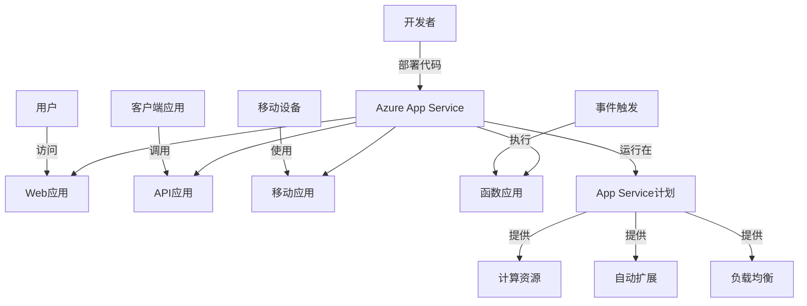

# Azure App Service

本文档详细介绍Azure App Service的概念、功能、配置选项以及最佳实践，帮助您在Azure云平台上有效地部署和管理Web应用程序。

## 目录

- [App Service概述](#app-service概述)
- [应用类型](#应用类型)
- [托管计划](#托管计划)
- [部署和CI/CD](#部署和cicd)
- [配置和设置](#配置和设置)
- [网络和安全](#网络和安全)
- [监控和诊断](#监控和诊断)
- [扩展和性能](#扩展和性能)
- [混合连接](#混合连接)
- [高级功能](#高级功能)
- [最佳实践](#最佳实践)
- [常见问题](#常见问题)

## App Service概述

Azure App Service是一个完全托管的平台即服务(PaaS)产品，用于构建、部署和扩展Web应用、移动后端、RESTful API和自动化业务流程。它支持多种编程语言和框架，同时处理基础设施管理，使开发人员能够专注于代码。

### 主要特点

- **多语言支持** - .NET、Java、Node.js、Python、PHP、Ruby等
- **内置CI/CD集成** - 与GitHub、Azure DevOps等集成
- **自动扩展** - 根据需求自动调整资源
- **高可用性** - 内置负载均衡和自动修复
- **安全性和合规性** - 符合ISO、SOC和PCI等标准
- **身份验证和授权** - 集成Azure AD和其他身份提供者
- **全球规模** - 在全球多个区域部署

### 工作原理

App Service提供了一个完全托管的环境，用于运行您的应用程序：



### 使用场景

Azure App Service适用于多种场景：

- **企业Web应用** - 部署和扩展企业级Web应用
- **API托管** - 创建和发布RESTful API
- **移动应用后端** - 构建移动应用的后端服务
- **业务流程自动化** - 使用Logic Apps自动化业务流程
- **DevOps集成** - 实现持续集成和部署
- **容器化应用** - 部署容器化的应用程序

## 应用类型

Azure App Service支持多种类型的应用程序，每种类型针对特定场景进行了优化。

### Web应用

用于托管网站和Web应用程序：

- 支持多种语言和框架
- 内置自动扩展和负载均衡
- 集成的部署和发布工作流
- SSL证书支持

```bash
# 创建Web应用
az webapp create \
  --resource-group myResourceGroup \
  --plan myAppServicePlan \
  --name myWebApp \
  --runtime "DOTNET|6.0"
```

### API应用

专为构建RESTful API而设计：

- 内置API定义支持
- CORS支持
- 身份验证和授权
- Swagger/OpenAPI集成

```bash
# 创建API应用
az webapp create \
  --resource-group myResourceGroup \
  --plan myAppServicePlan \
  --name myApiApp \
  --runtime "NODE|14-lts"
```

### 移动应用

为移动应用提供后端服务：

- 数据同步
- 身份验证
- 推送通知
- 离线数据同步

### 函数应用

用于事件驱动的无服务器计算：

- 按需执行代码
- 微服务架构
- 自动扩展
- 按使用付费

```bash
# 创建函数应用
az functionapp create \
  --resource-group myResourceGroup \
  --plan myAppServicePlan \
  --name myFunctionApp \
  --storage-account myStorageAccount \
  --runtime dotnet
```

### 静态Web应用

用于托管静态内容和单页应用(SPA)：

- 与GitHub/Azure DevOps集成
- 全球内容分发
- 预构建和预渲染
- 免费SSL证书

```bash
# 创建静态Web应用
az staticwebapp create \
  --resource-group myResourceGroup \
  --name myStaticWebApp \
  --source https://github.com/username/repo \
  --location "West US 2" \
  --branch main
```

## 托管计划

App Service计划定义了应用程序运行所需的计算资源。

### 计划类型

- **共享计算** - 多个客户共享同一VM上的资源
  - **免费** - 有限资源，用于测试和开发
  - **共享** - 更多资源，但仍与其他客户共享

- **专用计算** - 专用VM资源
  - **基本** - 开发和测试工作负载
  - **标准** - 生产工作负载
  - **高级** - 增强性能和规模
  - **隔离** - 专用物理环境

- **消费计划** - 仅用于函数应用，按执行付费

### 计划规模

每个计划提供不同级别的资源：

| 计划 | 实例 | 内存 | 存储 | 自动扩展 | 部署槽 |
|-----|-----|-----|-----|-------|-------|
| 免费 | 1个共享 | 1GB | 1GB | 否 | 否 |
| 共享 | 1个共享 | 1GB | 1GB | 否 | 否 |
| 基本 | 3个专用 | 最高3.5GB | 10GB | 是 | 否 |
| 标准 | 10个专用 | 最高7GB | 50GB | 是 | 5个 |
| 高级 | 20个专用 | 最高14GB | 250GB | 是 | 20个 |
| 隔离 | 100个专用 | 最高14GB | 1TB | 是 | 20个 |

### 创建和管理计划

使用Azure门户创建App Service计划：

1. 导航到"App Service计划"
2. 点击"添加"
3. 选择订阅和资源组
4. 提供计划名称
5. 选择操作系统（Windows或Linux）
6. 选择区域
7. 选择定价层
8. 点击"创建"

使用Azure CLI创建App Service计划：

```bash
# 创建App Service计划
az appservice plan create \
  --resource-group myResourceGroup \
  --name myAppServicePlan \
  --sku S1 \
  --is-linux
```

## 部署和CI/CD

App Service提供多种部署选项，从手动上传到完全自动化的CI/CD管道。

### 部署方法

- **Azure DevOps** - 使用Azure Pipelines进行CI/CD
- **GitHub Actions** - 直接从GitHub部署
- **Bitbucket** - 通过Bitbucket管道部署
- **FTP/FTPS** - 使用FTP上传文件
- **本地Git** - 推送到App Service Git存储库
- **ZIP部署** - 上传ZIP包
- **容器注册表** - 从Docker Hub或Azure容器注册表部署

### 部署槽位

使用部署槽位实现零停机部署：

- 为每个环境创建单独的槽位（如测试、预生产）
- 在非生产槽位中验证更改
- 交换槽位以将更改提升到生产环境
- 自动交换以实现自动部署

```bash
# 创建部署槽位
az webapp deployment slot create \
  --resource-group myResourceGroup \
  --name myWebApp \
  --slot staging
```

### 配置CI/CD

使用GitHub Actions设置CI/CD：

1. 在Azure门户中导航到Web应用
2. 选择"部署中心" > "GitHub"
3. 授权并选择存储库
4. 选择分支和工作流
5. 查看并完成设置

GitHub Actions工作流示例：

```yaml
name: Build and deploy

on:
  push:
    branches: [ main ]

jobs:
  build-and-deploy:
    runs-on: ubuntu-latest
    
    steps:
    - uses: actions/checkout@v2
    
    - name: Set up .NET Core
      uses: actions/setup-dotnet@v1
      with:
        dotnet-version: '6.0.x'
    
    - name: Build with dotnet
      run: dotnet build --configuration Release
    
    - name: dotnet publish
      run: dotnet publish -c Release -o ${{env.DOTNET_ROOT}}/myapp
    
    - name: Deploy to Azure Web App
      uses: azure/webapps-deploy@v2
      with:
        app-name: 'myWebApp'
        slot-name: 'production'
        publish-profile: ${{ secrets.AZURE_WEBAPP_PUBLISH_PROFILE }}
        package: ${{env.DOTNET_ROOT}}/myapp
```

## 配置和设置

App Service提供了多种配置选项来自定义应用程序的行为。

### 应用设置

应用设置作为环境变量提供给应用程序：

```bash
# 添加应用设置
az webapp config appsettings set \
  --resource-group myResourceGroup \
  --name myWebApp \
  --settings WEBSITE_TIME_ZONE="China Standard Time" DB_CONNECTION="value"
```

### 连接字符串

安全存储数据库连接字符串：

```bash
# 添加连接字符串
az webapp config connection-string set \
  --resource-group myResourceGroup \
  --name myWebApp \
  --connection-string-type SQLAzure \
  --settings MyDbConnection="Server=server;Database=db;User=user;Password=pwd;"
```

### 常规设置

配置应用程序的基本行为：

- **堆栈设置** - 选择运行时版本
- **平台设置** - 32位/64位、WebSocket支持
- **调试设置** - 远程调试和日志记录
- **传入客户端证书** - 客户端证书验证

### 路径映射

配置应用程序的内容目录：

- **Windows** - 虚拟应用程序和目录
- **Linux** - 容器启动文件和命令

## 网络和安全

保护App Service应用程序的安全至关重要。

### 访问限制

限制对Web应用的访问：

```bash
# 添加访问限制规则
az webapp config access-restriction add \
  --resource-group myResourceGroup \
  --name myWebApp \
  --rule-name 'Allow corporate network' \
  --action Allow \
  --ip-address 203.0.113.0/24 \
  --priority 100
```

### 身份验证和授权

集成身份验证提供者：

- Azure Active Directory
- Microsoft账户
- Facebook
- Google
- Twitter
- OpenID Connect提供者

```bash
# 启用Azure AD身份验证
az webapp auth update \
  --resource-group myResourceGroup \
  --name myWebApp \
  --enabled true \
  --action LoginWithAzureActiveDirectory \
  --aad-allowed-token-audiences "https://mywebapp.azurewebsites.net/.auth/login/aad/callback"
```

### SSL/TLS

保护应用程序通信：

- 管理SSL证书
- 配置TLS版本
- 强制HTTPS
- 客户端证书

```bash
# 添加自定义域
az webapp config hostname add \
  --resource-group myResourceGroup \
  --webapp-name myWebApp \
  --hostname www.contoso.com

# 添加SSL绑定
az webapp config ssl bind \
  --resource-group myResourceGroup \
  --name myWebApp \
  --certificate-thumbprint THUMBPRINT \
  --ssl-type SNI
```

### 虚拟网络集成

将应用连接到Azure虚拟网络：

- 访问虚拟网络中的资源
- 隔离入站和出站流量
- 区域虚拟网络集成
- 服务终结点

```bash
# 配置VNet集成
az webapp vnet-integration add \
  --resource-group myResourceGroup \
  --name myWebApp \
  --vnet myVNet \
  --subnet mySubnet
```

### 私有终结点

通过私有链接实现私有访问：

- 从虚拟网络私密访问应用
- 无需公共IP地址
- 绕过所有公共网络流量

## 监控和诊断

App Service提供多种工具来监控和诊断应用程序问题。

### 应用洞察

使用Application Insights全面监控应用：

- 性能监控
- 用户行为分析
- 异常跟踪
- 依赖项监控

```bash
# 启用应用洞察
az webapp config appsettings set \
  --resource-group myResourceGroup \
  --name myWebApp \
  --settings APPINSIGHTS_INSTRUMENTATIONKEY=key-value
```

### 日志和诊断

配置各种日志记录选项：

- **应用日志** - 记录应用程序生成的输出
- **Web服务器日志** - HTTP请求活动
- **详细错误消息** - 详细的错误信息
- **失败请求跟踪** - 有关失败请求的详细信息
- **部署日志** - 应用程序部署活动

```bash
# 启用应用日志
az webapp log config \
  --resource-group myResourceGroup \
  --name myWebApp \
  --application-logging filesystem \
  --level information
```

### 健康检查

配置健康检查端点：

- 定期检查应用程序健康状况
- 自动从负载均衡器中移除不健康的实例
- 自定义健康检查路径

```bash
# 配置健康检查
az webapp config set \
  --resource-group myResourceGroup \
  --name myWebApp \
  --generic-configurations '{"healthCheckPath": "/api/health"}'
```

### 问题诊断工具

使用内置工具诊断问题：

- **Kudu控制台** - 高级管理和调试
- **诊断工具** - 分析CPU、内存和HTTP错误
- **高级应用程序重启** - 无需重启Web应用的进程回收

## 扩展和性能

App Service提供多种选项来扩展应用程序并优化性能。

### 扩展选项

- **垂直扩展（向上扩展）** - 增加单个实例的资源
- **水平扩展（向外扩展）** - 增加实例数量

```bash
# 垂直扩展（更改定价层）
az appservice plan update \
  --resource-group myResourceGroup \
  --name myAppServicePlan \
  --sku P1

# 水平扩展（增加实例数量）
az appservice plan update \
  --resource-group myResourceGroup \
  --name myAppServicePlan \
  --number-of-workers 5
```

### 自动扩展

基于规则自动调整实例数量：

- **基于指标** - CPU、内存、HTTP队列等
- **基于计划** - 按预定义的时间表扩展
- **自定义指标** - 基于自定义指标扩展

```bash
# 配置基于CPU的自动扩展规则
az monitor autoscale create \
  --resource-group myResourceGroup \
  --resource myAppServicePlan \
  --resource-type "Microsoft.Web/serverfarms" \
  --name autoscaleConfig \
  --min-count 2 \
  --max-count 10 \
  --count 2

# 添加扩展规则
az monitor autoscale rule create \
  --resource-group myResourceGroup \
  --autoscale-name autoscaleConfig \
  --condition "Percentage CPU > 70 avg 10m" \
  --scale out 2
```

### 性能优化

提高应用程序性能的技巧：

- 启用内容分发网络(CDN)
- 配置缓存控制头
- 启用压缩
- 使用连接池
- 减少HTTP请求
- 优化数据库查询

### 地理分布

使用Traffic Manager或Front Door实现全球分布：

- 跨区域部署应用程序
- 自动路由到最近的实例
- 故障转移和负载均衡

## 混合连接

App Service提供多种方式将云应用程序连接到本地资源。

### 混合连接

通过Azure中继连接到本地系统：

- 无需防火墙更改
- 支持TCP和HTTP
- 无需VPN

```bash
# 添加混合连接
az webapp hybrid-connection add \
  --resource-group myResourceGroup \
  --name myWebApp \
  --namespace myRelayNamespace \
  --hybrid-connection myHybridConnection
```

### VNet集成

通过虚拟网络连接到本地网络：

- 使用点到站点VPN
- 使用站点到站点VPN
- 使用ExpressRoute

### 应用服务环境(ASE)

在虚拟网络中部署App Service：

- 完全隔离的专用环境
- 高级网络控制
- 高级扩展能力
- 专用计算实例

## 高级功能

App Service提供多种高级功能，满足复杂应用程序的需求。

### 容器支持

部署容器化应用程序：

- 支持Docker容器
- 多容器应用（Docker Compose）
- 从私有注册表部署
- 持续部署容器

```bash
# 创建容器Web应用
az webapp create \
  --resource-group myResourceGroup \
  --plan myAppServicePlan \
  --name myWebApp \
  --deployment-container-image-name nginx
```

### WebJobs

在App Service中运行后台任务：

- 持续运行或触发式作业
- 支持多种编程语言
- 与Azure存储集成
- 自动扩展

### API管理集成

将App Service与API管理集成：

- API文档
- 请求限制
- API版本控制
- 开发者门户

### 自定义域和证书

管理自定义域和SSL证书：

- 多域支持
- 通配符域
- 管理证书
- 自动SSL证书（App Service托管证书）

## 最佳实践

以下是使用Azure App Service的最佳实践建议。

### 安全最佳实践

- 启用HTTPS并强制重定向
- 使用最新的TLS版本
- 实施身份验证和授权
- 使用托管身份访问资源
- 定期更新应用程序依赖项
- 使用访问限制控制入站流量

### 性能最佳实践

- 选择适当的App Service计划
- 实施缓存策略
- 优化静态内容交付
- 使用CDN加速内容分发
- 配置自动扩展规则
- 监控和优化数据库查询

### 可靠性最佳实践

- 使用部署槽位进行零停机部署
- 实施健康检查和自我修复
- 配置备份和恢复策略
- 实施跨区域冗余
- 监控应用程序健康状况
- 使用应用洞察进行主动监控

### 开发最佳实践

- 使用CI/CD实现自动化部署
- 在本地模拟生产环境
- 使用应用设置存储配置
- 实施适当的日志记录
- 使用Key Vault存储敏感信息
- 遵循DevOps最佳实践

## 常见问题

### 如何解决常见的部署问题？

1. 检查部署日志了解错误详情
2. 验证应用设置和连接字符串
3. 确保应用服务计划支持所需功能
4. 检查源代码中的依赖项和兼容性问题
5. 使用Kudu控制台进行高级调试

### 如何提高应用程序性能？

- 升级到更高级别的App Service计划
- 启用并配置自动扩展
- 优化数据库查询和连接
- 使用Azure CDN缓存静态内容
- 实施应用程序级缓存
- 减少HTTP请求和响应大小

### 如何处理SSL证书更新？

1. 对于App Service托管证书，系统会自动更新
2. 对于导入的证书，在过期前上传新证书
3. 更新SSL绑定以使用新证书
4. 测试HTTPS连接确保证书正常工作
5. 删除旧证书

### 如何管理多个环境（开发、测试、生产）？

- 为每个环境使用单独的App Service实例
- 使用部署槽位进行环境隔离
- 使用应用设置区分环境配置
- 实施CI/CD管道自动化部署流程
- 使用Azure DevOps或GitHub Actions管理发布

### 如何优化App Service的成本？

- 在非高峰时段缩减实例数量
- 使用自动扩展根据需求调整资源
- 选择适合工作负载的定价层
- 考虑预留实例折扣
- 删除未使用的部署槽位
- 监控资源使用情况并优化 