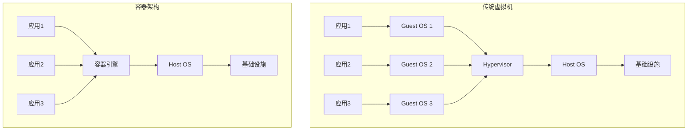
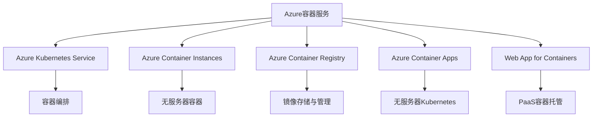
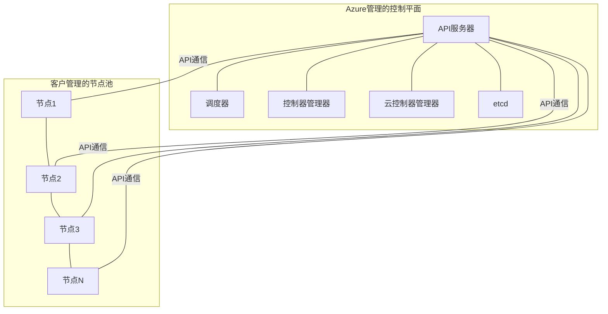

# Azure容器服务

本文档详细介绍Azure容器服务的概念、特性、部署方法以及最佳实践，重点关注Azure Kubernetes Service (AKS)和Azure Container Instances (ACI)，帮助您在Azure云平台上有效地使用容器技术。

## 目录

- [容器技术概述](#容器技术概述)
- [Azure容器服务简介](#azure容器服务简介)
- [Azure Kubernetes Service (AKS)](#azure-kubernetes-service-aks)
- [Azure Container Instances (ACI)](#azure-container-instances-aci)
- [容器注册表 (ACR)](#容器注册表-acr)
- [AKS与ACI集成](#aks与aci集成)
- [网络与安全](#网络与安全)
- [监控与日志](#监控与日志)
- [CI/CD与DevOps](#cicd与devops)
- [扩展与高可用性](#扩展与高可用性)
- [成本管理](#成本管理)
- [最佳实践](#最佳实践)
- [常见问题](#常见问题)

## 容器技术概述

容器是一种轻量级、可移植、自包含的软件包，包含运行应用程序所需的所有依赖项，使应用程序能够在任何环境中一致地运行。

### 容器vs虚拟机

容器与传统虚拟机的主要区别：



### 容器的优势

- **轻量级** - 容器共享操作系统内核，启动更快，使用更少的内存
- **一致性** - 开发、测试和生产环境保持一致
- **可移植性** - 可在任何支持容器的环境中运行
- **隔离性** - 应用程序及其依赖项相互隔离
- **可扩展性** - 可以快速扩展和缩减
- **效率** - 更高的资源利用率
- **版本控制** - 容器镜像可以被版本化和回滚

### 容器生态系统

- **Docker** - 最流行的容器平台
- **Kubernetes** - 开源容器编排平台
- **容器注册表** - 存储和分发容器镜像
- **CI/CD工具** - 自动构建和部署容器
- **监控工具** - 监控容器健康和性能

## Azure容器服务简介

Azure提供多种容器服务，满足不同的需求和使用场景。

### Azure容器服务概览



### 选择合适的容器服务

| 服务 | 最适用场景 | 管理复杂度 | 可扩展性 | 成本效益 |
|------|------------|------------|----------|----------|
| AKS | 复杂微服务、生产工作负载 | 高 | 极高 | 中等 |
| ACI | 简单应用、批处理、临时任务 | 低 | 中等 | 按秒计费 |
| Container Apps | 微服务、事件驱动应用 | 中等 | 高 | 按消耗计费 |
| Web App for Containers | Web应用和API | 低 | 高 | 中等 |

## Azure Kubernetes Service (AKS)

Azure Kubernetes Service是Azure提供的托管Kubernetes服务，简化了Kubernetes集群的部署、管理和操作。

### AKS架构

AKS集群由两个主要部分组成：

- **控制平面** - 由Azure管理的Kubernetes主组件
- **节点池** - 运行应用程序的虚拟机



### 创建AKS集群

使用Azure门户创建AKS集群：

1. 登录Azure门户
2. 创建新资源 > Kubernetes服务
3. 配置基本设置（订阅、资源组、集群名称）
4. 配置节点池（VM大小、节点数量）
5. 配置身份验证和网络
6. 配置集成和监控
7. 查看并创建

使用Azure CLI创建AKS集群：

```bash
# 创建资源组
az group create --name myResourceGroup --location eastasia

# 创建AKS集群
az aks create \
  --resource-group myResourceGroup \
  --name myAKSCluster \
  --node-count 3 \
  --enable-addons monitoring \
  --generate-ssh-keys

# 获取凭据
az aks get-credentials --resource-group myResourceGroup --name myAKSCluster
```

### 节点池管理

AKS支持多个节点池，可以根据不同工作负载的需求进行配置：

```bash
# 添加新节点池
az aks nodepool add \
  --resource-group myResourceGroup \
  --cluster-name myAKSCluster \
  --name gpunodepool \
  --node-count 3 \
  --node-vm-size Standard_NC6 \
  --labels workloadtype=gpu

# 扩展节点池
az aks nodepool scale \
  --resource-group myResourceGroup \
  --cluster-name myAKSCluster \
  --name gpunodepool \
  --node-count 5
```

### 部署应用程序

使用kubectl部署应用程序到AKS集群：

```yaml
# nginx-deployment.yaml
apiVersion: apps/v1
kind: Deployment
metadata:
  name: nginx
spec:
  replicas: 3
  selector:
    matchLabels:
      app: nginx
  template:
    metadata:
      labels:
        app: nginx
    spec:
      containers:
      - name: nginx
        image: nginx:1.19
        ports:
        - containerPort: 80
---
apiVersion: v1
kind: Service
metadata:
  name: nginx
spec:
  type: LoadBalancer
  ports:
  - port: 80
  selector:
    app: nginx
```

```bash
# 部署应用程序
kubectl apply -f nginx-deployment.yaml

# 查看部署状态
kubectl get deployments

# 查看服务和外部IP
kubectl get services
```

### AKS升级和维护

AKS支持集群的自动升级和手动升级：

```bash
# 检查可用的Kubernetes版本
az aks get-upgrades --resource-group myResourceGroup --name myAKSCluster

# 升级集群
az aks upgrade \
  --resource-group myResourceGroup \
  --name myAKSCluster \
  --kubernetes-version 1.24.6
```

### AKS高级功能

- **虚拟节点** - 使用ACI实现快速扩展
- **自动扩缩器** - 基于资源使用自动调整节点数量
- **Pod身份** - 使用托管身份访问Azure资源
- **应用程序网关集成** - 高级入口控制
- **Azure Policy集成** - 强制执行集群合规性
- **私有集群** - 限制API服务器访问

## Azure Container Instances (ACI)

Azure Container Instances提供了最快、最简单的方式在Azure中运行容器，无需管理虚拟机或采用更高级的服务。

### ACI特点

- **按秒计费** - 仅为容器运行时间付费
- **快速启动** - 秒级容器启动
- **无服务器** - 无需管理基础设施
- **超快扩展** - 快速部署多个容器实例
- **隔离保证** - 容器组提供资源隔离
- **公共IP和DNS** - 直接暴露容器服务
- **持久存储** - 支持Azure文件存储挂载

### 创建容器实例

使用Azure门户创建容器实例：

1. 创建新资源 > 容器实例
2. 配置基本设置（订阅、资源组、容器名称）
3. 指定容器镜像和资源需求
4. 配置网络和存储
5. 查看并创建

使用Azure CLI创建容器实例：

```bash
# 创建容器实例
az container create \
  --resource-group myResourceGroup \
  --name mycontainer \
  --image mcr.microsoft.com/azuredocs/aci-helloworld \
  --ports 80 \
  --dns-name-label aci-demo \
  --location eastasia

# 查看容器状态
az container show \
  --resource-group myResourceGroup \
  --name mycontainer \
  --query "{FQDN:ipAddress.fqdn,ProvisioningState:provisioningState}" \
  --output table
```

### 容器组

容器组是在同一主机上调度的一组容器，共享生命周期、资源、本地网络和存储卷：

```bash
# 使用YAML创建容器组
az container create \
  --resource-group myResourceGroup \
  --file container-group.yaml
```

```yaml
# container-group.yaml
apiVersion: '2021-10-01'
name: myContainerGroup
location: eastasia
properties:
  containers:
  - name: nginx
    properties:
      image: nginx:latest
      resources:
        requests:
          cpu: 1
          memoryInGB: 1.5
      ports:
      - port: 80
  - name: sidecar
    properties:
      image: mcr.microsoft.com/azuredocs/aci-tutorial-sidecar
      resources:
        requests:
          cpu: 0.5
          memoryInGB: 0.5
  osType: Linux
  ipAddress:
    type: Public
    ports:
    - protocol: tcp
      port: 80
```

### 卷挂载

ACI支持多种卷类型：

```bash
# 创建带Azure文件共享的容器
az container create \
  --resource-group myResourceGroup \
  --name mycontainer \
  --image mcr.microsoft.com/azuredocs/aci-hellofiles \
  --dns-name-label aci-demo \
  --ports 80 \
  --azure-file-volume-account-name mystorageaccount \
  --azure-file-volume-account-key $STORAGE_KEY \
  --azure-file-volume-share-name myfileshare \
  --azure-file-volume-mount-path /aci/logs/
```

### 容器实例重启策略

ACI支持三种重启策略：

- **Always** - 容器始终重启，适合长时间运行的服务
- **OnFailure** - 仅在失败时重启，适合批处理任务
- **Never** - 从不重启，适合一次性任务

```bash
# 设置重启策略
az container create \
  --resource-group myResourceGroup \
  --name mycontainer \
  --image myimage \
  --restart-policy OnFailure
```

## 容器注册表 (ACR)

Azure Container Registry是Azure提供的私有Docker注册表服务，用于存储和管理容器镜像。

### ACR特点

- **地理复制** - 全球分发容器镜像
- **集成身份验证** - 与Azure AD集成
- **镜像加密** - 增强安全性
- **Webhook支持** - 触发CI/CD流程
- **任务自动化** - 自动构建和修补镜像
- **内容信任** - 确保镜像完整性
- **Helm支持** - 存储Helm图表

### 创建容器注册表

```bash
# 创建容器注册表
az acr create \
  --resource-group myResourceGroup \
  --name myregistry \
  --sku Standard

# 登录到注册表
az acr login --name myregistry
```

### 构建和推送镜像

```bash
# 构建镜像
az acr build --registry myregistry --image myapp:v1 .

# 推送现有镜像
docker tag myapp:v1 myregistry.azurecr.io/myapp:v1
docker push myregistry.azurecr.io/myapp:v1
```

### ACR任务

使用ACR任务自动构建和更新容器镜像：

```bash
# 创建快速任务
az acr task create \
  --registry myregistry \
  --name buildwebapp \
  --image webimage \
  --context https://github.com/myuser/myrepo \
  --file Dockerfile \
  --git-access-token $GIT_TOKEN

# 手动触发任务
az acr task run --registry myregistry --name buildwebapp
```

### 与AKS集成

将ACR与AKS集成，允许AKS拉取私有镜像：

```bash
# 将ACR附加到AKS
az aks update \
  --resource-group myResourceGroup \
  --name myAKSCluster \
  --attach-acr myregistry
```

## AKS与ACI集成

Azure提供了AKS和ACI的集成，结合了两者的优势。

### 虚拟节点

虚拟节点允许AKS使用ACI快速扩展，无需添加物理节点：

```bash
# 启用虚拟节点
az aks enable-addons \
  --resource-group myResourceGroup \
  --name myAKSCluster \
  --addons virtual-node \
  --subnet-name mySubnet
```

在Kubernetes中使用虚拟节点：

```yaml
# aci-pod.yaml
apiVersion: v1
kind: Pod
metadata:
  name: nginx-virtual-node
spec:
  containers:
  - name: nginx
    image: nginx
  nodeSelector:
    kubernetes.io/role: virtual-kubelet
  tolerations:
  - key: virtual-kubelet.io/provider
    operator: Equal
    value: azure
    effect: NoSchedule
```

### AKS的Bursting到ACI

当AKS集群资源不足时，可以将工作负载"爆发"到ACI：

1. 配置Kubernetes集群自动扩缩器
2. 设置虚拟节点作为扩展目标
3. 为工作负载添加适当的节点选择器和容忍度

## 网络与安全

容器服务的网络配置和安全性至关重要。

### AKS网络模型

AKS支持两种网络模型：

- **Kubenet** - 简单的网络模型，适合小型部署
- **Azure CNI** - 高级网络模型，提供更好的集成和性能

```bash
# 使用Azure CNI创建集群
az aks create \
  --resource-group myResourceGroup \
  --name myAKSCluster \
  --network-plugin azure \
  --vnet-subnet-id $SUBNET_ID
```

### 网络策略

使用网络策略控制Pod之间的流量：

```bash
# 启用网络策略
az aks create \
  --resource-group myResourceGroup \
  --name myAKSCluster \
  --network-policy calico
```

```yaml
# deny-all-policy.yaml
apiVersion: networking.k8s.io/v1
kind: NetworkPolicy
metadata:
  name: deny-all
spec:
  podSelector: {}
  policyTypes:
  - Ingress
```

### 私有AKS集群

创建私有AKS集群，限制API服务器访问：

```bash
# 创建私有集群
az aks create \
  --resource-group myResourceGroup \
  --name myAKSCluster \
  --enable-private-cluster \
  --private-dns-zone system
```

### 容器安全最佳实践

- 使用最小特权原则
- 实施镜像扫描和漏洞管理
- 使用网络策略隔离工作负载
- 定期更新容器镜像
- 使用Azure Policy强制执行安全标准
- 实施Pod安全上下文
- 使用托管身份进行身份验证

## 监控与日志

有效监控容器服务对于保持应用程序健康和性能至关重要。

### Azure Monitor for Containers

启用Azure Monitor for Containers：

```bash
# 为现有集群启用监控
az aks enable-addons \
  --resource-group myResourceGroup \
  --name myAKSCluster \
  --addons monitoring
```

### 日志分析

使用Log Analytics查询容器日志：

```kusto
# 查询容器CPU使用率
ContainerLog
| where TimeGenerated > ago(1h)
| where ContainerName == "nginx"
| project TimeGenerated, LogEntry
```

### 容器洞察

Container Insights提供：

- 集群性能监控
- 节点和Pod健康状态
- 容器日志和事件
- 自定义指标和警报
- 实时工作负载监控

### Prometheus和Grafana集成

AKS可以与Prometheus和Grafana集成，提供高级监控：

```bash
# 安装Prometheus和Grafana
helm repo add prometheus-community https://prometheus-community.github.io/helm-charts
helm install prometheus prometheus-community/kube-prometheus-stack
```

## CI/CD与DevOps

将容器服务集成到CI/CD流程中，实现持续部署。

### Azure DevOps集成

使用Azure Pipelines部署到AKS：

```yaml
# azure-pipelines.yml
trigger:
- main

pool:
  vmImage: 'ubuntu-latest'

steps:
- task: Docker@2
  inputs:
    containerRegistry: 'myregistry'
    repository: 'myapp'
    command: 'buildAndPush'
    Dockerfile: '**/Dockerfile'
    tags: '$(Build.BuildId)'

- task: KubernetesManifest@0
  inputs:
    action: 'deploy'
    kubernetesServiceConnection: 'myAKSConnection'
    manifests: 'kubernetes/*.yaml'
    containers: 'myregistry.azurecr.io/myapp:$(Build.BuildId)'
```

### GitHub Actions集成

使用GitHub Actions部署到AKS：

```yaml
# .github/workflows/deploy.yml
name: Build and Deploy to AKS

on:
  push:
    branches: [ main ]

jobs:
  build-and-deploy:
    runs-on: ubuntu-latest
    steps:
    - uses: actions/checkout@v2
    
    - name: Azure Login
      uses: azure/login@v1
      with:
        creds: ${{ secrets.AZURE_CREDENTIALS }}
    
    - name: Build and push image to ACR
      uses: azure/docker-login@v1
      with:
        login-server: myregistry.azurecr.io
        username: ${{ secrets.ACR_USERNAME }}
        password: ${{ secrets.ACR_PASSWORD }}
    
    - run: |
        docker build . -t myregistry.azurecr.io/myapp:${{ github.sha }}
        docker push myregistry.azurecr.io/myapp:${{ github.sha }}
    
    - name: Set AKS context
      uses: azure/aks-set-context@v1
      with:
        creds: ${{ secrets.AZURE_CREDENTIALS }}
        resource-group: myResourceGroup
        cluster-name: myAKSCluster
    
    - name: Deploy to AKS
      uses: azure/k8s-deploy@v1
      with:
        manifests: |
          kubernetes/deployment.yaml
          kubernetes/service.yaml
        images: |
          myregistry.azurecr.io/myapp:${{ github.sha }}
```

### GitOps与Flux

使用GitOps方法管理AKS配置：

```bash
# 启用Flux v2
az k8s-configuration flux create \
  --resource-group myResourceGroup \
  --cluster-name myAKSCluster \
  --name flux-config \
  --namespace flux-system \
  --scope cluster \
  --url https://github.com/myuser/myrepo \
  --branch main \
  --kustomization name=kustomization path=./kustomize
```

## 扩展与高可用性

确保容器应用程序的可扩展性和高可用性。

### AKS集群自动扩缩器

启用集群自动扩缩器：

```bash
# 启用集群自动扩缩器
az aks update \
  --resource-group myResourceGroup \
  --name myAKSCluster \
  --enable-cluster-autoscaler \
  --min-count 1 \
  --max-count 5
```

### 水平Pod自动扩缩器(HPA)

配置HPA基于CPU或内存使用率自动扩展Pod：

```yaml
# hpa.yaml
apiVersion: autoscaling/v2
kind: HorizontalPodAutoscaler
metadata:
  name: nginx-hpa
spec:
  scaleTargetRef:
    apiVersion: apps/v1
    kind: Deployment
    name: nginx
  minReplicas: 2
  maxReplicas: 10
  metrics:
  - type: Resource
    resource:
      name: cpu
      target:
        type: Utilization
        averageUtilization: 70
```

### 多区域部署

使用Azure Traffic Manager或Front Door实现全球分布：

1. 在多个区域部署AKS集群
2. 配置Traffic Manager或Front Door
3. 将各区域的服务端点添加到配置中
4. 实施跨区域灾难恢复策略

## 成本管理

优化容器服务的成本是云战略的重要部分。

### AKS成本优化

- 使用节点自动扩缩器
- 利用Spot虚拟机降低成本
- 选择适当的VM大小
- 使用预留实例降低VM成本
- 实施资源配额和限制
- 定期审查和清理未使用的资源

### ACI成本优化

- 使用按秒计费的优势
- 为批处理工作负载选择ACI
- 使用容器组共享资源
- 在不需要时停止长时间运行的容器
- 监控使用情况和支出

## 最佳实践

以下是使用Azure容器服务的最佳实践建议。

### AKS最佳实践

- **集群设计**
  - 使用多个节点池分离工作负载
  - 实施适当的资源请求和限制
  - 使用命名空间隔离应用程序
  - 考虑多集群策略

- **安全性**
  - 启用Azure Policy
  - 使用RBAC控制访问
  - 实施网络策略
  - 定期更新Kubernetes版本

- **可靠性**
  - 使用Pod中断预算
  - 实施健康检查和就绪探针
  - 使用反亲和性规则分散Pod
  - 规划灾难恢复

### ACI最佳实践

- 为短期任务选择ACI
- 使用容器组优化资源使用
- 实施适当的重启策略
- 使用托管身份进行身份验证
- 考虑使用虚拟网络集成

### 容器设计最佳实践

- 构建小型、专用容器
- 使用多阶段构建减小镜像大小
- 不在容器中存储状态
- 实施健康检查
- 正确处理信号和优雅关闭
- 使用非root用户运行容器
- 遵循12因素应用原则

## 常见问题

### AKS与ACI如何选择？

- 选择AKS：
  - 复杂的多容器应用程序
  - 需要高级编排功能
  - 长时间运行的服务
  - 需要高可用性和扩展性
  
- 选择ACI：
  - 简单的单容器应用
  - 批处理和计划任务
  - 临时开发和测试环境
  - 需要快速启动和按秒计费

### 如何处理AKS集群升级？

1. 定期检查可用更新
2. 在非生产环境中测试升级
3. 使用蓝绿部署策略
4. 监控升级过程
5. 准备回滚计划
6. 考虑使用节点镜像升级

### 如何优化容器镜像？

- 使用官方基础镜像
- 实施多阶段构建
- 最小化层数
- 删除不必要的文件
- 使用.dockerignore文件
- 考虑使用Alpine或distroless基础镜像
- 定期更新基础镜像

### 如何实现容器应用的高可用性？

- 使用部署控制器管理Pod
- 配置多副本
- 实施适当的健康检查
- 使用Pod反亲和性规则
- 跨多个可用性区域部署
- 实施适当的存储策略
- 使用服务网格增强弹性

### 如何处理容器中的持久数据？

- 使用Azure Files进行共享存储
- 使用Azure Managed Disks进行高性能存储
- 实施适当的备份策略
- 使用StatefulSets管理有状态应用
- 考虑使用外部数据服务
- 实施数据复制和同步策略
