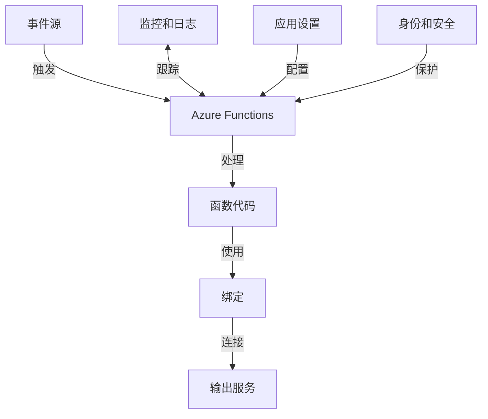

# Azure Functions

本文档详细介绍Azure Functions的概念、特性、开发方法以及最佳实践，帮助您在Azure云平台上有效地使用无服务器计算技术。

## 目录

- [Functions概述](#functions概述)
- [核心概念](#核心概念)
- [触发器和绑定](#触发器和绑定)
- [开发环境](#开发环境)
- [编程模型](#编程模型)
- [部署和托管](#部署和托管)
- [监控和诊断](#监控和诊断)
- [安全性](#安全性)
- [扩展和性能](#扩展和性能)
- [企业应用场景](#企业应用场景)
- [Durable Functions](#durable-functions)
- [最佳实践](#最佳实践)
- [常见问题](#常见问题)

## Functions概述

Azure Functions是一种无服务器计算服务，允许您运行事件驱动的代码，而无需管理基础设施。使用Functions，您只需关注代码逻辑，而Azure会自动处理扩展、资源分配和其他基础设施问题。

### 主要特点

- **事件驱动** - 响应各种事件源触发执行
- **自动扩展** - 根据负载自动扩展和缩减
- **无服务器** - 无需管理服务器或基础设施
- **按使用付费** - 仅为实际执行时间付费
- **多语言支持** - 支持C#、JavaScript、Python、Java、PowerShell等
- **集成生态系统** - 与Azure和第三方服务轻松集成
- **本地开发** - 完整的本地开发和调试体验

### 工作原理

Azure Functions的工作流程：



### 使用场景

Azure Functions适用于多种场景：

- **数据处理** - 响应数据更改，处理文件上传
- **实时流处理** - 处理IoT遥测数据或实时流
- **后台任务** - 执行计划任务或长时间运行的操作
- **Web API** - 构建无服务器API端点
- **工作流自动化** - 集成系统和服务
- **通知和消息处理** - 处理队列消息和发送通知
- **微服务** - 构建基于事件的微服务架构

## 核心概念

了解Azure Functions的核心概念对于有效使用该服务至关重要。

### 函数应用

函数应用是Azure Functions的部署和管理单元：

- 包含一个或多个函数
- 共享相同的配置和资源
- 部署在同一计算实例上
- 共享同一应用设置和连接字符串

### 函数

函数是执行特定任务的代码单元：

- 由触发器激活
- 包含业务逻辑
- 可以有输入和输出绑定
- 可以是同步或异步执行

### 触发器

触发器定义函数如何被调用：

- 每个函数必须有一个触发器
- 触发器可以是HTTP请求、计时器、队列消息等
- 触发器决定了函数的执行时机

### 绑定

绑定简化了与其他服务的连接：

- **输入绑定** - 从服务读取数据
- **输出绑定** - 向服务写入数据
- **声明式配置** - 无需编写连接代码
- **支持多种服务** - 存储、数据库、消息队列等

### 托管计划

Azure Functions提供多种托管选项：

- **消费计划** - 自动扩展，按执行付费
- **高级计划** - 预热实例，更高性能
- **App Service计划** - 在专用VM上运行
- **Kubernetes** - 在Kubernetes集群中运行

## 触发器和绑定

Azure Functions支持多种触发器和绑定，用于连接各种事件源和服务。

### 常用触发器

| 触发器 | 描述 | 使用场景 |
|-------|------|---------|
| HTTP | 响应HTTP请求 | REST API、Webhook |
| 计时器 | 按计划执行 | 定期任务、批处理 |
| Blob存储 | 响应Blob创建/更新 | 文件处理、图像处理 |
| 队列存储 | 处理队列消息 | 工作分发、解耦系统 |
| Cosmos DB | 响应文档更改 | 数据处理、通知 |
| 事件网格 | 处理Azure事件 | 事件驱动架构 |
| 事件中心 | 处理事件流 | IoT、遥测、日志 |
| 服务总线 | 处理消息 | 企业消息传递 |

### 常用绑定

| 绑定 | 方向 | 描述 |
|------|------|------|
| Blob存储 | 输入/输出 | 读取或写入Blob |
| 表存储 | 输入/输出 | 读取或写入表数据 |
| 队列存储 | 输出 | 写入队列消息 |
| Cosmos DB | 输入/输出 | 读取或写入文档 |
| SQL | 输入/输出 | 读取或写入SQL数据 |
| 服务总线 | 输出 | 发送消息 |
| 事件中心 | 输出 | 发送事件 |
| SendGrid | 输出 | 发送电子邮件 |
| Twilio | 输出 | 发送短信 |

### 配置触发器和绑定

触发器和绑定可以通过代码或配置文件定义：

```json
{
  "bindings": [
    {
      "type": "httpTrigger",
      "direction": "in",
      "name": "req",
      "methods": ["get", "post"],
      "authLevel": "function"
    },
    {
      "type": "blob",
      "direction": "in",
      "name": "inputBlob",
      "path": "samples-workitems/{queueTrigger}",
      "connection": "MyStorageAccountConnection"
    },
    {
      "type": "queue",
      "direction": "out",
      "name": "outputQueue",
      "queueName": "outqueue",
      "connection": "MyStorageAccountConnection"
    }
  ]
}
```

## 开发环境

Azure Functions提供多种开发环境选项，适应不同的开发偏好。

### Visual Studio

使用Visual Studio开发Functions：

- 完整的项目模板
- 集成的调试体验
- 本地运行和测试
- 直接部署到Azure

### VS Code

使用VS Code开发Functions：

- Azure Functions扩展
- 函数创建向导
- 本地调试支持
- 集成部署工具

### Azure Functions Core Tools

命令行开发工具：

```bash
# 安装Core Tools
npm install -g azure-functions-core-tools@4

# 创建新的函数应用
func init MyFunctionProject --dotnet

# 创建新函数
func new --name MyHttpFunction --template "HTTP trigger"

# 本地运行
func start

# 部署到Azure
func azure functionapp publish MyFunctionApp
```

### 在线开发

使用Azure门户直接开发：

- 内置代码编辑器
- 测试控制台
- 无需本地开发环境
- 适合快速原型设计

## 编程模型

Azure Functions支持多种编程语言和模式，适应不同的开发需求。

### 支持的语言

- **C#** - 类库或脚本
- **JavaScript/TypeScript** - Node.js运行时
- **Python** - Python 3.x
- **Java** - Java 8或更高版本
- **PowerShell** - PowerShell Core 6.x
- **F#** - .NET运行时
- **自定义处理程序** - 任何语言

### C#函数示例

```csharp
using System.Net;
using Microsoft.Azure.Functions.Worker;
using Microsoft.Azure.Functions.Worker.Http;
using Microsoft.Extensions.Logging;

namespace MyFunctionApp
{
    public class HttpExample
    {
        private readonly ILogger _logger;

        public HttpExample(ILoggerFactory loggerFactory)
        {
            _logger = loggerFactory.CreateLogger<HttpExample>();
        }

        [Function("HttpExample")]
        public HttpResponseData Run([HttpTrigger(AuthorizationLevel.Function, "get", "post")] HttpRequestData req)
        {
            _logger.LogInformation("C# HTTP trigger function processed a request.");

            var response = req.CreateResponse(HttpStatusCode.OK);
            response.Headers.Add("Content-Type", "text/plain; charset=utf-8");
            response.WriteString("Welcome to Azure Functions!");

            return response;
        }
    }
}
```

### JavaScript函数示例

```javascript
module.exports = async function (context, req) {
    context.log('JavaScript HTTP trigger function processed a request.');

    const name = (req.query.name || (req.body && req.body.name));
    const responseMessage = name
        ? "Hello, " + name + ". This HTTP triggered function executed successfully."
        : "This HTTP triggered function executed successfully. Pass a name in the query string or in the request body for a personalized response.";

    context.res = {
        status: 200,
        body: responseMessage
    };
}
```

### Python函数示例

```python
import logging
import azure.functions as func

def main(req: func.HttpRequest) -> func.HttpResponse:
    logging.info('Python HTTP trigger function processed a request.')

    name = req.params.get('name')
    if not name:
        try:
            req_body = req.get_json()
        except ValueError:
            pass
        else:
            name = req_body.get('name')

    if name:
        return func.HttpResponse(f"Hello, {name}. This HTTP triggered function executed successfully.")
    else:
        return func.HttpResponse(
             "This HTTP triggered function executed successfully. Pass a name in the query string or in the request body for a personalized response.",
             status_code=200
        )
```

### 依赖注入

在.NET Functions中使用依赖注入：

```csharp
using Microsoft.Azure.Functions.Extensions.DependencyInjection;
using Microsoft.Extensions.DependencyInjection;

[assembly: FunctionsStartup(typeof(MyNamespace.Startup))]

namespace MyNamespace
{
    public class Startup : FunctionsStartup
    {
        public override void Configure(IFunctionsHostBuilder builder)
        {
            builder.Services.AddSingleton<IMyService, MyService>();
        }
    }
}
```

## 部署和托管

Azure Functions提供多种部署和托管选项，满足不同的需求。

### 部署方法

- **Visual Studio** - 直接从IDE部署
- **VS Code** - 使用Azure扩展部署
- **Azure CLI** - 命令行部署
- **Azure DevOps** - CI/CD管道
- **GitHub Actions** - 自动化工作流
- **ZIP部署** - 打包部署
- **容器部署** - 使用Docker容器

### 使用Azure CLI部署

```bash
# 创建资源组
az group create --name MyResourceGroup --location eastasia

# 创建存储账户
az storage account create --name mystorageaccount --location eastasia --resource-group MyResourceGroup --sku Standard_LRS

# 创建函数应用
az functionapp create --resource-group MyResourceGroup --consumption-plan-location eastasia --runtime dotnet --functions-version 4 --name MyFunctionApp --storage-account mystorageaccount

# 部署函数
az functionapp deployment source config-zip -g MyResourceGroup -n MyFunctionApp --src function.zip
```

### 托管计划比较

| 特性 | 消费计划 | 高级计划 | App Service计划 | Kubernetes |
|------|---------|---------|--------------|-----------|
| 自动扩展 | ✓ (0-200实例) | ✓ (0-20实例) | ✓ (手动/自动) | ✓ (自定义) |
| 定价 | 按执行付费 | 按实例付费 | 按实例付费 | 按集群付费 |
| 实例大小 | 固定 | 多种选择 | 多种选择 | 自定义 |
| 冷启动 | 有 | 无(预热) | 无 | 可配置 |
| 最大超时 | 10分钟 | 无限制 | 无限制 | 自定义 |
| VNET集成 | 部分支持 | 完全支持 | 完全支持 | 原生支持 |
| 专用实例 | 否 | 是 | 是 | 是 |

### 应用设置和配置

管理函数应用的配置：

```bash
# 设置应用设置
az functionapp config appsettings set --name MyFunctionApp --resource-group MyResourceGroup --settings "MySetting=MyValue"

# 设置连接字符串
az functionapp config connection-string set --name MyFunctionApp --resource-group MyResourceGroup --connection-string-type SQLAzure --settings "MyConnection=connection-string"
```

## 监控和诊断

Azure Functions提供多种工具来监控和诊断应用程序问题。

### Application Insights集成

启用Application Insights监控：

```bash
# 启用Application Insights
az monitor app-insights component create --app MyAppInsights --location eastasia --resource-group MyResourceGroup

# 将Application Insights连接到函数应用
az functionapp config appsettings set --name MyFunctionApp --resource-group MyResourceGroup --settings "APPINSIGHTS_INSTRUMENTATIONKEY=instrumentation-key"
```

### 日志记录

在代码中添加日志：

```csharp
// C#
log.LogInformation("Function executed successfully");
log.LogError(ex, "Function failed with an error");

// JavaScript
context.log("Function executed successfully");
context.log.error("Function failed with an error");

// Python
logging.info("Function executed successfully")
logging.error("Function failed with an error")
```

### 监控指标

监控关键指标：

- 执行计数
- 执行时间
- 错误率
- 内存使用
- CPU使用
- 并发执行

### 分布式跟踪

使用Application Insights进行分布式跟踪：

- 跟踪请求流
- 查看依赖项调用
- 分析性能瓶颈
- 诊断错误

## 安全性

保护Azure Functions应用程序的安全至关重要。

### 身份验证和授权

HTTP触发器的授权级别：

- **anonymous** - 无需API密钥
- **function** - 需要函数级API密钥
- **admin** - 需要主机级API密钥

```csharp
[FunctionName("HttpTrigger")]
public static async Task<IActionResult> Run(
    [HttpTrigger(AuthorizationLevel.Function, "get", "post", Route = null)] HttpRequest req,
    ILogger log)
{
    // 函数代码
}
```

### 托管身份

使用托管身份访问Azure资源：

```csharp
// 获取托管身份令牌
var tokenProvider = new AzureServiceTokenProvider();
string token = await tokenProvider.GetAccessTokenAsync("https://storage.azure.com/");

// 使用令牌访问存储
var storageCredentials = new TokenCredential(token);
var storageAccount = new CloudStorageAccount(storageCredentials, "mystorageaccount", "core.windows.net", true);
```

### 密钥保管库集成

使用Key Vault存储敏感信息：

```bash
# 创建Key Vault引用
az functionapp config appsettings set --name MyFunctionApp --resource-group MyResourceGroup --settings "MySecret=@Microsoft.KeyVault(SecretUri=https://myvault.vault.azure.net/secrets/mysecret/)"
```

### 网络安全

限制函数应用的网络访问：

- 使用VNet集成
- 配置IP限制
- 使用专用终结点
- 启用服务终结点

## 扩展和性能

优化Azure Functions的性能和扩展性。

### 扩展行为

了解不同计划的扩展特性：

- **消费计划** - 基于事件队列自动扩展
- **高级计划** - 基于事件队列自动扩展，有预热实例
- **App Service计划** - 手动或基于规则自动扩展

### 冷启动优化

减少冷启动时间：

- 使用高级计划消除冷启动
- 减少依赖项数量和大小
- 优化导入和启动代码
- 使用预编译函数（.NET）
- 考虑语言选择（C#通常比Python启动更快）

### 性能优化

提高函数性能：

- 重用连接和客户端
- 使用异步编程模式
- 优化内存使用
- 使用输出缓存
- 实施重试策略

### 并发和节流

管理函数的并发和节流：

- 设置主机配置中的并发限制
- 实施自定义队列和批处理
- 使用Durable Functions进行编排
- 监控和调整节流设置

## 企业应用场景

Azure Functions在企业环境中的常见应用场景。

### 微服务架构

使用Functions构建微服务：

- 事件驱动的服务通信
- 细粒度的服务部署
- 独立扩展服务
- 按需计算资源

### 集成解决方案

构建系统集成：

- 连接不同的系统和API
- 转换和映射数据
- 实现消息路由
- 构建集成工作流

### 实时数据处理

处理实时数据流：

- IoT设备遥测数据
- 日志和事件流
- 实时分析
- 实时通知

### 后台处理

实现后台任务：

- 图像和视频处理
- 报告生成
- 数据导入和导出
- 长时间运行的计算

## Durable Functions

Durable Functions是Azure Functions的扩展，支持有状态函数的编写。

### 核心概念

- **编排器函数** - 定义工作流步骤
- **活动函数** - 执行工作单元
- **实体函数** - 管理状态
- **客户端函数** - 启动编排

### 模式

Durable Functions支持多种工作流模式：

- **函数链** - 按顺序执行一系列函数
- **扇出/扇入** - 并行执行多个函数并聚合结果
- **异步HTTP API** - 管理长时间运行的操作
- **监视器** - 定期检查条件
- **人工交互** - 在工作流中包含人工审批步骤

### C#编排器示例

```csharp
[FunctionName("OrderProcessing")]
public static async Task<object> RunOrchestrator(
    [OrchestrationTrigger] IDurableOrchestrationContext context)
{
    var orderData = context.GetInput<OrderData>();
    
    // 验证订单
    bool isValid = await context.CallActivityAsync<bool>("ValidateOrder", orderData);
    if (!isValid)
    {
        return new { Result = "Order validation failed" };
    }
    
    // 处理付款
    await context.CallActivityAsync("ProcessPayment", orderData);
    
    // 并行执行多个活动
    var tasks = new List<Task>();
    tasks.Add(context.CallActivityAsync("SendConfirmationEmail", orderData.Email));
    tasks.Add(context.CallActivityAsync("UpdateInventory", orderData.Items));
    await Task.WhenAll(tasks);
    
    return new { Result = "Order processed successfully" };
}
```

### JavaScript编排器示例

```javascript
const df = require("durable-functions");

module.exports = df.orchestrator(function*(context) {
    const orderData = context.df.getInput();
    
    // 验证订单
    const isValid = yield context.df.callActivity("ValidateOrder", orderData);
    if (!isValid) {
        return { result: "Order validation failed" };
    }
    
    // 处理付款
    yield context.df.callActivity("ProcessPayment", orderData);
    
    // 并行执行多个活动
    yield context.df.Task.all([
        context.df.callActivity("SendConfirmationEmail", orderData.email),
        context.df.callActivity("UpdateInventory", orderData.items)
    ]);
    
    return { result: "Order processed successfully" };
});
```

## 最佳实践

以下是使用Azure Functions的最佳实践建议。

### 设计最佳实践

- **单一职责** - 每个函数专注于一个任务
- **无状态设计** - 避免在函数实例之间共享状态
- **幂等性** - 设计可重复执行的函数
- **错误处理** - 实施全面的错误处理策略
- **超时考虑** - 考虑执行超时限制

### 性能最佳实践

- **连接重用** - 重用数据库和HTTP连接
- **并行处理** - 使用异步和并行执行
- **避免冷启动** - 优化启动性能
- **内存管理** - 监控和优化内存使用
- **批处理** - 批量处理消息和事件

### 安全最佳实践

- **最小特权** - 使用最小权限访问资源
- **密钥管理** - 使用Key Vault存储密钥和机密
- **输入验证** - 验证所有输入数据
- **网络隔离** - 使用VNet和访问限制
- **监控和审计** - 启用全面监控和日志记录

### 开发和DevOps最佳实践

- **本地开发** - 使用本地开发工具
- **源代码控制** - 使用Git管理代码
- **CI/CD** - 实施自动化部署管道
- **环境隔离** - 使用不同环境进行开发、测试和生产
- **版本控制** - 使用版本控制管理API和函数

## 常见问题

### 如何处理长时间运行的函数？

1. 使用Durable Functions进行编排
2. 将工作拆分为更小的函数
3. 使用队列进行工作分发
4. 在App Service计划上运行以延长超时
5. 考虑异步模式和回调

### 如何优化冷启动时间？

- 使用高级计划消除冷启动
- 减少依赖项数量和大小
- 优化导入和启动代码
- 使用预编译函数（.NET）
- 考虑语言选择（C#通常比Python启动更快）

### 如何在函数之间共享代码？

- 创建共享类库或包
- 使用函数应用中的共享文件
- 使用依赖项注入共享服务
- 考虑使用Durable Functions共享状态
- 使用外部存储或缓存

### 如何处理函数之间的通信？

- 使用存储队列或服务总线
- 使用事件网格进行发布/订阅
- 使用Durable Functions进行编排
- 考虑直接HTTP调用（适用于同步场景）
- 使用Cosmos DB或其他数据库共享数据

### 如何管理函数的版本控制？

- 使用不同的函数应用进行主要版本
- 使用路由参数包含版本信息
- 实施功能标志控制行为
- 使用部署槽位进行版本切换
- 考虑API管理进行版本控制
