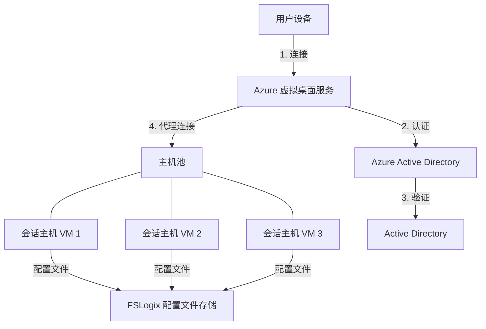

# Azure 虚拟桌面 (AVD)

Azure 虚拟桌面 (AVD) 是在 Azure 中运行的全面桌面和应用程序虚拟化服务。它提供了一个安全、灵活和可扩展的虚拟桌面基础架构 (VDI) 解决方案，由云端交付。

## 目录

- [概述](#概述)
- [核心概念](#核心概念)
- [架构](#架构)
- [入门指南](#入门指南)
- [部署选项](#部署选项)
- [管理与管理员](#管理与管理员)
- [用户体验](#用户体验)
- [安全与合规](#安全与合规)
- [监控与优化](#监控与优化)
- [定价与许可](#定价与许可)
- [最佳实践](#最佳实践)
- [故障排除](#故障排除)
- [案例研究](#案例研究)
- [其他资源](#其他资源)

## 概述

Azure 虚拟桌面（前身为 Windows 虚拟桌面）为任何设备提供虚拟化桌面体验和远程应用程序。它提供唯一的 Windows 10/11 多会话体验，针对 Microsoft 365 应用程序的优化，以及对远程桌面服务 (RDS) 环境的支持。

**主要优势：**

- **简化管理**：集中管理 Windows 10/11 桌面和应用程序
- **多会话 Windows**：独有的 Windows 10/11 多会话功能
- **Microsoft 365 优化**：增强 Microsoft 365 应用程序性能
- **成本效益**：通过即用即付定价降低基础设施成本
- **增强安全性**：内置安全和合规功能
- **灵活访问**：从任何设备，任何地点访问

## 核心概念

### 主机池

主机池是一组注册到 Azure 虚拟桌面作为会话主机的 Azure 虚拟机。主机池中的所有会话主机虚拟机应运行相同的操作系统映像，以提供一致的用户体验。

主机池可配置为：
- **个人**：每个用户分配到特定的虚拟机
- **共享**：用户以负载均衡方式连接到可用的会话主机

### 应用程序组

应用程序组是主机池中会话主机上安装的应用程序的逻辑分组。有两种类型：
- **桌面应用程序组**：提供完整桌面访问
- **RemoteApp 应用程序组**：提供对单个应用程序的访问

### 工作区

工作区是应用程序组的逻辑分组。用户通过工作区访问分配的应用程序组。

## 架构

Azure 虚拟桌面架构由多个协同工作的组件组成：



关键组件：
- **控制平面**：Azure 管理的服务，处理 Web 访问、网关、连接代理和诊断
- **会话主机**：运行 Windows 10/11 多会话或 Windows Server 的 Azure VM
- **FSLogix**：用户配置文件的配置文件容器技术
- **管理工具**：Azure 门户、PowerShell 和 REST API
- **网络**：Azure 虚拟网络集成

## 入门指南

### 先决条件

- Azure 订阅
- Azure Active Directory 租户
- 与 Active Directory 连接的虚拟网络
- 适当的许可（参见定价与许可部分）

### 基本部署步骤

1. **注册 Azure 虚拟桌面提供程序**：

```powershell
# 注册 Microsoft.DesktopVirtualization 资源提供程序
Register-AzResourceProvider -ProviderNamespace Microsoft.DesktopVirtualization
```

2. **创建主机池**：

```powershell
# 创建主机池
New-AzWvdHostPool -ResourceGroupName "avd-rg" `
                 -Name "AVD-HostPool" `
                 -Location "eastus" `
                 -HostPoolType "Pooled" `
                 -LoadBalancerType "BreadthFirst" `
                 -PreferredAppGroupType "Desktop" `
                 -MaxSessionLimit 10 `
                 -ValidationEnvironment:$false
```

3. **创建注册令牌**：

```powershell
# 创建有效期为 2 小时的注册令牌
$token = New-AzWvdRegistrationInfo -ResourceGroupName "avd-rg" `
                                  -HostPoolName "AVD-HostPool" `
                                  -ExpirationTime (Get-Date).AddHours(2)
```

4. **部署 VM 并将其加入主机池**：
   - 使用 Azure 门户、ARM 模板或 PowerShell 部署 VM
   - 安装 AVD 代理并使用令牌注册到主机池

5. **创建应用程序组和工作区**：

```powershell
# 创建桌面应用程序组
New-AzWvdApplicationGroup -ResourceGroupName "avd-rg" `
                         -Name "AVD-DAG" `
                         -Location "eastus" `
                         -HostPoolArmPath "/subscriptions/{subscription-id}/resourcegroups/avd-rg/providers/Microsoft.DesktopVirtualization/hostpools/AVD-HostPool" `
                         -ApplicationGroupType "Desktop"

# 创建工作区
New-AzWvdWorkspace -ResourceGroupName "avd-rg" `
                  -Name "AVD-Workspace" `
                  -Location "eastus"

# 将应用程序组与工作区关联
Register-AzWvdApplicationGroup -ResourceGroupName "avd-rg" `
                              -WorkspaceName "AVD-Workspace" `
                              -ApplicationGroupPath "/subscriptions/{subscription-id}/resourcegroups/avd-rg/providers/Microsoft.DesktopVirtualization/applicationgroups/AVD-DAG"
```

6. **将用户分配到应用程序组**：

```powershell
# 将用户分配到应用程序组
New-AzRoleAssignment -SignInName "user@contoso.com" `
                    -RoleDefinitionName "Desktop Virtualization User" `
                    -ResourceName "AVD-DAG" `
                    -ResourceGroupName "avd-rg" `
                    -ResourceType "Microsoft.DesktopVirtualization/applicationGroups"
```

## 部署选项

### Azure 门户部署

Azure 门户提供了部署 Azure 虚拟桌面的引导体验：

1. 在 Azure 门户中导航至"Azure 虚拟桌面"
2. 选择"主机池"并点击"创建"
3. 按照向导配置主机池设置
4. 部署会话主机 VM
5. 创建应用程序组和工作区
6. 分配用户并测试连接

### ARM 模板部署

对于自动化部署，使用 Azure 资源管理器模板：

```json
{
  "$schema": "https://schema.management.azure.com/schemas/2019-04-01/deploymentTemplate.json#",
  "contentVersion": "1.0.0.0",
  "parameters": {
    "hostPoolName": {
      "type": "string",
      "defaultValue": "AVD-HostPool"
    },
    "hostPoolType": {
      "type": "string",
      "allowedValues": ["Pooled", "Personal"],
      "defaultValue": "Pooled"
    },
    "loadBalancerType": {
      "type": "string",
      "allowedValues": ["BreadthFirst", "DepthFirst"],
      "defaultValue": "BreadthFirst"
    }
  },
  "resources": [
    {
      "type": "Microsoft.DesktopVirtualization/hostpools",
      "apiVersion": "2021-07-12",
      "name": "[parameters('hostPoolName')]",
      "location": "[resourceGroup().location]",
      "properties": {
        "hostPoolType": "[parameters('hostPoolType')]",
        "loadBalancerType": "[parameters('loadBalancerType')]",
        "preferredAppGroupType": "Desktop",
        "maxSessionLimit": 10,
        "validationEnvironment": false
      }
    }
  ]
}
```

### Azure 虚拟桌面加速器

对于企业部署，考虑使用 [Azure 虚拟桌面加速器](https://github.com/Azure/avdaccelerator)，它为各种场景提供参考架构和部署模板。

## 管理与管理员

### 主机池管理

- **扩展**：配置自动扩展以优化成本
- **更新**：使用 Azure 更新管理来管理操作系统和应用程序更新
- **映像管理**：使用 Azure 计算库（前身为共享映像库）进行映像管理

#### 自动扩展示例

```powershell
# 安装 Az.Avd PowerShell 模块
Install-Module -Name Az.Avd -Force

# 配置自动扩展
Add-AvdAutoScaleRunbook -HostPoolName "AVD-HostPool" `
                        -ResourceGroupName "avd-rg" `
                        -Location "eastus" `
                        -PeakStartTime "08:00" `
                        -PeakEndTime "18:00" `
                        -TimeDifference "-5:00" `
                        -MinimumNumberOfRdsh 1 `
                        -SessionThresholdPerCPU 2 `
                        -AutomationAccountName "AVD-Automation"
```

### 用户和应用程序管理

- **用户分配**：通过 Azure RBAC 管理用户访问
- **应用程序交付**：使用 MSIX 应用附加、RemoteApp 或传统方法部署应用程序
- **配置文件管理**：为用户配置文件配置 FSLogix

#### MSIX 应用附加示例

```powershell
# 注册 MSIX 包
New-AzWvdMsixPackage -HostPoolName "AVD-HostPool" `
                     -ResourceGroupName "avd-rg" `
                     -PackageAlias "Office365" `
                     -DisplayName "Microsoft 365 Apps" `
                     -ImagePath "\\storage\msixpackages\office365.vhd" `
                     -IsActive:$true
```

## 用户体验

### 客户端选项

用户可以通过各种客户端访问 Azure 虚拟桌面：
- Windows 桌面客户端
- Web 客户端
- macOS 客户端
- iOS 客户端
- Android 客户端
- Linux 客户端（预览版）

### 性能优化

- **图形加速**：为图形密集型工作负载配置启用 GPU 的 VM
- **Teams 优化**：启用 Microsoft Teams 优化，改善音频/视频体验
- **带宽管理**：配置 QoS 策略以实现最佳网络使用

## 安全与合规

Azure 虚拟桌面包括多项安全功能：

- **反向连接**：会话主机不需要入站端口
- **条件访问**：与 Azure AD 条件访问集成
- **MFA**：多因素身份验证支持
- **RBAC**：基于角色的访问控制进行管理
- **安全基线**：为会话主机实施安全基线

### 安全最佳实践

1. 使用 Azure 安全中心监控安全状况
2. 实施即时 VM 访问
3. 为服务器启用 Azure Defender
4. 配置 Azure 防火墙或网络安全组
5. 使用 Azure 专用链接进行安全连接

## 监控与优化

### Azure Monitor 集成

使用 Azure Monitor 监控 Azure 虚拟桌面：

```powershell
# 为主机池启用诊断设置
Set-AzDiagnosticSetting -ResourceId "/subscriptions/{subscription-id}/resourceGroups/avd-rg/providers/Microsoft.DesktopVirtualization/hostpools/AVD-HostPool" `
                        -WorkspaceId "/subscriptions/{subscription-id}/resourceGroups/log-analytics-rg/providers/Microsoft.OperationalInsights/workspaces/avd-analytics" `
                        -Enabled $true `
                        -Category @("Checkpoint", "Error", "Management", "Connection", "HostRegistration")
```

### Log Analytics 工作簿

使用 Azure Monitor 工作簿进行可视化：
- 连接性能
- 主机诊断
- 用户会话活动
- 利用率报告

## 定价与许可

Azure 虚拟桌面定价包括：

1. **Azure 基础设施成本**：
   - 虚拟机（计算）
   - 存储（操作系统磁盘、数据磁盘、配置文件存储）
   - 网络（出口流量、负载均衡器等）

2. **许可要求**：
   - 每用户 Windows 10/11 企业版 E3/E5
   - Microsoft 365 E3/E5 或 Windows E3/E5
   - 对于 Windows Server：RDS 客户端访问许可证 (CAL)

### 成本优化策略

- 使用自动扩展减少 VM 运行成本
- 对可预测的工作负载实施预留实例
- 为工作负载选择适当的 VM 大小
- 对非关键工作负载使用竞价实例
- 优化存储，为配置文件使用高级 SSD，为操作系统磁盘使用标准 SSD

## 最佳实践

### 设计最佳实践

- **主机池设计**：为不同的工作负载分离主机池
- **VM 大小调整**：根据用户工作负载适当调整 VM 大小
- **映像管理**：使用 Azure 计算库的标准化映像
- **配置文件管理**：使用适当存储实现 FSLogix 配置文件容器
- **网络设计**：确保用户和 Azure 区域之间的低延迟连接

### 运营最佳实践

- **监控**：实施带有警报的全面监控
- **备份**：定期备份关键组件
- **灾难恢复**：为区域性中断做好计划
- **更新管理**：定期修补和更新
- **扩展**：根据使用模式实施自动扩展

## 故障排除

常见问题及其解决方案：

### 连接问题

- **症状**：用户无法连接到 AVD
- **可能原因**：
  - 网络连接问题
  - 身份验证问题
  - 主机池不可用
- **故障排除步骤**：
  1. 检查 Azure 门户中的用户分配
  2. 验证网络连接
  3. 检查会话主机状态
  4. 查看诊断日志

### 性能问题

- **症状**：性能缓慢或延迟
- **可能原因**：
  - VM 资源不足
  - 网络延迟
  - 存储瓶颈
- **故障排除步骤**：
  1. 监控 VM 性能指标
  2. 检查网络延迟
  3. 验证存储性能
  4. 优化映像和应用程序

## 案例研究

### 企业部署

一家大型企业实施了 Azure 虚拟桌面，为 10,000 名员工启用远程工作：
- 为不同部门部署多个主机池
- 在 Azure NetApp Files 上实施 FSLogix 配置文件
- 使用自动扩展优化成本
- 与传统 VDI 相比，实现 30% 的成本节约

### 教育场景

一所大学为计算机实验室部署了 Azure 虚拟桌面：
- 远程为学生提供专业软件
- 根据学期安排扩展资源
- 与现有身份管理集成
- 将校园基础设施成本降低 40%

## 其他资源

- [官方文档](https://docs.microsoft.com/zh-cn/azure/virtual-desktop/)
- [Azure 虚拟桌面技术社区](https://techcommunity.microsoft.com/t5/azure-virtual-desktop/bd-p/AzureVirtualDesktop)
- [FSLogix 文档](https://docs.microsoft.com/zh-cn/fslogix/)
- [Azure 虚拟桌面加速器](https://github.com/Azure/avdaccelerator)
- [Microsoft Learn 模块](https://docs.microsoft.com/zh-cn/learn/paths/m365-wvd/)
