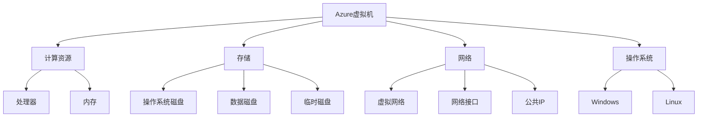
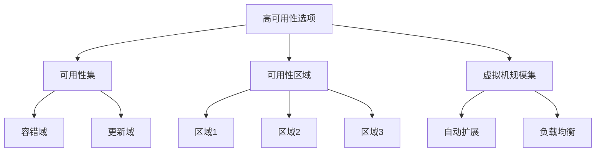

# Azure虚拟机

本文档详细介绍Azure虚拟机(VM)的概念、类型、配置选项以及最佳实践，帮助您在Azure云平台上有效地部署和管理虚拟机。

## 目录

- [虚拟机概述](#虚拟机概述)
- [虚拟机类型和系列](#虚拟机类型和系列)
- [规划和部署](#规划和部署)
- [存储选项](#存储选项)
- [网络配置](#网络配置)
- [可用性和扩展性](#可用性和扩展性)
- [安全性](#安全性)
- [成本管理](#成本管理)
- [监控和维护](#监控和维护)
- [自动化和管理](#自动化和管理)
- [最佳实践](#最佳实践)
- [常见问题](#常见问题)

## 虚拟机概述

Azure虚拟机是Azure提供的基础设施即服务(IaaS)产品，允许您在云中部署和管理虚拟服务器。Azure虚拟机提供了灵活性和控制，同时无需购买和维护物理硬件。

### 主要特点

- **灵活性** - 选择操作系统、计算能力、存储和网络配置
- **按需扩展** - 根据需求调整规模
- **全球可用性** - 在全球多个区域部署
- **混合能力** - 与本地环境集成
- **自定义映像** - 使用自定义或市场映像
- **专用硬件** - 可选择专用物理服务器

### 使用场景

Azure虚拟机适用于多种场景：

- **开发和测试** - 快速创建开发和测试环境
- **应用程序托管** - 运行企业应用程序
- **扩展数据中心** - 增加本地数据中心容量
- **灾难恢复** - 提供业务连续性和灾难恢复解决方案
- **高性能计算** - 处理复杂的计算工作负载
- **大数据分析** - 运行大数据分析工作负载

### 虚拟机架构

Azure虚拟机由多个组件组成：



## 虚拟机类型和系列

Azure提供多种虚拟机系列，每种系列针对特定的工作负载进行了优化。

### 通用型虚拟机

适用于测试和开发、小到中型数据库和低到中等流量Web服务器：

- **B系列** - 经济实惠的可突发虚拟机，适用于不需要持续全功率的工作负载
- **Dsv3和Dv3系列** - 通用计算，适用于企业应用和中小型数据库
- **Dasv5和Dav5系列** - 最新一代通用计算，提供更好的性能和价格比

### 计算优化型虚拟机

适用于计算密集型工作负载，如批处理、Web服务器和分析：

- **F系列** - 计算优化，适用于需要高CPU性能的工作负载
- **Fsv2系列** - 提供更高的CPU性能和临时存储

### 内存优化型虚拟机

适用于内存密集型工作负载，如大型数据库和内存分析：

- **Esv3和Ev3系列** - 内存优化，适用于关系型数据库和中到大型缓存
- **Easv5和Eav5系列** - 最新一代内存优化虚拟机
- **M系列** - 超大内存，最高可达4TB RAM

### 存储优化型虚拟机

适用于需要高磁盘吞吐量和IO的工作负载：

- **Lsv2系列** - 高吞吐量、低延迟NVMe存储

### GPU虚拟机

适用于图形渲染和深度学习：

- **NC系列** - GPU计算，适用于深度学习和AI
- **NV系列** - 可视化和远程可视化
- **ND系列** - 深度学习训练和推理

### 高性能计算虚拟机

适用于高性能计算工作负载：

- **H系列** - 高性能计算，适用于分子建模和计算流体动力学
- **HB系列** - 针对内存带宽密集型HPC应用进行了优化

## 规划和部署

在部署Azure虚拟机之前，需要考虑多个因素以确保最佳性能和成本效益。

### 选择合适的虚拟机大小

选择虚拟机大小时考虑以下因素：

- **CPU需求** - 应用程序需要的处理能力
- **内存需求** - 应用程序需要的RAM
- **存储吞吐量** - 需要的磁盘IO性能
- **网络带宽** - 预期的网络流量
- **GPU要求** - 是否需要图形处理能力
- **成本预算** - 可用的预算限制

### 选择区域

选择虚拟机区域时考虑：

- **数据驻留要求** - 法规和合规性需求
- **延迟** - 靠近用户的位置
- **可用性** - 服务和功能在区域的可用性
- **价格** - 不同区域的价格差异

### 操作系统选择

Azure支持多种操作系统：

- **Windows Server** - 多个版本，包括2016、2019和2022
- **Windows客户端** - Windows 10和11
- **Linux发行版** - Ubuntu、Red Hat、SUSE、Debian、CentOS等

### 创建虚拟机

使用Azure门户创建虚拟机：

1. 登录Azure门户
2. 点击"创建资源" > "计算" > "虚拟机"
3. 填写基本信息（订阅、资源组、名称、区域）
4. 选择映像和大小
5. 配置管理员账户
6. 设置入站端口规则
7. 配置磁盘、网络和其他设置
8. 点击"查看+创建"，然后点击"创建"

使用Azure CLI创建虚拟机：

```bash
# 创建资源组
az group create --name myResourceGroup --location eastus

# 创建Linux VM
az vm create \
  --resource-group myResourceGroup \
  --name myVM \
  --image UbuntuLTS \
  --admin-username azureuser \
  --generate-ssh-keys \
  --size Standard_D2s_v3

# 创建Windows VM
az vm create \
  --resource-group myResourceGroup \
  --name myWindowsVM \
  --image Win2019Datacenter \
  --admin-username azureuser \
  --admin-password ComplexPassword123! \
  --size Standard_D2s_v3
```

## 存储选项

Azure虚拟机提供多种存储选项，以满足不同的性能和成本需求。

### 磁盘类型

- **操作系统磁盘** - 包含操作系统，最大32,767 GiB
- **临时磁盘** - 提供短期存储，VM重启时数据可能丢失
- **数据磁盘** - 用于应用程序数据，每个VM最多可添加64个数据磁盘

### 托管磁盘

Azure托管磁盘是一种块级存储卷，由Azure管理：

- **Ultra磁盘** - 极高性能，适用于IO密集型工作负载
- **高级SSD** - 高性能SSD，适用于生产工作负载
- **标准SSD** - 适用于需要一致性能的开发/测试
- **标准HDD** - 经济实惠的存储选项，适用于备份和非关键数据

### 磁盘加密

保护磁盘数据安全：

- **Azure磁盘加密** - 使用BitLocker(Windows)或dm-crypt(Linux)加密OS和数据磁盘
- **服务器端加密** - Azure存储自动加密所有数据

### 磁盘缓存

配置磁盘缓存以提高性能：

- **只读** - 适用于只读数据，如数据库日志
- **读写** - 适用于需要读写缓存的应用程序
- **无** - 适用于不需要缓存的场景，如大型顺序IO

## 网络配置

Azure虚拟机的网络配置对于连接性、性能和安全性至关重要。

### 虚拟网络集成

每个Azure VM都部署在虚拟网络中：

- **子网分配** - VM部署在特定子网中
- **私有IP地址** - 从子网地址范围分配
- **多NIC支持** - 可以附加多个网络接口

### 公共连接

允许从Internet访问VM：

- **公共IP地址** - 分配静态或动态公共IP
- **域名标签** - 创建FQDN（如myvm.eastus.cloudapp.azure.com）
- **负载均衡器** - 通过负载均衡器分发流量

### 网络安全

保护VM网络流量：

- **网络安全组(NSG)** - 控制入站和出站流量
- **应用程序安全组(ASG)** - 按应用程序分组VM进行安全管理
- **服务终结点** - 安全访问Azure服务
- **专用链接** - 私密访问PaaS服务

### 高级网络功能

- **加速网络** - 启用SR-IOV提高网络性能
- **IPv6支持** - 双栈IPv4/IPv6网络
- **多NIC** - 每个VM最多8个网络接口
- **用户定义路由** - 自定义网络流量路径

## 可用性和扩展性

Azure提供多种选项来确保虚拟机的高可用性和可扩展性。

### 可用性选项



#### 可用性集

将VM分组到可用性集中，以防止单点故障：

- **容错域** - 不同的物理硬件、网络和电源
- **更新域** - 可以同时重启的VM组

```bash
# 创建可用性集
az vm availability-set create \
  --resource-group myResourceGroup \
  --name myAvailabilitySet \
  --platform-fault-domain-count 2 \
  --platform-update-domain-count 5
```

#### 可用性区域

跨数据中心部署VM，提供更高级别的可用性：

- 每个区域最多3个可用性区域
- 物理隔离的数据中心
- 独立电源、冷却和网络

```bash
# 在可用性区域1创建VM
az vm create \
  --resource-group myResourceGroup \
  --name myVM1 \
  --image UbuntuLTS \
  --zone 1
```

### 虚拟机规模集

自动扩展VM组以满足需求：

- **自动扩展** - 根据指标自动添加或删除实例
- **负载均衡** - 自动分发流量
- **大规模部署** - 支持数千个VM实例
- **滚动升级** - 无停机更新

```bash
# 创建VM规模集
az vmss create \
  --resource-group myResourceGroup \
  --name myScaleSet \
  --image UbuntuLTS \
  --upgrade-policy-mode automatic \
  --instance-count 3 \
  --admin-username azureuser \
  --generate-ssh-keys
```

### 自动扩展

配置自动扩展规则：

- **基于指标** - CPU、内存、磁盘、网络使用率
- **基于计划** - 按预定义的时间表扩展
- **预测性扩展** - 基于历史模式预测需求

## 安全性

保护Azure虚拟机免受威胁是至关重要的。

### 身份验证和访问

- **SSH密钥** - 用于Linux VM的安全身份验证
- **密码策略** - 强密码要求
- **Azure AD登录** - 使用Azure AD凭据登录VM
- **Just-In-Time访问** - 按需临时访问VM

### 网络安全

- **NSG规则** - 限制入站和出站流量
- **Azure Firewall** - 高级网络安全服务
- **DDoS保护** - 防御分布式拒绝服务攻击
- **专用IP** - 使用私有网络通信

### 数据安全

- **磁盘加密** - 加密静态数据
- **密钥保管库集成** - 安全存储加密密钥
- **机密管理** - 安全管理证书和密码

### 安全监控

- **Azure Security Center** - 集中安全管理和监控
- **Azure Sentinel** - 安全信息和事件管理(SIEM)
- **安全建议** - 自动安全评估和建议

## 成本管理

有效管理Azure虚拟机成本是云战略的关键部分。

### 定价模型

- **即用即付** - 按实际使用时间付费
- **预留实例** - 承诺使用1年或3年，享受折扣
- **Spot实例** - 利用多余容量，享受大幅折扣
- **混合权益** - 使用现有许可证降低成本

### 成本优化策略

- **合适的大小** - 选择适合工作负载的VM大小
- **自动关闭** - 在非工作时间关闭VM
- **自动扩展** - 根据需求调整VM数量
- **存储优化** - 选择适当的存储类型和大小
- **预留实例** - 对稳定工作负载使用预留

### 成本监控工具

- **Azure成本管理** - 分析和优化云支出
- **预算警报** - 设置支出限制和通知
- **成本分析** - 深入了解资源成本
- **标记** - 使用标记分配成本到业务单位

## 监控和维护

持续监控和维护虚拟机对于确保性能和可靠性至关重要。

### Azure Monitor

使用Azure Monitor全面监控VM：

- **指标** - 收集CPU、内存、磁盘和网络性能数据
- **日志** - 收集和分析日志数据
- **警报** - 设置基于阈值的通知
- **工作簿** - 创建交互式报告

### 诊断扩展

启用诊断扩展收集详细数据：

- **性能计数器** - 收集性能数据
- **事件日志** - 收集Windows事件日志
- **Syslog** - 收集Linux系统日志
- **崩溃转储** - 捕获应用程序崩溃信息

### 维护和更新

管理VM更新和维护：

- **更新管理** - 自动化操作系统更新
- **维护配置** - 控制平台维护事件
- **备份** - 定期备份VM
- **修复** - 自动修复安全漏洞

### 健康监控

监控VM健康状态：

- **启动诊断** - 捕获启动问题
- **VM洞察** - 深入了解VM性能
- **服务健康** - 了解Azure服务问题
- **资源健康** - 监控VM资源健康状态

## 自动化和管理

自动化VM管理任务可以提高效率并减少错误。

### Azure资源管理器模板

使用ARM模板声明式部署VM：

```json
{
  "$schema": "https://schema.management.azure.com/schemas/2019-04-01/deploymentTemplate.json#",
  "contentVersion": "1.0.0.0",
  "resources": [
    {
      "type": "Microsoft.Compute/virtualMachines",
      "apiVersion": "2021-03-01",
      "name": "myVM",
      "location": "[resourceGroup().location]",
      "properties": {
        "hardwareProfile": {
          "vmSize": "Standard_D2s_v3"
        },
        "storageProfile": {
          "imageReference": {
            "publisher": "Canonical",
            "offer": "UbuntuServer",
            "sku": "18.04-LTS",
            "version": "latest"
          },
          "osDisk": {
            "createOption": "FromImage"
          }
        },
        "osProfile": {
          "computerName": "myVM",
          "adminUsername": "azureuser",
          "linuxConfiguration": {
            "disablePasswordAuthentication": true,
            "ssh": {
              "publicKeys": [
                {
                  "path": "/home/azureuser/.ssh/authorized_keys",
                  "keyData": "[parameters('sshPublicKey')]"
                }
              ]
            }
          }
        },
        "networkProfile": {
          "networkInterfaces": [
            {
              "id": "[resourceId('Microsoft.Network/networkInterfaces', 'myNIC')]"
            }
          ]
        }
      }
    }
  ]
}
```

### Azure自动化

使用Azure自动化执行常见任务：

- **Runbook** - 自动化操作过程
- **状态配置** - 维护VM配置
- **更新管理** - 自动化更新过程
- **变更跟踪** - 监控配置更改

### 自定义脚本扩展

在VM上运行自定义脚本：

```bash
# 在Linux VM上运行脚本
az vm extension set \
  --resource-group myResourceGroup \
  --vm-name myVM \
  --name customScript \
  --publisher Microsoft.Azure.Extensions \
  --settings '{"fileUris":["https://raw.githubusercontent.com/user/repo/master/script.sh"],"commandToExecute":"sh script.sh"}'
```

### 映像和库

管理VM映像：

- **共享映像库** - 在组织内共享VM映像
- **自定义映像** - 创建自定义VM映像
- **映像版本** - 管理映像的多个版本
- **复制** - 跨区域复制映像

## 最佳实践

以下是Azure虚拟机的最佳实践建议。

### 设计和规划

- **合适的大小** - 选择适合工作负载的VM大小
- **区域选择** - 选择靠近用户的区域
- **可用性规划** - 使用可用性集或可用性区域
- **网络设计** - 规划子网和IP地址空间
- **存储规划** - 选择适当的磁盘类型和大小

### 安全性

- **最小特权** - 限制管理访问
- **网络隔离** - 使用NSG限制流量
- **定期更新** - 保持操作系统和应用程序更新
- **加密数据** - 加密静态和传输中的数据
- **安全基线** - 实施安全基线配置

### 性能优化

- **磁盘条带化** - 使用多个磁盘提高IO性能
- **缓存设置** - 优化磁盘缓存配置
- **加速网络** - 启用加速网络功能
- **VM大小调整** - 根据实际使用情况调整VM大小
- **监控性能** - 持续监控和优化性能

### 成本优化

- **关闭未使用的VM** - 自动关闭非工作时间的VM
- **使用预留实例** - 对长期运行的VM使用预留
- **使用Spot实例** - 对可中断工作负载使用Spot实例
- **删除未使用的资源** - 删除未使用的磁盘和网络资源
- **使用自动扩展** - 根据需求自动调整VM数量

### 备份和恢复

- **定期备份** - 设置定期VM备份
- **测试恢复** - 定期测试恢复过程
- **多区域备份** - 考虑跨区域备份
- **备份策略** - 定义备份频率和保留期
- **应用程序一致性备份** - 使用应用程序一致性备份

## 常见问题

### 如何连接到Azure虚拟机？

- **Windows VM**: 使用远程桌面协议(RDP)
- **Linux VM**: 使用SSH

```bash
# 连接到Linux VM
ssh azureuser@<public-ip>

# 获取Windows VM的RDP文件
az vm show -d -g myResourceGroup -n myVM --query publicIps -o tsv
```

### 如何调整虚拟机大小？

1. 停止VM（注意：这会导致停机）
2. 在Azure门户中选择"大小"选项
3. 选择新的VM大小
4. 重新启动VM

```bash
# 使用CLI调整VM大小
az vm deallocate --resource-group myResourceGroup --name myVM
az vm resize --resource-group myResourceGroup --name myVM --size Standard_DS3_v2
az vm start --resource-group myResourceGroup --name myVM
```

### 如何创建VM的快照？

```bash
# 创建磁盘快照
az snapshot create \
  --resource-group myResourceGroup \
  --name mySnapshot \
  --source "/subscriptions/{subscription-id}/resourceGroups/myResourceGroup/providers/Microsoft.Compute/disks/myDisk"
```

### 如何处理VM启动问题？

1. 检查启动诊断日志
2. 检查资源健康状态
3. 尝试重启VM
4. 使用串行控制台访问VM
5. 使用修复功能修复启动问题

### 如何优化VM性能？

- 选择合适的VM大小和系列
- 使用高级SSD或Ultra磁盘
- 启用加速网络
- 优化应用程序配置
- 监控和调整性能瓶颈 