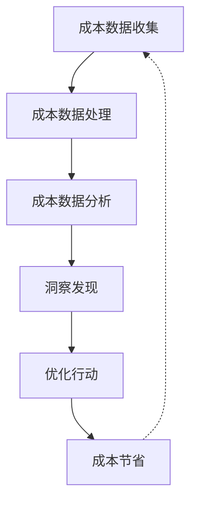
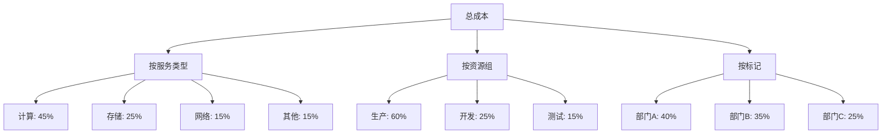

# Azure 成本分析

> [!NOTE]
> 本文档详细介绍了 Azure 成本分析功能，帮助您深入了解云支出模式，识别成本优化机会，并做出明智的财务决策。

## 目录

- [成本分析概述](#成本分析概述)
- [成本分析工具](#成本分析工具)
- [成本数据维度](#成本数据维度)
- [成本分析视图](#成本分析视图)
- [成本预测](#成本预测)
- [成本异常检测](#成本异常检测)
- [成本分配](#成本分配)
- [成本分析最佳实践](#成本分析最佳实践)
- [成本报告](#成本报告)
- [高级分析场景](#高级分析场景)

## 成本分析概述

成本分析是 Azure 成本管理的核心功能，它允许您深入了解 Azure 支出，识别趋势，发现异常，并找出优化机会。

### 成本分析的价值

1. **可见性与透明度**
   - 全面了解云支出
   - 按各种维度分析成本

2. **成本优化**
   - 识别浪费和优化机会
   - 量化潜在节省

3. **预算管理**
   - 跟踪实际支出与预算
   - 预测未来支出

4. **成本分配**
   - 将成本分配给业务单位
   - 实现准确的内部计费

### 成本分析流程

## 成本分析工具

### Azure 成本管理

1. **Azure 门户中的成本分析**
   - 内置的交互式分析工具
   - 丰富的可视化和筛选选项

2. **成本管理 API**
   - 以编程方式访问成本数据
   - 集成到自定义解决方案

3. **Azure 成本管理 Power BI 连接器**
   - 在 Power BI 中创建自定义报告
   - 与其他数据源结合分析

### 第三方工具

1. **云成本管理平台**
   - 提供跨云分析
   - 专业的成本优化建议

2. **财务管理系统集成**
   - 与企业财务系统集成
   - 全面的财务视图

## 成本数据维度

Azure 成本数据可以按多个维度进行分析：

### 组织维度

1. **管理组**
   - 企业级视图
   - 跨多个订阅的成本

2. **订阅**
   - 按订阅分析成本
   - 比较不同订阅的支出

3. **资源组**
   - 项目或应用程序级成本
   - 相关资源的分组成本

4. **资源**
   - 单个资源级别的成本
   - 详细的资源使用情况

### 资源维度

1. **服务类型**
   - 计算、存储、网络等
   - 识别成本最高的服务

2. **位置/区域**
   - 按地理区域分析成本
   - 比较不同区域的价格

3. **资源类型**
   - 虚拟机、存储账户、数据库等
   - 特定资源类型的成本趋势

### 标记维度

1. **业务单位标记**
   - 按部门或团队分析成本
   - 内部成本分配

2. **环境标记**
   - 生产、测试、开发环境成本
   - 环境间成本比较

3. **项目标记**
   - 特定项目的成本
   - 项目预算跟踪

4. **应用标记**
   - 按应用程序分析成本
   - 应用程序总拥有成本

### 时间维度

1. **日/周/月/季/年**
   - 不同时间粒度的成本趋势
   - 季节性模式识别

2. **自定义日期范围**
   - 特定时间段的成本分析
   - 活动或项目的成本跟踪

## 成本分析视图

Azure 成本分析提供多种视图来分析成本数据：

### 累积视图

- 显示一段时间内累积的成本
- 识别成本增长趋势
- 预测月末或季末总成本

### 每日视图

- 显示每日成本波动
- 识别异常支出日
- 分析工作日与非工作日模式

### 透视表视图

- 多维度成本分析
- 按服务、位置、标记等交叉分析
- 深入了解成本构成

### 饼图/环形图视图

- 显示成本分布
- 识别主要成本贡献者
- 比较不同类别的相对成本

### 示例：多维度成本分析

## 成本预测

### 预测方法

1. **趋势分析**
   - 基于历史数据的线性预测
   - 识别长期成本趋势

2. **季节性分析**
   - 考虑周期性模式
   - 更准确的月度/季度预测

3. **机器学习预测**
   - 考虑多种因素的高级预测
   - 自动调整预测模型

### 预测应用场景

1. **预算规划**
   - 预测未来期间的支出
   - 设置合理的预算金额

2. **资源规划**
   - 预测资源需求增长
   - 提前规划容量扩展

3. **财务报告**
   - 为财务团队提供预测
   - 支持财务决策

### 预测准确性

- 短期预测（1-3 个月）通常较准确
- 长期预测需要定期调整
- 考虑业务变化和新项目的影响

## 成本异常检测

### 异常类型

1. **突发性成本增加**
   - 单日或短期内的显著增加
   - 可能表示资源配置错误或攻击

2. **渐进性成本增加**
   - 成本持续增长超过预期
   - 可能表示资源泄漏或未优化配置

3. **使用模式变化**
   - 资源使用模式的显著变化
   - 可能表示应用行为变化

### 异常检测方法

1. **统计分析**
   - 基于历史数据的统计模型
   - 识别超出正常范围的成本

2. **机器学习模型**
   - 学习正常的成本模式
   - 自动识别异常情况

3. **规则基础检测**
   - 基于预定义规则
   - 例如：成本增加超过 20%

### 异常响应流程

1. **检测**
   - 自动识别成本异常

2. **通知**
   - 向相关人员发送警报

3. **调查**
   - 分析异常原因

4. **修复**
   - 实施必要的纠正措施

5. **预防**
   - 更新策略和控制措施

## 成本分配

### 成本分配模型

1. **直接分配**
   - 基于资源标记直接分配成本
   - 最简单和最透明的方法

2. **比例分配**
   - 基于使用比例分配共享资源成本
   - 适用于共享服务

3. **加权分配**
   - 基于预定义权重分配成本
   - 适用于复杂的共享资源

### 分配策略

1. **按部门/团队**
   - 将成本分配给组织单位
   - 支持部门预算管理

2. **按项目**
   - 将成本分配给特定项目
   - 支持项目财务跟踪

3. **按应用/服务**
   - 将成本分配给应用程序
   - 计算应用程序总拥有成本

### 成本分配最佳实践

1. **一致的标记策略**
   - 实施强制性标记
   - 确保标记一致性

2. **共享资源分配规则**
   - 明确定义共享资源的分配规则
   - 获得利益相关者认同

3. **定期审查和调整**
   - 定期验证分配准确性
   - 根据业务变化调整分配规则

## 成本分析最佳实践

### 数据质量

1. **完整的资源标记**
   - 确保所有资源都有适当的标记
   - 实施标记治理策略

2. **一致的命名约定**
   - 使用一致的资源命名
   - 便于识别和分组

3. **历史数据保留**
   - 保留足够的历史成本数据
   - 支持趋势分析和比较

### 分析频率

1. **日常监控**
   - 快速检查关键指标
   - 识别明显异常

2. **周度分析**
   - 详细审查成本趋势
   - 识别优化机会

3. **月度深度分析**
   - 全面的成本审查
   - 与预算比较和调整

### 分析深度

1. **高级别摘要**
   - 总体成本趋势
   - 主要成本驱动因素

2. **服务级别分析**
   - 按服务类型详细分析
   - 识别高成本服务

3. **资源级别分析**
   - 分析单个资源成本
   - 识别具体优化目标

## 成本报告

### 标准报告

1. **月度成本摘要**
   - 总体成本和趋势
   - 主要成本驱动因素

2. **预算比较报告**
   - 实际成本与预算比较
   - 差异分析

3. **资源利用率报告**
   - 资源使用情况与成本
   - 识别未充分利用的资源

### 自定义报告

1. **Power BI 报告**
   - 使用 Azure 成本管理连接器
   - 创建交互式仪表板

2. **定制 API 集成**
   - 使用成本管理 API
   - 集成到现有报告系统

3. **导出和分享**
   - 导出 CSV 或 Excel 格式
   - 与利益相关者分享

### 报告自动化

1. **定期导出**
   - 设置自动导出计划
   - 发送到指定存储位置

2. **自动报告生成**
   - 使用 Logic Apps 或 Azure Functions
   - 生成并分发报告

3. **报告订阅**
   - 设置定期报告订阅
   - 自动发送给利益相关者

## 高级分析场景

### 单位经济分析

1. **每用户成本**
   - 计算每用户的云服务成本
   - 跟踪随时间的变化

2. **每交易成本**
   - 计算每业务交易的成本
   - 优化交易处理效率

3. **每应用成本**
   - 计算每个应用的总拥有成本
   - 比较不同应用的成本效率

### 成本与性能分析

1. **成本与性能平衡**
   - 分析成本与性能指标的关系
   - 找到最佳平衡点

2. **性能投资回报**
   - 评估性能提升的成本效益
   - 确定最具价值的优化

### 多云成本比较

1. **跨云提供商比较**
   - 比较不同云提供商的成本
   - 支持多云策略决策

2. **混合云分析**
   - 比较云与本地成本
   - 优化工作负载放置

### 成本归因分析

1. **成本增长因素分析**
   - 识别成本增长的主要因素
   - 量化各因素的影响

2. **成本节省归因**
   - 跟踪优化措施的影响
   - 量化实际节省

## 成本分析工具使用指南

### Azure 门户成本分析

1. **访问路径**
   - Azure 门户 > 成本管理 + 计费 > 成本分析

2. **视图选择**
   - 累积视图、每日视图、透视表等

3. **筛选器设置**
   - 按订阅、资源组、服务等筛选

4. **分组和细分**
   - 按不同维度分组和细分数据

### 成本管理 API

1. **身份验证**
   - 设置 API 访问权限
   - 获取身份验证令牌

2. **查询构建**
   - 构建成本查询
   - 设置适当的筛选器和分组

3. **数据处理**
   - 处理和转换 API 返回的数据
   - 计算所需指标

### Power BI 集成

1. **连接设置**
   - 配置 Azure 成本管理连接器
   - 设置数据刷新计划

2. **模型构建**
   - 创建数据模型和关系
   - 定义计算列和度量值

3. **可视化创建**
   - 创建交互式仪表板
   - 设计关键指标视图

## 参考资源

- [Azure 成本管理文档](https://docs.microsoft.com/azure/cost-management-billing/)
- [Azure 成本管理 API 参考](https://docs.microsoft.com/rest/api/cost-management/)
- [Azure 成本管理 Power BI 连接器](https://docs.microsoft.com/power-bi/connect-data/desktop-connect-azure-cost-management)
- [Azure Well-Architected Framework - 成本优化](https://docs.microsoft.com/azure/architecture/framework/cost/)
- [Azure 成本优化最佳实践](https://azure.microsoft.com/solutions/cost-optimization/) 