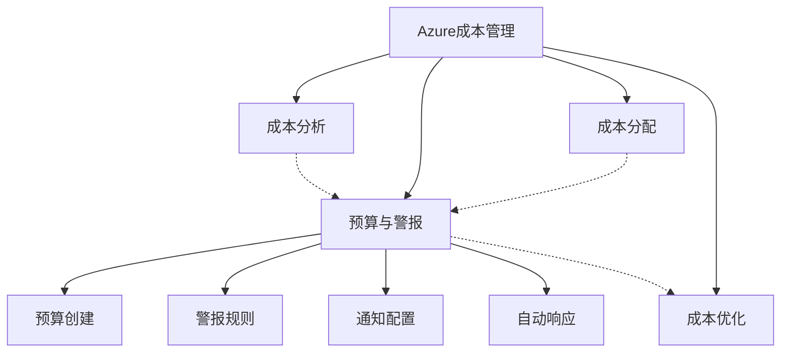
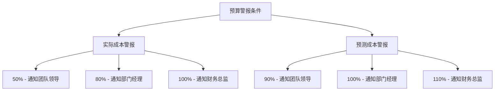

# Azure 预算与警报

> [!NOTE]
> 本文档详细介绍了如何在 Azure 中设置和管理预算与成本警报，帮助您控制云支出并避免意外费用。

## 目录

- [预算与警报概述](#预算与警报概述)
- [预算类型](#预算类型)
- [创建预算](#创建预算)
- [设置预算警报](#设置预算警报)
- [成本警报类型](#成本警报类型)
- [警报通知与操作](#警报通知与操作)
- [预算范围与筛选](#预算范围与筛选)
- [预算最佳实践](#预算最佳实践)
- [常见场景](#常见场景)
- [监控与报告](#监控与报告)

## 预算与警报概述

Azure 预算是一种主动控制成本的工具，允许您设置支出限额并在达到特定阈值时触发警报。通过预算和警报，您可以：

- 设置明确的支出限制
- 及早发现超支趋势
- 自动响应预算超支
- 提高组织的成本意识

### 预算与成本管理的关系

预算是 Azure 成本管理的核心组成部分，与其他成本管理功能协同工作：



## 预算类型

Azure 提供多种预算类型，以满足不同的管理需求：

### 按时间周期划分

1. **月度预算**
   - 每月重置
   - 适合大多数标准场景

2. **季度预算**
   - 每季度重置
   - 适合季度财务规划

3. **年度预算**
   - 每年重置
   - 适合年度财务规划

4. **自定义时间周期**
   - 指定开始和结束日期
   - 适合项目或特定活动

### 按重置周期划分

1. **重置预算**
   - 每个周期结束时重置
   - 适合周期性支出管理

2. **累计预算**
   - 跨周期累计计算
   - 适合长期项目或总支出控制

## 创建预算

### 前提条件

- 具有成本管理贡献者或所有者权限
- 访问 Azure 成本管理 + 计费服务的权限

### 创建步骤

1. **访问成本管理**
   - 导航至 Azure 门户
   - 选择"成本管理 + 计费"
   - 点击"成本管理"下的"预算"

2. **创建新预算**
   - 点击"添加"
   - 输入预算名称和金额

3. **设置预算范围**
   - 选择适用的订阅或资源组
   - 设置适用的服务或资源类型

4. **设置预算周期**
   - 选择重置周期（月度/季度/年度）
   - 设置开始日期和结束日期（可选）

5. **配置筛选器**
   - 按资源组、服务类型、标记等筛选
   - 精确控制预算适用范围

6. **设置警报条件**
   - 配置触发警报的阈值
   - 设置警报接收者

7. **设置自动响应**（可选）
   - 配置预算触发的自动操作

### 示例：创建月度预算

```
预算名称：生产环境-计算服务-月度预算
金额：5000 元
重置周期：每月
范围：订阅 XYZ
筛选条件：服务类型 = 虚拟机、App Service
警报阈值：70%、90%、100%
接收者：operations@example.com, finance@example.com
```

## 设置预算警报

预算警报是预算功能的核心组成部分，可以在达到特定阈值时通知相关人员。

### 警报阈值类型

1. **实际成本阈值**
   - 基于已发生的实际支出
   - 例如：当实际支出达到预算的 80% 时发出警报

2. **预测成本阈值**
   - 基于预测的未来支出
   - 例如：当预测支出将超过预算时发出警报

### 配置警报阈值

- 可以设置多个阈值（例如 50%、75%、90%、100%）
- 每个阈值可以有不同的通知接收者
- 可以为不同阈值配置不同的自动响应

### 警报条件示例



## 成本警报类型

除了预算警报外，Azure 还提供其他类型的成本警报：

### 1. 预算警报

- 基于预设的预算阈值
- 最常用的警报类型

### 2. 信用额度警报

- 适用于拥有 Azure 信用额度的账户
- 当信用额度使用达到特定百分比时触发

### 3. 部门支出配额警报

- 适用于企业协议客户
- 基于部门支出配额触发

### 4. 异常支出警报

- 基于机器学习检测异常支出模式
- 自动识别与历史模式不符的支出

## 警报通知与操作

### 通知方法

1. **电子邮件通知**
   - 发送给指定的电子邮件地址
   - 包含预算详情和当前支出状态

2. **Action Group 集成**
   - 触发 Azure Action Group
   - 支持多种通知渠道（短信、推送通知等）

3. **Azure 门户通知**
   - 在 Azure 门户中显示通知
   - 适用于经常访问门户的管理员

### 自动响应操作

Azure 预算警报可以触发自动响应操作，包括：

1. **触发 Azure Functions**
   - 执行自定义代码逻辑
   - 例如：自动调整资源规模

2. **触发 Logic Apps**
   - 执行复杂的工作流程
   - 集成多种服务和系统

3. **触发 Webhook**
   - 调用外部系统 API
   - 与第三方服务集成

### 自动响应示例

```
预算：开发环境月度预算
阈值：90%
自动响应：
1. 触发 Azure Function 关闭非关键虚拟机
2. 发送详细报告给团队负责人
3. 创建 IT 服务管理系统中的审批工单
```

## 预算范围与筛选

### 预算范围级别

1. **管理组级别**
   - 适用于整个管理组下的所有订阅
   - 适合企业级成本管理

2. **订阅级别**
   - 适用于单个订阅
   - 最常用的预算范围

3. **资源组级别**
   - 适用于特定资源组
   - 适合项目或应用程序级别的预算

4. **账单范围级别**
   - 适用于计费账户或配置文件
   - 适合财务部门使用

### 预算筛选器

可以使用多种筛选器精确控制预算范围：

1. **按服务筛选**
   - 限制特定 Azure 服务
   - 例如：仅计算服务或仅存储服务

2. **按资源筛选**
   - 限制特定资源类型
   - 例如：仅虚拟机或仅 SQL 数据库

3. **按标记筛选**
   - 基于资源标记
   - 例如：环境=生产、部门=IT

4. **按计量筛选**
   - 基于特定计量类别
   - 例如：仅计算小时或仅数据传输

### 筛选器组合示例

```
预算名称：生产数据库预算
范围：订阅 ABC
筛选条件组合：
- 服务类型 = Azure SQL、Cosmos DB
- 标记 = 环境:生产、部门:数据
- 资源组 = 核心服务、分析服务
```

## 预算最佳实践

### 预算设计原则

1. **分层预算结构**
   - 从组织顶层到项目级别
   - 确保预算金额一致且有逻辑关系

2. **适当的预算粒度**
   - 避免过多或过少的预算
   - 通常按团队、项目或环境划分

3. **预算周期与财务周期一致**
   - 与组织财务报告周期保持一致
   - 便于财务对账和审核

### 警报配置最佳实践

1. **渐进式警报阈值**
   - 设置多个预警级别（如 50%、75%、90%、100%）
   - 允许及时响应并采取措施

2. **预测性警报**
   - 使用预测性警报提前发现潜在超支
   - 提供足够时间进行干预

3. **合适的警报接收者**
   - 根据阈值和严重性选择接收者
   - 避免警报疲劳

### 预算治理

1. **定期审查和调整**
   - 每季度审查预算设置
   - 根据业务变化调整预算金额

2. **预算责任制**
   - 明确预算责任人
   - 建立预算超支的问责机制

3. **预算文档化**
   - 记录预算决策和变更
   - 维护预算历史记录

## 常见场景

### 开发/测试环境预算

1. **特点**
   - 通常有固定月度预算
   - 需要严格控制以避免浪费

2. **建议配置**
   - 设置较低的警报阈值（如 60%、80%）
   - 配置自动关闭非工作时间资源的操作
   - 月末接近预算时自动降级服务级别

### 生产环境预算

1. **特点**
   - 业务关键型环境
   - 成本控制需平衡可用性和性能

2. **建议配置**
   - 设置合理的预算余量
   - 警报阈值（如 70%、85%、95%）
   - 超支时优先优化而非限制资源

### 项目预算

1. **特点**
   - 有明确开始和结束日期
   - 通常有固定总预算

2. **建议配置**
   - 使用自定义时间周期预算
   - 设置累计预算而非重置预算
   - 配置里程碑检查点警报

### 部门预算

1. **特点**
   - 覆盖多个项目或服务
   - 通常按季度或年度管理

2. **建议配置**
   - 使用管理组或订阅级别预算
   - 按标记筛选特定部门资源
   - 配置月度和季度检查点

## 监控与报告

### 预算监控工具

1. **Azure 成本管理仪表板**
   - 直观显示预算状态
   - 跟踪实际支出与预算的对比

2. **Azure Monitor 集成**
   - 将预算状态集成到监控仪表板
   - 创建自定义监控视图

3. **Power BI 报告**
   - 创建详细的预算分析报告
   - 深入分析成本趋势和模式

### 预算报告类型

1. **预算执行报告**
   - 显示预算使用情况
   - 突出显示超支和节余区域

2. **预算趋势报告**
   - 显示随时间变化的预算使用情况
   - 识别季节性模式或增长趋势

3. **预算差异报告**
   - 分析实际支出与预算的差异
   - 识别需要调整的领域

### 报告最佳实践

1. **定期分发报告**
   - 向利益相关者定期发送报告
   - 提高组织成本意识

2. **报告自动化**
   - 设置自动生成和分发报告
   - 减少手动报告工作

3. **报告可操作性**
   - 确保报告包含可操作的见解
   - 提供优化建议和下一步行动

## 高级预算策略

### 动态预算调整

1. **基于使用模式**
   - 根据历史使用模式自动调整预算
   - 适应季节性变化

2. **基于业务指标**
   - 将预算与业务 KPI 关联
   - 例如：每用户成本、每交易成本

### 多层预算架构

1. **组织结构对应**
   - 预算层次与组织结构一致
   - 从企业级到团队级

2. **责任分配**
   - 每个层级有明确的预算责任人
   - 授权与责任相匹配

### 预算与资源治理集成

1. **Azure Policy 集成**
   - 使用策略强制执行预算限制
   - 例如：禁止创建高成本资源

2. **RBAC 与预算**
   - 基于预算责任分配权限
   - 限制高成本资源的创建权限

## 参考资源

- [Azure 成本管理文档](https://docs.microsoft.com/azure/cost-management-billing/)
- [Azure 预算教程](https://docs.microsoft.com/azure/cost-management-billing/costs/tutorial-acm-create-budgets)
- [Azure 成本警报最佳实践](https://docs.microsoft.com/azure/cost-management-billing/costs/cost-mgt-alerts-monitor-usage-spending)
- [企业级成本管理策略](https://docs.microsoft.com/azure/cloud-adoption-framework/govern/cost-management/)
- [Azure 成本管理 API](https://docs.microsoft.com/rest/api/cost-management/) 