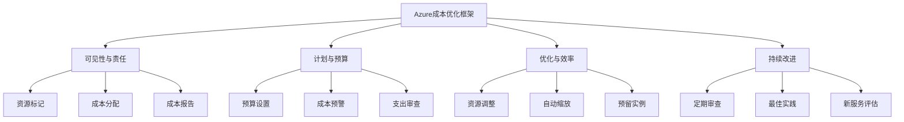
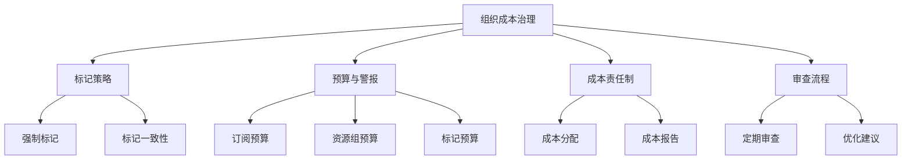

# Azure 成本优化

> [!NOTE]
> 本文档提供了 Azure 成本优化的全面指南，帮助您降低云支出并提高资源利用率。

## 目录

- [成本优化概述](#成本优化概述)
- [成本优化框架](#成本优化框架)
- [计算资源优化](#计算资源优化)
- [存储资源优化](#存储资源优化)
- [网络资源优化](#网络资源优化)
- [数据库服务优化](#数据库服务优化)
- [自动化成本优化](#自动化成本优化)
- [组织策略与治理](#组织策略与治理)
- [成本优化工具](#成本优化工具)
- [常见优化场景](#常见优化场景)

## 成本优化概述

成本优化是云治理的关键支柱之一，旨在确保您的 Azure 资源以最具成本效益的方式运行，同时满足性能和可靠性需求。

### 为什么需要成本优化

1. **控制云支出**
   - 云服务的弹性特性可能导致成本失控
   - 避免资源浪费和过度配置

2. **提高资源利用率**
   - 确保资源得到充分利用
   - 减少闲置资源

3. **支持业务增长**
   - 通过节省成本释放预算用于创新
   - 提高投资回报率 (ROI)

### 成本优化的挑战

1. **复杂的定价模型**
   - 多种服务和定价选项
   - 不同区域的价格差异

2. **资源规划**
   - 预测未来需求
   - 平衡性能和成本

3. **组织协作**
   - 需要多团队协作
   - 建立成本意识文化

## 成本优化框架

Azure 成本优化可以通过以下框架系统化实施：

### 1. 可见性与责任

- 实施标记策略
- 分配成本中心
- 建立成本报告机制

### 2. 计划与预算

- 设置明确的预算
- 实施成本预警
- 定期审查支出

### 3. 优化与效率

- 调整资源规模
- 实施自动缩放
- 利用预留实例

### 4. 持续改进

- 定期审查和优化
- 跟踪行业最佳实践
- 评估新服务和功能

## 计算资源优化

### 虚拟机优化

1. **适当规模调整 (Right-sizing)**
   - 分析 CPU 和内存使用率
   - 选择最适合工作负载的 VM 大小
   - 考虑使用 B 系列 VM 用于低 CPU 使用率的工作负载

2. **关闭未使用的资源**
   - 实施自动关闭/启动计划
   - 开发/测试环境在非工作时间关闭
   - 使用 Azure 自动化或 Azure Functions 实现

3. **利用预留实例**
   - 为稳定工作负载购买预留实例
   - 选择合适的预留期限（1 年或 3 年）
   - 考虑共享预留范围（订阅或管理组）

4. **使用 Spot 实例**
   - 对于可中断的工作负载使用 Spot 实例
   - 批处理作业和容错应用程序
   - 实施适当的处理中断机制

5. **利用 Azure 混合优势**
   - 使用现有的 Windows Server 和 SQL Server 许可证
   - 正确配置许可证类型

### App Service 优化

1. **选择合适的服务计划**
   - 根据需求选择适当的层级
   - 考虑共享基础设施的选项

2. **实施自动缩放**
   - 基于指标设置自动缩放规则
   - 设置合适的最小和最大实例数

3. **使用槽位进行部署**
   - 减少生产环境中的冗余资源

### 容器服务优化

1. **AKS 优化**
   - 使用虚拟节点处理突发负载
   - 实施集群自动缩放
   - 选择成本效益高的节点大小

2. **容器实例**
   - 对短期运行的任务使用容器实例
   - 避免长时间运行未使用的容器

## 存储资源优化

### Blob 存储优化

1. **选择合适的访问层**
   - 热访问层：频繁访问的数据
   - 冷访问层：不常访问的数据（30 天以上）
   - 归档访问层：很少访问的数据（180 天以上）

2. **实施生命周期管理**
   - 自动将数据从热层移至冷层和归档层
   - 设置自动删除过期数据的规则

3. **选择适当的冗余级别**
   - 根据数据重要性选择冗余级别
   - 非关键数据使用 LRS 而非 GRS

### 磁盘存储优化

1. **选择合适的磁盘类型**
   - 标准 HDD：成本敏感的工作负载
   - 标准 SSD：低 IOPS 工作负载
   - 高级 SSD：关键业务工作负载

2. **调整磁盘大小**
   - 避免过度配置
   - 利用磁盘缓存提高性能

3. **共享磁盘**
   - 适当情况下使用共享磁盘
   - 减少总体磁盘数量

## 网络资源优化

### 数据传输优化

1. **减少跨区域数据传输**
   - 将相关服务部署在同一区域
   - 使用内容分发网络 (CDN)

2. **优化出站数据流量**
   - 压缩传输数据
   - 使用缓存减少重复传输

### 网络服务优化

1. **VPN 与 ExpressRoute**
   - 评估 VPN 和 ExpressRoute 的成本效益
   - 选择合适的带宽和冗余级别

2. **负载均衡器**
   - 对非关键应用使用基本负载均衡器
   - 仅在需要时使用标准负载均衡器

3. **应用程序网关**
   - 适当规模调整实例数量
   - 使用自动缩放功能

## 数据库服务优化

### Azure SQL 优化

1. **选择合适的部署选项**
   - 单一数据库、弹性池或托管实例
   - 弹性池适合多个小型数据库

2. **选择合适的定价模型**
   - DTU 模型：简单、可预测的工作负载
   - vCore 模型：需要精细控制和混合优势

3. **自动暂停和恢复**
   - 对开发/测试环境实施自动暂停

4. **存储优化**
   - 实施数据压缩
   - 定期清理历史数据

### Cosmos DB 优化

1. **优化吞吐量**
   - 使用自动缩放吞吐量
   - 选择合适的一致性级别

2. **分区策略**
   - 设计高效的分区键
   - 避免热分区

3. **查询优化**
   - 优化查询减少 RU 消耗
   - 使用索引策略

## 自动化成本优化

### Azure 自动化

1. **自动启动/关闭**
   - 使用 Runbook 自动管理资源
   - 基于时间表或指标触发

2. **自动缩放**
   - 实施基于规则的自动缩放
   - 设置合适的阈值和冷却期

### Azure 策略

1. **强制实施成本控制**
   - 限制可创建的资源类型
   - 强制使用标记

2. **自动修复**
   - 自动调整不合规资源

### DevOps 实践

1. **基础设施即代码**
   - 标准化资源部署
   - 版本控制配置

2. **自动化测试环境**
   - 按需创建和销毁环境
   - 避免长期运行未使用的资源

## 组织策略与治理

### 标记策略

1. **强制标记**
   - 部门/团队
   - 项目/应用
   - 环境（生产、测试、开发）
   - 成本中心

2. **标记用途**
   - 成本分配
   - 资源组织
   - 自动化触发器

### 预算和警报

1. **设置预算**
   - 按订阅、资源组或标记设置预算
   - 定期审查和调整

2. **配置警报**
   - 预算百分比警报
   - 异常支出警报
   - 定向通知到相关团队

### 成本责任制

1. **成本分配**
   - 将成本分配给业务单位
   - 提供详细的成本明细

2. **成本意识文化**
   - 培训和教育
   - 定期成本审查会议

## 成本优化工具

### Azure Cost Management

1. **成本分析**
   - 按各种维度分析成本
   - 识别成本趋势和异常

2. **成本分配**
   - 按标记分配成本
   - 创建自定义视图

3. **预算管理**
   - 创建和跟踪预算
   - 设置警报阈值

### Azure Advisor

1. **成本建议**
   - 识别闲置和未充分利用的资源
   - 提供预留实例建议
   - 调整资源大小建议

2. **实施建议**
   - 评估潜在节省
   - 快速实施优化措施

### Azure 计算器

1. **总拥有成本 (TCO) 计算器**
   - 比较本地与云成本
   - 长期成本规划

2. **定价计算器**
   - 估算新部署成本
   - 比较不同配置选项

## 常见优化场景

### 开发/测试环境优化

1. **自动关闭**
   - 非工作时间自动关闭资源
   - 周末和节假日完全关闭

2. **使用低成本资源**
   - 开发/测试定价
   - 较低性能层级

3. **环境即代码**
   - 按需创建完整环境
   - 使用完成后销毁

### 生产环境优化

1. **负载预测**
   - 根据历史数据预测负载
   - 提前规划容量

2. **混合使用实例类型**
   - 基础负载使用预留实例
   - 变动负载使用即用即付或 Spot 实例

3. **服务选择**
   - 选择最具成本效益的服务
   - 考虑无服务器选项减少闲置成本

### 大型企业优化

1. **企业协议优化**
   - 货币承诺优化
   - 利用企业折扣

2. **集中治理**
   - 管理组结构
   - 集中策略和标准

3. **跨云优化**
   - 多云策略
   - 云服务经纪

## 最佳实践总结

1. **持续监控和优化**
   - 定期审查成本和使用情况
   - 实施自动化优化流程

2. **平衡成本和性能**
   - 不以牺牲用户体验为代价节省成本
   - 定义明确的服务级别目标

3. **建立成本文化**
   - 将成本意识融入开发和运营流程
   - 奖励成本优化行为

4. **利用 Azure 工具和服务**
   - 充分利用 Azure Cost Management
   - 实施 Azure Advisor 建议

5. **持续学习**
   - 跟踪 Azure 新功能和服务
   - 学习行业最佳实践

## 参考资源

- [Azure Cost Management 文档](https://docs.microsoft.com/azure/cost-management-billing/)
- [Azure Well-Architected Framework - 成本优化支柱](https://docs.microsoft.com/azure/architecture/framework/cost/)
- [Azure 成本优化最佳实践](https://azure.microsoft.com/solutions/cost-optimization/)
- [Azure Advisor 文档](https://docs.microsoft.com/azure/advisor/)
- [Azure 架构中心 - 成本优化模式](https://docs.microsoft.com/azure/architecture/patterns/) 