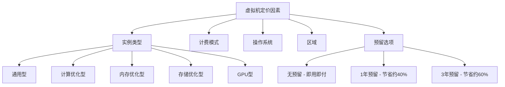
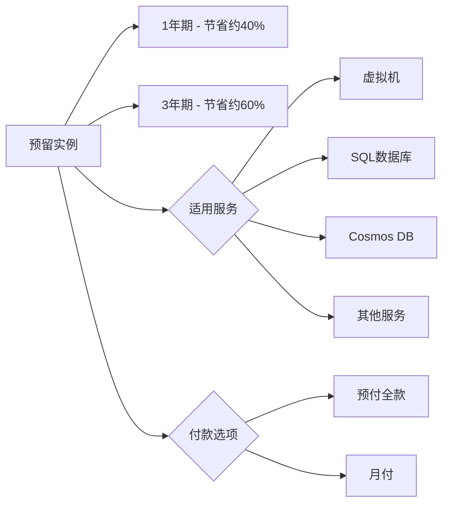

# Azure 定价模型

> [!NOTE]
> 本文档提供了 Azure 定价模型的详细概述，帮助您了解 Azure 服务的计费方式和优化成本的选项。

## 目录

- [定价模型概述](#定价模型概述)
- [计算资源定价](#计算资源定价)
- [存储资源定价](#存储资源定价)
- [网络资源定价](#网络资源定价)
- [数据库服务定价](#数据库服务定价)
- [预留实例](#预留实例)
- [即用即付与承诺使用](#即用即付与承诺使用)
- [免费服务和资源](#免费服务和资源)
- [Azure 定价计算器](#azure-定价计算器)
- [最佳实践](#最佳实践)

## 定价模型概述

Azure 采用多种定价模型，以满足不同客户的需求。了解这些模型对于优化成本至关重要。

### 主要定价模式

1. **即用即付 (Pay-As-You-Go)**
   - 按实际使用量计费
   - 无预付费用或长期承诺
   - 适合测试环境和变化较大的工作负载

2. **预留实例 (Reserved Instances)**
   - 预先承诺使用 1 年或 3 年
   - 相比即用即付可节省 20-72%
   - 适合稳定、可预测的工作负载

3. **Azure 混合优势 (Azure Hybrid Benefit)**
   - 利用现有的本地许可证降低云成本
   - 适用于 Windows Server、SQL Server 等
   - 可节省高达 40% 的虚拟机成本

4. **Spot 实例 (Spot Instances)**
   - 利用 Azure 的闲置容量
   - 显著降低成本（高达 90%）
   - 适合可中断的工作负载

5. **开发/测试定价**
   - 为开发和测试环境提供折扣价格
   - 需要 Visual Studio 订阅

### 计费周期和货币

- 计费周期通常为每月
- 可以选择多种货币进行结算
- 可以设置不同的计费账户和部门

## 计算资源定价

### 虚拟机

虚拟机的定价基于以下因素：

1. **实例类型**
   - 通用型 (B, D, A 系列)
   - 计算优化型 (F 系列)
   - 内存优化型 (E, M 系列)
   - 存储优化型 (L 系列)
   - GPU 型 (N 系列)
   - 高性能计算型 (H 系列)

2. **计费模式**
   - 按秒计费（大多数区域）
   - 最低计费单位为 1 分钟

3. **操作系统**
   - Linux（通常较便宜）
   - Windows（包含许可证成本）

4. **区域**
   - 不同地理区域的价格有所不同

### App Service

App Service 的定价基于：

1. **服务计划**
   - 免费
   - 共享
   - 基本
   - 标准
   - 高级
   - 隔离

2. **实例数量和大小**

3. **额外功能**
   - 自动缩放
   - 备份
   - 自定义域和 SSL

### Azure Functions

Azure Functions 的定价基于：

1. **消费计划**
   - 按执行次数计费
   - 按执行时间计费（GB-秒）
   - 包含免费赠送量

2. **高级计划**
   - 预热实例
   - 更长的运行时间
   - 更可预测的性能

3. **专用计划**
   - 使用 App Service 计划

## 存储资源定价

### Blob 存储

Blob 存储的定价基于：

1. **存储类型**
   - 热访问层
   - 冷访问层
   - 归档访问层

2. **容量**
   - 存储的数据量

3. **操作和数据传输**
   - 读/写操作次数
   - 数据传出量

4. **数据冗余选项**
   - LRS（本地冗余存储）
   - ZRS（区域冗余存储）
   - GRS（地理冗余存储）
   - RA-GRS（读取访问地理冗余存储）

### 磁盘存储

磁盘存储的定价基于：

1. **磁盘类型**
   - 标准 HDD
   - 标准 SSD
   - 高级 SSD
   - Ultra 磁盘

2. **磁盘大小**

3. **事务量**

## 网络资源定价

### 数据传输

1. **入站数据传输**
   - 通常免费

2. **出站数据传输**
   - 按 GB 计费
   - 价格随使用量增加而递减
   - 不同区域有不同费率

### 虚拟网络

1. **基本功能**
   - 虚拟网络创建和管理通常免费

2. **VPN 网关**
   - 按网关类型和运行时间计费

3. **负载均衡器**
   - 标准负载均衡器：按规则数和处理的数据量计费
   - 基本负载均衡器：通常免费

4. **应用程序网关**
   - 按实例小时和数据处理量计费

## 数据库服务定价

### Azure SQL

1. **部署选项**
   - 单一数据库
   - 弹性池
   - 托管实例

2. **定价模型**
   - DTU 模型（数据库事务单位）
   - vCore 模型（虚拟核心）

3. **性能层级**
   - 基本
   - 标准
   - 高级
   - 超高性能

### Cosmos DB

1. **预配吞吐量模式**
   - 按 RU/s（请求单位每秒）计费
   - 可以自动缩放

2. **无服务器模式**
   - 按消耗的 RU 计费

3. **存储**
   - 按 GB 计费

## 预留实例

### 预留实例优势

1. **成本节省**
   - 1 年期：最多节省 40-45%
   - 3 年期：最多节省 60-72%

2. **适用范围**
   - 虚拟机
   - SQL 数据库
   - Cosmos DB
   - Azure Synapse Analytics
   - 其他服务

### 预留实例灵活性

1. **实例大小灵活性**
   - 在同一 VM 系列内自动应用

2. **交换和退款选项**
   - 可以交换预留实例
   - 有限的退款政策

## 即用即付与承诺使用

### 即用即付

1. **优势**
   - 无需前期投资
   - 灵活性高
   - 适合变化较大的工作负载

2. **劣势**
   - 单价较高
   - 成本可能难以预测

### 承诺使用

1. **Azure 承诺使用折扣 (CUD)**
   - 承诺在 1 或 3 年内消费一定金额
   - 可获得 5-15% 的折扣
   - 适用于各种 Azure 服务

2. **企业协议 (EA)**
   - 为大型企业提供的定制化合同
   - 提供更多定价优势和灵活性

## 免费服务和资源

### Azure 免费账户

1. **包含内容**
   - 12 个月的热门免费服务
   - 25+ 永久免费服务
   - $200 的信用额度（30 天内使用）

2. **永久免费服务示例**
   - Azure Kubernetes Service（不含节点）
   - DevOps（5 个用户）
   - Functions（每月 100 万次请求）
   - 静态 Web 应用

### 始终免费的服务

- Azure Active Directory（基本功能）
- 虚拟网络（基本功能）
- 负载均衡器（基本）
- 数据入站传输
- Azure Advisor

## Azure 定价计算器

### 使用方法

1. **访问计算器**
   - [Azure 定价计算器](https://azure.microsoft.com/pricing/calculator/)

2. **选择服务**
   - 添加需要估算的服务

3. **配置参数**
   - 设置区域、层级、实例数等

4. **查看估算**
   - 获取月度和年度成本估算
   - 导出或分享结果

### 最佳实践

- 包含所有相关服务
- 考虑不同区域的价格差异
- 比较不同配置选项
- 定期重新评估估算

## 最佳实践

### 选择正确的定价模型

1. **分析工作负载特性**
   - 稳定性
   - 可预测性
   - 峰值使用模式

2. **混合使用不同模型**
   - 基础负载使用预留实例
   - 峰值负载使用即用即付或 Spot 实例

### 定期审查和优化

1. **使用 Azure Cost Management**
   - 监控实际支出
   - 识别优化机会

2. **调整资源大小**
   - 根据实际使用情况调整资源规模

3. **利用自动缩放**
   - 根据需求自动调整资源

### 利用折扣和优惠

1. **Azure 开发/测试定价**
   - 非生产环境使用折扣价格

2. **Azure 混合优势**
   - 利用现有许可证

3. **企业协议和 CSP**
   - 大规模部署考虑企业协议
   - 通过云解决方案提供商获取服务

## 参考资源

- [Azure 定价概述](https://azure.microsoft.com/pricing/)
- [Azure 定价计算器](https://azure.microsoft.com/pricing/calculator/)
- [Azure 成本管理文档](https://docs.microsoft.com/azure/cost-management-billing/)
- [Azure 预留实例文档](https://docs.microsoft.com/azure/cost-management-billing/reservations/)
- [Azure 免费服务](https://azure.microsoft.com/free/) 