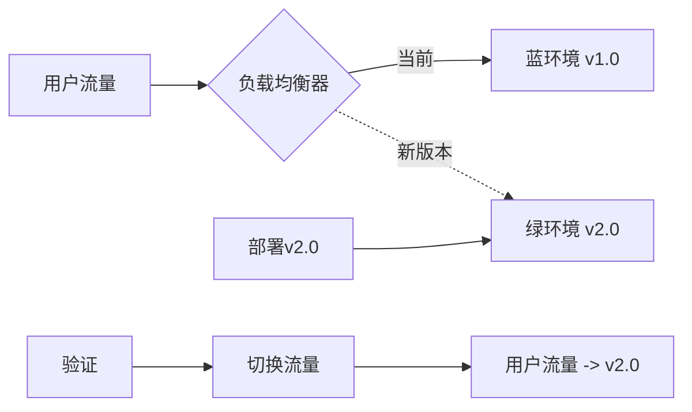
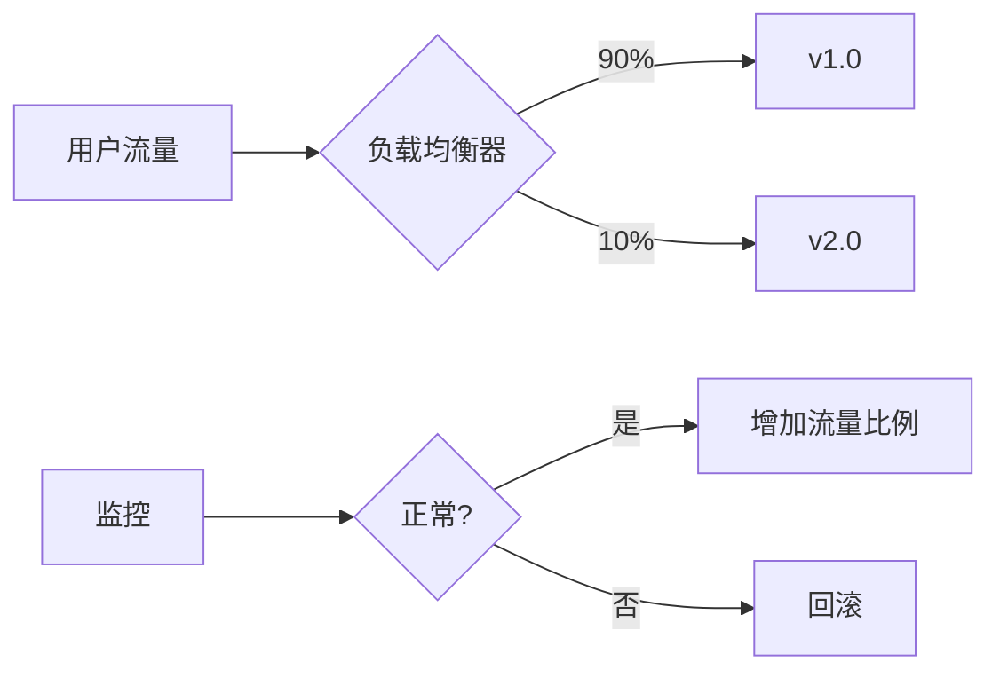

# CI/CD管道

> [!NOTE]
> 本文档提供了Azure DevOps CI/CD管道的详细介绍，包括配置、最佳实践和高级场景。

## 目录

- [CI/CD概述](#cicd概述)
- [Azure Pipelines基础](#azure-pipelines基础)
- [管道类型](#管道类型)
- [YAML管道](#yaml管道)
- [经典管道](#经典管道)
- [构建管道](#构建管道)
- [发布管道](#发布管道)
- [环境与审批](#环境与审批)
- [变量与参数](#变量与参数)
- [模板与重用](#模板与重用)
- [高级场景](#高级场景)
- [安全性考虑](#安全性考虑)
- [监控与诊断](#监控与诊断)
- [最佳实践](#最佳实践)

## CI/CD概述

持续集成和持续部署(CI/CD)是现代DevOps实践的核心，它通过自动化构建、测试和部署流程，加速软件交付并提高质量。

### 持续集成(CI)

持续集成是一种开发实践，开发人员频繁地将代码集成到共享仓库中，每次集成都通过自动化构建和测试进行验证。CI的目标是尽早发现问题，提高代码质量。

**核心原则：**
- 频繁提交代码
- 自动化构建
- 自动化测试
- 快速反馈

### 持续部署(CD)

持续部署是将软件自动部署到生产环境或类生产环境的过程。CD确保软件可以随时以可靠的方式发布。

**核心原则：**
- 自动化部署流程
- 环境一致性
- 可重复的部署
- 可回滚的发布

### CI/CD流程

完整的CI/CD流程通常包括以下阶段：


## Azure Pipelines基础

Azure Pipelines是Azure DevOps中的CI/CD服务，它可以自动构建、测试和部署代码到任何平台和云环境。

### 关键概念

#### 1. 管道(Pipeline)

定义整个CI/CD过程的容器，包含一系列阶段、作业和步骤。

#### 2. 阶段(Stage)

管道中的逻辑分组，例如构建、测试、部署等。阶段可以顺序执行或并行执行。

#### 3. 作业(Job)

阶段中的执行单元，由一系列步骤组成。作业在单个代理上运行，或者作为无代理作业运行。

#### 4. 步骤(Step)

作业中的最小执行单元，可以是脚本或任务。

#### 5. 任务(Task)

预定义的构建或部署操作，如编译代码、运行测试、部署应用等。

#### 6. 代理(Agent)

执行管道作业的计算资源。可以使用Microsoft托管的代理或自托管代理。

#### 7. 触发器(Trigger)

启动管道执行的事件，如代码提交、拉取请求或计划。

## 管道类型

Azure Pipelines支持两种主要类型的管道：YAML管道和经典管道。

### YAML管道

YAML管道使用代码定义管道配置，将其存储在代码仓库中，实现管道即代码(Pipeline as Code)。

**优势：**
- 版本控制
- 代码审查
- 历史跟踪
- 分支策略
- 重用和模板化

### 经典管道

经典管道使用Web界面创建和配置，分为构建管道和发布管道。

**优势：**
- 可视化配置
- 无需学习YAML语法
- 丰富的UI体验
- 简单场景快速配置
- 向导式体验

## YAML管道

YAML管道是Azure Pipelines的推荐方式，它使用YAML文件定义整个CI/CD流程。

### 基本结构

```yaml
# 触发器
trigger:
  - main

# 池（代理池）
pool:
  vmImage: 'ubuntu-latest'

# 变量
variables:
  buildConfiguration: 'Release'

# 阶段
stages:
  - stage: Build
    jobs:
      - job: BuildJob
        steps:
          - script: echo Hello, world!
            displayName: 'Run a script'
          
  - stage: Deploy
    jobs:
      - job: DeployJob
        steps:
          - script: echo Deploying...
            displayName: 'Deploy to environment'
```

### 常用元素

#### 触发器

```yaml
# 分支触发器
trigger:
  branches:
    include:
      - main
      - releases/*
    exclude:
      - releases/old*

# 路径触发器
trigger:
  paths:
    include:
      - src/*
    exclude:
      - docs/*

# 拉取请求触发器
pr:
  - main
  - releases/*

# 禁用触发器
trigger: none
pr: none

# 计划触发器
schedules:
- cron: '0 0 * * *'
  displayName: 每天午夜构建
  branches:
    include:
      - main
  always: true
```

#### 池和代理

```yaml
# 使用Microsoft托管代理
pool:
  vmImage: 'ubuntu-latest'  # 或 'windows-latest', 'macOS-latest'

# 使用自托管代理
pool:
  name: 'Default'
  demands:
    - npm

# 使用特定版本
pool:
  vmImage: 'ubuntu-20.04'
```

#### 变量

```yaml
# 直接定义变量
variables:
  projectName: 'MyProject'
  buildConfiguration: 'Release'

# 变量组
variables:
  - group: 'common-vars'
  - name: 'customVar'
    value: 'customValue'

# 在步骤中使用变量
steps:
  - script: echo $(projectName)
```

#### 参数

```yaml
# 定义参数
parameters:
  - name: environment
    displayName: 'Environment'
    type: string
    default: 'Dev'
    values:
      - Dev
      - Test
      - Prod

# 使用参数
steps:
  - script: echo Deploying to ${{ parameters.environment }}
```

#### 阶段和依赖

```yaml
stages:
  - stage: Build
    jobs:
      - job: BuildJob
        steps:
          - script: echo Building...

  - stage: Test
    dependsOn: Build
    jobs:
      - job: TestJob
        steps:
          - script: echo Testing...

  - stage: Deploy
    dependsOn: Test
    jobs:
      - job: DeployJob
        steps:
          - script: echo Deploying...
```

#### 条件执行

```yaml
stages:
  - stage: Deploy
    condition: and(succeeded(), eq(variables['Build.SourceBranch'], 'refs/heads/main'))
    jobs:
      - job: DeployJob
        steps:
          - script: echo Deploying...
```

### 常用任务

#### 构建任务

```yaml
steps:
  # .NET构建
  - task: DotNetCoreCLI@2
    inputs:
      command: 'build'
      projects: '**/*.csproj'
      arguments: '--configuration $(BuildConfiguration)'

  # Node.js构建
  - task: Npm@1
    inputs:
      command: 'install'
  - task: Npm@1
    inputs:
      command: 'custom'
      customCommand: 'run build'

  # Docker构建
  - task: Docker@2
    inputs:
      containerRegistry: 'myRegistry'
      repository: 'myRepository'
      command: 'build'
      Dockerfile: '**/Dockerfile'
      tags: '$(Build.BuildNumber)'
```

#### 测试任务

```yaml
steps:
  # .NET测试
  - task: DotNetCoreCLI@2
    inputs:
      command: 'test'
      projects: '**/*Tests/*.csproj'
      arguments: '--configuration $(BuildConfiguration) --collect "Code coverage"'

  # Node.js测试
  - task: Npm@1
    inputs:
      command: 'custom'
      customCommand: 'run test'

  # 发布测试结果
  - task: PublishTestResults@2
    inputs:
      testResultsFormat: 'JUnit'
      testResultsFiles: '**/TEST-*.xml'
```

#### 部署任务

```yaml
steps:
  # Azure Web App部署
  - task: AzureWebApp@1
    inputs:
      azureSubscription: 'mySubscription'
      appName: 'myWebApp'
      package: '$(System.ArtifactsDirectory)/**/*.zip'

  # Kubernetes部署
  - task: KubernetesManifest@0
    inputs:
      action: 'deploy'
      kubernetesServiceConnection: 'myK8sConnection'
      manifests: 'kubernetes/*.yml'

  # Azure资源管理器模板部署
  - task: AzureResourceManagerTemplateDeployment@3
    inputs:
      deploymentScope: 'Resource Group'
      azureResourceManagerConnection: 'myARMConnection'
      subscriptionId: '$(subscriptionId)'
      resourceGroupName: '$(resourceGroupName)'
      location: 'East US'
      templateLocation: 'Linked artifact'
      csmFile: 'templates/azuredeploy.json'
      csmParametersFile: 'templates/azuredeploy.parameters.json'
      deploymentMode: 'Incremental'
```

## 经典管道

经典管道分为构建管道和发布管道，通过Web界面配置。

### 构建管道

构建管道负责代码编译、测试和打包，生成可部署的制品。

**主要组件：**
- 触发器设置
- 代理池选择
- 变量定义
- 任务序列
- 制品发布
- 保留策略

### 发布管道

发布管道负责将构建制品部署到各种环境。

**主要组件：**
- 制品来源
- 阶段定义
- 部署任务
- 环境配置
- 审批和门控
- 变量组

## 构建管道

构建管道的主要目标是生成可部署的应用程序制品。

### 常见构建场景

#### .NET应用构建

1. **还原NuGet包**
   - NuGet restore任务

2. **编译解决方案**
   - MSBuild或Visual Studio Build任务

3. **运行单元测试**
   - VSTest或.NET Core测试任务

4. **代码覆盖率分析**
   - 发布代码覆盖率结果

5. **打包应用**
   - 创建Web部署包或NuGet包

#### Node.js应用构建

1. **安装依赖**
   - npm install或yarn任务

2. **运行Lint**
   - npm run lint

3. **运行单元测试**
   - npm test

4. **构建应用**
   - npm run build

5. **打包应用**
   - 压缩构建输出

#### 容器化应用构建

1. **构建Docker镜像**
   - Docker构建任务

2. **运行容器安全扫描**
   - 容器漏洞扫描

3. **标记镜像**
   - 使用版本号和最新标签

4. **推送到容器注册表**
   - Docker推送任务

### 制品管理

构建过程生成的制品需要被保存和管理，以便后续部署。

```yaml
# 发布构建制品
steps:
  - task: PublishBuildArtifacts@1
    inputs:
      PathtoPublish: '$(Build.ArtifactStagingDirectory)'
      ArtifactName: 'drop'
      publishLocation: 'Container'

# 发布管道制品
steps:
  - task: PublishPipelineArtifact@1
    inputs:
      targetPath: '$(Build.ArtifactStagingDirectory)'
      artifact: 'drop'
      publishLocation: 'pipeline'
```

## 发布管道

发布管道负责将应用部署到不同环境，如开发、测试、预生产和生产环境。

### 发布流程

典型的发布流程包括以下阶段：

1. **开发环境部署**
   - 自动触发
   - 基本功能验证

2. **测试环境部署**
   - 可能需要手动审批
   - 运行集成测试和性能测试

3. **预生产环境部署**
   - 需要审批
   - 运行用户验收测试
   - 模拟生产环境

4. **生产环境部署**
   - 需要严格审批
   - 可能使用蓝绿部署或金丝雀发布
   - 部署后监控

### 部署策略

#### 基本部署

最简单的部署策略，直接替换旧版本。

**适用场景：**
- 开发和测试环境
- 内部应用
- 允许短暂停机的应用

#### 蓝绿部署

维护两个相同的环境，一个运行当前版本(蓝)，一个部署新版本(绿)，然后切换流量。



**优势：**
- 零停机时间
- 快速回滚
- 完整的预生产测试

#### 金丝雀发布

逐步将流量从旧版本转移到新版本，监控新版本的性能和错误。



**优势：**
- 风险最小化
- 真实用户验证
- 渐进式发布

#### 特性开关

使用代码中的开关控制特性的启用和禁用，而不需要重新部署。

**优势：**
- 运行时控制特性
- A/B测试支持
- 紧急禁用问题特性

## 环境与审批

环境代表部署目标，如开发、测试或生产环境。审批机制确保代码在部署前经过适当的审核。

### 环境配置

在YAML管道中定义环境：

```yaml
stages:
  - stage: DeployToDev
    jobs:
      - deployment: Deploy
        environment: 'Dev'
        strategy:
          runOnce:
            deploy:
              steps:
                - script: echo Deploying to Dev...

  - stage: DeployToTest
    jobs:
      - deployment: Deploy
        environment: 'Test'
        strategy:
          runOnce:
            deploy:
              steps:
                - script: echo Deploying to Test...
```

### 审批和检查

为环境添加审批和其他检查：

1. **手动审批**
   - 指定审批人员或组
   - 设置超时时间
   - 添加说明

2. **业务小时检查**
   - 限制在特定时间窗口部署

3. **评估检查**
   - 基于Azure Policy评估合规性

4. **服务钩子**
   - 集成外部系统进行验证

## 变量与参数

变量和参数用于存储和传递管道中的配置信息。

### 变量类型

1. **预定义变量**
   - 系统提供的变量，如`Build.BuildNumber`
   - 环境变量，如`PATH`

2. **用户定义变量**
   - 在管道中直接定义
   - 在变量组中定义

3. **运行时变量**
   - 在运行时设置的变量

### 变量作用域

变量可以在不同级别定义，具有不同的作用域：

- **管道级别**：适用于整个管道
- **阶段级别**：仅适用于特定阶段
- **作业级别**：仅适用于特定作业

### 变量组

变量组允许跨多个管道共享变量：

```yaml
variables:
  - group: 'Common-Variables'
  - group: 'Environment-Specific-Variables'
```

### 安全变量

敏感信息应存储为安全变量：

- 在UI中标记为"保密"
- 存储在Azure Key Vault中
- 在日志中不可见

```yaml
variables:
  - group: 'Key-Vault-Variables'
    
# 使用Key Vault任务
steps:
  - task: AzureKeyVault@1
    inputs:
      azureSubscription: 'mySubscription'
      keyVaultName: 'myKeyVault'
      secretsFilter: '*'
```

## 模板与重用

模板允许跨管道重用配置，提高一致性并减少重复。

### 任务组

在经典管道中，任务组允许将一组任务封装为可重用单元。

### YAML模板

在YAML管道中，可以创建和引用模板：

#### 步骤模板

```yaml
# 模板文件：steps/build.yml
parameters:
  buildConfiguration: 'Release'

steps:
  - script: dotnet build --configuration ${{ parameters.buildConfiguration }}
    displayName: 'Build with configuration ${{ parameters.buildConfiguration }}'
```

```yaml
# 主管道文件
steps:
  - template: steps/build.yml
    parameters:
      buildConfiguration: 'Debug'
```

#### 作业模板

```yaml
# 模板文件：jobs/build.yml
parameters:
  name: ''
  pool: ''

jobs:
- job: ${{ parameters.name }}
  pool: ${{ parameters.pool }}
  steps:
  - script: echo Building...
```

```yaml
# 主管道文件
jobs:
  - template: jobs/build.yml
    parameters:
      name: Windows
      pool:
        vmImage: 'windows-latest'
```

#### 阶段模板

```yaml
# 模板文件：stages/deploy.yml
parameters:
  environment: ''

stages:
- stage: Deploy_${{ parameters.environment }}
  jobs:
  - deployment: Deploy
    environment: ${{ parameters.environment }}
    strategy:
      runOnce:
        deploy:
          steps:
          - script: echo Deploying to ${{ parameters.environment }}
```

```yaml
# 主管道文件
stages:
  - template: stages/deploy.yml
    parameters:
      environment: 'Dev'
  - template: stages/deploy.yml
    parameters:
      environment: 'Test'
```

## 高级场景

### 多阶段部署

复杂应用可能需要多阶段部署流程：

```yaml
stages:
  - stage: Build
    jobs:
      - job: BuildJob
        steps:
          - script: echo Building...
          - task: PublishPipelineArtifact@1
            inputs:
              targetPath: '$(Build.ArtifactStagingDirectory)'
              artifact: 'drop'

  - stage: DeployToDev
    dependsOn: Build
    jobs:
      - deployment: Deploy
        environment: 'Dev'
        strategy:
          runOnce:
            deploy:
              steps:
                - task: DownloadPipelineArtifact@2
                  inputs:
                    artifactName: 'drop'
                - script: echo Deploying to Dev...

  - stage: DeployToTest
    dependsOn: DeployToDev
    jobs:
      - deployment: Deploy
        environment: 'Test'
        strategy:
          runOnce:
            deploy:
              steps:
                - task: DownloadPipelineArtifact@2
                  inputs:
                    artifactName: 'drop'
                - script: echo Deploying to Test...
```

### 矩阵策略

矩阵策略允许在多个配置上并行运行作业：

```yaml
jobs:
  - job: Build
    strategy:
      matrix:
        windows:
          imageName: 'windows-latest'
          buildConfiguration: 'Release'
        linux:
          imageName: 'ubuntu-latest'
          buildConfiguration: 'Debug'
        mac:
          imageName: 'macOS-latest'
          buildConfiguration: 'Release'
    pool:
      vmImage: $(imageName)
    steps:
      - script: echo Building on $(imageName) with $(buildConfiguration)
```

### 部署策略

在YAML管道中定义不同的部署策略：

```yaml
jobs:
  - deployment: Deploy
    environment: 'Production'
    strategy:
      # 滚动部署
      rolling:
        maxParallel: 2
        deploy:
          steps:
            - script: echo Rolling deployment

  - deployment: DeployWithCanary
    environment: 'Production'
    strategy:
      # 金丝雀部署
      canary:
        increments: [10, 20, 70]
        deploy:
          steps:
            - script: echo Canary deployment
```

### 资源触发器

基于外部资源变化触发管道：

```yaml
resources:
  pipelines:
    - pipeline: myAppBuild
      source: 'Build-Pipeline'
      trigger: true

  repositories:
    - repository: templates
      type: git
      name: 'MyProject/Templates'
      ref: refs/heads/main

  containers:
    - container: myContainer
      image: ubuntu:18.04

trigger: none

stages:
  - stage: Deploy
    jobs:
      - job: DeployJob
        steps:
          - script: echo Deploying from $(resources.pipelines.myAppBuild.runName)
```

## 安全性考虑

### 服务连接安全

服务连接用于连接外部服务，应遵循以下安全实践：

- 使用服务主体而非个人凭据
- 应用最小权限原则
- 定期轮换凭据
- 限制服务连接的使用范围

### 密钥管理

敏感信息的安全管理：

- 使用Azure Key Vault存储机密
- 避免在脚本中硬编码密钥
- 使用安全文件存储证书
- 限制对变量组的访问

### 管道权限

管理管道的访问权限：

- 实施资源保护
- 限制管道配置权限
- 审核管道更改
- 保护环境和审批流程

## 监控与诊断

### 管道分析

监控管道性能和健康状况：

- 跟踪成功率和失败率
- 分析构建和部署时间
- 识别瓶颈和优化机会
- 监控资源使用情况

### 诊断技巧

排查管道问题：

- 启用详细日志
- 使用系统诊断任务
- 检查代理诊断日志
- 分析变量值和环境状态

## 最佳实践

### 管道设计

- **保持管道简单**：每个管道专注于单一目的
- **使用模板**：提高一致性和可维护性
- **参数化配置**：避免硬编码值
- **分离构建和部署**：使用独立的构建和部署管道
- **版本控制管道定义**：将YAML管道存储在代码仓库中

### 性能优化

- **并行执行**：使用并行作业加速构建
- **增量构建**：仅构建已更改的部分
- **缓存依赖项**：加速构建过程
- **自托管代理**：针对特定工作负载优化
- **精简任务**：移除不必要的步骤

### 稳定性提升

- **幂等性脚本**：确保脚本可以重复运行
- **错误处理**：适当处理错误和异常
- **超时设置**：防止作业无限期运行
- **健康检查**：验证部署后的应用状态
- **自动回滚**：在失败时自动回滚

### 安全最佳实践

- **代码扫描**：集成安全代码分析
- **依赖项检查**：扫描漏洞
- **最小权限**：应用最小权限原则
- **审计日志**：监控和审计管道活动
- **环境隔离**：严格隔离生产环境

## 结论

Azure Pipelines提供了强大而灵活的CI/CD能力，支持各种开发场景和部署策略。通过采用本文档中的最佳实践，团队可以构建高效、可靠和安全的CI/CD管道，加速软件交付并提高质量。

随着DevOps实践的不断发展，CI/CD管道也在持续演进，引入更多自动化、智能化和安全性功能。保持对最新功能和最佳实践的了解，将帮助团队充分利用Azure Pipelines的能力，实现更高效的软件交付。

## 参考资源

- [Azure Pipelines文档](https://docs.microsoft.com/azure/devops/pipelines/)
- [YAML架构参考](https://docs.microsoft.com/azure/devops/pipelines/yaml-schema)
- [预定义变量参考](https://docs.microsoft.com/azure/devops/pipelines/build/variables)
- [任务参考](https://docs.microsoft.com/azure/devops/pipelines/tasks/)
- [Azure DevOps管道示例](https://github.com/microsoft/azure-pipelines-yaml)

---

> 本文档将持续更新，欢迎提供反馈和建议。 