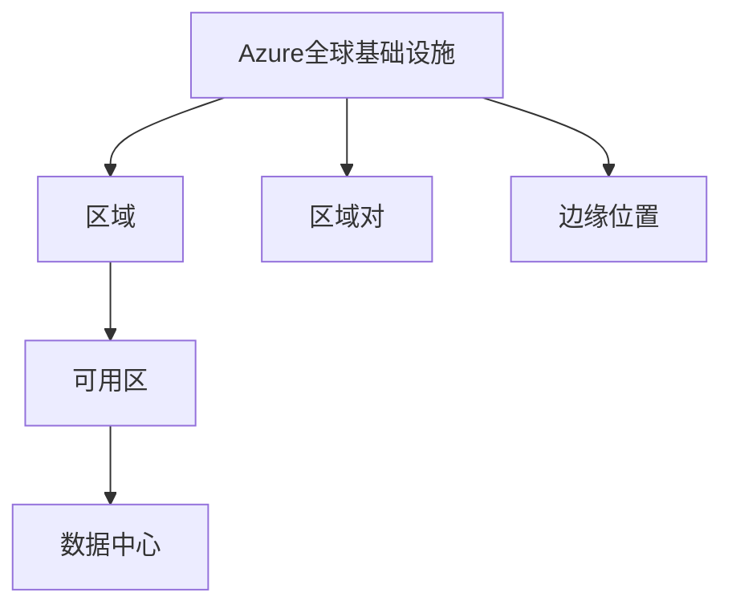
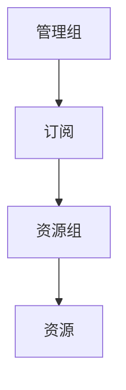

# Azure概述

本文档提供Microsoft Azure云计算平台的全面概述，介绍其核心概念、服务类别和基本架构。

## 目录

- [什么是Azure](#什么是azure)
- [云计算模型](#云计算模型)
- [Azure全球基础设施](#azure全球基础设施)
- [核心服务概览](#核心服务概览)
- [Azure账户结构](#azure账户结构)
- [管理工具](#管理工具)
- [安全与合规](#安全与合规)
- [定价与成本管理](#定价与成本管理)
- [入门指南](#入门指南)

## 什么是Azure

Microsoft Azure是微软提供的公共云计算平台，提供200多种产品和云服务，帮助组织构建、运行和管理应用程序。Azure提供了完整的解决方案，包括基础设施即服务(IaaS)、平台即服务(PaaS)和软件即服务(SaaS)，支持各种编程语言、工具和框架，包括微软特定和第三方软件与系统。

### 主要优势

- **灵活性** - 根据需求快速扩展或缩减资源
- **成本效益** - 按需付费模式，无需大量前期投资
- **全球覆盖** - 60+区域，提供全球范围的服务可用性
- **混合能力** - 无缝连接本地环境和云环境
- **创新性** - 持续集成最新技术，如AI、IoT和区块链
- **安全性** - 企业级安全性和合规性

## 云计算模型

Azure提供三种主要的云计算模型：

### 1. 基础设施即服务 (IaaS)

IaaS提供按需访问基础计算资源，如服务器、存储和网络。

**典型服务：**
- Azure虚拟机
- Azure存储
- Azure虚拟网络

**适用场景：**
- 迁移现有应用程序
- 测试和开发环境
- 存储、备份和恢复

### 2. 平台即服务 (PaaS)

PaaS提供用于开发、测试和部署应用程序的完整开发和部署环境。

**典型服务：**
- Azure App Service
- Azure SQL Database
- Azure Functions

**适用场景：**
- 应用程序开发
- API开发
- 业务分析

### 3. 软件即服务 (SaaS)

SaaS提供完整的应用程序解决方案，由服务提供商管理。

**典型服务：**
- Microsoft 365
- Dynamics 365
- Azure DevOps

**适用场景：**
- 企业应用
- 协作工具
- 客户关系管理

## Azure全球基础设施

Azure全球基础设施由以下组件构成：

### 区域 (Regions)

Azure区域是一个地理区域内的数据中心集合。Azure在全球60多个区域运营，提供计算、网络和存储资源。



### 可用区 (Availability Zones)

可用区是区域内物理隔离的位置，每个可用区由一个或多个数据中心组成，具有独立的电源、冷却和网络。

### 区域对 (Region Pairs)

区域对是同一地理区域内的两个区域，至少相距300英里，用于灾难恢复。

### 数据驻留 (Data Residency)

Azure允许客户指定其数据存储的位置，以满足特定的法规要求。

## 核心服务概览

Azure提供了广泛的服务，可分为以下主要类别：

### 计算服务

- **虚拟机** - 可定制的Windows或Linux虚拟机
- **App Service** - 用于托管Web应用、移动应用后端和RESTful API
- **Azure Functions** - 无服务器计算服务
- **Azure Kubernetes Service (AKS)** - 简化容器化应用程序的部署和管理
- **虚拟机规模集** - 自动扩展的一组相同的虚拟机

### 存储服务

- **Blob存储** - 用于存储非结构化数据的对象存储
- **文件存储** - 完全托管的文件共享
- **表存储** - NoSQL键值存储
- **队列存储** - 消息队列存储
- **磁盘存储** - 用于Azure虚拟机的块级存储卷

### 网络服务

- **虚拟网络** - 隔离和安全的网络环境
- **负载均衡器** - 分发传入流量
- **应用程序网关** - Web流量负载均衡器
- **VPN网关** - 连接Azure虚拟网络和本地网络
- **ExpressRoute** - 通过专用连接扩展本地网络到Azure
- **内容分发网络 (CDN)** - 加速内容交付

### 数据库服务

- **Azure SQL Database** - 完全托管的关系型数据库
- **Azure Cosmos DB** - 全球分布式多模型数据库
- **Azure Database for MySQL/PostgreSQL** - 托管的开源数据库
- **Azure Synapse Analytics** - 企业数据仓库和大数据分析

### AI和机器学习

- **Azure Machine Learning** - 用于构建、训练和部署模型
- **认知服务** - 预构建的AI模型
- **Azure Bot Service** - 智能机器人开发框架
- **Azure Cognitive Search** - AI驱动的云搜索服务

### 物联网 (IoT)

- **IoT Hub** - 连接、监控和管理IoT设备
- **IoT Edge** - 在边缘设备上运行云智能
- **Digital Twins** - 创建物理环境的数字模型
- **Time Series Insights** - 分析时间序列数据

## Azure账户结构

Azure使用层次结构来组织资源和管理访问权限：



### 管理组 (Management Groups)

管理组提供订阅上的范围级别治理，可用于定义策略和访问控制。

### 订阅 (Subscriptions)

订阅是Azure服务的基本计费单位，提供对Azure资源的访问。每个订阅都有其自己的计费和资源限制。

### 资源组 (Resource Groups)

资源组是用于存储共享相同生命周期的资源的逻辑容器。资源组简化了资源管理，并允许按组应用策略。

### 资源 (Resources)

资源是Azure中的服务实例，如虚拟机、数据库或存储账户。

## 管理工具

Azure提供多种工具来管理和监控资源：

### Azure门户 (Portal)

基于Web的统一控制台，提供图形用户界面来管理Azure资源。

### Azure PowerShell

用于管理Azure资源的PowerShell命令集。

```powershell
# 创建资源组示例
New-AzResourceGroup -Name "myResourceGroup" -Location "East US"
```

### Azure CLI

用于管理Azure资源的跨平台命令行工具。

```bash
# 创建资源组示例
az group create --name myResourceGroup --location eastus
```

### Azure Cloud Shell

直接在浏览器中运行的交互式Shell环境。

### Azure Resource Manager (ARM) 模板

用于以声明方式定义和部署Azure资源的JSON文件。

```json
{
  "$schema": "https://schema.management.azure.com/schemas/2019-04-01/deploymentTemplate.json#",
  "contentVersion": "1.0.0.0",
  "resources": [
    {
      "type": "Microsoft.Storage/storageAccounts",
      "apiVersion": "2021-04-01",
      "name": "mystorageaccount",
      "location": "eastus",
      "sku": {
        "name": "Standard_LRS"
      },
      "kind": "StorageV2"
    }
  ]
}
```

### Azure Monitor

提供全面的解决方案来收集、分析和响应来自云和本地环境的遥测数据。

## 安全与合规

Azure提供多层安全保护：

### Azure Active Directory (Azure AD)

云端身份和访问管理服务，帮助员工登录和访问资源。

### Azure Security Center

统一的安全管理系统，提供高级威胁保护。

### Azure Key Vault

用于管理密钥、密码和证书的安全存储。

### Azure Defender

为混合工作负载提供高级威胁防护。

### 合规性认证

Azure符合多种国际和行业特定合规标准，包括：

- ISO 27001
- GDPR
- HIPAA
- FedRAMP
- SOC 1, 2, 3

## 定价与成本管理

Azure使用基于消费的定价模型：

### 定价模型

- **即用即付** - 按实际使用量付费
- **预留实例** - 预先承诺使用期限，享受折扣
- **Spot实例** - 利用多余容量，获得大幅折扣

### 成本管理工具

- **Azure定价计算器** - 估算部署成本
- **总拥有成本(TCO)计算器** - 比较本地与云部署成本
- **Azure成本管理** - 监控和优化云支出
- **预算和警报** - 设置支出限制和通知

## 入门指南

### 创建Azure账户

1. 访问 [Azure官网](https://azure.microsoft.com/)
2. 点击"免费账户"或"开始免费使用"
3. 使用Microsoft账户登录或创建新账户
4. 提供必要的个人信息和付款详情
5. 验证身份并完成注册

### 首次使用建议

1. **探索Azure门户** - 熟悉界面和基本导航
2. **创建资源组** - 组织和管理相关资源
3. **尝试快速入门教程** - 部署简单的应用或服务
4. **设置成本警报** - 避免意外支出
5. **了解安全最佳实践** - 保护您的资源和数据

## 参考资源

- [Azure官方文档](https://docs.microsoft.com/azure/)
- [Azure架构中心](https://docs.microsoft.com/azure/architecture/)
- [Azure学习路径](https://docs.microsoft.com/learn/azure/)
- [Azure更新](https://azure.microsoft.com/updates/) 