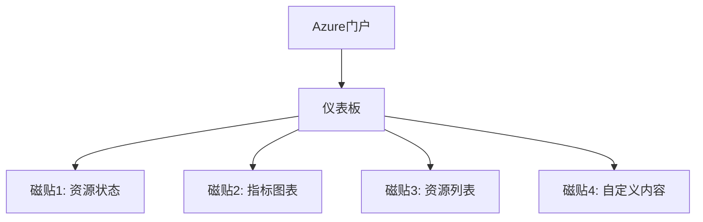

# Azure门户

本文档详细介绍Azure门户的功能、界面和使用方法，帮助您有效地管理和监控Azure资源。

## 目录

- [Azure门户概述](#azure门户概述)
- [界面导航](#界面导航)
- [个性化设置](#个性化设置)
- [资源管理](#资源管理)
- [监控与诊断](#监控与诊断)
- [云Shell](#cloud-shell)
- [移动应用](#移动应用)
- [辅助功能](#辅助功能)
- [性能优化](#性能优化)
- [常见问题](#常见问题)

## Azure门户概述

Azure门户是一个基于Web的统一控制台，提供了一个图形用户界面来管理和监控Azure资源。它允许您创建、配置、管理和监控从简单的Web应用到复杂的云部署的所有内容。

### 主要特点

- **统一管理** - 在单一界面管理所有Azure资源
- **个性化体验** - 自定义仪表板和视图
- **可视化监控** - 通过图表和指标监控资源
- **集成工具** - 内置Cloud Shell、资源浏览器等工具
- **基于角色的访问控制** - 精细的权限管理
- **全球可用性** - 支持多种语言和区域

### 访问方式

可以通过以下URL访问Azure门户：
- [https://portal.azure.com](https://portal.azure.com) - 全球版本
- [https://portal.azure.cn](https://portal.azure.cn) - 中国版本
- [https://portal.azure.us](https://portal.azure.us) - 美国政府版本

## 界面导航

Azure门户的界面由多个关键元素组成，帮助您有效导航和管理资源。

### 顶部导航栏

顶部导航栏包含以下元素：

- **全局搜索** - 快速查找资源、服务和文档
- **云Shell** - 内置命令行界面
- **目录和订阅筛选器** - 切换目录和订阅
- **通知** - 查看部署状态和系统通知
- **设置** - 配置门户首选项
- **帮助和支持** - 获取帮助和提交支持请求
- **用户信息** - 查看登录信息和切换目录

### 左侧导航菜单

左侧导航菜单提供对以下内容的访问：

- **主页** - 返回门户主页
- **所有服务** - 查看所有可用的Azure服务
- **收藏夹** - 快速访问常用服务
- **最近使用的服务** - 最近访问的服务列表
- **资源组** - 管理资源组
- **Azure服务** - 按类别组织的服务

### 仪表板

仪表板是一个可自定义的视图，可以显示您选择的资源和指标：



## 个性化设置

Azure门户提供了多种个性化选项，使您可以根据自己的工作方式自定义体验。

### 自定义仪表板

创建和自定义仪表板：

1. 在门户中点击"仪表板"
2. 点击"新建仪表板"或编辑现有仪表板
3. 添加、移除或重新排列磁贴
4. 调整磁贴大小和位置
5. 点击"完成自定义"保存更改

### 创建多个仪表板

您可以创建多个专用仪表板：

- 按项目或应用程序创建仪表板
- 按团队或部门创建仪表板
- 为监控和诊断创建专用仪表板
- 共享仪表板与团队成员

### 设置收藏夹

添加常用服务到收藏夹：

1. 浏览到"所有服务"
2. 找到要添加的服务
3. 点击服务名称旁的星形图标
4. 服务将出现在左侧导航菜单的收藏夹部分

### 主题设置

自定义门户外观：

1. 点击顶部导航栏中的设置图标
2. 选择"外观"
3. 选择明亮、深色或高对比度主题
4. 点击"应用"保存更改

## 资源管理

Azure门户提供了多种方式来管理资源，从创建到监控和删除。

### 创建资源

使用门户创建新资源：

1. 点击左侧导航菜单中的"创建资源"
2. 浏览或搜索要创建的资源类型
3. 点击资源并选择"创建"
4. 填写必要的配置信息
5. 点击"查看+创建"验证配置
6. 点击"创建"部署资源

### 资源浏览器

使用资源浏览器查找和管理资源：

1. 在顶部搜索栏中搜索资源
2. 使用筛选器按资源组、类型或位置筛选
3. 点击资源名称查看详细信息和管理选项

### 资源组操作

通过门户管理资源组：

- **创建资源组** - 点击"资源组" > "创建"
- **查看资源** - 点击资源组名称查看其包含的资源
- **管理访问权限** - 使用IAM设置权限
- **设置锁定** - 防止意外修改或删除
- **查看成本** - 分析资源组的支出
- **导出模板** - 导出ARM模板以重新创建资源

### 批量操作

对多个资源执行操作：

1. 在资源列表中选择多个资源
2. 使用顶部菜单执行批量操作，如移动、删除或分配标记

## 监控与诊断

Azure门户提供了强大的监控和诊断功能，帮助您了解资源的性能和健康状况。

### Azure Monitor集成

直接在门户中访问监控功能：

- **指标** - 查看资源性能指标
- **日志** - 查询和分析日志数据
- **警报** - 设置和管理警报规则
- **服务运行状况** - 查看Azure服务的健康状况

### 资源健康状况

检查资源的当前状态：

1. 导航到资源
2. 选择"资源健康状况"
3. 查看当前状态和历史事件

### 诊断设置

配置资源诊断：

1. 导航到资源
2. 选择"诊断设置"
3. 配置要收集的日志和指标
4. 设置目标位置（存储账户、事件中心或Log Analytics）

### 活动日志

查看订阅级别的操作：

1. 在左侧导航菜单中选择"活动日志"
2. 使用筛选器查找特定操作或时间段
3. 导出日志或设置日志配置文件

## Cloud Shell

Azure Cloud Shell是一个基于浏览器的交互式Shell环境，无需本地安装即可管理Azure资源。

### 启动Cloud Shell

在门户中启动Cloud Shell：

1. 点击顶部导航栏中的Cloud Shell图标
2. 选择Bash或PowerShell环境
3. 如果是首次使用，需要配置存储账户

### Cloud Shell功能

Cloud Shell提供多种功能：

- **预安装工具** - Azure CLI、PowerShell、Terraform等
- **文件持久性** - 文件存储在关联的文件共享中
- **编辑器集成** - 内置Monaco编辑器
- **身份验证** - 自动使用门户凭据
- **上传/下载文件** - 在本地和Cloud Shell之间传输文件

### 使用示例

使用Cloud Shell管理资源：

```bash
# 列出所有资源组
az group list --output table

# 创建新的资源组
az group create --name myResourceGroup --location eastus

# 部署ARM模板
az deployment group create \
  --resource-group myResourceGroup \
  --template-file template.json \
  --parameters parameters.json
```

## 移动应用

Azure门户移动应用允许您随时随地监控和管理Azure资源。

### 获取应用

Azure移动应用可在以下平台获取：

- [iOS App Store](https://apps.apple.com/app/azure-mobile/id1219013620)
- [Google Play Store](https://play.google.com/store/apps/details?id=com.microsoft.azure)

### 主要功能

移动应用提供以下功能：

- **资源监控** - 查看资源状态和指标
- **警报通知** - 接收实时警报
- **常见操作** - 执行重启、启动/停止等操作
- **Cloud Shell** - 使用移动设备访问Cloud Shell
- **多账户支持** - 管理多个Azure账户

## 辅助功能

Azure门户致力于为所有用户提供无障碍访问。

### 辅助功能支持

门户包含以下辅助功能：

- **键盘导航** - 完全支持键盘操作
- **屏幕阅读器兼容性** - 与JAWS和NVDA等屏幕阅读器兼容
- **高对比度主题** - 提高文本和界面元素的可见性
- **文本缩放** - 支持浏览器文本缩放
- **ARIA标签** - 改善屏幕阅读器体验

### 键盘快捷键

常用键盘快捷键：

- **G+D** - 导航到仪表板
- **G+A** - 导航到所有资源
- **G+R** - 导航到资源组
- **?** - 显示键盘快捷键帮助

## 性能优化

优化Azure门户的性能和响应速度。

### 提高性能的技巧

- **使用最新浏览器** - Edge、Chrome、Firefox或Safari的最新版本
- **清除缓存** - 定期清除浏览器缓存和Cookie
- **限制仪表板磁贴** - 减少仪表板上的磁贴数量
- **使用筛选器** - 在大型列表中使用筛选器
- **使用专用仪表板** - 为特定任务创建专用仪表板

### 浏览器兼容性

Azure门户支持以下浏览器的最新版本：

- Microsoft Edge
- Google Chrome
- Mozilla Firefox
- Apple Safari

## 常见问题

### 如何在不同订阅之间切换？

点击顶部导航栏中的"目录和订阅"筛选器，然后选择要切换到的订阅。

### 如何共享仪表板？

1. 导航到要共享的仪表板
2. 点击顶部的"共享"
3. 选择共享范围和权限
4. 点击"发布"使仪表板可供其他人访问

### 如何恢复已删除的资源？

1. 导航到资源组
2. 点击"设置"下的"删除的资源"
3. 选择要恢复的资源
4. 点击"恢复"

### 如何自定义资源列表视图？

1. 导航到资源列表
2. 点击列表上方的"编辑列"
3. 添加或删除列
4. 调整列顺序
5. 点击"应用"保存更改

### 如何查找特定资源类型的文档？

1. 导航到资源的创建页面或详细信息页面
2. 查找"了解详细信息"或"文档"链接
3. 或者，点击顶部导航栏中的"帮助和支持"，然后搜索相关文档

### 如何报告门户问题？

1. 点击顶部导航栏中的"帮助和支持"
2. 选择"报告门户问题"
3. 填写问题详情
4. 提交反馈 