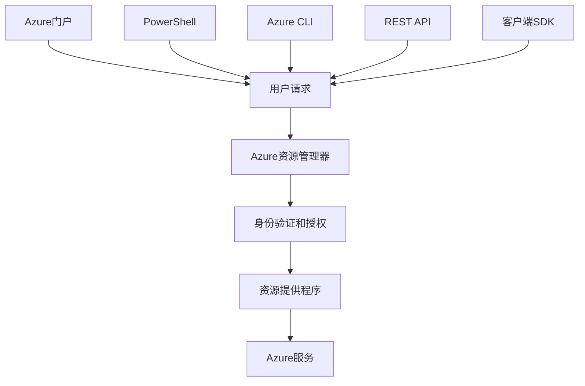

# Azure资源管理

本文档详细介绍Azure资源管理器(ARM)和资源组的概念、功能以及最佳实践，帮助您有效地组织、部署和管理Azure资源。

## 目录

- [Azure资源管理器概述](#azure资源管理器概述)
- [资源组](#资源组)
- [ARM模板](#arm模板)
- [资源管理操作](#资源管理操作)
- [标记和组织](#标记和组织)
- [资源锁定](#资源锁定)
- [策略和合规性](#策略和合规性)
- [最佳实践](#最佳实践)
- [常见问题](#常见问题)

## Azure资源管理器概述

Azure资源管理器(ARM)是Azure的部署和管理服务，提供了一个管理层，使您能够创建、更新和删除Azure账户中的资源。

### 主要优势

- **一致的管理层** - 统一的API，无论使用Azure门户、Azure CLI、PowerShell还是REST API
- **资源组管理** - 将相关资源作为一个组进行管理
- **声明式模板** - 使用ARM模板以声明方式定义基础设施
- **访问控制** - 精细的基于角色的访问控制(RBAC)
- **标记** - 使用标记组织资源
- **计费** - 通过标记和资源组分析成本

### 工作原理



1. 用户发送请求（通过门户、CLI、PowerShell等）
2. ARM接收请求并进行身份验证和授权
3. ARM将请求发送到相应的资源提供程序
4. 资源提供程序执行请求并返回结果

## 资源组

资源组是Azure中用于组织相关资源的逻辑容器。每个Azure资源必须属于一个资源组。

### 资源组特性

- **逻辑容器** - 不是物理容器，只是逻辑分组
- **区域性** - 资源组存在于特定区域，但可以包含不同区域的资源
- **生命周期** - 删除资源组会删除其中的所有资源
- **访问控制** - 可以在资源组级别应用RBAC
- **元数据** - 可以应用标记进行组织和计费

### 资源组设计考虑因素

创建资源组时，应考虑以下因素：

1. **生命周期** - 资源是否共享相同的生命周期？
2. **访问控制** - 资源是否需要相同的访问控制？
3. **计费** - 如何组织资源以便于成本分析？
4. **依赖关系** - 资源之间的依赖关系如何？

### 资源组命名约定

采用一致的命名约定有助于识别和管理资源组：

```
<环境>-<应用>-<区域>-rg
```

例如：`prod-webapp-eastus-rg`

## ARM模板

ARM模板是用于以声明方式定义Azure基础设施的JSON文件。使用模板可以确保部署的一致性和可重复性。

### 模板结构

基本的ARM模板包含以下部分：

```json
{
  "$schema": "https://schema.management.azure.com/schemas/2019-04-01/deploymentTemplate.json#",
  "contentVersion": "1.0.0.0",
  "parameters": {
    "storageAccountName": {
      "type": "string",
      "metadata": {
        "description": "存储账户的名称"
      }
    }
  },
  "variables": {
    "storageAccountSku": "Standard_LRS"
  },
  "resources": [
    {
      "type": "Microsoft.Storage/storageAccounts",
      "apiVersion": "2021-04-01",
      "name": "[parameters('storageAccountName')]",
      "location": "[resourceGroup().location]",
      "sku": {
        "name": "[variables('storageAccountSku')]"
      },
      "kind": "StorageV2"
    }
  ],
  "outputs": {
    "storageEndpoint": {
      "type": "string",
      "value": "[reference(parameters('storageAccountName')).primaryEndpoints.blob]"
    }
  }
}
```

### 模板参数文件

参数文件用于为模板提供特定环境的值：

```json
{
  "$schema": "https://schema.management.azure.com/schemas/2019-04-01/deploymentParameters.json#",
  "contentVersion": "1.0.0.0",
  "parameters": {
    "storageAccountName": {
      "value": "mystorageaccount"
    }
  }
}
```

### 部署ARM模板

可以使用多种方法部署ARM模板：

#### 使用Azure门户

1. 导航到"创建资源"
2. 搜索并选择"模板部署"
3. 点击"创建"
4. 选择"构建自己的模板"
5. 上传或粘贴模板
6. 提供参数值并部署

#### 使用Azure CLI

```bash
# 创建资源组
az group create --name myResourceGroup --location eastus

# 部署模板
az deployment group create \
  --name myDeployment \
  --resource-group myResourceGroup \
  --template-file template.json \
  --parameters parameters.json
```

#### 使用PowerShell

```powershell
# 创建资源组
New-AzResourceGroup -Name myResourceGroup -Location "East US"

# 部署模板
New-AzResourceGroupDeployment `
  -Name myDeployment `
  -ResourceGroupName myResourceGroup `
  -TemplateFile template.json `
  -TemplateParameterFile parameters.json
```

### 模板函数

ARM模板支持多种函数来动态生成值：

- **字符串函数**：concat, substring, replace
- **数组和对象函数**：length, first, last
- **部署函数**：deployment, resourceGroup
- **资源函数**：reference, resourceId
- **逻辑函数**：if, equals, greater, less

示例：

```json
"variables": {
  "storageName": "[concat('storage', uniqueString(resourceGroup().id))]"
}
```

## 资源管理操作

### 创建资源

使用Azure门户、CLI、PowerShell或SDK创建资源：

```azurecli
# 使用Azure CLI创建存储账户
az storage account create \
  --name mystorageaccount \
  --resource-group myResourceGroup \
  --location eastus \
  --sku Standard_LRS
```

### 更新资源

更新现有资源的属性：

```azurecli
# 更新存储账户SKU
az storage account update \
  --name mystorageaccount \
  --resource-group myResourceGroup \
  --sku Standard_GRS
```

### 移动资源

将资源移动到不同的资源组或订阅：

```azurecli
# 移动资源到另一个资源组
az resource move \
  --destination-group targetResourceGroup \
  --ids /subscriptions/{subscription-id}/resourceGroups/{source-group}/providers/Microsoft.Storage/storageAccounts/mystorageaccount
```

### 删除资源

删除不再需要的资源：

```azurecli
# 删除单个资源
az storage account delete \
  --name mystorageaccount \
  --resource-group myResourceGroup

# 删除整个资源组
az group delete --name myResourceGroup
```

## 标记和组织

标记是应用于Azure资源的名称-值对，用于对资源进行分类和组织。

### 标记用途

- **组织资源** - 按部门、环境或项目分类
- **成本管理** - 分析和分配成本
- **运营管理** - 基于环境或重要性分组
- **自动化** - 基于标记触发操作
- **合规性** - 识别需要特定合规性的资源

### 标记限制

- 每个资源最多可以有50个标记
- 标记名称最多512个字符，值最多256个字符
- 资源组的标记不会继承到资源

### 标记策略

常用的标记包括：

- **Environment**: Production, Development, Test
- **Department**: Finance, HR, IT
- **Project**: ProjectX, Migration2023
- **Owner**: Email or department
- **CostCenter**: Cost center code

### 应用标记

```azurecli
# 为资源组添加标记
az group update --name myResourceGroup --tags Environment=Production Department=Finance

# 为资源添加标记
az resource tag --tags Environment=Production CostCenter=CC123 \
  --ids /subscriptions/{subscription-id}/resourceGroups/{resource-group}/providers/Microsoft.Storage/storageAccounts/mystorageaccount
```

## 资源锁定

资源锁定可防止资源被意外删除或修改。

### 锁定类型

- **ReadOnly** - 只允许读取操作，禁止修改或删除
- **CanNotDelete** - 允许修改但禁止删除

### 应用锁定

```azurecli
# 创建不可删除锁定
az lock create \
  --name myLock \
  --resource-group myResourceGroup \
  --lock-type CanNotDelete

# 创建只读锁定
az lock create \
  --name myReadOnlyLock \
  --resource-group myResourceGroup \
  --lock-type ReadOnly
```

### 删除锁定

```azurecli
# 删除锁定
az lock delete --name myLock --resource-group myResourceGroup
```

## 策略和合规性

Azure策略允许您创建、分配和管理定义规则和效果的策略，以确保资源符合公司标准和服务级别协议。

### 策略定义

策略定义指定资源应符合的条件和效果：

```json
{
  "properties": {
    "displayName": "允许的存储账户SKU",
    "description": "此策略限制可以部署的存储账户SKU",
    "mode": "Indexed",
    "parameters": {},
    "policyRule": {
      "if": {
        "allOf": [
          {
            "field": "type",
            "equals": "Microsoft.Storage/storageAccounts"
          },
          {
            "not": {
              "field": "Microsoft.Storage/storageAccounts/sku.name",
              "in": ["Standard_LRS", "Standard_GRS"]
            }
          }
        ]
      },
      "then": {
        "effect": "deny"
      }
    }
  }
}
```

### 策略分配

将策略分配到特定范围（管理组、订阅或资源组）：

```azurecli
# 分配策略
az policy assignment create \
  --name 'allowed-storage-skus' \
  --policy 'allowed-storage-skus' \
  --resource-group myResourceGroup
```

### 策略效果

策略可以有不同的效果：

- **Deny** - 阻止不符合条件的资源请求
- **Audit** - 允许请求但标记为不合规
- **AuditIfNotExists** - 检查相关资源是否存在
- **DeployIfNotExists** - 如果不存在则部署相关资源
- **Modify** - 添加、更新或删除资源属性

### 策略合规性

定期检查资源是否符合分配的策略：

```azurecli
# 检查策略合规性
az policy state list --resource-group myResourceGroup
```

## 最佳实践

### 资源组最佳实践

1. **按生命周期分组** - 将共享相同生命周期的资源放在同一资源组中
2. **限制资源组范围** - 避免创建过大的资源组
3. **考虑访问控制** - 根据访问控制需求组织资源
4. **考虑区域** - 尽可能将资源放在同一区域的资源组中
5. **命名约定** - 使用一致的命名约定

### ARM模板最佳实践

1. **模块化设计** - 创建可重用的嵌套模板
2. **使用参数文件** - 为不同环境创建不同的参数文件
3. **使用输出** - 捕获关键信息用于后续部署
4. **版本控制** - 将模板存储在版本控制系统中
5. **测试模板** - 在部署前验证模板

### 标记最佳实践

1. **制定标记策略** - 定义标准标记和命名约定
2. **强制执行标记** - 使用Azure策略强制执行必要的标记
3. **自动化标记** - 使用自动化脚本应用标记
4. **定期审核** - 定期检查和更新标记
5. **限制标记数量** - 专注于最有价值的标记

## 常见问题

### 资源组和订阅有什么区别？

订阅是Azure服务的计费和安全边界，而资源组是订阅内部用于组织和管理资源的逻辑容器。

### 如何选择资源的最佳区域？

选择区域时，考虑以下因素：
- 数据驻留要求和合规性
- 靠近用户的位置（减少延迟）
- 可用的服务（并非所有服务在所有区域都可用）
- 成本（不同区域的价格可能不同）

### 如何管理大型ARM模板？

对于复杂的部署，可以：
- 使用嵌套模板拆分功能
- 使用链接模板进行模块化
- 利用资源复制减少重复
- 使用参数文件管理不同环境

### 删除资源组会发生什么？

删除资源组会删除其中的所有资源。此操作不可逆，因此在删除前请确保：
- 备份重要数据
- 记录资源配置（如果需要重新创建）
- 检查是否有资源锁定

### 如何处理跨资源组的依赖关系？

虽然最好避免跨资源组的依赖关系，但如果必要：
- 使用资源ID引用其他资源组中的资源
- 在ARM模板中使用输出和参数传递信息
- 考虑使用服务端点或私有链接进行连接 