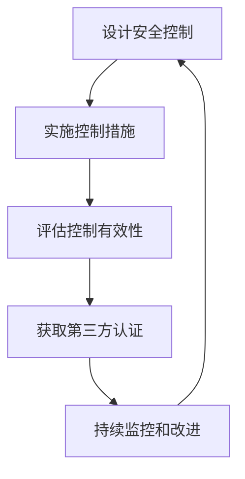
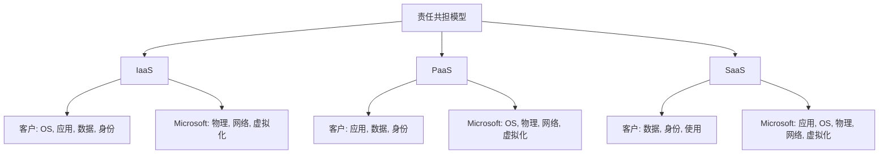
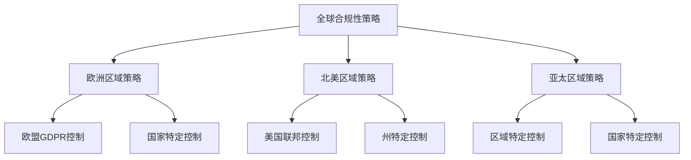

# 合规性

> [!NOTE]
> 本文档提供了Azure合规性的详细介绍，包括法规与标准合规、合规性工具、最佳实践和常见场景。

## 目录

- [合规性概述](#合规性概述)
- [Azure合规性框架](#azure合规性框架)
- [全球合规性标准](#全球合规性标准)
- [行业特定合规性](#行业特定合规性)
- [区域和国家/地区合规性](#区域和国家地区合规性)
- [合规性工具](#合规性工具)
- [Microsoft 合规性管理器](#microsoft-合规性管理器)
- [Azure Policy](#azure-policy)
- [Microsoft Defender for Cloud](#microsoft-defender-for-cloud)
- [Azure Monitor](#azure-monitor)
- [合规性文档](#合规性文档)
- [合规性责任共担模型](#合规性责任共担模型)
- [合规性最佳实践](#合规性最佳实践)
- [常见合规性场景](#常见合规性场景)

## 合规性概述

合规性是确保组织的IT系统和流程符合适用的法律、法规和行业标准的过程。在云计算环境中，合规性变得更加复杂，涉及到共享责任模型、多区域部署和快速变化的法规环境。

### 合规性的重要性

合规性对组织至关重要，原因如下：

- **法律要求**：满足法律和监管义务
- **风险管理**：减少法律、财务和声誉风险
- **客户信任**：增强客户和合作伙伴信任
- **业务拓展**：进入受监管市场和行业
- **安全增强**：提高整体安全态势

### 合规性挑战

在云环境中实现合规性面临的挑战：

1. **责任共担**：明确云提供商与客户的责任边界
2. **多区域部署**：满足不同地区的法规要求
3. **动态环境**：跟踪快速变化的云资源
4. **法规变化**：适应不断发展的合规性要求
5. **技术复杂性**：管理复杂的云架构

### Azure合规性优势

Azure提供多种优势帮助组织实现合规性：

- **全球合规性覆盖**：支持全球范围内的法规标准
- **内置合规性工具**：提供专用合规性管理工具
- **合规性文档**：详细的合规性资源和证明
- **持续更新**：不断更新以满足新的合规性要求
- **第三方认证**：由独立审计机构验证

## Azure合规性框架

Azure合规性框架是一套全面的控制措施、流程和文档，旨在帮助客户满足合规性要求。

### 框架组件

Azure合规性框架包括以下核心组件：

1. **控制实施**：
   - 技术控制措施
   - 管理控制措施
   - 操作控制措施

2. **合规性流程**：
   - 风险评估
   - 控制评估
   - 持续监控
   - 合规性报告

3. **合规性文档**：
   - 合规性证明
   - 责任矩阵
   - 技术指南
   - 最佳实践

### 合规性方法

Azure采用以下方法确保合规性：



1. **设计安全控制**：基于国际标准设计控制
2. **实施控制措施**：在Azure服务和基础设施中实施
3. **评估控制有效性**：定期测试和评估控制
4. **获取第三方认证**：由独立审计机构验证
5. **持续监控和改进**：不断更新和增强控制

## 全球合规性标准

Azure符合多种全球认可的合规性标准。

### ISO/IEC标准

国际标准化组织(ISO)和国际电工委员会(IEC)标准：

1. **ISO/IEC 27001**：
   - 信息安全管理体系标准
   - 全面的安全控制框架
   - Azure全球范围内认证

2. **ISO/IEC 27017**：
   - 云服务信息安全控制
   - 针对云服务提供商的特定指南
   - 扩展ISO 27001的云安全控制

3. **ISO/IEC 27018**：
   - 云中个人身份信息(PII)保护
   - 数据隐私控制
   - 数据处理者责任

4. **ISO/IEC 22301**：
   - 业务连续性管理体系
   - 灾难恢复和业务连续性
   - 服务可用性保证

### SOC标准

服务组织控制(SOC)报告：

1. **SOC 1 Type 2**：
   - 财务报告相关控制
   - SSAE 18/ISAE 3402标准
   - 内部控制有效性

2. **SOC 2 Type 2**：
   - 安全性、可用性、处理完整性
   - 机密性和隐私控制
   - AICPA Trust Services标准

3. **SOC 3**：
   - SOC 2的公开版本
   - 通用控制摘要
   - 可公开分享

### 支付卡行业标准

支付卡行业数据安全标准(PCI DSS)：

- 支付卡数据处理安全要求
- 12个安全控制领域
- 适用于存储、处理或传输持卡人数据的服务

## 行业特定合规性

Azure满足多种行业特定的合规性要求。

### 医疗保健

医疗保健行业合规性：

1. **HIPAA/HITECH**：
   - 美国医疗保健隐私和安全法规
   - 受保护健康信息(PHI)保护
   - 业务伙伴协议(BAA)支持

2. **HITRUST CSF**：
   - 医疗保健信息安全框架
   - 整合多种标准和法规
   - 风险管理方法

3. **GxP**：
   - 制药和医疗设备良好实践
   - FDA 21 CFR Part 11合规性
   - 验证和质量控制

### 金融服务

金融服务行业合规性：

1. **GLBA**：
   - 美国金融服务现代化法案
   - 金融数据隐私保护
   - 安全保障规则

2. **PSD2**：
   - 欧盟支付服务指令
   - 开放银行API安全
   - 强客户认证

3. **SOX**：
   - 萨班斯-奥克斯利法案
   - 财务报告控制
   - IT控制和审计

### 政府

政府合规性标准：

1. **FedRAMP**：
   - 美国联邦风险与授权管理计划
   - 政府云服务安全评估
   - 高、中、低影响级别

2. **CJIS**：
   - 刑事司法信息服务安全策略
   - 执法数据保护
   - 背景调查要求

3. **DoD CC SRG**：
   - 国防部云计算安全要求指南
   - 国防系统云部署
   - 影响级别2-6

## 区域和国家/地区合规性

Azure满足全球各地区和国家/地区的特定合规性要求。

### 欧洲

欧洲地区合规性：

1. **GDPR**：
   - 欧盟通用数据保护条例
   - 个人数据保护和隐私权
   - 数据处理者和控制者责任

2. **EU-US Privacy Shield**：
   - 欧盟-美国数据传输框架
   - 跨大西洋数据传输
   - 数据保护原则

3. **ENS**：
   - 西班牙国家安全框架
   - 政府云服务安全
   - 高、中、低安全级别

### 亚太地区

亚太地区合规性：

1. **MTCS**：
   - 新加坡多层云安全标准
   - 云服务安全认证
   - 第1-3级安全

2. **IRAP**：
   - 澳大利亚信息安全注册评估师计划
   - 政府数据安全
   - 保护级别评估

3. **中国网络安全法**：
   - 中国数据安全法规
   - 关键信息基础设施保护
   - 数据本地化要求

### 北美

北美地区合规性：

1. **PIPEDA**：
   - 加拿大个人信息保护与电子文件法
   - 商业活动中的隐私保护
   - 数据收集和使用限制

2. **CCPA/CPRA**：
   - 加州消费者隐私法案/加州隐私权法案
   - 消费者数据权利
   - 数据收集和共享透明度

3. **ITAR**：
   - 国际武器贸易条例
   - 军事和国防数据控制
   - 数据访问限制

## 合规性工具

Azure提供多种工具帮助组织实现和维护合规性。

### Microsoft 合规性管理器

Microsoft 365/Azure合规性管理工具：

1. **主要功能**：
   - 合规性评估
   - 控制映射
   - 改进措施建议
   - 合规性分数

2. **评估模板**：
   - 预定义合规性模板
   - 自定义评估
   - 控制库

3. **合规性工作流**：
   - 任务分配
   - 证据收集
   - 进度跟踪
   - 报告生成

### Azure Policy

Azure Policy帮助实施组织标准和评估合规性：

1. **策略定义**：
   - 内置合规性策略
   - 自定义策略创建
   - 策略参数化

2. **策略分配**：
   - 范围选择(管理组、订阅、资源组)
   - 参数配置
   - 排除设置

3. **合规性评估**：
   - 资源合规性状态
   - 不合规资源识别
   - 详细合规性报告

4. **修复选项**：
   - 部署策略效果
   - 手动修复
   - 自动修复任务

**策略定义示例**：

```json
{
  "properties": {
    "displayName": "要求存储账户使用HTTPS",
    "description": "审计要求存储账户仅接受来自安全连接的请求",
    "mode": "Indexed",
    "parameters": {},
    "policyRule": {
      "if": {
        "allOf": [
          {
            "field": "type",
            "equals": "Microsoft.Storage/storageAccounts"
          },
          {
            "field": "Microsoft.Storage/storageAccounts/supportsHttpsTrafficOnly",
            "notEquals": "true"
          }
        ]
      },
      "then": {
        "effect": "audit"
      }
    }
  }
}
```

### Microsoft Defender for Cloud

Microsoft Defender for Cloud(前Azure安全中心)提供合规性管理功能：

1. **监管合规性仪表板**：
   - 多标准合规性视图
   - 合规性分数计算
   - 控制状态跟踪

2. **合规性控制**：
   - 控制映射
   - 实施建议
   - 修复指导

3. **合规性报告**：
   - 详细评估报告
   - 合规性证据
   - 导出功能

### Azure Monitor

Azure Monitor帮助监控合规性状态：

1. **日志分析**：
   - 合规性相关日志收集
   - 自定义查询
   - 异常检测

2. **警报**：
   - 合规性违规警报
   - 阈值和活动警报
   - 通知配置

3. **工作簿**：
   - 交互式合规性报告
   - 自定义可视化
   - 数据导出

## 合规性文档

Azure提供全面的合规性文档，帮助客户了解和证明合规性。

### 合规性证明

Azure提供的合规性证明文档：

1. **认证**：
   - 正式认证证书
   - 审计报告
   - 合规性声明

2. **证明**：
   - 合规性验证
   - 第三方评估
   - 实施证据

### 责任矩阵

责任共担模型文档：

1. **客户责任矩阵(CRM)**：
   - 详细的责任分配
   - 按服务和控制分类
   - 实施指导

2. **控制映射**：
   - 法规要求到Azure控制的映射
   - 控制覆盖分析
   - 差距识别

### 合规性蓝图

预定义的合规性实施指南：

1. **部署模板**：
   - ARM模板
   - 策略定义
   - 角色分配

2. **架构指南**：
   - 参考架构
   - 设计原则
   - 实施步骤

3. **控制文档**：
   - 控制描述
   - 实施指导
   - 测试程序

## 合规性责任共担模型

云合规性基于责任共担模型，明确定义云提供商和客户的责任。

### 责任划分

不同服务模型的责任划分：



### Microsoft责任

Microsoft在合规性方面的责任：

1. **基础设施安全**：
   - 物理安全
   - 网络安全
   - 计算基础设施

2. **服务合规性**：
   - 服务设计中的合规性
   - 内置控制措施
   - 服务认证

3. **透明度**：
   - 合规性文档
   - 审计报告
   - 安全通知

### 客户责任

客户在合规性方面的责任：

1. **数据分类**：
   - 数据敏感性分类
   - 数据处理要求
   - 数据保留策略

2. **身份和访问**：
   - 用户访问控制
   - 权限管理
   - 身份验证控制

3. **应用程序**：
   - 应用程序安全
   - 代码安全
   - 应用合规性

4. **合规性监控**：
   - 持续合规性评估
   - 合规性报告
   - 控制有效性验证

## 合规性最佳实践

### 规划与设计

合规性规划和设计最佳实践：

1. **合规性评估**：
   - 识别适用的法规和标准
   - 评估当前合规性状态
   - 确定合规性差距

2. **合规性策略**：
   - 制定合规性策略和标准
   - 定义合规性目标
   - 建立合规性框架

3. **责任分配**：
   - 明确角色和责任
   - 建立合规性团队
   - 定义问责机制

### 实施与配置

合规性实施和配置最佳实践：

1. **控制实施**：
   - 使用Azure Policy实施控制
   - 应用安全基准
   - 实施技术控制措施

2. **文档管理**：
   - 维护合规性文档
   - 记录控制实施
   - 保存合规性证据

3. **安全配置**：
   - 应用安全强化设置
   - 配置审计和日志记录
   - 实施数据保护控制

### 监控与维护

合规性监控和维护最佳实践：

1. **持续评估**：
   - 定期合规性评估
   - 自动化合规性检查
   - 跟踪合规性状态

2. **变更管理**：
   - 评估变更对合规性的影响
   - 更新合规性控制
   - 维护合规性文档

3. **审计准备**：
   - 准备审计证据
   - 进行内部审计
   - 响应外部审计

## 常见合规性场景

### 多区域部署

管理多区域部署的合规性：

1. **区域特定要求**：
   - 识别每个区域的法规要求
   - 实施区域特定控制
   - 考虑数据驻留要求

2. **统一管理**：
   - 集中合规性管理
   - 使用管理组组织资源
   - 应用分层策略

3. **数据治理**：
   - 实施数据分类
   - 控制数据移动
   - 满足数据本地化要求

**多区域部署策略**：



### 混合云环境

管理混合云环境的合规性：

1. **一致控制**：
   - 跨环境应用一致控制
   - 使用Azure Arc扩展管理
   - 统一策略实施

2. **集中可见性**：
   - 整合合规性视图
   - 跨环境监控
   - 统一报告

3. **数据流管理**：
   - 管理跨环境数据流
   - 实施适当的加密
   - 确保端到端合规性

### 受监管行业

满足受监管行业的特殊要求：

1. **金融服务**：
   - 实施强客户认证
   - 满足交易监控要求
   - 确保数据完整性

2. **医疗保健**：
   - 保护患者健康信息
   - 实施访问控制
   - 维护审计跟踪

3. **政府**：
   - 满足数据主权要求
   - 实施高级安全控制
   - 支持背景调查和人员安全

## 结论

Azure提供全面的合规性功能和工具，帮助组织满足各种全球、行业和区域特定的合规性要求。通过了解责任共担模型，利用Azure的合规性工具，并实施最佳实践，组织可以建立强大的合规性框架，有效管理合规性风险。

随着法规环境的不断变化，Azure持续更新其合规性产品和服务，确保客户能够适应新的要求。定期评估合规性状态，关注法规变化，并利用Azure提供的资源，对于维护有效的合规性计划至关重要。

## 参考资源

- [Azure合规性文档](https://docs.microsoft.com/azure/compliance/)
- [Microsoft信任中心](https://www.microsoft.com/trust-center)
- [Azure合规性产品](https://azure.microsoft.com/overview/trusted-cloud/compliance/)
- [合规性管理器文档](https://docs.microsoft.com/microsoft-365/compliance/compliance-manager)
- [Azure Policy文档](https://docs.microsoft.com/azure/governance/policy/)
- [Microsoft Defender for Cloud合规性](https://docs.microsoft.com/azure/defender-for-cloud/regulatory-compliance-dashboard)

---

> 本文档将持续更新，欢迎提供反馈和建议。 