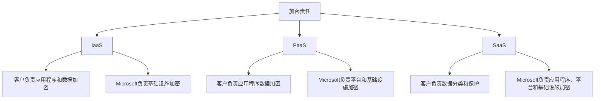
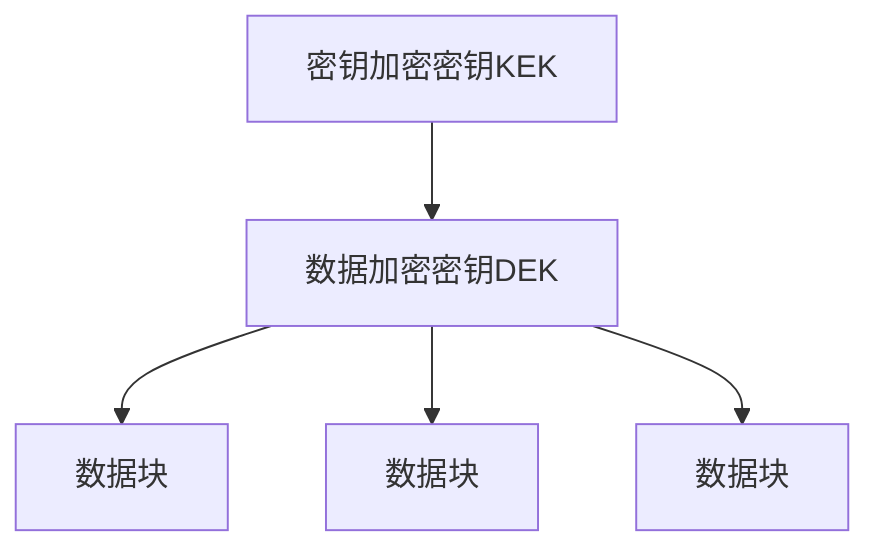
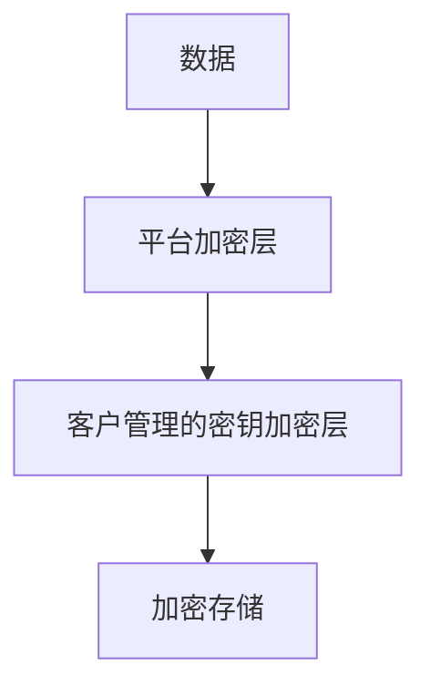

# 数据加密

> [!NOTE]
> 本文档提供了Azure数据加密的详细介绍，包括静态数据加密、传输中数据加密的实现方法、最佳实践和常见场景。

## 目录

- [数据加密概述](#数据加密概述)
- [静态数据加密](#静态数据加密)
- [传输中数据加密](#传输中数据加密)
- [使用中数据加密](#使用中数据加密)
- [密钥管理](#密钥管理)
- [Azure存储服务加密](#azure存储服务加密)
- [Azure数据库加密](#azure数据库加密)
- [虚拟机加密](#虚拟机加密)
- [应用程序级加密](#应用程序级加密)
- [加密最佳实践](#加密最佳实践)
- [合规性与监管](#合规性与监管)
- [常见场景](#常见场景)
- [故障排除](#故障排除)

## 数据加密概述

数据加密是保护数据机密性和完整性的关键技术，通过将明文数据转换为密文来防止未授权访问。在Azure中，加密是保护云数据的基础安全控制。

### 加密状态

Azure提供三种状态的数据加密：

1. **静态数据加密**：保护存储在持久介质上的数据
2. **传输中数据加密**：保护网络传输中的数据
3. **使用中数据加密**：保护内存中处理的数据

### 加密类型

Azure支持多种加密类型：

- **对称加密**：使用相同的密钥加密和解密
- **非对称加密**：使用公钥/私钥对加密和解密
- **信封加密**：使用数据加密密钥(DEK)加密数据，使用密钥加密密钥(KEK)加密DEK

### 加密责任模型

在Azure中，加密责任根据服务模型(IaaS、PaaS、SaaS)而有所不同：



## 静态数据加密

静态数据加密保护存储在持久介质(如磁盘、数据库、存储账户)上的数据。

### Azure存储服务加密(SSE)

Azure存储服务加密自动加密所有存储账户中的数据：

- 默认启用，无法禁用
- 使用256位AES加密
- 对性能影响最小
- 支持Microsoft管理的密钥或客户管理的密钥

### Azure磁盘加密(ADE)

Azure磁盘加密为虚拟机磁盘提供加密：

- 加密操作系统和数据磁盘
- 使用BitLocker(Windows)或dm-crypt(Linux)
- 与Azure Key Vault集成
- 支持托管磁盘和非托管磁盘

### 透明数据加密(TDE)

透明数据加密保护Azure SQL数据库和SQL Managed Instance：

- 实时加密数据库、日志和备份
- 对应用程序透明，无需更改
- 默认启用
- 支持服务管理的密钥或客户管理的密钥

### 静态加密配置

**存储账户加密配置**：

```json
{
  "properties": {
    "encryption": {
      "keySource": "Microsoft.Keyvault",
      "keyvaultproperties": {
        "keyname": "mykey",
        "keyvaulturi": "https://mykeyvault.vault.azure.net"
      }
    }
  }
}
```

**磁盘加密配置**：

```powershell
Set-AzVMDiskEncryptionExtension -ResourceGroupName "MyResourceGroup" `
  -VMName "MyVM" `
  -DiskEncryptionKeyVaultUrl "https://mykeyvault.vault.azure.net/" `
  -DiskEncryptionKeyVaultId "/subscriptions/{subscriptionId}/resourceGroups/myResourceGroup/providers/Microsoft.KeyVault/vaults/mykeyvault"
```

## 传输中数据加密

传输中数据加密保护在网络上传输的数据，防止中间人攻击和窃听。

### 传输层安全性(TLS)

Azure服务使用TLS协议保护客户端与服务之间的通信：

- 默认使用TLS 1.2或更高版本
- 支持强密码套件
- 定期更新以应对新威胁
- 证书自动管理和轮换

### Azure VPN

Azure VPN使用IPsec/IKE加密本地网络与Azure之间的流量：

- 站点到站点VPN
- 点到站点VPN
- VNet到VNet连接

### ExpressRoute加密

ExpressRoute私有连接可以通过以下方式加密：

- IPsec通过ExpressRoute
- MACsec(第2层加密)
- 应用程序级加密

### 服务特定加密

各种Azure服务提供传输加密：

- **Azure Storage**：HTTPS和SMB 3.0加密
- **Azure SQL**：强制TLS连接
- **Azure Cosmos DB**：TLS和传输级HMAC验证
- **Azure Service Bus**：TLS和AMQP加密

### 传输加密配置

**强制HTTPS配置(存储账户)**：

```json
{
  "properties": {
    "supportsHttpsTrafficOnly": true
  }
}
```

**强制TLS配置(SQL数据库)**：

```sql
ALTER DATABASE [MyDatabase] SET ENCRYPTED_CONNECTION = ON
```

## 使用中数据加密

使用中数据加密保护正在处理的数据，这是加密领域的前沿技术。

### 机密计算

Azure机密计算使用硬件可信执行环境(TEE)保护使用中的数据：

- 数据在使用时保持加密状态
- 代码和数据在处理期间不可见
- 基于硬件的证明机制

### 机密计算选项

Azure提供多种机密计算选项：

1. **Azure机密虚拟机**：
   - 使用AMD SEV-SNP或Intel SGX
   - 保护整个VM内存
   - 防止主机管理员访问

2. **Azure机密容器**：
   - 保护容器化工作负载
   - 与AKS集成
   - 支持Intel SGX

3. **SQL Always Encrypted**：
   - 客户端加密敏感数据
   - 数据在数据库中始终加密
   - 支持机密列和安全飞地

### 同态加密

同态加密允许对加密数据进行计算，而无需解密：

- 研究阶段技术
- 支持有限的操作
- 性能开销较大

## 密钥管理

有效的密钥管理是成功实施加密策略的基础。

### Azure Key Vault

Azure Key Vault是一项托管服务，用于安全存储和管理密钥、机密和证书：

- 集中管理加密密钥
- FIPS 140-2 Level 2验证
- 访问控制和审计
- 与多种Azure服务集成

**Key Vault层级**：
- **标准层**：软件保护的密钥
- **高级层**：硬件安全模块(HSM)保护的密钥

### 客户管理的密钥(CMK)

客户管理的密钥允许控制用于加密数据的密钥：

- 存储在Azure Key Vault中
- 支持自带密钥(BYOK)
- 可以随时撤销访问权限
- 提供密钥轮换控制

### 密钥层次结构

Azure使用分层密钥模型：



1. **密钥加密密钥(KEK)**：存储在Key Vault中，用于加密DEK
2. **数据加密密钥(DEK)**：用于加密实际数据
3. **数据块**：使用DEK加密的实际数据

### 密钥轮换

定期轮换密钥是安全最佳实践：

- 减少密钥泄露风险
- 符合合规性要求
- 可以手动或自动执行
- Key Vault支持版本化密钥

**自动轮换配置**：

```json
{
  "attributes": {
    "expiryTime": "P90D",
    "rotationPolicy": {
      "lifetimeActions": [
        {
          "trigger": {
            "timeBeforeExpiry": "P30D"
          },
          "action": {
            "type": "Rotate"
          }
        }
      ]
    }
  }
}
```

## Azure存储服务加密

Azure存储服务为所有存储服务提供自动加密。

### Blob存储加密

Blob存储加密特性：

- 自动加密所有块blob、追加blob和页blob
- 加密元数据
- 支持客户提供的密钥(CPK)
- 支持基于范围的加密

### Azure Files加密

Azure Files加密特性：

- SMB 3.0传输加密
- 静态数据自动加密
- 与AD身份验证集成
- 支持客户管理的密钥

### 表和队列加密

表和队列存储加密特性：

- 自动加密所有表和队列数据
- 透明加密和解密
- 使用AES-256加密

### 客户提供的密钥

客户提供的密钥(CPK)允许在请求级别控制加密密钥：

- 在API请求中提供加密密钥
- 密钥不存储在Azure中
- 适用于高度敏感的数据

**使用CPK的REST API示例**：

```http
PUT https://myaccount.blob.core.windows.net/mycontainer/myblob HTTP/1.1
x-ms-version: 2019-07-07
x-ms-date: Wed, 23 Oct 2019 10:00:00 GMT
x-ms-encryption-key: BASE64-ENCODED-AES-KEY
x-ms-encryption-key-sha256: BASE64-ENCODED-KEY-SHA256
x-ms-encryption-algorithm: AES256
```

## Azure数据库加密

Azure数据库服务提供多层加密保护。

### SQL数据库加密

Azure SQL数据库提供多种加密选项：

1. **透明数据加密(TDE)**：
   - 自动加密数据库文件
   - 默认启用
   - 支持客户管理的密钥

2. **动态数据掩码**：
   - 掩盖敏感数据，而不是加密
   - 限制未授权用户查看敏感数据
   - 配置灵活的掩码规则

3. **Always Encrypted**：
   - 客户端加密敏感数据
   - 数据库中存储密文
   - 支持确定性和随机加密

**TDE配置**：

```sql
ALTER DATABASE [MyDatabase] SET ENCRYPTION ON
```

**Always Encrypted配置**：

```sql
CREATE TABLE Patients (
    PatientId int PRIMARY KEY,
    SSN char(11) COLLATE Latin1_General_BIN2 ENCRYPTED WITH (
        ENCRYPTION_TYPE = DETERMINISTIC,
        ALGORITHM = 'AEAD_AES_256_CBC_HMAC_SHA_256',
        COLUMN_ENCRYPTION_KEY = [CEK_Auto1]
    ),
    LastName nvarchar(50) COLLATE Latin1_General_BIN2 ENCRYPTED WITH (
        ENCRYPTION_TYPE = RANDOMIZED,
        ALGORITHM = 'AEAD_AES_256_CBC_HMAC_SHA_256',
        COLUMN_ENCRYPTION_KEY = [CEK_Auto1]
    ),
    FirstName nvarchar(50) NULL
)
```

### Cosmos DB加密

Azure Cosmos DB提供全面的加密保护：

- 自动加密所有数据库、容器和项目
- 加密备份
- 支持客户管理的密钥
- 字段级加密(预览)

### MySQL/PostgreSQL加密

Azure Database for MySQL和PostgreSQL加密功能：

- 数据静态加密
- 基于TLS的传输加密
- 支持客户管理的密钥
- 基础设施加密

## 虚拟机加密

Azure提供多种保护虚拟机数据的加密选项。

### Azure磁盘加密(ADE)

Azure磁盘加密为VM磁盘提供加密：

- 加密Windows和Linux VM
- 加密操作系统和数据磁盘
- 与Key Vault集成
- 支持托管磁盘和非托管磁盘

**ADE先决条件**：
- 支持的VM大小和操作系统
- 网络连接到Key Vault
- 足够的CPU和内存资源

**部署步骤**：
1. 创建Key Vault并配置访问策略
2. 设置磁盘加密密钥
3. 启用磁盘加密
4. 验证加密状态

### 托管磁盘加密

Azure托管磁盘提供两层加密：

1. **平台管理的加密**：
   - 默认启用
   - 使用Microsoft管理的密钥
   - 保护整个存储集群

2. **客户管理的密钥加密**：
   - 使用Key Vault中的密钥
   - 增加控制层级
   - 支持自动轮换

**托管磁盘双层加密**：



### 机密虚拟机

Azure机密虚拟机提供增强的安全性：

- 保护VM内存免受主机访问
- 支持AMD SEV-SNP或Intel SGX
- 保护启动过程
- 远程证明能力

## 应用程序级加密

除了Azure提供的加密外，应用程序级加密提供额外的保护层。

### 客户端加密

在数据发送到Azure之前在客户端加密：

- 端到端加密
- 减少信任边界
- 适用于高度敏感数据

**.NET客户端加密示例**：

```csharp
// 创建加密提供程序
var encryptionProvider = new AesCryptoServiceProvider();

// 加密数据
byte[] encryptedData;
using (var encryptor = encryptionProvider.CreateEncryptor())
{
    encryptedData = encryptor.TransformFinalBlock(data, 0, data.Length);
}

// 存储加密数据
await blobClient.UploadAsync(new MemoryStream(encryptedData));
```

### 应用程序密钥管理

管理应用程序加密密钥的选项：

1. **Azure Key Vault集成**：
   - 安全存储加密密钥
   - 支持密钥轮换
   - 访问控制和审计

2. **Azure托管HSM**：
   - FIPS 140-2 Level 3认证
   - 单租户HSM
   - 地理冗余

3. **客户端库**：
   - Azure Key Vault客户端库
   - Azure存储客户端加密库
   - Azure信息保护SDK

### 字段级加密

在应用程序中实现字段级加密：

- 只加密敏感字段
- 保留搜索和排序功能
- 减少性能影响
- 支持不同的访问级别

## 加密最佳实践

### 密钥管理最佳实践

1. **使用强密钥**：使用足够长度和熵的密钥
2. **安全存储密钥**：使用Key Vault或HSM存储密钥
3. **密钥轮换**：定期轮换加密密钥
4. **访问控制**：限制对密钥的访问
5. **备份密钥**：安全备份密钥材料
6. **监控密钥使用**：审计和监控密钥访问

### 加密实施最佳实践

1. **默认加密**：默认启用所有可用的加密选项
2. **深度防御**：实施多层加密保护
3. **使用客户管理的密钥**：对敏感数据使用CMK
4. **传输加密**：始终使用TLS 1.2+
5. **验证加密**：定期验证加密配置
6. **密码套件**：使用强密码套件和算法

### 合规性最佳实践

1. **了解要求**：了解适用的法规要求
2. **文档加密控制**：记录加密实施
3. **定期审核**：定期审核加密配置
4. **风险评估**：评估加密策略的风险
5. **保留证据**：保留合规性证据
6. **更新策略**：根据新要求更新加密策略

## 合规性与监管

### 法规要求

各种法规对数据加密有特定要求：

1. **GDPR**：要求适当的技术措施保护个人数据
2. **HIPAA**：要求保护电子健康信息
3. **PCI DSS**：要求加密传输中和存储的持卡人数据
4. **CCPA**：要求合理的安全措施
5. **行业特定法规**：金融、医疗等行业的特定要求

### Azure合规性认证

Azure获得了多项与加密相关的认证：

- ISO/IEC 27001:2013
- ISO/IEC 27018:2019
- FedRAMP High
- HIPAA/HITECH
- PCI DSS Level 1
- SOC 1, 2, 3

### 合规性文档

为满足合规性要求的文档：

1. **加密策略**：记录加密方法和标准
2. **密钥管理程序**：记录密钥生命周期管理
3. **风险评估**：评估加密控制的有效性
4. **合规性映射**：将加密控制映射到法规要求
5. **审计报告**：记录加密控制的审计结果

## 常见场景

### 多租户SaaS应用程序

为多租户SaaS应用实施加密：

1. **租户隔离**：每个租户使用单独的加密密钥
2. **密钥层次结构**：实施租户特定的密钥层次结构
3. **权限管理**：严格控制密钥访问
4. **客户管理的密钥**：允许客户提供自己的密钥
5. **数据分类**：根据敏感性分类和加密数据

### 医疗保健应用程序

满足医疗保健应用的加密要求：

1. **PHI保护**：加密所有受保护的健康信息
2. **端到端加密**：实施端到端加密
3. **字段级加密**：加密敏感字段
4. **访问控制**：基于角色的加密访问
5. **审计日志**：记录所有加密操作

### 金融服务应用程序

保护金融服务应用中的敏感数据：

1. **交易数据加密**：加密所有交易数据
2. **HSM保护**：使用HSM保护密钥
3. **多层加密**：实施多层加密保护
4. **实时监控**：监控加密状态
5. **密钥轮换**：频繁轮换加密密钥

### 混合云场景

在混合云环境中管理加密：

1. **一致加密**：在本地和云中应用一致的加密
2. **密钥同步**：安全同步或共享密钥
3. **证书管理**：集中管理加密证书
4. **VPN/ExpressRoute加密**：加密传输通道
5. **BYOK/HYOK**：支持自带密钥或保留自己的密钥

## 故障排除

### 常见问题

1. **性能问题**：
   - 优化加密算法
   - 使用硬件加速
   - 选择性加密

2. **密钥访问问题**：
   - 检查访问策略
   - 验证网络连接
   - 检查服务主体权限

3. **加密失败**：
   - 验证密钥可用性
   - 检查加密配置
   - 查看详细错误日志

### 诊断工具

用于诊断加密问题的工具：

1. **Azure Monitor**：监控加密操作
2. **Key Vault日志**：分析密钥访问问题
3. **存储分析日志**：诊断存储加密问题
4. **Azure资源运行状况**：检查加密服务运行状况
5. **Azure CLI/PowerShell**：验证加密配置

### 恢复策略

处理加密相关故障的策略：

1. **密钥备份**：维护密钥备份
2. **恢复计划**：制定密钥恢复计划
3. **应急访问**：实施应急访问程序
4. **测试恢复**：定期测试恢复流程
5. **文档程序**：记录恢复步骤

## 结论

Azure提供全面的数据加密功能，保护静态、传输中和使用中的数据。通过实施本文档中描述的最佳实践，组织可以建立强大的加密策略，保护敏感数据并满足合规性要求。

随着加密技术的不断发展，Azure继续创新和改进其加密功能，提供更强大的保护和更灵活的控制选项。保持了解最新的加密功能和最佳实践，对于维护强大的数据安全态势至关重要。

## 参考资源

- [Azure加密概述](https://docs.microsoft.com/azure/security/fundamentals/encryption-overview)
- [Azure Key Vault文档](https://docs.microsoft.com/azure/key-vault/)
- [Azure存储加密](https://docs.microsoft.com/azure/storage/common/storage-service-encryption)
- [Azure SQL数据库加密](https://docs.microsoft.com/azure/azure-sql/database/transparent-data-encryption-tde-overview)
- [Azure磁盘加密](https://docs.microsoft.com/azure/security/fundamentals/azure-disk-encryption-vms-vmss)
- [Azure机密计算](https://docs.microsoft.com/azure/confidential-computing/)

---

> 本文档将持续更新，欢迎提供反馈和建议。 