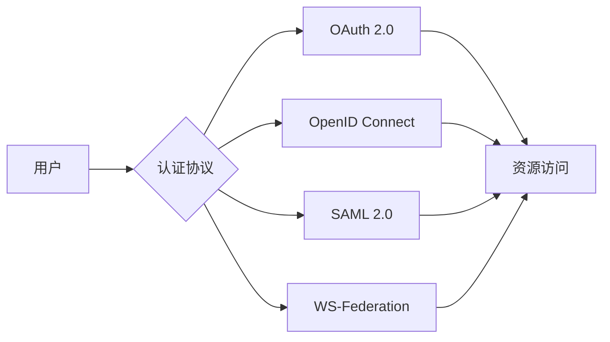
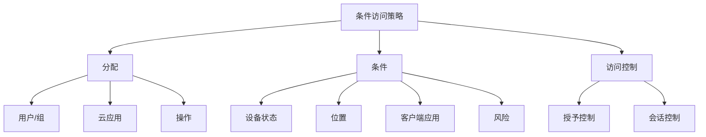

# 身份管理

> [!NOTE]
> 本文档提供了Azure Active Directory(Azure AD)与身份保护的详细介绍，包括核心概念、配置方法、最佳实践和常见场景。

## 目录

- [Azure Active Directory概述](#azure-active-directory概述)
- [身份验证与授权](#身份验证与授权)
- [Azure AD身份类型](#azure-ad身份类型)
- [Azure AD目录角色](#azure-ad目录角色)
- [条件访问策略](#条件访问策略)
- [多因素认证](#多因素认证)
- [身份保护](#身份保护)
- [自助服务功能](#自助服务功能)
- [混合身份解决方案](#混合身份解决方案)
- [外部身份管理](#外部身份管理)
- [特权身份管理](#特权身份管理)
- [监控与审计](#监控与审计)
- [最佳实践](#最佳实践)
- [常见场景](#常见场景)

## Azure Active Directory概述

Azure Active Directory (Azure AD) 是微软基于云的身份和访问管理服务，帮助员工访问外部资源（如Microsoft 365、Azure门户和成千上万的其他SaaS应用程序）和内部资源（如公司网络和内部网上的应用程序）。

### 主要功能

- **身份验证**：验证用户身份
- **单点登录(SSO)**：使用单一身份访问多个应用
- **应用程序管理**：集中管理云和本地应用
- **设备管理**：管理设备身份和访问
- **身份保护**：保护身份免受威胁
- **特权身份管理**：管理、控制和监控特权访问
- **身份治理**：确保适当的访问权限

### 服务层级

Azure AD提供四种版本，每种版本提供不同级别的功能：

| 功能 | 免费版 | Office 365应用版 | Premium P1 | Premium P2 |
|------|--------|-----------------|-----------|-----------|
| 目录对象 | ✓ | ✓ | ✓ | ✓ |
| 用户/组管理 | ✓ | ✓ | ✓ | ✓ |
| 本地目录同步 | ✓ | ✓ | ✓ | ✓ |
| 基本报告 | ✓ | ✓ | ✓ | ✓ |
| 自助密码重置 | - | - | ✓ | ✓ |
| 条件访问 | - | - | ✓ | ✓ |
| 动态组 | - | - | ✓ | ✓ |
| 身份保护 | - | - | - | ✓ |
| 特权身份管理 | - | - | - | ✓ |

## 身份验证与授权

### 身份验证(Authentication)

身份验证是验证用户身份的过程。Azure AD支持多种身份验证方法：

1. **密码认证**：使用用户名和密码
2. **Windows集成认证**：使用Kerberos或NTLM
3. **证书认证**：使用客户端证书
4. **FIDO2安全密钥**：使用物理安全密钥
5. **无密码认证**：Microsoft Authenticator应用、FIDO2密钥或Windows Hello

### 授权(Authorization)

授权确定用户可以访问哪些资源和执行哪些操作。Azure AD提供多种授权机制：

1. **基于角色的访问控制(RBAC)**：根据用户角色分配权限
2. **应用程序权限**：控制应用程序的访问范围
3. **条件访问**：基于信号和条件的动态授权
4. **资源权限**：特定资源的细粒度权限

### 认证流程

Azure AD支持多种认证协议：

## Azure AD身份类型

### 用户

用户是Azure AD中的基本身份类型，代表组织中的人员。

**用户类型：**
- **云身份**：仅存在于Azure AD中的用户
- **同步身份**：从本地Active Directory同步的用户
- **来宾用户**：来自其他组织的用户

**用户属性：**
- 基本信息（姓名、电子邮件等）
- 联系信息
- 工作信息
- 位置信息
- 身份验证信息

### 组

组用于管理对资源的访问权限，简化权限管理。

**组类型：**
- **安全组**：用于管理对资源的访问权限
- **Microsoft 365组**：用于协作，包括共享邮箱、日历等
- **动态组**：基于规则自动添加和删除成员

**组管理：**
- 静态成员资格（手动添加/删除）
- 动态成员资格（基于属性规则）
- 自助组管理
- 组嵌套

### 服务主体

服务主体代表应用程序或服务的身份，用于访问Azure资源。

**服务主体类型：**
- **应用程序**：代表注册的应用程序
- **托管身份**：由Azure管理的服务身份
- **服务账户**：用于自动化和服务间通信

**服务主体管理：**
- 应用程序注册
- 权限分配
- 证书和密钥管理
- 同意管理

### 设备

设备身份允许基于设备的条件访问策略。

**设备状态：**
- **Azure AD注册**：个人设备注册到Azure AD
- **Azure AD加入**：组织拥有的设备加入Azure AD
- **混合Azure AD加入**：同时加入本地AD和Azure AD

**设备管理：**
- 设备注册
- 设备合规性
- 设备条件访问
- 设备生命周期管理

## Azure AD目录角色

Azure AD提供预定义的目录角色，用于管理Azure AD资源。

### 常见目录角色

| 角色 | 描述 | 典型用途 |
|------|------|---------|
| 全局管理员 | 完全访问所有Azure AD功能 | 高级管理员，数量应限制 |
| 用户管理员 | 管理用户和组 | 帮助台人员，用户管理 |
| 安全管理员 | 管理安全功能 | 安全团队 |
| 应用程序管理员 | 管理企业应用程序 | 应用程序团队 |
| 条件访问管理员 | 管理条件访问策略 | 安全团队 |
| 身份验证管理员 | 管理身份验证方法 | 身份团队 |

### 角色分配

角色可以分配给：
- 单个用户
- 组（需要Azure AD Premium P1）
- 服务主体

**最佳实践：**
- 使用特权访问组
- 实施最小权限原则
- 定期审核角色分配
- 使用条件访问限制管理会话

## 条件访问策略

条件访问是Azure AD的一项功能，允许基于特定条件控制对应用和资源的访问。

### 条件访问组件

### 常见条件

1. **用户风险**：基于用户账户可能被泄露的风险级别
2. **登录风险**：基于特定登录尝试的风险级别
3. **设备平台**：用户使用的操作系统（Windows、iOS、Android等）
4. **位置**：基于IP地址的用户位置
5. **客户端应用**：用于请求访问的应用程序
6. **设备状态**：设备是否符合组织策略

### 访问控制

**授予控制：**
- 要求多因素认证
- 要求设备合规性
- 要求混合Azure AD加入设备
- 要求已批准的客户端应用
- 要求应用保护策略
- 要求密码更改

**会话控制：**
- 使用应用强制限制
- 使用条件访问应用控制
- 登录频率
- 持久性浏览器会话

### 策略示例

**要求敏感应用的MFA：**
- **分配**：
  - **用户/组**：所有用户
  - **云应用**：Office 365、Azure门户
- **条件**：
  - 任何位置
  - 任何设备
- **访问控制**：
  - 要求多因素认证

**阻止高风险登录：**
- **分配**：
  - **用户/组**：所有用户
  - **云应用**：所有云应用
- **条件**：
  - 登录风险级别为高
- **访问控制**：
  - 阻止访问

## 多因素认证

多因素认证(MFA)要求用户提供两种或更多验证方式，显著提高安全性。

### 验证方法

Azure AD支持多种验证方法：

1. **Microsoft Authenticator应用**：
   - 推送通知
   - 一次性密码(OTP)
   - 无密码登录

2. **OATH硬件令牌**：
   - 生成一次性密码的物理设备

3. **SMS/语音通话**：
   - 发送验证码到手机
   - 安全性较低，不推荐用于敏感环境

4. **FIDO2安全密钥**：
   - 基于标准的物理认证设备
   - 高安全性，抵抗钓鱼攻击

### 部署选项

1. **安全默认值**：
   - 适用于Azure AD免费版
   - 为所有用户和管理员启用MFA
   - 有限的自定义选项

2. **条件访问**：
   - 需要Azure AD Premium
   - 精细控制MFA策略
   - 基于风险、位置、应用等条件

3. **每用户MFA**：
   - 传统方法，不推荐
   - 手动为每个用户启用
   - 有限的策略控制

### 注册和用户体验

1. **组合注册体验**：
   - 统一的安全信息注册门户
   - 用户可以注册多种验证方法
   - 管理员可以要求特定方法

2. **自助服务**：
   - 用户可以管理自己的验证方法
   - 更新电话号码和设备
   - 重置注册信息

3. **登录体验**：
   - 智能MFA提示
   - 记住MFA的设备
   - 应用内验证

## 身份保护

Azure AD身份保护使用机器学习和启发式算法检测和预防身份相关风险。

### 风险检测

**用户风险**：用户身份可能被泄露的概率。

用户风险检测类型：
- 泄露的凭据
- Azure AD威胁情报
- 不可能的旅行

**登录风险**：特定身份验证请求被盗用的概率。

登录风险检测类型：
- 匿名IP地址
- 不常见的登录属性
- 恶意软件链接的IP地址
- 新的国家/地区
- 不可能的旅行
- 不寻常的位置

### 风险策略

**用户风险策略**：根据用户风险级别自动响应。

示例策略：
- 高风险用户：要求密码更改
- 中风险用户：要求MFA

**登录风险策略**：根据登录风险级别自动响应。

示例策略：
- 高风险登录：阻止访问
- 中风险登录：要求MFA

### 风险调查

**风险工作簿**：分析和调查风险事件。

**用户详细信息**：查看用户的风险历史和活动。

**风险历史**：查看组织的风险趋势和模式。

## 自助服务功能

Azure AD提供多种自助服务功能，减少IT支持负担并提高用户体验。

### 自助密码重置(SSPR)

允许用户在忘记密码时自行重置密码，无需联系IT支持。

**配置选项：**
- 启用的用户组
- 验证方法（电子邮件、手机、安全问题）
- 注册策略
- 通知设置

**用户体验：**
- 注册验证方法
- 重置密码流程
- 解锁账户

### 自助组管理

允许用户创建和管理自己的组，无需管理员干预。

**功能：**
- 创建组
- 请求加入组
- 管理组成员
- 委派组管理

### 访问包

通过访问包管理用户对资源的访问请求和审批。

**主要功能：**
- 创建访问包
- 定义访问策略
- 自动过期和续订
- 访问审核

## 混合身份解决方案

许多组织同时使用本地Active Directory和Azure AD，需要混合身份解决方案。

### Azure AD Connect

Azure AD Connect是将本地目录与Azure AD同步的主要工具。

**主要功能：**
- 用户和组同步
- 密码哈希同步
- 密码写回
- 设备写回
- 防止意外删除

**部署拓扑：**
- 单林单Azure AD租户
- 多林单Azure AD租户
- 资源林拓扑
- 云同步（轻量级代理）

### 密码管理

**密码哈希同步**：将本地密码哈希同步到Azure AD。

**密码写回**：将在Azure AD中更改的密码写回本地AD。

**自助服务密码重置**：允许用户重置本地AD密码。

### 联合身份验证

使用Active Directory联合身份验证服务(AD FS)或其他联合服务实现单点登录。

**主要功能：**
- 本地身份验证
- 高级认证场景
- 智能锁定保护
- 额外的MFA选项

**考虑因素：**
- 增加的复杂性
- 额外的基础设施
- 更高的维护成本

### Azure AD云同步

更轻量级的同步选项，适用于复杂环境或分支机构。

**主要特点：**
- 基于代理的轻量级架构
- 支持多林环境
- 简化的配置
- 减少本地基础设施需求

## 外部身份管理

Azure AD提供管理外部用户（如合作伙伴、供应商、客户）身份的功能。

### Azure AD B2B协作

允许邀请外部用户作为来宾用户访问组织资源。

**主要功能：**
- 自助服务注册
- 邀请工作流
- 条件访问
- 身份提供商集成
- 访问审核

**来宾用户体验：**
- 接受邀请
- 使用现有凭据
- 访问共享资源
- 自助服务管理

### Azure AD B2C

为面向客户的应用程序提供身份管理和访问控制。

**主要功能：**
- 客户注册和登录
- 社交身份提供商集成
- 品牌定制
- 多语言支持
- 安全和隐私控制

**常见场景：**
- 零售应用
- 银行和金融应用
- 政府服务
- 医疗保健门户

### 外部身份治理

管理外部用户的生命周期和访问权限。

**关键功能：**
- 访问审核
- 访问过期
- 权限管理
- 使用情况监控

## 特权身份管理

Azure AD特权身份管理(PIM)提供对Azure AD、Azure和其他Microsoft Online Services中特权角色的实时管理、控制和监控。

### 主要功能

1. **即时访问**：需要时激活特权角色
2. **时间限制**：特权访问有固定的时间限制
3. **审批工作流**：要求审批特权访问
4. **通知**：特权角色激活时发送通知
5. **访问审核**：记录所有特权活动

### 角色激活

**激活过程：**
1. 请求激活特权角色
2. 提供激活理由
3. 完成MFA验证
4. 获得时间限制的访问权限
5. 访问过期自动撤销

**激活设置：**
- 激活最大持续时间
- 通知设置
- 审批要求
- 票证信息

### 访问审核

**审核功能：**
- 角色激活历史
- 目录角色分配
- 角色配置更改
- PIM活动

**报告：**
- 角色分配报告
- 角色激活报告
- 审核历史报告

## 监控与审计

Azure AD提供全面的监控和审计功能，帮助识别安全风险和合规问题。

### 登录活动

**用户登录**：监控用户登录活动，包括：
- 成功和失败的登录
- 使用的身份验证方法
- 登录位置和IP地址
- 使用的客户端应用
- 条件访问结果

**服务主体登录**：监控应用程序和服务的登录活动。

### 审计日志

记录对Azure AD配置的更改，包括：
- 用户和组管理
- 应用程序注册和权限
- 目录角色分配
- 策略更改
- 设备管理

### 风险检测

监控与身份相关的风险事件：
- 用户风险检测
- 登录风险检测
- 风险调查

### 监控工具

**Azure Monitor**：将Azure AD日志集成到Azure Monitor。

**Log Analytics**：高级日志查询和分析。

**安全信息和事件管理(SIEM)集成**：将Azure AD日志导出到SIEM解决方案。

**工作簿**：交互式报告和可视化。

## 最佳实践

### 身份安全

1. **启用MFA**：为所有用户启用多因素认证
2. **使用条件访问**：实施基于风险的访问控制
3. **启用自助服务**：减少管理负担并提高用户体验
4. **实施最小权限**：仅授予必要的权限
5. **定期审核**：定期审核访问权限和角色分配

### 管理员保护

1. **使用特权访问工作站(PAW)**：专用的安全工作站进行管理任务
2. **实施PIM**：使用即时特权访问
3. **分离管理员账户**：使用专用账户进行管理任务
4. **强制MFA**：对所有管理员强制执行MFA
5. **限制管理访问**：限制管理访问的位置和设备

### 身份治理

1. **实施访问审核**：定期审核用户访问权限
2. **自动化生命周期管理**：自动化用户预配和解除预配
3. **管理外部身份**：控制和监控外部用户访问
4. **实施访问过期**：设置访问权限自动过期
5. **监控异常活动**：检测和响应异常访问模式

## 常见场景

### 零信任实施

使用Azure AD实施零信任安全模型：

1. **验证身份**：使用强认证和风险评估
2. **验证设备**：确保设备符合安全要求
3. **限制访问**：基于最小权限原则
4. **假设入侵**：持续验证和监控

### 远程工作安全

保护远程工作环境的身份安全：

1. **设备管理**：确保设备安全并符合策略
2. **条件访问**：基于设备、位置和风险的访问控制
3. **应用保护**：保护移动应用中的数据
4. **VPN替代方案**：使用应用代理提供远程访问

### 合规性要求

满足常见合规性要求：

1. **多因素认证**：满足PCI DSS、HIPAA等要求
2. **访问审核**：提供合规性审计证据
3. **特权访问管理**：满足SOX等法规要求
4. **数据主权**：满足GDPR等数据保护要求

### 企业合并

管理企业合并或收购期间的身份整合：

1. **目录同步**：整合多个目录
2. **联合身份验证**：跨组织实现SSO
3. **分阶段迁移**：平稳过渡到统一身份
4. **混合身份模型**：支持过渡期间的混合环境

## 结论

Azure AD提供全面的身份和访问管理功能，帮助组织保护资源、简化用户体验并满足合规性要求。通过实施本文档中描述的最佳实践，组织可以建立强大的身份安全基础，抵御现代威胁并支持业务创新。

随着身份成为新的安全边界，Azure AD的角色变得越来越重要。持续关注新功能和最佳实践，确保身份管理策略与不断变化的安全环境保持同步。

## 参考资源

- [Azure Active Directory文档](https://docs.microsoft.com/azure/active-directory/)
- [Azure AD身份保护](https://docs.microsoft.com/azure/active-directory/identity-protection/)
- [条件访问文档](https://docs.microsoft.com/azure/active-directory/conditional-access/)
- [多因素认证文档](https://docs.microsoft.com/azure/active-directory/authentication/concept-mfa-howitworks)
- [Azure AD特权身份管理](https://docs.microsoft.com/azure/active-directory/privileged-identity-management/)
- [混合身份文档](https://docs.microsoft.com/azure/active-directory/hybrid/)

---

> 本文档将持续更新，欢迎提供反馈和建议。 