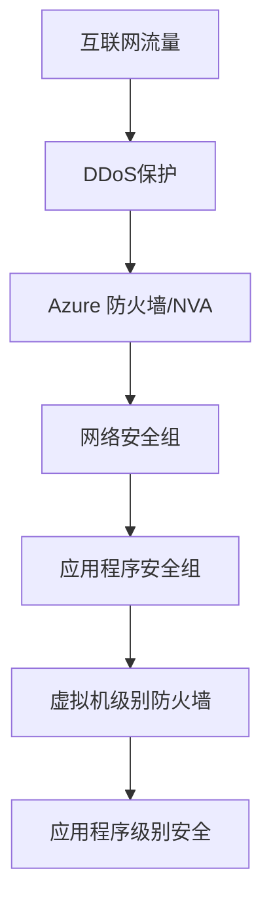
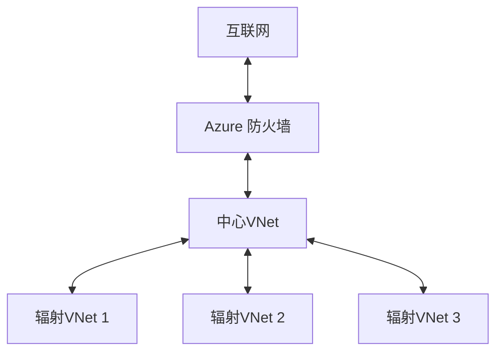
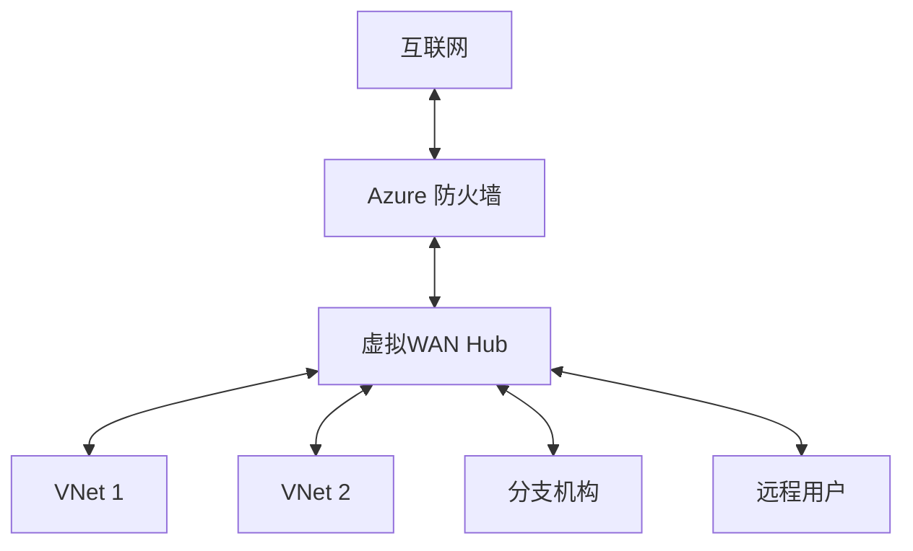
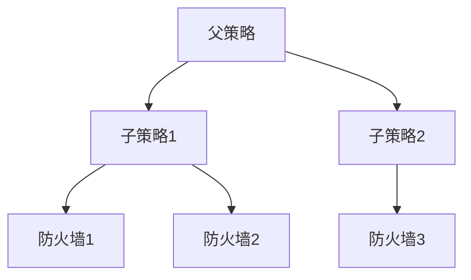
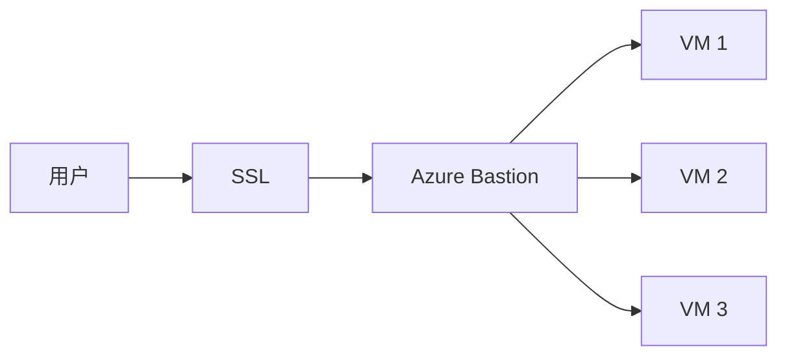
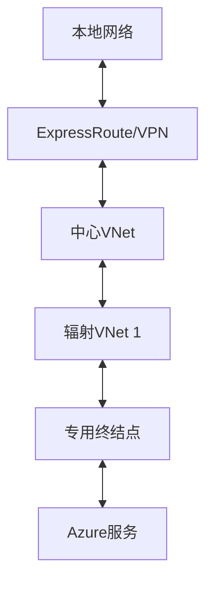

# 网络安全

> [!NOTE]
> 本文档提供了Azure网络安全的详细介绍，包括网络安全组(NSG)、防火墙和DDoS保护的配置方法、最佳实践和常见场景。

## 目录

- [Azure网络安全概述](#azure网络安全概述)
- [网络安全组(NSG)](#网络安全组nsg)
- [应用程序安全组(ASG)](#应用程序安全组asg)
- [Azure 防火墙](#azure-防火墙)
- [Azure 防火墙管理器](#azure-防火墙管理器)
- [DDoS保护](#ddos保护)
- [Azure Bastion](#azure-bastion)
- [虚拟网络服务终结点](#虚拟网络服务终结点)
- [专用链接](#专用链接)
- [网络虚拟设备(NVA)](#网络虚拟设备nva)
- [Web应用程序防火墙(WAF)](#web应用程序防火墙waf)
- [网络监控与诊断](#网络监控与诊断)
- [安全中心网络建议](#安全中心网络建议)
- [最佳实践](#最佳实践)
- [常见场景](#常见场景)

## Azure网络安全概述

Azure网络安全是保护云资源的关键组成部分，提供多层次的安全控制，保护网络流量、限制访问并防止攻击。

### 网络安全层次

Azure网络安全遵循深度防御策略，包括多个安全层次：



### 关键安全控制

Azure提供多种网络安全控制：

1. **边界保护**：DDoS保护、防火墙、WAF
2. **网络分段**：虚拟网络、子网、NSG
3. **流量过滤**：NSG规则、防火墙规则、路由表
4. **连接安全**：VPN、ExpressRoute、Bastion
5. **服务保护**：服务终结点、专用链接
6. **监控与可见性**：NSG流日志、网络监视器

## 网络安全组(NSG)

网络安全组(NSG)是一种基本的网络流量过滤服务，可以控制进出Azure资源的网络流量。

### NSG基础

NSG包含安全规则列表，允许或拒绝特定流量。规则基于以下参数：

- 源/目标IP地址或CIDR范围
- 源/目标端口或端口范围
- 协议(TCP、UDP、ICMP、Any)
- 方向(入站、出站)
- 优先级(数字越小优先级越高)

### NSG规则

**默认规则**：每个NSG包含默认入站和出站规则：

| 优先级 | 名称 | 方向 | 操作 |
|-------|------|------|------|
| 65000 | AllowVnetInBound | 入站 | 允许 |
| 65001 | AllowAzureLoadBalancerInBound | 入站 | 允许 |
| 65500 | DenyAllInBound | 入站 | 拒绝 |
| 65000 | AllowVnetOutBound | 出站 | 允许 |
| 65001 | AllowInternetOutBound | 出站 | 允许 |
| 65500 | DenyAllOutBound | 出站 | 拒绝 |

**自定义规则示例**：

```json
{
  "name": "Allow-RDP",
  "protocol": "TCP",
  "sourceAddressPrefix": "10.0.0.0/24",
  "sourcePortRange": "*",
  "destinationAddressPrefix": "*",
  "destinationPortRange": "3389",
  "access": "Allow",
  "priority": 100,
  "direction": "Inbound"
}
```

### NSG关联

NSG可以关联到：

1. **子网**：控制进出子网的所有流量
2. **网络接口(NIC)**：控制进出特定VM的流量

当同时应用两个级别时，规则处理顺序：
1. 入站流量：NSG(子网) → NSG(NIC)
2. 出站流量：NSG(NIC) → NSG(子网)

### NSG配置最佳实践

- 使用服务标签简化规则管理
- 应用最小权限原则
- 使用应用程序安全组进行逻辑分组
- 启用NSG流日志进行监控
- 使用标准化命名约定
- 限制RDP/SSH直接访问

## 应用程序安全组(ASG)

应用程序安全组(ASG)允许您将虚拟机分组，并定义基于这些组的网络安全策略。

### ASG优势

- 简化NSG规则管理
- 基于应用程序结构定义安全策略
- 减少规则数量和复杂性
- 无需手动维护IP地址列表

### ASG配置

1. **创建ASG**：定义应用程序组(如Web、API、数据库)
2. **关联VM**：将VM的网络接口与ASG关联
3. **配置NSG规则**：使用ASG作为源或目标

**示例规则**：

```json
{
  "name": "Allow-Web-to-API",
  "protocol": "TCP",
  "sourceApplicationSecurityGroups": [
    {
      "id": "/subscriptions/subid/resourceGroups/rg1/providers/Microsoft.Network/applicationSecurityGroups/WebASG"
    }
  ],
  "destinationApplicationSecurityGroups": [
    {
      "id": "/subscriptions/subid/resourceGroups/rg1/providers/Microsoft.Network/applicationSecurityGroups/APIASG"
    }
  ],
  "destinationPortRange": "443",
  "access": "Allow",
  "priority": 100,
  "direction": "Inbound"
}
```

### ASG限制

- 每个网络接口可以关联到多个ASG
- 每个订阅有ASG数量限制
- ASG只能在创建或修改NSG规则时使用
- ASG必须与NSG在同一区域

## Azure 防火墙

Azure 防火墙是一种托管的、云原生的网络安全服务，提供高可用性和可无限扩展的保护。

### 主要功能

- **状态检测**：跟踪连接状态
- **内置高可用性**：无需额外负载均衡器
- **高可扩展性**：可自动扩展以满足流量需求
- **应用程序FQDN过滤**：限制特定FQDN的出站HTTP/S流量
- **网络流量过滤**：基于源/目标地址、端口和协议的规则
- **FQDN标签**：常见Azure服务的预定义标签
- **服务标签**：代表Azure服务的IP地址前缀
- **威胁情报**：可选的威胁过滤功能

### 防火墙策略

Azure 防火墙策略包含三种规则集合：

1. **NAT规则集合**：定义DNAT(目标网络地址转换)配置
2. **网络规则集合**：定义基于源/目标地址、端口和协议的规则
3. **应用程序规则集合**：定义基于FQDN的出站访问控制

**网络规则示例**：

```json
{
  "name": "AllowWeb",
  "priority": 100,
  "action": { "type": "Allow" },
  "rules": [
    {
      "name": "AllowHTTP",
      "sourceAddresses": ["10.0.0.0/24"],
      "destinationAddresses": ["*"],
      "destinationPorts": ["80", "443"],
      "protocols": ["TCP"]
    }
  ]
}
```

**应用程序规则示例**：

```json
{
  "name": "AllowMicrosoft",
  "priority": 200,
  "action": { "type": "Allow" },
  "rules": [
    {
      "name": "AllowMicrosoftFQDN",
      "sourceAddresses": ["10.0.0.0/24"],
      "targetFqdns": ["*.microsoft.com"],
      "protocols": [
        { "port": "443", "protocolType": "Https" },
        { "port": "80", "protocolType": "Http" }
      ]
    }
  ]
}
```

### 部署模式

**中心辐射型(Hub-and-Spoke)模式**：



**安全虚拟WAN模式**：



### 防火墙监控

- **诊断日志**：记录防火墙活动
- **指标**：处理的数据、健康状态等
- **工作簿**：交互式报告和可视化
- **警报**：基于特定条件触发通知

## Azure 防火墙管理器

Azure 防火墙管理器是一项安全管理服务，提供跨多个Azure 防火墙实例的集中安全策略管理。

### 主要功能

- **集中策略管理**：跨区域和订阅管理防火墙策略
- **层次化策略**：支持继承和覆盖的策略层次结构
- **全球和本地规则**：全球适用和特定区域的规则
- **与安全合作伙伴集成**：集成第三方安全服务

### 策略层次结构



### 部署场景

- **分支机构安全**：保护从分支机构到Azure的流量
- **互联网边缘安全**：保护从Internet到Azure的流量
- **专用流量检查**：检查VNet到VNet的流量

## DDoS保护

Azure DDoS保护服务保护应用程序免受分布式拒绝服务(DDoS)攻击。

### 保护级别

**基本**：
- 自动启用
- 监控和实时缓解常见网络层攻击
- 与全球Azure网络规模配合使用

**标准**：
- 高级缓解功能
- 实时攻击指标和警报
- DDoS专家支持
- 成本保护

### 缓解功能

**网络层保护(第3/4层)**：
- 容量确保
- 协议异常检测
- 资源自适应调整
- 多层缓解

**应用层保护(第7层)**：
- 与Web应用程序防火墙集成
- 应用层流量监控
- 行为分析

### 监控与响应

- **实时指标**：查看攻击流量特征
- **警报配置**：设置攻击通知
- **缓解报告**：攻击后详细分析
- **流量分析**：识别流量模式和异常

## Azure Bastion

Azure Bastion是一项完全托管的服务，提供对虚拟机的安全RDP和SSH访问，无需公共IP地址。

### 主要功能

- **无需公共IP**：虚拟机不需要公共IP地址
- **无需客户端**：通过浏览器直接访问
- **SSL加密**：所有流量通过SSL加密
- **防火墙穿透**：无需打开RDP/SSH端口
- **简化NSG管理**：简化安全规则

### 部署架构



### 安全优势

- 减少攻击面
- 集中化访问控制
- 简化审计和日志记录
- 与Azure AD集成
- 支持多因素认证

## 虚拟网络服务终结点

虚拟网络服务终结点提供从虚拟网络到Azure服务的直接连接，流量保持在Azure骨干网络上。

### 支持的服务

- Azure Storage
- Azure SQL Database
- Azure Cosmos DB
- Azure Key Vault
- Azure Service Bus
- Azure Event Hubs
- Azure Data Lake
- 其他Azure PaaS服务

### 安全优势

- **改进的安全性**：流量不经过Internet
- **最佳路由**：最优网络路径到Azure服务
- **简单配置**：无需保留公共IP或NAT
- **服务级保护**：特定Azure资源的VNet限制

### 配置步骤

1. 在子网上启用服务终结点
2. 在Azure服务上添加网络规则，限制访问特定VNet/子网

## 专用链接

Azure专用链接提供从虚拟网络到Azure PaaS服务和合作伙伴服务的私有连接。

### 与服务终结点的区别

| 特性 | 服务终结点 | 专用链接 |
|------|------------|---------|
| 连接类型 | 到服务前端 | 到特定资源实例 |
| 路由 | 通过Microsoft骨干网 | 通过私有IP地址 |
| 数据泄露风险 | 较高 | 较低 |
| 私有IP | 否 | 是 |
| 跨区域支持 | 有限 | 完全支持 |
| 支持本地网络 | 需要额外配置 | 原生支持 |

### 主要组件

- **专用终结点**：VNet中的网络接口，连接到Azure服务
- **专用链接服务**：可连接的服务资源
- **连接审批工作流**：控制谁可以连接到服务

### 部署模式

**中心辐射型模式**：



## 网络虚拟设备(NVA)

网络虚拟设备(NVA)是在Azure中部署的虚拟设备，提供特定网络功能，如防火墙、WAN优化或路由。

### 常见NVA类型

- **防火墙**：Palo Alto Networks、Fortinet、Check Point等
- **负载均衡器**：F5、Citrix等
- **WAN优化器**：Riverbed、Silver Peak等
- **SD-WAN设备**：Cisco、VMware等

### NVA部署模式

**单NVA部署**：
- 简单配置
- 单点故障风险
- 适用于非关键工作负载

**高可用性NVA部署**：
- 主动-主动或主动-被动配置
- 使用Azure负载均衡器
- 需要健康探测和故障转移机制

**规模集NVA部署**：
- 使用虚拟机规模集
- 自动扩展能力
- 适用于高流量场景

### NVA注意事项

- **IP转发**：需要启用IP转发
- **路由配置**：需要适当的UDR(用户定义路由)
- **健康监控**：需要监控NVA健康状态
- **容量规划**：基于预期流量进行规划
- **许可**：了解NVA许可模式

## Web应用程序防火墙(WAF)

Web应用程序防火墙(WAF)保护Web应用程序免受常见漏洞和攻击。

### WAF部署选项

- **应用程序网关WAF**：保护应用程序网关后的应用
- **Azure Front Door WAF**：全球分布式WAF保护
- **CDN WAF**：与Azure CDN集成的WAF

### 保护功能

- **OWASP核心规则集**：防御常见Web攻击
- **自定义规则**：创建特定应用程序的规则
- **机器人保护**：识别和阻止恶意机器人
- **速率限制**：防止DDoS和暴力破解攻击
- **地理过滤**：基于国家/地区限制访问

### 操作模式

- **检测模式**：记录但不阻止请求
- **预防模式**：检测并阻止恶意请求

### 监控与调整

- **WAF日志**：详细记录检测和阻止的请求
- **规则调整**：减少误报和漏报
- **安全警报**：与安全中心集成
- **流量分析**：识别攻击模式

## 网络监控与诊断

Azure提供多种工具监控和诊断网络安全问题。

### 网络观察器

Azure网络观察器提供网络监控和诊断工具：

- **拓扑**：可视化网络拓扑
- **连接监视器**：监控网络连接
- **NSG流日志**：记录通过NSG的流量
- **数据包捕获**：捕获网络流量
- **VPN故障排除**：诊断VPN连接问题
- **有效安全规则**：查看应用于资源的规则

### NSG流日志

NSG流日志提供有关通过NSG的流量信息：

- **允许/拒绝决策**：记录流量是否被允许或拒绝
- **5元组信息**：源/目标IP、端口和协议
- **流量统计**：字节和数据包计数
- **时间戳**：事件发生时间

**流日志分析**：
- 使用Traffic Analytics分析流量模式
- 识别安全威胁和异常
- 优化网络性能
- 确保合规性

### 网络性能监视器

监控网络连接和性能：

- **性能监视器**：监控网络性能
- **服务连接监视器**：监控到服务的连接
- **ExpressRoute监视器**：监控ExpressRoute性能

## 安全中心网络建议

Azure安全中心提供网络安全建议和最佳实践。

### 常见建议

- **保护管理端口**：限制RDP/SSH访问
- **应用JIT访问**：实施即时访问
- **应用自适应网络强化**：基于流量模式推荐NSG规则
- **实施网络分段**：使用NSG进行网络分段
- **启用DDoS保护**：启用DDoS保护标准版
- **修复NSG配置**：修复过于宽松的NSG规则

### 安全分数

网络安全控制影响整体安全分数：

- **NSG强化**：适当限制入站流量
- **互联网暴露**：减少面向互联网的终结点
- **JIT实施**：使用即时VM访问
- **加密传输**：确保网络流量加密

## 最佳实践

### 网络设计

1. **实施网络分段**：使用VNet和子网进行逻辑分离
2. **采用零信任模型**：假设网络已被入侵
3. **实施深度防御**：多层安全控制
4. **限制互联网暴露**：减少公共终结点
5. **使用专用链接**：私有访问Azure服务

### NSG配置

1. **应用最小权限**：仅允许必要的流量
2. **使用服务标签**：简化规则管理
3. **使用应用程序安全组**：基于应用程序角色分组
4. **启用流日志**：监控和审计流量
5. **定期审核规则**：删除不必要的规则

### 防火墙部署

1. **集中管理**：使用防火墙管理器
2. **分层策略**：实施分层策略结构
3. **威胁情报**：启用威胁情报过滤
4. **IDPS**：考虑入侵检测和防护
5. **日志分析**：分析防火墙日志识别威胁

### DDoS防护

1. **启用标准保护**：为关键应用启用DDoS保护标准版
2. **设计弹性应用**：应用程序设计考虑DDoS弹性
3. **监控流量**：监控流量基线和异常
4. **制定响应计划**：准备DDoS攻击响应计划
5. **定期测试**：测试DDoS防护有效性

## 常见场景

### 保护IaaS工作负载

保护Azure虚拟机和相关资源：

1. **NSG保护**：应用适当的NSG规则
2. **JIT访问**：实施即时VM访问
3. **Bastion**：使用Azure Bastion安全访问
4. **防火墙保护**：部署Azure 防火墙或NVA
5. **监控与警报**：启用网络监控和警报

### 保护PaaS服务

保护Azure PaaS服务：

1. **服务终结点**：启用VNet服务终结点
2. **专用链接**：实施Azure专用链接
3. **防火墙策略**：限制PaaS服务访问
4. **WAF保护**：为Web应用启用WAF
5. **网络集成**：将PaaS服务与VNet集成

### 混合网络安全

保护混合云环境：

1. **安全连接**：使用VPN或ExpressRoute
2. **流量检查**：检查本地和云之间的流量
3. **一致策略**：在本地和云中应用一致的安全策略
4. **集中监控**：集中监控混合网络
5. **灾难恢复**：规划网络安全灾难恢复

### 多云网络安全

管理多云环境的网络安全：

1. **一致控制**：应用一致的安全控制
2. **集中管理**：使用集中管理工具
3. **安全互连**：安全连接不同云环境
4. **身份集成**：集成身份和访问管理
5. **合规性管理**：确保跨云合规性

## 结论

Azure网络安全提供全面的工具和服务，帮助组织保护其云资源和应用程序。通过实施多层防御策略，包括网络安全组、防火墙、DDoS保护和其他安全控制，组织可以显著降低网络安全风险。

随着威胁环境的不断变化，持续监控、更新安全控制并遵循最佳实践至关重要。Azure网络安全工具的持续创新和改进，使组织能够应对新兴威胁并保持强大的安全态势。

## 参考资源

- [Azure网络安全文档](https://docs.microsoft.com/azure/security/fundamentals/network-security)
- [Azure 防火墙文档](https://docs.microsoft.com/azure/firewall/)
- [网络安全组文档](https://docs.microsoft.com/azure/virtual-network/network-security-groups-overview)
- [DDoS保护文档](https://docs.microsoft.com/azure/ddos-protection/)
- [Azure Bastion文档](https://docs.microsoft.com/azure/bastion/)
- [网络观察器文档](https://docs.microsoft.com/azure/network-watcher/)

---

> 本文档将持续更新，欢迎提供反馈和建议。 