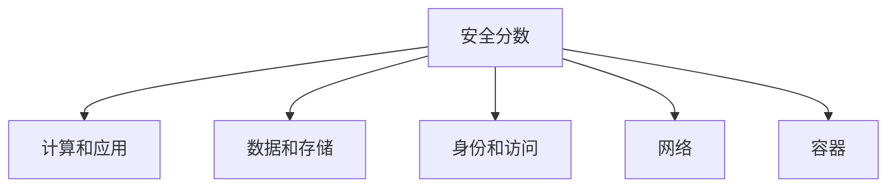

# 安全中心

> [!NOTE]
> 本文档提供了Azure安全中心(Microsoft Defender for Cloud)的详细介绍，包括核心功能、配置方法、最佳实践和常见场景。

## 目录

- [安全中心概述](#安全中心概述)
- [核心功能](#核心功能)
- [安全分数](#安全分数)
- [资源安全卫生](#资源安全卫生)
- [威胁防护](#威胁防护)
- [监管合规性](#监管合规性)
- [工作流自动化](#工作流自动化)
- [集成与扩展](#集成与扩展)
- [多云支持](#多云支持)
- [安全中心配置](#安全中心配置)
- [安全策略](#安全策略)
- [安全建议](#安全建议)
- [安全警报](#安全警报)
- [最佳实践](#最佳实践)
- [常见场景](#常见场景)

## 安全中心概述

Azure安全中心(现称为Microsoft Defender for Cloud)是一个统一的安全管理系统，提供高级威胁防护，保护云工作负载、服务器、数据库、容器和其他资源免受威胁。它提供安全建议以加强安全态势，并检测和响应威胁。

> [!NOTE]
> 2021年底，Azure安全中心更名为Microsoft Defender for Cloud，但在许多文档和界面中仍可能看到"安全中心"的称呼。本文档将使用"安全中心"这一名称，以保持一致性。

### 主要优势

- **统一安全管理**：跨混合和多云环境的单一控制台
- **持续评估**：持续评估资源、工作负载和服务
- **安全建议**：可操作的建议以加强安全态势
- **威胁防护**：高级威胁检测和响应能力
- **合规性管理**：简化合规性和报告
- **云原生集成**：与Azure服务深度集成

### 服务层级

安全中心提供两种服务层级：

1. **免费层**：
   - 基本安全评估
   - 安全分数
   - 基本安全建议
   - Azure资源的安全策略

2. **高级功能(Microsoft Defender for Cloud)**：
   - 高级威胁防护
   - 漏洞评估
   - 实时安全警报
   - 跨云工作负载保护
   - 监管合规性仪表板

## 核心功能

### 安全管理

安全中心提供全面的安全管理功能：

1. **安全策略**：
   - 基于Azure策略
   - 定义安全要求
   - 跨订阅和管理组应用

2. **安全评估**：
   - 持续评估资源配置
   - 识别安全漏洞
   - 提供修复建议

3. **资源安全卫生**：
   - 监控资源安全状态
   - 识别配置偏差
   - 跟踪安全状态变化

### 威胁防护

高级威胁防护功能：

1. **Microsoft Defender计划**：
   - Defender for Servers
   - Defender for App Service
   - Defender for Storage
   - Defender for SQL
   - Defender for Kubernetes
   - Defender for Container Registries
   - Defender for Key Vault
   - Defender for Resource Manager
   - Defender for DNS
   - Defender for Open-source relational databases

2. **威胁检测**：
   - 基于行为分析
   - Microsoft威胁情报
   - 异常检测
   - 高级关联

3. **安全警报**：
   - 实时警报
   - 详细的调查信息
   - 修复建议
   - MITRE ATT&CK映射

### 合规性管理

简化合规性管理：

1. **合规性仪表板**：
   - 跟踪合规性状态
   - 多标准视图
   - 合规性评分

2. **监管标准**：
   - PCI DSS
   - ISO 27001
   - SOC TSP
   - NIST SP 800-53
   - CIS基准
   - 中国监管标准

3. **合规性报告**：
   - 自动生成报告
   - 合规性证据
   - 自定义评估

## 安全分数

安全分数是安全中心的核心功能，提供组织安全态势的量化指标。

### 分数计算

安全分数基于以下因素计算：

- 资源安全控制的实施状态
- 安全建议的严重性和影响
- 资源的相对重要性
- 安全最佳实践的采用程度

### 安全控制

安全分数按安全控制分组：



每个安全控制包含多个相关建议，并有自己的分数贡献。

### 分数改进

提高安全分数的方法：

1. **修复建议**：实施安全建议
2. **预防措施**：采取预防性安全措施
3. **自动修复**：启用自动修复功能
4. **例外处理**：适当处理不适用的建议

## 资源安全卫生

资源安全卫生功能监控Azure资源的安全状态。

### 资源健康评估

安全中心持续评估资源安全状态：

- 操作系统配置
- 安全设置
- 网络配置
- 应用程序设置
- 数据保护

### 漏洞评估

针对不同资源类型的漏洞评估：

1. **虚拟机**：
   - 操作系统漏洞
   - 缺失安全更新
   - 端点保护状态
   - 磁盘加密状态

2. **容器**：
   - 容器镜像漏洞
   - Kubernetes配置
   - 运行时保护

3. **数据库**：
   - 数据库配置
   - 访问控制设置
   - 加密状态

### 资源清单

全面的资源清单视图：

- 按资源类型分组
- 安全状态可视化
- 筛选和排序选项
- 导出功能

## 威胁防护

Microsoft Defender for Cloud提供高级威胁防护功能。

### Microsoft Defender计划

针对不同资源类型的专用防护计划：

#### Defender for Servers

保护Windows和Linux服务器：

- 漏洞评估
- 文件完整性监控
- 自适应应用程序控制
- 自适应网络强化
- 实时威胁检测

**部署选项**：
- Azure Arc支持混合环境
- 代理自动或手动部署
- 与Log Analytics集成

#### Defender for SQL

保护SQL数据库：

- 漏洞评估
- 高级威胁防护
- 异常访问检测
- SQL注入检测
- 权限滥用检测

#### Defender for Kubernetes

保护Kubernetes环境：

- 集群级保护
- 节点级威胁检测
- 工作负载强化建议
- 运行时保护
- 准入控制集成

#### Defender for Storage

保护存储账户：

- 异常访问检测
- 恶意软件上传检测
- 数据泄露尝试检测
- 权限滥用检测

### 高级威胁检测

安全中心使用多种技术检测威胁：

1. **行为分析**：
   - 基线行为建模
   - 异常检测
   - 用户和实体行为分析

2. **威胁情报**：
   - Microsoft全球威胁情报
   - 已知恶意行为者模式
   - 新兴威胁指标

3. **机器学习**：
   - 异常模式检测
   - 误报减少
   - 关联分析

### 安全警报管理

全面的安全警报管理：

1. **警报分类**：
   - 按严重性分类
   - 按资源类型分组
   - 按攻击类型分类

2. **警报调查**：
   - 详细的攻击信息
   - 受影响资源
   - 攻击时间线
   - MITRE ATT&CK映射

3. **警报响应**：
   - 建议的修复步骤
   - 自动化响应选项
   - 与SOAR系统集成

## 监管合规性

安全中心简化合规性管理和报告。

### 合规性仪表板

集中式合规性管理：

- 多标准合规性视图
- 合规性评分计算
- 控制映射
- 实时合规性状态

### 内置监管标准

支持多种监管标准：

1. **国际标准**：
   - ISO 27001
   - PCI DSS
   - SOC TSP
   - GDPR

2. **行业标准**：
   - CIS Microsoft Azure Foundations
   - NIST SP 800-53
   - NIST SP 800-171

3. **区域标准**：
   - 中国网络安全法
   - 澳大利亚ISM
   - 加拿大PBMM
   - 英国NHS

### 合规性报告

自动化合规性报告：

- 合规性状态摘要
- 详细评估结果
- 修复建议
- 历史趋势分析
- 导出和共享选项

## 工作流自动化

安全中心支持自动化安全工作流。

### 自动修复

自动修复安全问题：

1. **内置修复逻辑**：
   - 预定义的修复脚本
   - 基于Azure Policy的修复
   - 资源特定修复

2. **部署选项**：
   - 单个资源修复
   - 批量修复
   - 自动修复
   - 计划修复

### 工作流自动化

使用Logic Apps自动化安全工作流：

1. **触发器**：
   - 安全警报
   - 安全建议
   - 合规性变化
   - 安全分数变化

2. **操作示例**：
   - 发送通知
   - 创建工单
   - 触发修复脚本
   - 更新CMDB

**自动化示例**：

```json
{
  "properties": {
    "description": "当检测到高严重性警报时发送电子邮件",
    "isEnabled": true,
    "scopes": ["/subscriptions/subscription-id"],
    "sources": ["Microsoft Defender for Cloud"],
    "triggers": {
      "alertTrigger": {
        "type": "Alert",
        "alertType": ["High"]
      }
    },
    "actions": [
      {
        "actionType": "LogicApp",
        "logicAppResourceId": "/subscriptions/subscription-id/resourceGroups/rg-name/providers/Microsoft.Logic/workflows/SendAlertEmail",
        "uri": "https://logic-app-uri"
      }
    ]
  }
}
```

### 安全编排

与安全编排和自动化响应(SOAR)系统集成：

- Microsoft Sentinel集成
- 第三方SOAR平台集成
- 自定义响应工作流
- 事件响应自动化

## 集成与扩展

安全中心与多种Azure服务和第三方解决方案集成。

### Azure服务集成

与核心Azure服务集成：

1. **Azure Policy**：
   - 安全策略管理
   - 合规性评估
   - 自动修复

2. **Azure Monitor**：
   - 日志分析
   - 警报管理
   - 自定义查询

3. **Azure Sentinel**：
   - 安全信息和事件管理(SIEM)
   - 高级威胁狩猎
   - 事件响应

4. **Azure Active Directory**：
   - 身份保护
   - 权限管理
   - 条件访问

### 第三方集成

与第三方安全解决方案集成：

1. **漏洞管理**：
   - Qualys
   - Rapid7
   - Tenable

2. **终端保护**：
   - Microsoft Defender for Endpoint
   - Trend Micro
   - Symantec

3. **SIEM系统**：
   - Splunk
   - IBM QRadar
   - ArcSight

### 数据导出

将安全数据导出到外部系统：

1. **连续导出**：
   - 安全警报
   - 安全建议
   - 安全分数
   - 合规性数据

2. **导出目标**：
   - Log Analytics工作区
   - Azure Event Hubs
   - Azure存储

**连续导出配置**：

```json
{
  "properties": {
    "exportedDataTypes": [
      "Alerts",
      "Assessments",
      "SecureScore"
    ],
    "isEnabled": true,
    "exportData": [
      {
        "type": "EventHub",
        "properties": {
          "eventHubDetails": {
            "eventHubResourceId": "/subscriptions/subscription-id/resourceGroups/rg-name/providers/Microsoft.EventHub/namespaces/namespace/eventhubs/hub-name"
          }
        }
      }
    ]
  }
}
```

## 多云支持

安全中心支持多云环境的安全管理。

### AWS集成

与Amazon Web Services集成：

1. **支持的服务**：
   - Amazon EC2
   - Amazon S3
   - Amazon RDS
   - AWS IAM

2. **功能**：
   - 安全建议
   - 威胁检测
   - 合规性评估
   - 统一仪表板

### GCP集成

与Google Cloud Platform集成：

1. **支持的服务**：
   - Google Compute Engine
   - Google Kubernetes Engine
   - Google Cloud Storage
   - Google Cloud SQL

2. **功能**：
   - 安全建议
   - 合规性评估
   - 资源清单
   - 统一管理

### 多云管理

统一管理多云环境：

- 集中式安全仪表板
- 跨云安全策略
- 统一安全分数
- 多云合规性视图

## 安全中心配置

### 初始设置

设置安全中心的步骤：

1. **启用安全中心**：
   - 访问Azure门户中的安全中心
   - 选择订阅
   - 设置服务层级

2. **数据收集配置**：
   - 配置Log Analytics工作区
   - 设置自动代理安装
   - 定义数据收集范围

3. **电子邮件通知**：
   - 配置安全联系人
   - 设置通知首选项
   - 定义警报级别

### 高级功能配置

配置Microsoft Defender计划：

1. **选择Defender计划**：
   - 根据环境需求选择
   - 考虑资源类型和重要性
   - 评估成本效益

2. **自动预配**：
   - 配置Log Analytics代理
   - 设置漏洞评估
   - 启用威胁检测

3. **网络覆盖**：
   - 配置网络流量分析
   - 设置JIT VM访问
   - 启用自适应网络控制

### 访问控制

管理安全中心访问权限：

1. **基于角色的访问控制(RBAC)**：
   - 安全管理员
   - 安全读取者
   - 自定义角色

2. **工作区权限**：
   - Log Analytics工作区访问
   - 数据收集权限
   - 查询权限

3. **多租户管理**：
   - 跨租户视图
   - 委派访问
   - 中央管理

## 安全策略

安全策略定义安全要求和评估标准。

### 策略组件

安全策略包含以下组件：

1. **数据收集**：
   - 代理部署设置
   - 数据存储配置
   - 监控范围

2. **安全控制**：
   - 启用/禁用特定控制
   - 设置控制参数
   - 定义评估规则

3. **自动预配**：
   - 代理安装设置
   - 扩展部署配置
   - 监控设置

### 策略管理

管理安全策略的方法：

1. **Azure策略**：
   - 使用内置策略定义
   - 创建自定义策略
   - 应用策略计划

2. **管理组**：
   - 层次化策略应用
   - 继承和覆盖规则
   - 集中管理

3. **策略例外**：
   - 资源特定例外
   - 时间限制例外
   - 审批流程

**策略分配示例**：

```json
{
  "properties": {
    "displayName": "安全中心默认策略",
    "policyDefinitionId": "/providers/Microsoft.Authorization/policySetDefinitions/1f3afdf9-d0c9-4c3d-847f-89da613e70a8",
    "scope": "/subscriptions/subscription-id",
    "parameters": {
      "autoProvisioningOfLogAnalyticsAgent": {
        "value": "On"
      },
      "useAdvancedNetworkSecurityForVm": {
        "value": "AuditIfNotExists"
      }
    }
  }
}
```

## 安全建议

安全建议是安全中心的核心功能，提供可操作的指导。

### 建议类型

安全中心提供多种类型的建议：

1. **强化建议**：
   - 配置安全设置
   - 应用安全基准
   - 实施最佳实践

2. **漏洞修复**：
   - 操作系统更新
   - 应用程序漏洞
   - 配置漏洞

3. **资源保护**：
   - 加密数据
   - 网络保护
   - 身份安全

### 建议优先级

建议按严重性分类：

- **高**：需要立即关注的严重问题
- **中**：应尽快解决的重要问题
- **低**：可以计划解决的次要问题

### 建议实施

实施安全建议的方法：

1. **手动修复**：
   - 按照详细步骤修复
   - 验证修复结果
   - 更新安全状态

2. **自动修复**：
   - 使用一键修复
   - 批量修复多个资源
   - 计划自动修复

3. **集成修复**：
   - 通过CI/CD流程修复
   - 使用基础设施即代码
   - 通过自动化工作流修复

## 安全警报

安全警报提供有关检测到的威胁的信息。

### 警报严重性

警报按严重性分类：

- **高**：表示活跃的攻击或高影响威胁
- **中**：表示可疑活动或潜在威胁
- **低**：表示低风险或信息性发现
- **信息性**：不表示直接威胁的通知

### 警报类型

常见的警报类型：

1. **网络攻击**：
   - 暴力破解尝试
   - DDoS攻击
   - 端口扫描

2. **恶意软件**：
   - 已知恶意软件检测
   - 可疑进程执行
   - 文件篡改

3. **异常行为**：
   - 异常登录
   - 异常数据访问
   - 异常API调用

4. **特权升级**：
   - 可疑权限更改
   - 凭据盗用
   - 角色滥用

### 警报调查

调查安全警报的方法：

1. **警报详情**：
   - 查看完整警报信息
   - 分析受影响资源
   - 了解攻击技术

2. **调查工具**：
   - 交互式调查图
   - 实体关系分析
   - 时间线视图

3. **证据收集**：
   - 日志分析
   - 网络流量检查
   - 进程活动审查

### 警报响应

响应安全警报的方法：

1. **立即响应**：
   - 隔离受影响资源
   - 阻止可疑IP
   - 终止可疑进程

2. **修复步骤**：
   - 移除恶意软件
   - 重置凭据
   - 修补漏洞
   - 恢复系统

3. **事后分析**：
   - 根本原因分析
   - 改进安全控制
   - 更新响应程序

## 最佳实践

### 部署最佳实践

1. **全面覆盖**：
   - 为所有订阅启用
   - 包括混合和多云资源
   - 确保代理部署

2. **分层方法**：
   - 使用管理组组织资源
   - 应用分层安全策略
   - 考虑业务需求

3. **适当权限**：
   - 遵循最小权限原则
   - 定义明确的角色
   - 定期审核权限

### 操作最佳实践

1. **定期审查**：
   - 每日检查安全警报
   - 每周审查安全建议
   - 每月评估安全分数

2. **优先级管理**：
   - 关注高严重性问题
   - 建立修复时间表
   - 跟踪修复进度

3. **持续改进**：
   - 分析安全趋势
   - 更新安全策略
   - 实施新的安全控制

### 集成最佳实践

1. **与DevOps集成**：
   - 在CI/CD管道中包含安全检查
   - 自动化安全测试
   - 实施安全门控

2. **与IT流程集成**：
   - 与变更管理对齐
   - 与事件响应集成
   - 与资产管理同步

3. **与业务流程集成**：
   - 与风险管理对齐
   - 支持合规性报告
   - 提供执行级别可见性

## 常见场景

### 企业安全管理

为大型企业实施安全中心：

1. **集中管理**：
   - 使用管理组组织资源
   - 实施分层安全策略
   - 集中监控和报告

2. **混合环境保护**：
   - 使用Azure Arc扩展到本地
   - 保护混合工作负载
   - 统一安全视图

3. **合规性管理**：
   - 映射内部控制
   - 自动化合规性报告
   - 跟踪合规性状态

### 云迁移安全

在云迁移过程中使用安全中心：

1. **迁移前评估**：
   - 评估当前安全态势
   - 识别安全差距
   - 定义安全要求

2. **迁移中保护**：
   - 确保安全配置
   - 实时监控安全状态
   - 快速响应问题

3. **迁移后优化**：
   - 应用云原生安全控制
   - 持续评估和改进
   - 实施高级保护

### DevSecOps实施

将安全中心集成到DevSecOps流程：

1. **安全即代码**：
   - 使用基础设施即代码定义安全控制
   - 自动化安全配置
   - 版本控制安全策略

2. **CI/CD集成**：
   - 在管道中包含安全检查
   - 自动修复安全问题
   - 安全门控部署

3. **持续监控**：
   - 实时监控生产环境
   - 自动响应安全事件
   - 反馈安全发现

## 结论

Azure安全中心(Microsoft Defender for Cloud)提供全面的安全管理和高级威胁防护功能，帮助组织保护其云资源和工作负载。通过实施本文档中描述的最佳实践，组织可以显著提高其安全态势，减少安全风险，并简化合规性管理。

随着威胁环境的不断变化，安全中心持续发展其功能，提供最新的保护能力。定期评估和更新安全配置，关注新功能和改进，对于维护强大的安全态势至关重要。

## 参考资源

- [Microsoft Defender for Cloud文档](https://docs.microsoft.com/azure/defender-for-cloud/)
- [安全中心最佳实践](https://docs.microsoft.com/azure/defender-for-cloud/security-center-planning-and-operations-guide)
- [安全基准](https://docs.microsoft.com/azure/defender-for-cloud/secure-score-security-controls)
- [威胁防护](https://docs.microsoft.com/azure/defender-for-cloud/defender-for-cloud-introduction)
- [合规性管理](https://docs.microsoft.com/azure/defender-for-cloud/regulatory-compliance-dashboard)
- [工作流自动化](https://docs.microsoft.com/azure/defender-for-cloud/workflow-automation)

---

> 本文档将持续更新，欢迎提供反馈和建议。 