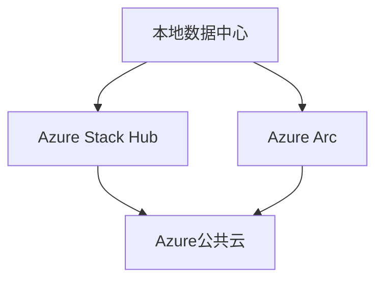
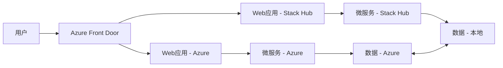

# Azure 混合云架构

> [!NOTE]
> 本文档提供了Azure混合云架构的详细介绍，重点关注Azure Arc和Azure Stack的实现方案、设计考虑因素和最佳实践。

## 概述

Azure混合云架构允许组织在本地数据中心、边缘位置和Azure云之间无缝扩展和管理IT资源。通过Azure Arc和Azure Stack，企业可以构建一致的混合环境，实现资源的统一管理、治理和部署。

混合云架构的核心优势：
- **一致性管理**：跨云和本地环境统一管理资源
- **灵活部署**：根据业务需求选择最佳部署位置
- **数据主权**：满足数据驻留和合规性要求
- **边缘计算**：在靠近数据源的位置处理数据
- **业务连续性**：提高灾难恢复和业务连续性能力
- **成本优化**：平衡资本支出(CapEx)和运营支出(OpEx)

## Azure Arc基础

Azure Arc是微软的混合云管理平台，可将Azure管理扩展到任何基础设施。

### 核心功能

#### 1. 资源管理

| 功能 | 描述 | 应用场景 |
|------|------|---------|
| 服务器管理 | 将非Azure服务器连接到Azure | 统一管理本地和多云服务器 |
| Kubernetes集群 | 将任何Kubernetes集群连接到Azure | 跨环境管理容器工作负载 |
| 数据服务 | 在任何环境中部署Azure数据服务 | 边缘位置的数据处理 |
| 应用服务 | 在任何Kubernetes集群上运行Web应用 | 分布式应用部署 |
| SQL管理 | 管理任何位置的SQL Server | 统一数据库管理 |

#### 2. 治理与合规

```yaml
治理能力:
  策略管理:
    - Azure Policy集成
    - 合规性评估
    - 自动修复
  配置管理:
    - 配置状态跟踪
    - 偏差检测
    - 自动化配置
  标记与组织:
    - 资源分组
    - 标记继承
    - 基于标记的策略
```

#### 3. 操作管理

- **监控与日志**：使用Azure Monitor跨环境监控
- **更新管理**：集中管理所有服务器的更新
- **安全管理**：应用安全策略和评估
- **自动化**：使用Azure Automation实现自动化
- **资源图表**：全局资源可见性和查询

## Azure Stack产品系列

Azure Stack是一系列产品，将Azure服务和功能扩展到本地环境和边缘位置。

### Azure Stack Hub

完整的本地Azure环境，提供IaaS和PaaS服务。

#### 核心功能
- **Azure一致性**：与Azure相同的API、门户和工具
- **断开连接操作**：支持完全断开连接的环境
- **可扩展性**：从4-16个节点的部署规模
- **集成系统**：由硬件合作伙伴提供的验证解决方案
- **服务目录**：虚拟机、存储、网络、PaaS服务等

### Azure Stack HCI

超融合基础设施解决方案，优化虚拟机和容器工作负载。

#### 核心功能
- **超融合架构**：计算和存储整合
- **软件定义网络**：高级网络虚拟化
- **存储空间直通**：高性能软件定义存储
- **Azure集成**：与Azure服务和管理工具集成
- **云见证**：提高可用性和弹性

### Azure Stack Edge

AI支持的边缘计算设备，具有网络数据传输功能。

#### 核心功能
- **边缘计算**：本地运行容器和VM
- **FPGA/GPU加速**：AI和ML工作负载加速
- **数据传输**：智能数据传输到Azure
- **网络存储网关**：本地缓存和云存储
- **小型占地面积**：适用于远程和分支位置

## 混合云架构模式

### 1. 数据中心扩展



**应用场景：**
- 数据中心容量扩展
- 开发/测试环境
- 灾难恢复站点
- 高性能计算突发

### 2. 边缘计算

**架构组件：**
- Azure Stack Edge设备部署在边缘位置
- IoT Hub管理设备连接
- Azure Arc管理边缘资源
- 本地数据处理和分析
- 选择性数据传输到云

### 3. 多云管理

**实现方式：**
- 使用Azure Arc管理多云资源
- 统一策略和合规性管理
- 集中化身份和访问管理
- 跨云监控和日志记录
- 自动化部署和配置

### 4. 监管与合规

**关键考虑：**
- 数据驻留要求
- 行业特定合规性
- 主权云集成
- 审计和报告
- 数据隐私保护

## 解决方案架构

### 1. 混合应用架构



### 2. 混合数据架构

1. **数据分层**
   - 热数据：本地高性能存储
   - 温数据：Azure Stack存储
   - 冷数据：Azure Blob存储

2. **数据复制**
   - 同步复制：关键业务数据
   - 异步复制：非关键数据
   - 快照备份：定期数据保护

3. **数据处理**
   - 本地：实时处理和分析
   - 边缘：近实时处理
   - 云端：大规模批处理和高级分析

### 3. 混合身份架构

**核心组件：**
- Azure AD Connect：身份同步
- Azure AD DS：域服务
- 条件访问策略：基于风险的访问控制
- 单点登录：跨环境认证
- 特权身份管理：提升权限控制

## 安全性和合规性

### 安全架构

1. **网络安全**
   - 站点到站点VPN
   - ExpressRoute专用连接
   - 网络安全组和防火墙
   - DDoS保护
   - 流量加密

2. **数据安全**
   - 静态数据加密
   - 传输中加密
   - 客户管理的密钥
   - 数据分类和保护
   - 信息保护

3. **身份安全**
   - 多因素认证
   - 条件访问
   - 特权访问管理
   - 身份保护
   - 零信任模型

### 合规性考虑

- 行业特定合规标准
- 区域数据保护法规
- 审计和日志记录
- 合规性报告
- 第三方认证

## 部署与迁移

### 部署策略

1. **Azure Stack Hub部署**
   - 硬件选择与验证
   - 网络规划
   - 身份集成
   - 初始配置
   - 服务部署

2. **Azure Arc部署**
   - 代理安装
   - 资源注册
   - 策略配置
   - 监控设置
   - 自动化脚本

### 迁移方法

1. **应用迁移**
   - 重新托管(Rehost)
   - 重构(Refactor)
   - 重新设计(Rearchitect)
   - 重建(Rebuild)
   - 替换(Replace)

2. **数据迁移**
   - 在线迁移
   - 离线迁移
   - 混合迁移
   - 分阶段迁移
   - 数据同步

## 运维与管理

### 监控策略

1. **统一监控**
   - Azure Monitor
   - Log Analytics
   - Application Insights
   - Network Watcher
   - 自定义仪表板

2. **警报与通知**
   - 阈值警报
   - 智能警报
   - 警报分组
   - 升级路径
   - 自动修复

### 自动化管理

1. **配置管理**
   - 期望状态配置(DSC)
   - Ansible/Chef/Puppet集成
   - Azure Automation
   - GitHub Actions
   - Azure DevOps

2. **更新管理**
   - 补丁管理
   - 版本控制
   - 测试环境验证
   - 分阶段部署
   - 回滚策略

## 性能优化

### 网络优化

- **ExpressRoute优化**：专用连接带宽规划
- **WAN加速**：优化广域网性能
- **内容分发**：使用CDN分发内容
- **流量管理**：智能路由和负载均衡
- **网络分段**：优化流量隔离

### 资源优化

- **资源大小调整**：根据工作负载优化
- **自动缩放**：根据需求调整资源
- **资源预留**：关键工作负载资源保证
- **工作负载分布**：跨环境优化分布
- **存储分层**：按访问频率优化存储

## 成本管理

### 成本优化策略

1. **混合成本模型**
   - 资本支出(CapEx)与运营支出(OpEx)平衡
   - 预留实例与即用即付结合
   - 资源生命周期管理
   - 闲置资源回收
   - 自动关闭非生产环境

2. **成本分析**
   - 混合环境成本可见性
   - 部门和项目成本分配
   - 成本趋势分析
   - 预算管理
   - 成本异常检测

## 最佳实践

### 架构最佳实践

1. **设计原则**
   - 一致性优先：跨环境一致体验
   - 位置灵活性：工作负载可在环境间移动
   - 弹性设计：避免单点故障
   - 自动化优先：减少手动操作
   - 安全默认：内置安全设计

2. **工作负载放置**
   - 延迟敏感型：本地或边缘
   - 数据密集型：靠近数据源
   - 计算密集型：根据成本和性能需求
   - 合规要求：满足数据驻留需求
   - 业务关键型：高可用性环境

### 运维最佳实践

1. **混合运维模型**
   - 统一运维流程
   - 自动化日常任务
   - 主动监控和警报
   - 集中日志管理
   - 持续改进流程

2. **灾难恢复**
   - 跨环境备份策略
   - 恢复点目标(RPO)和恢复时间目标(RTO)
   - 定期恢复测试
   - 业务连续性规划
   - 故障转移自动化

## 案例研究

### 金融服务混合云

**挑战：**
- 严格的数据主权要求
- 高性能交易系统
- 复杂的合规性要求
- 灾难恢复需求

**解决方案：**
- Azure Stack Hub用于核心交易系统
- Azure公共云用于分析和非敏感工作负载
- Azure Arc统一管理和治理
- ExpressRoute提供安全、高带宽连接

**成果：**
- 满足监管合规性要求
- 提高系统弹性和可用性
- 优化IT基础设施成本
- 加速创新和上市时间

### 制造业边缘计算

**挑战：**
- 工厂网络连接有限
- 实时数据处理需求
- 多站点管理复杂性
- 设备和系统多样性

**解决方案：**
- Azure Stack Edge部署在工厂车间
- 本地AI和分析处理
- Azure Arc管理所有边缘设备
- 选择性数据上传到Azure

**成果：**
- 减少网络依赖
- 提高生产效率
- 降低运营成本
- 实现预测性维护

## 参考资源

- [Azure Arc文档](https://docs.microsoft.com/azure/azure-arc/)
- [Azure Stack Hub文档](https://docs.microsoft.com/azure-stack/operator/)
- [Azure Stack HCI文档](https://docs.microsoft.com/azure-stack/hci/)
- [Azure Stack Edge文档](https://docs.microsoft.com/azure/databox-online/)
- [混合云架构最佳实践](https://docs.microsoft.com/azure/architecture/hybrid/)

---

> 本文档将持续更新，欢迎提供反馈和建议。 