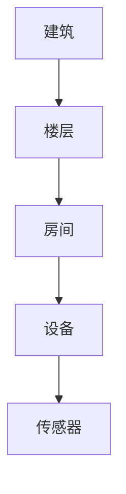
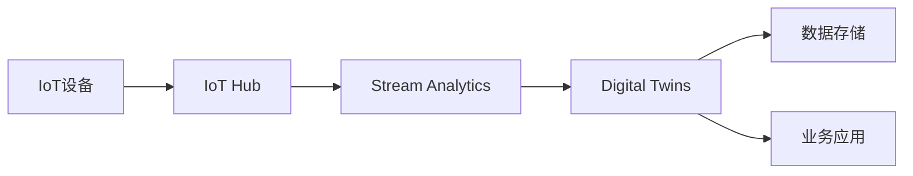

# Azure IoT解决方案

> [!NOTE]
> 本文档提供了Azure IoT解决方案的详细介绍，重点关注IoT Hub和Digital Twins的实现方案、设计考虑因素和最佳实践。

## 概述

Azure IoT解决方案提供了完整的物联网平台，支持设备连接、数据收集、实时处理和数字孪生模拟。通过Azure IoT Hub和Digital Twins，企业可以构建可扩展、安全和智能的IoT应用。

IoT解决方案的核心特点：
- **大规模设备连接**：支持数百万设备同时连接
- **双向通信**：设备到云和云到设备的消息传递
- **实时数据处理**：处理和分析设备遥测数据
- **设备管理**：远程监控和控制设备
- **数字孪生**：创建物理环境的实时数字模型
- **安全通信**：端到端加密和身份认证

## Azure IoT Hub基础

Azure IoT Hub是IoT解决方案的核心服务，提供可靠和安全的设备通信平台。

### 核心功能

#### 1. 设备连接

| 功能 | 描述 | 应用场景 |
|------|------|---------|
| 设备注册 | 管理设备身份和凭据 | 设备部署和认证 |
| 协议支持 | MQTT、AMQP、HTTPS | 多协议设备接入 |
| 设备孪生 | 存储设备元数据和状态 | 设备配置和监控 |
| 直接方法 | 远程调用设备功能 | 设备控制和管理 |
| 消息路由 | 配置消息传递规则 | 数据分发和处理 |

#### 2. 消息传递

```yaml
消息类型:
  设备到云:
    - 遥测数据
    - 设备状态
    - 上传文件
  云到设备:
    - 命令消息
    - 通知
    - 固件更新
```

#### 3. 设备管理

- **自动设备注册**：批量预配设备
- **设备配置**：远程更新设备配置
- **固件更新**：管理设备固件升级
- **设备监控**：跟踪设备健康状态
- **设备分组**：组织和管理设备集合

## Azure Digital Twins

Azure Digital Twins允许创建和管理物理环境的数字表示。

### 核心概念

#### 1. 数字孪生定义语言(DTDL)

```json
{
  "@context": "dtmi:dtdl:context;2",
  "@type": "Interface",
  "@id": "dtmi:example:Room;1",
  "displayName": "房间",
  "contents": [
    {
      "@type": "Property",
      "name": "温度",
      "schema": "double"
    },
    {
      "@type": "Property",
      "name": "湿度",
      "schema": "double"
    }
  ]
}
```

#### 2. 孪生图

- **节点**：表示实体（如设备、空间）
- **关系**：定义实体间的连接
- **属性**：存储实体的状态和特征
- **事件**：捕获状态变化和活动

### 实现方案

#### 1. 智能建筑



**组件和功能：**
- 空间管理
- 环境监控
- 能源优化
- 预测性维护
- 安全管理

#### 2. 工业物联网

**架构组件：**
- 设备连接和数据采集
- 实时监控和控制
- 生产线优化
- 设备预测性维护
- 质量控制

#### 3. 智慧城市

**应用场景：**
- 交通管理
- 环境监测
- 能源管理
- 公共安全
- 市政设施监控

## 解决方案架构

### 1. 基础架构



### 2. 数据处理流程

1. **数据采集**
   - 设备遥测数据
   - 设备状态信息
   - 环境数据

2. **实时处理**
   - Stream Analytics作业
   - Azure Functions处理
   - 实时分析和警报

3. **数据存储**
   - Cosmos DB：实时数据
   - Data Lake：历史数据
   - Time Series Insights：时序分析

4. **应用集成**
   - REST API接口
   - 事件网格集成
   - Power BI可视化

## 安全性和合规性

### 安全架构

1. **设备安全**
   - X.509证书认证
   - 对称密钥认证
   - 安全启动和固件
   
2. **通信安全**
   - TLS加密
   - 设备认证
   - 消息完整性验证

3. **云端安全**
   - Azure AD集成
   - 基于角色的访问控制
   - 审计日志记录

### 合规性考虑

- 数据隐私保护
- 行业标准合规
- 数据主权要求
- 安全最佳实践

## 监控和运维

### 监控策略

1. **设备监控**
   - 连接状态
   - 遥测数据质量
   - 设备性能指标

2. **服务监控**
   - IoT Hub指标
   - Digital Twins性能
   - 资源利用率

3. **应用监控**
   - 业务指标
   - 用户体验
   - 系统性能

### 运维管理

1. **设备运维**
   - 远程诊断
   - 固件更新
   - 故障排除

2. **平台运维**
   - 容量规划
   - 性能优化
   - 成本管理

## 性能优化

### IoT Hub优化

- **分区优化**：合理设置分区数
- **消息大小**：优化消息格式
- **批处理**：使用消息批处理
- **重试策略**：配置适当的重试策略
- **路由规则**：优化消息路由

### Digital Twins优化

- **图优化**：优化孪生图结构
- **查询性能**：优化查询模式
- **事件处理**：高效的事件处理
- **缓存策略**：实施适当的缓存
- **数据模型**：优化DTDL模型

## 成本管理

### 成本优化策略

1. **IoT Hub**
   - 选择适当的层级
   - 优化消息数量
   - 监控使用情况

2. **Digital Twins**
   - 优化实例数量
   - 控制查询频率
   - 管理存储成本

3. **数据存储**
   - 数据生命周期管理
   - 存储层级选择
   - 数据压缩

## 最佳实践

### 设计最佳实践

1. **架构设计**
   - 模块化设计
   - 可扩展架构
   - 故障隔离
   - 数据分层

2. **设备设计**
   - 离线操作能力
   - 电池效率优化
   - 安全设计
   - 可维护性

3. **应用设计**
   - 微服务架构
   - 事件驱动设计
   - 可扩展接口
   - 用户体验优化

### 部署最佳实践

1. **基础设施**
   - 资源组织
   - 网络规划
   - 安全配置
   - 监控设置

2. **应用部署**
   - CI/CD流程
   - 环境管理
   - 版本控制
   - 回滚策略

### 运维最佳实践

1. **监控告警**
   - 设置关键指标
   - 配置告警规则
   - 响应流程
   - 事件升级

2. **故障处理**
   - 故障诊断流程
   - 应急响应计划
   - 恢复程序
   - 事后分析

## 参考资源

- [Azure IoT文档](https://docs.microsoft.com/azure/iot-hub/)
- [Digital Twins文档](https://docs.microsoft.com/azure/digital-twins/)
- [IoT解决方案架构](https://docs.microsoft.com/azure/architecture/reference-architectures/iot)
- [IoT安全最佳实践](https://docs.microsoft.com/azure/iot-fundamentals/security-best-practices)
- [IoT设计原则](https://docs.microsoft.com/azure/architecture/guide/iot)

---

> 本文档将持续更新，欢迎提供反馈和建议。 