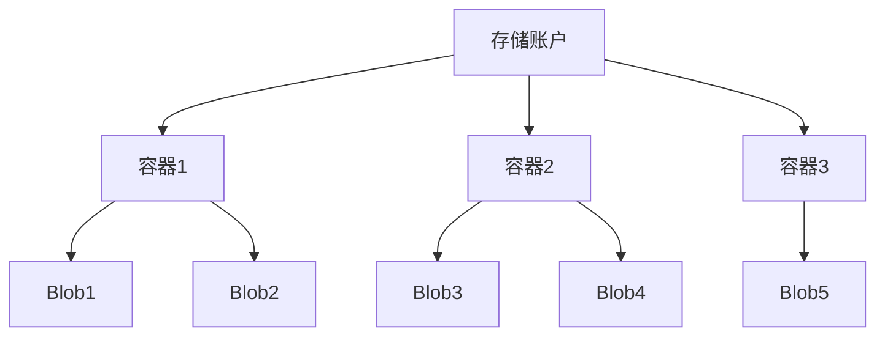

# Azure Blob 存储

Azure Blob 存储是 Microsoft 的云对象存储解决方案，专为存储海量非结构化数据而设计。本文档提供了 Azure Blob 存储的全面概述、核心概念和使用指南。

## 目录

- [概述](#概述)
- [核心概念](#核心概念)
- [存储账户类型](#存储账户类型)
- [访问层级](#访问层级)
- [数据冗余选项](#数据冗余选项)
- [安全性](#安全性)
- [性能与扩展性](#性能与扩展性)
- [使用方法](#使用方法)
- [生命周期管理](#生命周期管理)
- [数据保护](#数据保护)
- [监控与诊断](#监控与诊断)
- [成本优化](#成本优化)
- [最佳实践](#最佳实践)
- [常见场景](#常见场景)
- [常见问题](#常见问题)
- [其他资源](#其他资源)

## 概述

Azure Blob 存储是一种可大规模扩展的对象存储服务，用于存储和管理非结构化数据，如文本、二进制数据、文档、媒体文件和应用程序安装包。Blob 存储特别适合：

- 直接向浏览器提供图像或文档
- 存储用于分布式访问的文件
- 视频和音频流式传输
- 备份和恢复、灾难恢复和归档
- 为分析服务存储数据

**主要优势：**

- **高可用性和持久性**：多种冗余选项确保数据安全
- **安全性**：多层次的安全控制和加密
- **可扩展性**：几乎无限的存储容量
- **托管服务**：自动管理硬件和维护
- **访问性**：通过 HTTP/HTTPS 从世界任何地方访问
- **成本效益**：多层存储选项优化成本

## 核心概念

### 存储账户

所有对 Azure 存储的访问都是通过存储账户进行的。存储账户提供了一个唯一的命名空间，用于存储和访问 Azure 存储中的数据对象。

### 容器和 Blob

Blob 存储包含以下组件：



- **容器**：类似于文件系统中的文件夹，用于组织 Blob
- **Blob**：实际存储的对象，有三种类型：
  - **块 Blob**：由块组成，适合存储文本或二进制文件
  - **追加 Blob**：由块组成，针对追加操作进行了优化，适合日志场景
  - **页 Blob**：随机访问文件，主要用于 Azure 虚拟机的 VHD 文件

## 存储账户类型

Azure 提供多种类型的存储账户，每种具有不同的功能和价格模型：

| 存储账户类型 | 支持的服务 | 性能层级 | 推荐使用场景 |
|------------|----------|---------|-----------|
| 标准通用 v2 | Blob, 文件, 队列, 表, 磁盘 | 标准 | 大多数场景 |
| 高级块 Blob | 仅 Blob | 高级 | 高事务率或需要低存储延迟 |
| 高级文件共享 | 仅文件 | 高级 | 企业或高性能应用程序 |
| 高级页 Blob | 仅页 Blob | 高级 | 虚拟机磁盘 |
| Blob 存储 | 仅 Blob | 标准 | 存储大量非结构化数据 |

## 访问层级

Azure Blob 存储提供不同的访问层级，以优化性能和成本：

- **热访问层**：针对频繁访问的数据进行了优化，存储成本较高但访问成本低
- **冷访问层**：针对不常访问且存储至少 30 天的数据，存储成本低但访问成本高
- **归档层**：针对极少访问且存储至少 180 天的数据，存储成本最低但访问成本最高，检索数据可能需要几小时

可以在账户级别设置默认访问层，也可以在 Blob 级别设置特定访问层。

## 数据冗余选项

Azure Blob 存储提供多种数据冗余选项：

- **本地冗余存储 (LRS)**：在单个数据中心内复制数据三次
- **区域冗余存储 (ZRS)**：在单个区域内的多个可用性区域之间同步复制数据
- **异地冗余存储 (GRS)**：将数据复制到主要区域和次要区域（数百英里外）
- **读取访问异地冗余存储 (RA-GRS)**：与 GRS 类似，但允许从次要区域读取数据
- **异地区域冗余存储 (GZRS)**：结合了 ZRS 和 GRS 的优点
- **读取访问异地区域冗余存储 (RA-GZRS)**：与 GZRS 类似，但允许从次要区域读取数据

## 安全性

Azure Blob 存储提供全面的安全功能：

### 数据加密

- **静态加密**：所有数据自动使用 Azure 存储服务加密 (SSE) 进行加密
- **传输中加密**：通过 HTTPS 进行安全传输
- **客户管理的密钥**：使用自己的加密密钥

### 访问控制

- **共享密钥授权**：使用账户密钥进行身份验证
- **共享访问签名 (SAS)**：提供有限的访问权限
- **Azure Active Directory 集成**：基于角色的访问控制
- **匿名访问**：可选择允许对容器和 Blob 进行公共访问

### 网络安全

- **虚拟网络服务终结点**：将访问限制在特定虚拟网络内
- **防火墙规则**：基于 IP 地址限制访问
- **私有链接**：通过私有终结点访问存储账户

## 性能与扩展性

Azure Blob 存储设计为高性能和高可扩展性：

- **吞吐量目标**：单个 Blob 最高可达 60 MiB/秒
- **扩展限制**：
  - 存储账户容量：最高 5 PB
  - 单个 Blob 大小：最高 4.75 TB（块 Blob）或 8 TB（页 Blob）
  - 每个容器的 Blob 数量：无限制

### 性能优化

- 使用 CDN 加速内容分发
- 并行操作提高吞吐量
- 块大小优化（对于块 Blob）
- 高级存储账户用于低延迟要求

## 使用方法

### 创建存储账户

使用 Azure 门户创建存储账户：

1. 登录 Azure 门户
2. 点击"创建资源" > "存储" > "存储账户"
3. 填写必要信息：
   - 订阅和资源组
   - 存储账户名称（全局唯一）
   - 位置
   - 性能（标准/高级）
   - 冗余选项
4. 点击"查看 + 创建"，然后点击"创建"

### 使用 Azure CLI

```bash
# 创建资源组
az group create --name myResourceGroup --location eastus

# 创建存储账户
az storage account create \
    --name mystorageaccount \
    --resource-group myResourceGroup \
    --location eastus \
    --sku Standard_ZRS \
    --kind StorageV2
```

### 使用 Azure PowerShell

```powershell
# 创建资源组
New-AzResourceGroup -Name myResourceGroup -Location eastus

# 创建存储账户
New-AzStorageAccount -ResourceGroupName myResourceGroup `
  -Name mystorageaccount `
  -Location eastus `
  -SkuName Standard_ZRS `
  -Kind StorageV2
```

### 上传和下载 Blob

#### 使用 Azure 门户

1. 在 Azure 门户中导航到存储账户
2. 选择"Blob 服务" > "容器"
3. 选择或创建容器
4. 点击"上传"按钮上传文件
5. 点击 Blob 名称并选择"下载"进行下载

#### 使用 Azure CLI

```bash
# 创建容器
az storage container create \
    --name mycontainer \
    --account-name mystorageaccount \
    --auth-mode login

# 上传 Blob
az storage blob upload \
    --account-name mystorageaccount \
    --container-name mycontainer \
    --name myblob \
    --file /path/to/file \
    --auth-mode login

# 下载 Blob
az storage blob download \
    --account-name mystorageaccount \
    --container-name mycontainer \
    --name myblob \
    --file /path/to/download/location \
    --auth-mode login
```

#### 使用 Azure Storage SDK

以下是使用 .NET SDK 的示例：

```csharp
// 创建 BlobServiceClient
BlobServiceClient blobServiceClient = new BlobServiceClient(connectionString);

// 获取 BlobContainerClient
BlobContainerClient containerClient = blobServiceClient.GetBlobContainerClient("mycontainer");

// 上传 Blob
BlobClient blobClient = containerClient.GetBlobClient("myblob");
await blobClient.UploadAsync(filePath, true);

// 下载 Blob
BlobDownloadInfo download = await blobClient.DownloadAsync();
using (FileStream file = File.OpenWrite(downloadPath))
{
    await download.Content.CopyToAsync(file);
}
```

## 生命周期管理

Azure Blob 存储生命周期管理允许自动将数据转移到更具成本效益的访问层或在数据老化时删除数据。

### 生命周期策略示例

```json
{
  "rules": [
    {
      "name": "moveToCoolRule",
      "enabled": true,
      "type": "Lifecycle",
      "definition": {
        "filters": {
          "blobTypes": [ "blockBlob" ],
          "prefixMatch": [ "container1/log" ]
        },
        "actions": {
          "baseBlob": {
            "tierToCool": { "daysAfterModificationGreaterThan": 30 },
            "tierToArchive": { "daysAfterModificationGreaterThan": 90 },
            "delete": { "daysAfterModificationGreaterThan": 365 }
          }
        }
      }
    }
  ]
}
```

## 数据保护

### 软删除

软删除保护 Blob 和容器免受意外删除或覆盖，允许在指定的保留期内恢复已删除的数据。

```powershell
# 启用 Blob 软删除（保留期为 7 天）
Enable-AzStorageBlobDeleteRetentionPolicy -ResourceGroupName myResourceGroup `
    -StorageAccountName mystorageaccount `
    -RetentionDays 7
```

### 不可变 Blob

不可变存储允许用户以写入一次，读取多次 (WORM) 的方式存储业务关键数据，在指定的时间间隔内防止数据被修改或删除。

支持两种策略类型：
- **时间基础保留**：在指定期间内保护数据
- **法律保留**：直到明确删除保留为止保护数据

## 监控与诊断

### Azure Monitor

使用 Azure Monitor 监控 Blob 存储的性能、可用性和操作：

- **指标**：吞吐量、可用性、延迟、容量等
- **日志**：详细的请求日志、存储分析日志

### 存储分析

启用存储分析以记录详细的请求信息：

```powershell
# 启用存储分析日志
Set-AzStorageServiceLoggingProperty -ServiceType Blob `
    -LoggingOperations read,write,delete `
    -RetentionDays 10 `
    -Context $ctx
```

## 成本优化

优化 Azure Blob 存储成本的策略：

1. **选择适当的访问层**：根据访问频率使用热/冷/归档层
2. **生命周期管理**：自动转移较旧的数据到较便宜的存储层
3. **选择合适的冗余选项**：根据业务需求选择冗余级别
4. **预留容量**：对于可预测的存储需求考虑预留容量折扣
5. **监控和清理**：定期删除不需要的数据

## 最佳实践

### 性能最佳实践

- 使用最新版本的存储客户端库
- 对于高吞吐量场景，使用并行操作
- 对于频繁访问的内容，使用 Azure CDN
- 使用适当的块大小（对于块 Blob，理想大小为 4 MiB 到 100 MiB）
- 考虑使用高级存储账户用于低延迟要求

### 安全最佳实践

- 使用 Azure AD 进行身份验证而非共享密钥
- 限制 SAS 令牌的范围和持续时间
- 实施网络安全控制（服务终结点、防火墙规则）
- 启用高级威胁防护
- 定期轮换访问密钥

### 可靠性最佳实践

- 为关键数据使用 GRS 或 RA-GRS
- 启用软删除和版本控制
- 实施定期备份策略
- 测试恢复过程

## 常见场景

### 静态网站托管

Azure Blob 存储可以直接托管静态网站：

```powershell
# 启用静态网站
Enable-AzStorageStaticWebsite -Context $ctx `
    -IndexDocument "index.html" `
    -ErrorDocument404Path "404.html"
```

### 大数据分析

Blob 存储是大数据分析的理想存储解决方案：
- 与 Azure HDInsight、Azure Databricks 和 Azure Synapse Analytics 集成
- 支持 Azure Data Lake Storage Gen2 功能

### 备份和归档

使用 Blob 存储进行成本效益高的长期数据保留：
- 与 Azure Backup 集成
- 使用归档层存储很少访问的数据

## 常见问题

### 如何在 Blob 之间复制数据？

```powershell
# 在同一存储账户内复制
Start-AzStorageBlobCopy -SrcContainer "sourcecontainer" `
    -SrcBlob "sourceblob" `
    -DestContainer "destcontainer" `
    -DestBlob "destblob" `
    -Context $ctx

# 在不同存储账户之间复制
$srcContext = New-AzStorageContext -StorageAccountName $srcAccountName -StorageAccountKey $srcAccountKey
$destContext = New-AzStorageContext -StorageAccountName $destAccountName -StorageAccountKey $destAccountKey

Start-AzStorageBlobCopy -SrcContainer "sourcecontainer" `
    -SrcBlob "sourceblob" `
    -Context $srcContext `
    -DestContainer "destcontainer" `
    -DestBlob "destblob" `
    -DestContext $destContext
```

### 如何处理大文件上传？

对于大文件，应使用分块上传：

```csharp
// .NET 示例
BlobClient blobClient = containerClient.GetBlobClient("largeblob");

// 设置块大小为 4 MiB
int blockSize = 4 * 1024 * 1024;
using (FileStream fileStream = File.OpenRead(filePath))
{
    long fileSize = fileStream.Length;
    long position = 0;
    List<string> blockIds = new List<string>();

    // 上传块
    while (position < fileSize)
    {
        int bytesToRead = (int)Math.Min(blockSize, fileSize - position);
        byte[] buffer = new byte[bytesToRead];
        fileStream.Read(buffer, 0, bytesToRead);

        string blockId = Convert.ToBase64String(Encoding.UTF8.GetBytes(Guid.NewGuid().ToString()));
        await blobClient.StageBlockAsync(blockId, new MemoryStream(buffer));
        blockIds.Add(blockId);

        position += bytesToRead;
    }

    // 提交块列表
    await blobClient.CommitBlockListAsync(blockIds);
}
```

### 如何从归档层恢复数据？

```csharp
// 从归档层恢复 Blob
BlobClient blobClient = containerClient.GetBlobClient("archivedblob");
await blobClient.SetAccessTierAsync(AccessTier.Hot);

// 检查恢复状态
BlobProperties properties = await blobClient.GetPropertiesAsync();
string archiveStatus = properties.ArchiveStatus;
```

## 其他资源

- [Azure Blob 存储官方文档](https://docs.microsoft.com/zh-cn/azure/storage/blobs/)
- [Azure 存储 REST API 参考](https://docs.microsoft.com/zh-cn/rest/api/storageservices/)
- [Azure 存储客户端库](https://docs.microsoft.com/zh-cn/azure/storage/common/storage-samples)
- [Azure 存储博客](https://techcommunity.microsoft.com/t5/azure-storage/bg-p/AzureStorageBlog)
- [Azure 存储定价](https://azure.microsoft.com/zh-cn/pricing/details/storage/) 